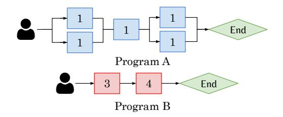
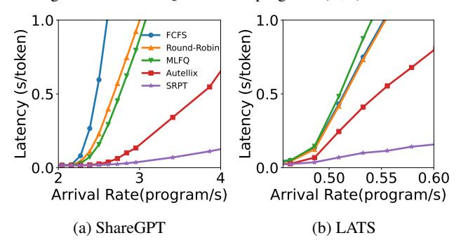

# A Appendix

### A.1 Discussion & Future Work

Graph Optimizations. Agentix assumes no prior knowledge of a program's execution DAG and dynamically constructs the graph as an internal representation (IR) during runtime. While full prior knowledge of a program's execution is unrealistic, anticipating its immediate next steps can be practical—thereby enabling *compiler optimizations* such as branch prediction and speculative execution, which enables future LLM calls to execute while prior calls are still completing. We defer such optimizations to future works.

Post-Training. Reasoning models, such as Deepseek-R1 [\[19\]](#page-12-3) and OpenAI's o1-o4 models [\[53\]](#page-14-26), are post-trained via end-toend reinforcement learning (RL) to optimize the thought process. To accelerate training, distributed RL systems alternate between distributed on-policy sampling and training to collect trajectories and perform policy gradient updates [\[40,](#page-13-21) [61\]](#page-14-27). With more effective scheduling, Agentix reduces the total makespan for batch sampling for each RL iteration, which immediately benefits distributed post-training systems.

### A.2 Comparison to Optimal Scheduling

Optimal scheduling policies like Shortest Remaining Processing Time (SRPT) assume complete knowledge of each program's runtime—an unrealistic assumption in practice. Hence, we emulate clairvoyance with a simulator by exposing each program's total LLM calls and decode steps a priori. The simulation only considers scheduling, where each continuous-batching step is identical. Under these simplified conditions, Agentix outperforms FCFS and other preemptive schedulers (e.g., Round Robin, MLFQ). Nevertheless, a noticable gap remains between Agentix and SRPT, showing that prior knowledge can significantly boost performance.

### A.3 ATLAS Deep Dive

Fig. [19](#page-16-0) illustrates a toy scenario where two programs, A and B, arrive at *t*=0 and are scheduled onto an inference engine with max BS=1, where ATLAS outperforms MLFQ. Program A executes 2-way parallel calls with small steps while program B executes sequential calls with long steps. Under MLFQ, Program A's calls continually interrupts program B's first LLM call. This incurs a total waiting time of 5 steps (B waits until A finishes). With ATLAS, Program A executes the first two parallel calls, where the third call is moved to a lower priority queue. This allows for Program B to finish executing it's first step. Overall, this incurs a total waiting time of 3 steps, demonstrating how ATLAS prevents short-critical-path programs from interrupting by long-running calls.

Edge Cases. In workloads with many short parallel threads (e.g., best-of-N sampling with N=100), ATLAS initially assigns all threads the same priority, effectively batching them together. This behavior is desirable—it prevents straggler threads by gang-scheduling parallel calls. In addition, our

> **[图片提取文字 (无描述)]:**
> End Program A End Program B

Figure 19: Toy example of two programs. ATLAS incurs less waiting time than MLFQ when both programs (A,B) arrive at t=0.

> **[图片提取文字 (无描述)]:**
> 1.0 1.0 Latency (s/token) Latency (s/token) **FCFS** Round-Robin MLFQ Autellix SRPT 0.50 0.55 0.60 Arrival Rate(program/s) Arrival Rate(program/s) (a) ShareGPT (b) LATS

Figure 20: Comparison to optimal scheduling policy. In simulation, Agentix outperforms other scheduling policies; however, there remains a visible gap relative to the optimal policy (SRPT).

anti-starvation mechanism bounds the wait time of other programs to at most β times their execution time, preventing indefinite blocking.