# <span id="page-2-0"></span>2 Background & Related Work

To detail relevant context for Agentix, we provide a brief overview of the emergent AI agent infrastructure and its applications, split between the LLM serving layer (§ [2.1\)](#page-2-2) and higher-level agentic layer (§ [2.2\)](#page-2-3), as depicted in Figure [3.](#page-2-4)

### <span id="page-2-2"></span>2.1 LLM Serving Layer

LLM Engine. LLM serving systems manage both the routing of LLM calls across engines and the execution of LLM calls within each engine (Fig. [3\)](#page-2-4). Within an engine, recent innovations in LLM serving mirror concepts rooted in traditional operating systems (OS), such as memory management, kernel optimization, and scheduling [\[43,](#page-13-10)[68\]](#page-14-9). Existing solutions, such as vLLM, integrate virtual memory and paging techniques

<span id="page-2-4"></span>> **[图片提取文字 (无描述)]:**
> Agentic Program Environment Orchestrator Web (# Tools X Agents 📥 Robots Function Calls LLM Agent #1 API Calls LLM Agent #2 Terminal > LLM Agent #3 Humans A Database Global History LLM Serving Load Balancer LLM Engine LLM Engine LLM Engine Scheduler Scheduler Scheduler KV KV KV LLM LLM LLM Cache, Cache. Cache,
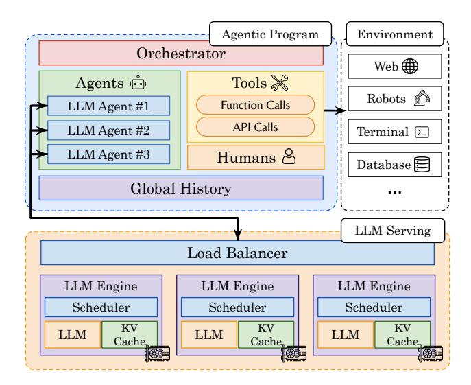

Figure 3: AI Agent Infrastructure. Top: Developers and users build and execute agentic programs that orchestrate execution and persist global, cumulative history across agents, tools, and humans. Bottom: LLM serving systems process agents' LLM calls and route calls across one or more LLM engines.

to reduce KV-cache fragmentation [\[36\]](#page-13-9), introduce shared memory to cache prefixes across LLM requests like in SGLang [\[41,](#page-13-6) [90\]](#page-15-10), and manage cache hierarchies between GPU, CPU, and disk like in FlexGen [\[62,](#page-14-10) [64,](#page-14-11) [94\]](#page-15-12). Other techniques, such as FlashInfer [\[85\]](#page-15-14), improve GPU kernel implementations to accelerate self-attention [\[16\]](#page-12-13), pipeline different operators like in Nanoflow [\[94\]](#page-15-12), and implement better tensor or pipeline parallelism like in AlpaServe [\[39,](#page-13-11)[76\]](#page-15-11). Finally, LLM engines can leverage better scheduling, such as binpacking prefills and decodes together [\[2\]](#page-12-11) and preempting LLM requests [\[76\]](#page-15-11), to improve response times or fairness like in VTC [\[63\]](#page-14-12). In particular, Agentix innovates and generalizes on top of prior work (VTC, FastServe), leveraging better swap kernels and advanced program-aware, preemptive schedulers to serve programs faster.

Across Engines. Across multiple LLM engines, serving systems employ load-balancing techniques like Llumnix's live migration for KV cache and requests [\[69\]](#page-14-13), Mooncake's disaggregation of prefills and decodes [\[58\]](#page-14-14), Preble's global prefix trees [\[67\]](#page-14-7) to meet request SLOs and improve tail latencies. Overall, such techniques can immediately benefit Agentix, but are optimized for *independent LLM requests*, equivalent to a function-call in a general program. Instead, Agentix focuses on program-level optimizations—akin to how traditional OSs manage entire processes across CPU cores.

### <span id="page-2-3"></span>2.2 Agentic Layer

Agentic Programs. Above the LLM inference layer, developers build sophisticated *agentic programs* to orchestrate interactions between agents, tools, and humans (Fig. [3\)](#page-2-4). Specifically, this work focuses on LLM agents, defined as a tuple consisting of a system prompt specifying the agent's role

<span id="page-2-1"></span><sup>1</sup> Including chunk-prefill [\[3\]](#page-12-12), prefix-caching [\[41,](#page-13-6) [90\]](#page-15-10), and multi-step scheduling.

<span id="page-3-4"></span>> **[图片提取文字 (无描述)]:**
> --- vLLM Agentix 80 60 + FILM Calls 20 2000 3000 1000 4000 Time (s)
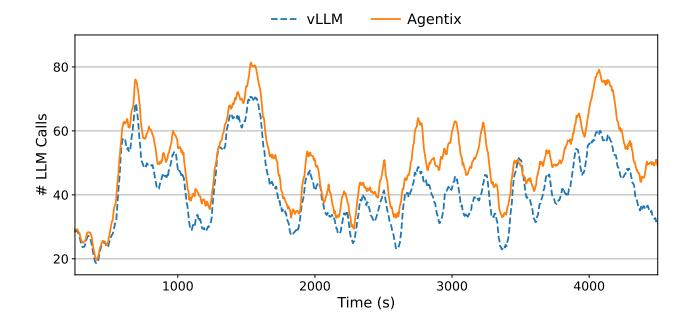

Figure 4: Number of LLM calls in serving engine during steady state over 1 hour. Optimizing programs' wait times increases the volume of LLM calls at steady state.

and the LLM model class<sup>2</sup>. Similar to traditional OS processes and interrupts, agentic programs either interact directly with the LLM serving layer via LLM calls or engage in external interrupts—time spent outside an LLM engine. Specifically, agents can interact with tools to execute generic functions or external APIs, enabling control over environments such as databases, robotic systems, or the internet [7,55,59,60,82,93]. Most importantly, agentic orchestration frameworks [50], such as LangChain [15, 37] and Autogen [77], provide developers with primitives to manage a program's control flow, determining when to execute agents, invoke tools, or request human input. Such primitives adhere to general programming semantics, including conditional statements, loops, error handling, and terminal conditions [32, 37, 77, 90]. Finally, programs maintain a global history of outputs across agents, tools, and humans [37,41,54,80]. For instance, LLM-based chatbots accumulate messages between LLM agents' outputs and humans' inputs [48]. Importantly, Agentix does not modify the program layer. Instead, it dynamically builds an internal state of the program's execution graph (DAG) when the program runs, which is stored in a process table (§5).

**Agentic Applications.** Beyond standard chatbots (Fig. 1a), agentic applications, or instantiations of programs, automate or assist with complex tasks, including web or user-interface (UI) navigation (e.g. OpenAI's Operator) [7, 27, 47, 92], resolving Github issues [29, 73, 79], solving IMO-level problems [18, 35], fact-checking and summarizing claims from multiple sources (Fig. 1c) [23,41], and performing deep research [52]. Many applications scale inference time compute—the number of LLM calls and, correspondingly, total decode tokens—to improve their performance on complex tasks. These test-time methods include: step-by-step reasoning to decompose tasks [56, 75], explicit thought injection to guide reasoning [84], planning or searching to explore possible solutions [9, 83, 91], self-critique to evaluate actions [42, 89], self-reflection to learn from failures [34, 65], and multi-agent collaboration [21,77]. In particular, a singlethreaded Reasoning and Acting (ReAct) agent, which com-

<span id="page-3-3"></span>> **[图片提取文字 (无描述)]:**
> **Execution Time** Wait Time 100 80 38.6% 56.6% 63.5% Fraction (%) 60 80.4% 87.0% 91.3% 40 61.4% 43.4% 20 36.5% 19.6% 13.0% 8.7% Load=0.5 Load=0.9 Load=0.5 Load=0.9 Load=0.5 Load=0.9 Chatbot ReAct **MCTS**
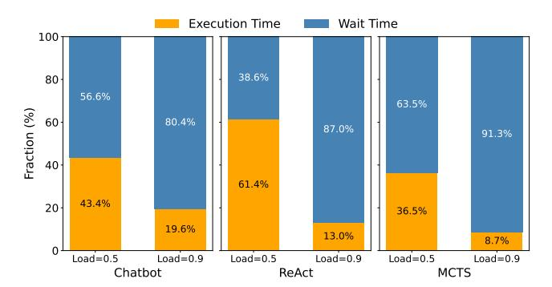

Figure 5: **Program execution and wait times, over different programs and system loads.** With moderate loads, programs spend the most time waiting. The duration of waiting depends on the workload.

bines chain-of-thought (CoT) techniques to efficiently act in an environment (Fig.1b), has recently been integrated on top of Deepseek-style (or o1-style) LLMs to enable automatic reasoning and tool calling [19,73,74]. A multi-threaded program, Monte Carlo Tree Search (MCTS) [91], integrates parallel planning, self-critique, self-reflection, and multi-agent collaboration (Fig. 1d). Beyond MCTS, distributed programs may also incorporate best-of-N sampling, beam search, lookahead techniques, and genetic algorithms to explore and discover optimal solutions [13, 17, 38, 66]. Given the probabilistic nature of LLMs, agentic programs are inherently *dynamic* (varying execution based on users' prompts), *non-deterministic* (unknown termination conditions), and *distributed* (parallel LLM calls). Consequently, *Agentix* is non-clairvoyant, operating with no prior knowledge of workloads or execution graphs.

#### <span id="page-3-0"></span>3 Motivation

Today's AI agent infrastructure decouples LLM serving systems from agentic programs (§2). As organizations shift from serving LLM queries to higher-level AI applications, LLM engines must optimize for program-level objectives, such as response times, or end-to-end latencies [41]. Formally, a single-threaded program's end-to-end latency comprises three components: (1) waiting time, the total queuing time of a program's LLM calls on the engine; (2) execution time, the cumulative feedforward time of LLM calls; and (3) interceptions, time spent waiting for external interrupts such as tool calls or human input. Since component (3) is unrelated to LLM serving, this section identifies problems and opportunities to reduce waiting (§3.1) and execution times (§3.2), subsequently addressed in the design of Agentix's scheduling policies (§4).

#### <span id="page-3-2"></span>3.1 Program-level Wait Times

Figure 5 shows that across various agentic workloads—from classic chatbots to ReAct and MCTS programs—the majority of a program's time is spent waiting as load increases. Hence, Agentix prioritizes reducing wait times, which not only improves program's latancies, but also increases LLM engine throughput. Faster call completions prompt programs to issue subsequent calls more quickly, increasing the arrival rate of

<span id="page-3-1"></span><sup>&</sup>lt;sup>2</sup>LLM agents with identical system prompts but different models (e.g., LLaMA [70], Mistral [28]) are considered distinct [72].

<span id="page-4-2"></span>> **[图片提取文字 (无描述)]:**
> **FCFS** MLFQ Wait / Exec. Ratio Wait / Exec. Ratio Agentix # LLM Calls # Decode Steps (a) Chatbot, LLM Calls (b) Chatbot, Programs **FCFS** MLFQ Wait / Exec. Ratio Agentix Wait / Exec. Ratio # Decode Steps # LLM Calls (c) MCTS, LLM Calls (d) MCTS, Programs
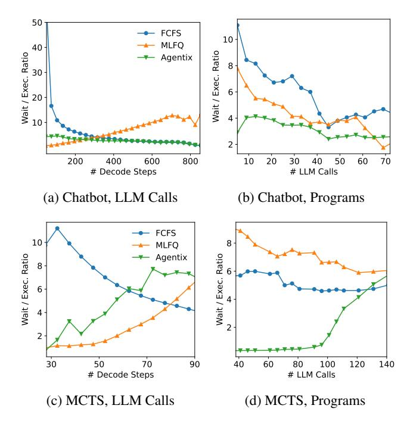

Figure 6: Ratio of Waiting to Execution Time for LLM Calls and Programs. Head-of-line blocking occurs when short LLM calls and programs wait significantly longer than their execution times.

LLM calls. Figure 4 illustrates steady-state behavior over a one-hour trace using LLaMA-3.1-8B [24] on a single A100-80GB GPU for entire chatbot conversations [1]. Compared to vLLM's first-come, first-served (FCFS) policy, Agentix consistently handles 10 additional concurrent LLM calls, offering more batching opportunities to improve throughput.

**Call-level Blocking.** The first challenge is LLM call-level *head-of-line (HoL) blocking*. LLM calls with long decodes delay shorter ones, causing significant wait times [76]. This issue is evident in serving engines like vLLM [36], which wait for ongoing calls to finish decoding before scheduling new ones. HoL blocking is severe in our evaluated workloads with long-tailed distributions of decoding steps (Fig. 11).

To measure blocking, Figure 6 measures the ratio of LLM requests' waiting time to execution time for Chatbot and MCTS workloads, as a function of output tokens. For FCFS policy, HoL blocking increases wait times for short LLM calls, increasing the ratio. Preemption, similar to how operating system schedulers interrupt long-running processes, mitigates HoL blocking by favoring shorter LLM calls. Figure 6 shows that Multi-Level Feedback Queue (MLFQ), a preemptive algorithm, leads to smaller ratios for short decodes. However, preemption without program-level statistics may not fully resolve the issue, as explained next.

**Program-level Blocking.** The second challenge is *program-level HoL blocking*, where longer programs with many LLM requests delay shorter programs. Existing LLM schedulers are program-agnostic; they schedule individual

<span id="page-4-3"></span>> **[图片提取文字 (无描述)]:**
> 1.0 8.0 Cache Hit-Rate Intra-Program Inter-Program 0.2 0.0 50k 100k 150k Input Tokens
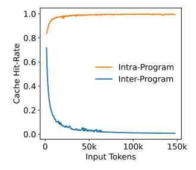

> **[图片提取文字 (无描述)]:**
> 1.0 8.0 Cache Hit-Rate 0.2 0.0 2k 8k 4k 6k Input Tokens
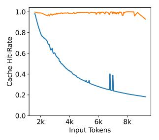

- (a) Single thread: Chatbot
- (b) Multiple threads: MCTS

Figure 7: Prefix cache hit rates for LLM calls within and across programs. LLM calls within the same program often share KV cache, whereas LLM calls across programs typically do not.

LLM requests without considering their positions within the overall program, leading to suboptimal decisions. Our evaluation shows a long-tailed distribution of LLM calls per program, which increases program-level blocking (§6).

To quantify program-level blocking, Figure 6 measures the ratio of programs' waiting time to execution time, with respect to number of LLM calls. For both workloads, FCFS and MLFQ incur higher ratios when the number of LLM calls is small, suggesting that short programs wait a long time. Due to this, preemptive scheduling policies, like MLFQ, may perform close to, or even worse, than FCFS (§ 6). Without program-level context, MLFQ blindly prioritizes new LLM requests, leading to starvation of shorter programs when long programs' new LLM calls are prioritized.

### <span id="page-4-1"></span>3.2 Program-level Execution Times

A program's execution time largely depends on how efficiently the LLM engine manages the prefill and decoding phases. In agentic workloads, which often feature long, cumulative prefills, Agentix focuses on optimizing prefill performance. Specifically, significant portions of prefill computation can be eliminated through prefix caching. This technique stores and reuses relevant key-value (KV) cache entries—such as the system prompt—across LLM requests [41,90].

Data Locality. Figure 7 illustrates the average cache-hit rate as a function of input length. The cache-hit rate is defined as the percentage of precomputed input tokens in the LLM engine's KV cache for an incoming LLM call. Notably, within a single program, cache-hit rates remain above 90% across all input lengths, indicating that LLM calls within the same program share identical contexts. In contrast, when considering different programs, the cache-hit rate decays exponentially with input length, suggesting that programs only share the system prompt. These results suggest that LLM serving systems across engines should consider a program's *data locality*, as much of its KV cache can be reused for future LLM requests.

### <span id="page-4-0"></span>4 Agentix Design

We present Agentix's overall architecture (§4.1) and then explore its two key components: (1) a program-aware scheduler

<span id="page-5-2"></span>> **[图片提取文字 (无描述)]:**
> Programs (Frontend, §5) WebAgent ReAct MCTS Code New Programs Running Start Session LLM Call Process Table (§4.2) Load-Balancer (§4.3) Engine Data PID Data 078051 LLM Engine 13358 Priority Function Memory Manager (§4.2) 1337420 314159 KV Cache 'pid': '314159', Model Executor Scheduler (§4.2) service\_time': 120.1, 'threads': [...]
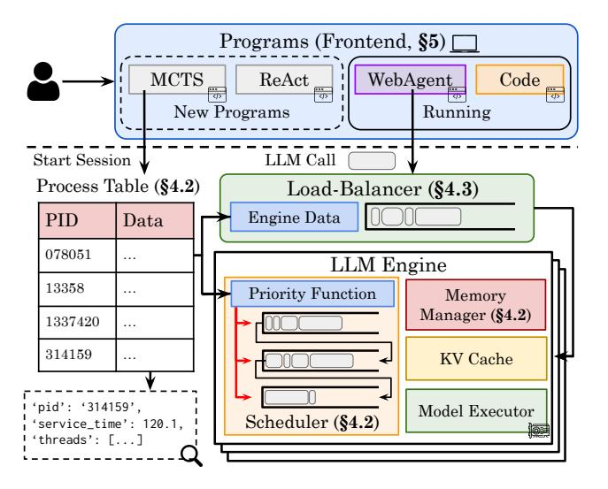

Figure 8: Agentix's system architecture. Users run their programs locally, which initiates a stateful session and submits LLM calls to Agentix's backend. Agentix leverages a global process table to track sessions and better inform its custom load-balancer and scheduler.

(§4.2) designed to reduce both call-level and program-level blocking, and (2) a data locality–aware load balancer (§4.3).

#### <span id="page-5-0"></span>4.1 Overview

Agentix is a higher-level serving engine designed for agentic programs rather than individual LLM requests. Agentix focuses on three primary objectives: (1) improving overall program's end-to-end latency, for users, (2) maximizing GPU utilization for providers, and (3) mitigating program starvation to improve fairness, measured via 95th and 99th percentile latencies.

Assumptions. Agentix is non-clairvoyant; it assumes no knowledge of program arrivals, the structure of executed workflows, or general workload distributions. When a program arrives, its execution DAG is initially unknown; Agentix dynamically constructs an internal representation (IR) as the program runs. This flexibility enables Agentix to generalize to any program that invokes LLM calls on the underlying engine. While prior work [41] submits static LLM applications to the engine, Agentix assumes users run general Python programs on their local machines, which invoke Agentix's backend (§ 5).

Architecture. Figure 8 illustrates Agentix's overall architecture. Unlike existing LLM engines, which assumes LLM calls are stateless, Agentix is stateful: programs execute from the user's local machine, establish a session with the Agentix, and issue LLM calls over time with an associated session ID. We further detail the low-level implementation in Section 5. When a session starts, Agentix adds a corresponding entry to a global process table (§4.2). This table tracks program metadata, including total service time, thread-level metadata, and waiting times across programs' LLM calls. Both the engine-level scheduler (§4.2) and stateful load balancer (§4.3) leverage the table to schedule LLM calls for the next

### <span id="page-5-4"></span>Algorithm 1 Agentix's Program-Aware Scheduler

```
1: procedure UPDATE_PROCESS_TABLE(Call c, Table pt)
 2:
        pd = pt[c.pid]
        // Total service time (PLAS), max critical path (ATLAS)
 3:
 4:
        pd.service = max(pd.service, c.service + c.model\_time)
 5:
        // Update other metrics...
 6:
 7: end procedure
    procedure Scheduler(Queues Q_1, ..., Q_K, Table pt)
 8:
                                                ▷ Arriving LLM calls
 9:
        for c \in C_{arrived} do
10:
            // Fetch priority with program ID
11:
            c.service = pt[c.pid].service
            c.q_i dx = i, s.t. Q_i^{low} \le c.service \le Q_i^{hi}
12:
            Q_{c,q_{idx}}.append(c), c.quanta = Q_{c,q_{idx}}.quanta
13:
14
        end for
        for c \in \{Q_1, Q_2, ..., Q_K\} do
15:
                                         ⊳ Finished jobs update table
16:
            if c.finished() then
17:
                UPDATE_PROCESS_TABLE(c, pt)
                Q_{c,q\_idx}.remove(c)
18:
19:
20:

    Call demotion

            if c.quanta \leq 0 then
21.
                Q_{c,q_{idx}}.remove(c), Q_{c,q_{idx}+1}.append(c)
22:
                c.q_{idx} + = 1, c.quanta = Q_{c.q_{idx}}.quanta
23:
24:
            wait = pt[c.pid].wait + c.wait
            service = pt[c.pid].service + c.model_time
25:
            if wait/service \geq \beta then
26:
                                                    ▶ Anti-Starvation
27:
                Q_{c,q\_idx}.remove(c), Q_1.append(c)
28:
                // Reset waiting and model execution times
29.
                c.wait = 0, c.model\_time = 0
30:
            end if
        end for
31:
32:
        B_{out} = []
                                ▷ Schedule next batch of LLM calls
33.
        for c \in \{Q_1, Q_2, ..., Q_K\} do
34.
            if engine.can_fit(c) then
35:
                B_{out}.append(c)
36:
            else
37:
                break
38
            end if
        end for
40: end procedure
```

<span id="page-5-1"></span>decoding batch and route LLM calls to an engine based on their program's data locality.

### 4.2 Program-Aware Scheduler

<span id="page-5-3"></span>We present a general, efficient scheduler designed to minimize programs' response times, or end-to-end latencies, without a-priori knowledge. To mitigate head-of-line blocking at both the program and call levels, Agentix assigns priorities to calls based on program-level statistics (e.g., total accumulated runtime, §4.2.1) and dynamically preempts calls (§4.2.2). The complete scheduling algorithm is shown in Alg. 1.

<span id="page-6-0"></span>> **[图片提取文字 (无描述)]:**
> 2 End Worst-Case 2 Best-Case
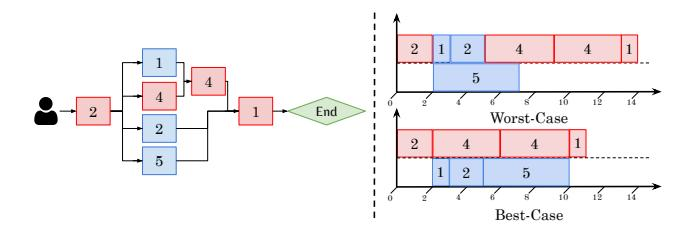

Figure 9: Critical path for multi-threaded programs. (Left) Example of a critical path through a DAG. (Right) Best-case scenario makespan, 14 units, versus worst-case makespan. 11 units.

### 4.2.1 Program-level Prioritization

To implement program-level prioritization effectively, Agentix relies on a global process table that tracks essential program metrics, enabling more informed scheduling decisions across both single- and multi-threaded programs.

Process Table. Inspired by traditional operating systems, Agentix maintains a global process table that records the state of all running programs. When a new program arrives, Agentix adds a corresponding entry; when the program completes, this entry is removed. Each program entry in the process table tracks the following metrics:

- *Service time:* For single-threaded programs, this is the cumulative execution time of all completed calls on the LLM engine's model executor. For multi-threaded programs, it is the longest observed critical path's execution time.
- *Waiting time:* The time spent in the LLM engine's scheduler queue—used for anti-starvation.
- *Engine ID(s):* The engine(s) that the program is currently running on—used for Agentix's load-balancer. (§ [4.3\)](#page-7-0).
- *Threads Metadata:* Each thread corresponds to an active LLM call. Hence, we keep track of a program's active LLM calls and their individual arrival, waiting, and service times.
- *Most recent call arrival:* The last time a new LLM call arrived for this program—used for tracking stale programs.
- *Most recent call completion:* The last time an LLM call finished—used for detecting long external interrupts.

When a program's LLM call completes, the table is updated accordingly. With the process table, the scheduler can reason about the global state of each program to schedule LLM calls.

Single-Threaded Programs. Scheduling policies like Shortest-Job-First (SJF) and Shortest-Remaining-Processing-Time (SRPT) minimize response times optimally in singleand multi-server settings [\[5,](#page-12-21)[25\]](#page-13-16). However, these require exact knowledge of program runtimes, violating Agentix's nonclairvoyance assumption. Instead, the Least-Attained-Service (LAS) algorithm [\[45\]](#page-13-17), widely used in information-agnostic settings such as data center networking [\[8,](#page-12-22) [14\]](#page-12-8) and deep learning clusters [\[26\]](#page-13-18), offers a practical alternative.

We introduce *Program-Level Attained Service*, or *PLAS*, extending LAS to programs. For a single-threaded program, its service time is the total runtime of all prior completed LLM calls. Formally, if the *j*th LLM call *c<sup>j</sup>* with program

ID of *c<sup>j</sup>* .*id* is submitted, *PLAS* assigns a priority *p*(*c <sup>j</sup>*) to *c<sup>j</sup>* based on the sum of all runtimes, *tk*, of all prior LLM calls with the same ID:

$$p(c_j) = \sum_{\substack{k < j \\ c_k.id = c_i.id}} t_k \tag{1}$$

Here, large priority values mean lower priority. To reduce computation, the scheduler reads the program's total service time from the process table (Line [11\)](#page-5-4). When an LLM call completes, its program's total service time is updated (Line [4\)](#page-5-4). Thus, *PLAS* naturally favors calls from programs that have received less total service, helping shorter programs finish earlier and reducing response times.

Multi-Threaded Programs. Unlike single-threaded programs, multi-threaded programs are modeled as dynamic DAGs of LLM calls. Unfortunately, a program's completion time is dictated by the DAG's *critical path*—the longest sequence of dependent calls from start to finish, illustrated in Figure [9.](#page-6-0) No matter how many parallel LLM calls an engine can process, the program only terminates when all calls along the critical path have finished. Furthermore, without considering critical paths, schedulers achieve sub-optimal completion times for programs; in Figure [9,](#page-6-0) the DAG's makespan increases from 11 to 14 units.

To address this, we introduce *Adaptive Thread-Level Attained Service (ATLAS)*, a pragmatic generalization of *PLAS*, that prioritizes calls based on their service times along their programs' critical paths. *ATLAS* aims to assign each newly arrived call *c<sup>j</sup>* a priority *p*(*c <sup>j</sup>*) based on the priorities and completed service times of its parents *P*(*cj*) in the same program:

$$p(c_j) = \begin{cases} 0 & \text{if } c_j \text{ is root} \\ \max_{c_k \in \mathcal{P}(c_j)} \{ p(c_k) + t_k \} & \text{otherwise} \end{cases}$$
 (2)

Here, *t<sup>k</sup>* is the execution time of a parent call *ck*. By recursively combining parent priorities and runtimes, *p*(*cj*) estimates the longest chain of accumulated service time leading to *c<sup>j</sup>* , providing a non-clairvoyant estimation of the critical path.

However, achieving both objectives—favoring short programs while also prioritizing the longest, critical-path threads—is nontrivial. To solve this, *ATLAS* maintains a single scalar per program in its process table: the longest observed critical path. Each active LLM call in a program inherits this value as its initial priority, and upon call completion, updates the scalar only if its own critical path is longer (Line [4\)](#page-5-4). This simple mechanism continuously refines the program's critical path estimate without tracking dependencies between LLM calls. Consequently, *ATLAS* favors programs and LLM calls with shorter critical paths, effectively approximating a Least-Attained-Service policy for dynamic DAGs. Furthermore, as all calls of a given program derive their priorities from the same entry, the scheduler naturally groups a program's parallel calls, preventing straggler threads from delaying programs' completion.

<span id="page-7-1"></span>> **[图片提取文字 (无描述)]:**
> Arriving Low LLM Calls Priority PID Data Process High Priority Table
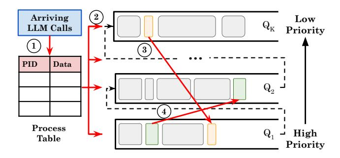

Figure 10: LLM call lifecycle based on discretized prioritization.

### 4.2.2 Preemptive Scheduling

Agentix assigns priorities to each LLM call based on their program's history. However, scheduling and preempting programs based on continuous priorities can degrade into worst-case round-robin scheduling [14], which performs worse than FCFS, and incur unnecessary context switches, including frequent KV-cache swaps between CPU and GPU [76]. To avoid this, Agentix discretizes priorities into a finite set of queues, akin to multi-level feedback queues (MLFQ) in operating systems [6, 14, 26].

**Multi-level Program-based Scheduling** Agentix bins and discretizes LLM calls' priorities into K queues  $(Q_1, Q_2, ..., Q_K)$ , where priorities decrease from  $Q_1$  to  $Q_K$ . Each queue  $Q_i$  covers a priority range  $[Q_i^{lo}, Q_i^{hi})$ , with  $Q_1^{lo} = 0$ ,  $Q_K^{hi} = \infty$ , and  $Q_{i+1}^{lo} = Q_i^{hi}$ .

In Figure 10, when an LLM call arrives, Agentix looks up its program's priority p(c), based on the process table (①, Line 11). Unlike traditional MLFQ, where new calls all start at the highest priority queue  $Q_1$ , LLM calls are assigned to the *i*th queue based on discretized priorities,  $p(c) \in [Q_i^{lo}, Q_i^{hi})$  (②, Line 12). Subsequently, calls receive the queue's time quantum and execute in FCFS order within their queue (Line 13, 35). Once a call exhausts its quantum, it is demoted to a lower priority queue (③, Lines 20-23). If the call waits too long, Agentix employs anti-starvation mechanisms, described next (④, Lines 24-30). Finally, when a call completes decoding, it updates the process table (Lines 16-18).

Anti-Starvation. Discrete prioritization, or MLFQ-style algorithms, incurs the starvation of long, low-priority programs [14, 26, 76]. Simple anti-starvation techniques—such as promoting calls that have waited past a threshold—reduces Agentix to naive MLFQ, where long program's LLM calls, which are now in  $Q_1$ , interrupt short programs [6, 76]. Hence, we also utilize the process table to measure program-level starvation. Concretely, for a program p, Agentix promotes call c to  $Q_1$  if the ratio of total waiting time ( $W_{\text{total}} = W_p + W_c$ ) to service time ( $T_{\text{total}} = T_p + T_c$ ) exceeds a threshold  $\beta$ :  $\frac{W_{\text{total}}}{T_{\text{total}}} \ge \beta$  Varying  $\beta$  presents a trade off between programs' average response times and fairness. After promotion, only  $W_c$  and  $T_c$ , or the calls' wait and run time, are set to zero, to

### <span id="page-7-2"></span>Algorithm 2 Agentix's Load Balancer

```
1: procedure LOAD_BALANCER(Call c, Table pt, List Engines)
       if Len(c.tokens) \leq 2048 then

⊳ Small request

 2:
 3:
           assigned\_engine = LEAST\_USED(Engines)
 4:
           if c.pid \in pt then \triangleright Program already assigned to engine
 5:
 6:
               assigned engine = pt[c.pid]
 7:
           else
               // Select the least utilized engine
 8:
               assigned\_engine = Least\_Used(Engines)
 9:
10:
               pt[c.pid] = assigned\_engine
11:
           end if
12:
       return assigned_engine
13:
14: end procedure
   procedure LEAST_USED(List Engines)
15:
16:
       // Query engine workloads in parallel
       workloads = QUERY_ENGINE_WORKLOADS(Engines)
17:
       least_used_engine = ARGMIN(workloads)
18:
19:
       return least_used_engine
20: end procedure
```

ensure programs' threads, or active LLM calls, are likely all promoted together (Line 29).

Memory Management. With preemptive scheduling, LLM engines must handle a large volume of concurrent LLM calls, leading to frequent GPU-CPU transfers as KV-cache blocks are repeatedly swapped to serve different requests [76]. Prior work mitigates this swapping overhead by proactively swapping KV-cache for the next iteration of LLM requests while processing the current ones [76]. However, Agentix is synchronous and requires real-time updates for each call's time quantum and the process table. Instead, Agentix employs two key optimizations to reduce both the frequency and overhead of GPU-CPU swapping respectively.

First, Agentix reduces total swaps by adopting multi-step scheduling, running the scheduler once every *N* decoding steps rather than at every step. As some requests may complete early, our scheduler overprovisions queued requests already on the GPU, ensuring that new requests are immediately added when some requests finish before *N* steps. Second, Agentix employs a more efficient GPU-CPU swap kernel. Instead of calling separate asynchronous transfers for each block, our kernel gathers all KV blocks into a contiguous buffer and transfers them in one operation—increasing PCIe bandwidth by reducing fragmentation, reducing per-block overhead, and lowering end-to-end swap latency (§5).

#### <span id="page-7-0"></span>4.3 Load Balancer

As agentic workloads scale, deploying multiple engine replicas is necessary. However, distributing requests without considering data locality yields suboptimal performance [67].

Our analysis for agentic workloads (§3.2) highlights a critical distinction between short and long requests. Short

requests below 2048 tokens achieve high cache hit rates ( $\geq 75\%$ ) across any engine, due to common system prompts<sup>3</sup>. Enforcing data locality for these requests offers negligible gains and risks skewing engine utilization when large, parallel programs dominate specific engines. Thus, simply balancing short requests across the least-loaded engines preserves performance with minimal overhead. Conversely, longer requests are far more sensitive to their programs' data locality. Their substantial prefix overlap with a given program significantly reduces recomputation when consistently routed to the same engine, justifying occasional queuing delays.

While prior work relies on complex prefix trees to quantify data locality [67], our simple method dynamically routes short requests to the least-loaded engine and pins longer requests to their programs' corresponding engines. Algorithm 2 formalizes this approach, and our evaluation shows that Agentix's load balancer improves both throughput and latency across heterogeneous workloads (§6).

## <span id="page-8-1"></span>5 Implementation

Agentix is a multi-engine LLM inference serving system comprising a frontend, scheduler, and load balancer—totaling 5k lines of Python and CUDA/C++ code.

Frontend. Agentix's frontend extends OpenAI's Chat Completion and vLLM's Python APIs [36,49] to provide a stateful interface that appears stateless to developers. Users simply import Agentix's library into their Python applications, and upon program initialization, Agentix automatically issues a start\_session request to the backend, which populate the process table. When the program completes or errors, Agentix invokes end\_session, removing the table's entry.

LLM Engine. Agentix builds on vLLM v0.6.1 [36]. To keep changes localized, we modify only the scheduler by integrating new scheduling policies and memory swapping kernels for efficiency. We've also noticed in vLLM, each Key-Value (KV) block is transferred individually via cudaMemcpyAsync, creating small fragmented transfers that underutilize PCIe bandwidth and incur high overhead such as repeated DMA setups. To address this, we allocate a host buffer and consolidate all KV blocks into a single contiguous chunk, enabling one bulk transfer. The results are shown in the next section (§6).

Multi-engine. To better evaluate our load balancing strategy, we built AsyncMultiLLMEngine atop of vLLM's AsyncLLMEngine. Each LLM engine replica runs in a dedicated Python process, and a coordinating meta-engine manages these replicas via standard inter-process communication (IPC) primitives such as mp.Queue and mp.Pipe. When the meta-engine receives a request, it assigns the request to the appropriate replica, returning a future-like object to the frontend without blocking. The selected engine process executes the task asynchronously and sends the completed result back through the IPC channel.

<span id="page-8-2"></span>> **[图片提取文字 (无描述)]:**
> 0.1 0.3 Decode Tokens (Mean: 276.81) Decode Tokens (Mean: 34.14) 0.1 0.2 Prefill Tokens (Mean: 255.65) Prefill Tokens (Mean: 735.06) Density  $(10^{-2})$ Density (10<sup>-2</sup>) 0.2 0.1 0.1 0.1 0.1 0.0 0.0 0.1 0.0 0.0 100k 125k 150k 25k 50k 75k 10k 20k 30k 40k # Tokens # Tokens (a) ShareGPT (b) BFCL 2.2 22.5 Decode Tokens (Mean: 72.64) 2.0 ShareGPT (Mean: 6.66) 20.0 Prefill Tokens (Mean: 467.24) 1.8 17.5 BFCL (Mean: 10.75) Density (10-2) Density (10<sup>-2</sup>) 1.5 15.0 LATS (Mean: 159.71) 1.2 12.5 10.0 1.0 0.8 7.5 5.0 0.5 0.2 2.5 0.0 0.0 500 1000 1500 2000 100 200 300 400 Number of LLM Calls # Tokens (c) LATS (d) Number of LLM calls
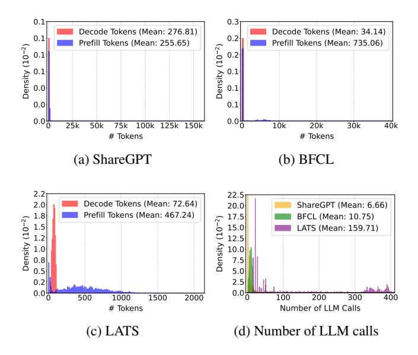

Figure 11: **Workload analysis.** LLM call statistics of programs from each workload. Input and output length distributions for (a) ShareGPT, (b) BFCL, and (c) LATS. Subfigure (d) plots the distribution of number of LLM calls in each workload.

### 6 Evaluation

#### 6.1 Workloads

Our real-world experiments evaluate Agentix over four representative agentic workloads, which widely vary in the number of decode tokens, prefill tokens, and the LLM calls (Fig. 11).

Chatbot Agent: ShareGPT [1]. The ShareGPT dataset comprises of user-generated conversational inputs and outputs, typical for chatbot applications. The number of LLM calls follows a long-tailed distribution with a mean of 6.66 and a max of 80 (Fig. 11d). ShareGPT's conversational nature is evident in its decode-heavy calls, averaging 277 decode tokens versus 256 prefill tokens, where short prompts generate detailed responses (Fig. 11a). Our experiments replay entire conversations as a program rather than the first turn.

ReAct Agent: BFCL [78]. The Berkeley Function Calling Leaderboard (BFCLv3) evaluates LLMs on multi-turn, multi-step tool-usage tasks. Compared to ShareGPT, BFCL's LLM calls are less long-tailed, with a mean of 10.75 and a maximum of 70 calls per program (Fig. 11d). BFCL is prefill-heavy, averaging 735.06 tokens per call due to long system prompts and detailed tool signatures, while decodes are short, averaging 34.14 tokens (Fig. 11b). BFCL thus encapsulates dynamic workflows that alternate between heavy prefills phases and short decodes with function calls.

Monte Carlo Tree Search: LATS [91]. LATS workloads, derived from running MCTS on HotpotQA [81], are computationally intensive and involve many parallel LLM calls. Each program instance contains on average 159.7 LLM calls—an order of magnitude more than ShareGPT or BFCL workloads (Fig.11d). Moreover, the prefill and decoding phase of each

<span id="page-8-3"></span><span id="page-8-0"></span><sup>&</sup>lt;sup>3</sup>The threshold, 2048 tokens, is chosen based on trace statistics in Fig. 11

<span id="page-9-1"></span>> **[图片提取文字 (无描述)]:**
> Agentix VLLMvLLM-opt MLFQ 1.0<sub>T</sub> Mixed LATS BFCL ShareGPT Latency(s/token) Latency(s/token) 1.0 0.5 0.5 0.5 0.0 0.0 0.0 4 2 2 1.0 1.0 1.0 0.5 0.5 0.5 0.0 0.0 0.0 0.6 0.8 0.2 0.6 0.6 0.4 0.2 0.2 0.4 0.4 1.0 1.0 1.0 0.5 0.5 0.5 0.0 0.0 0.20 0.3 0.15 0.1 0.2 0.05 0.10 0.05 0.10 0.15 0.20 1.0 1.0 1.0 0.5 0.5 0.5 0.0 0.0 0.6 8.0 0.2 0.2 0.2 0.4 0.4 0.4 Arrival Rate (program/s) Arrival Rate (program/s) Arrival Rate (program/s) LLaMA3.1-8B, 1GPU LLaMA3.1-70B, 4GPU Falcon-180B, 8GPU
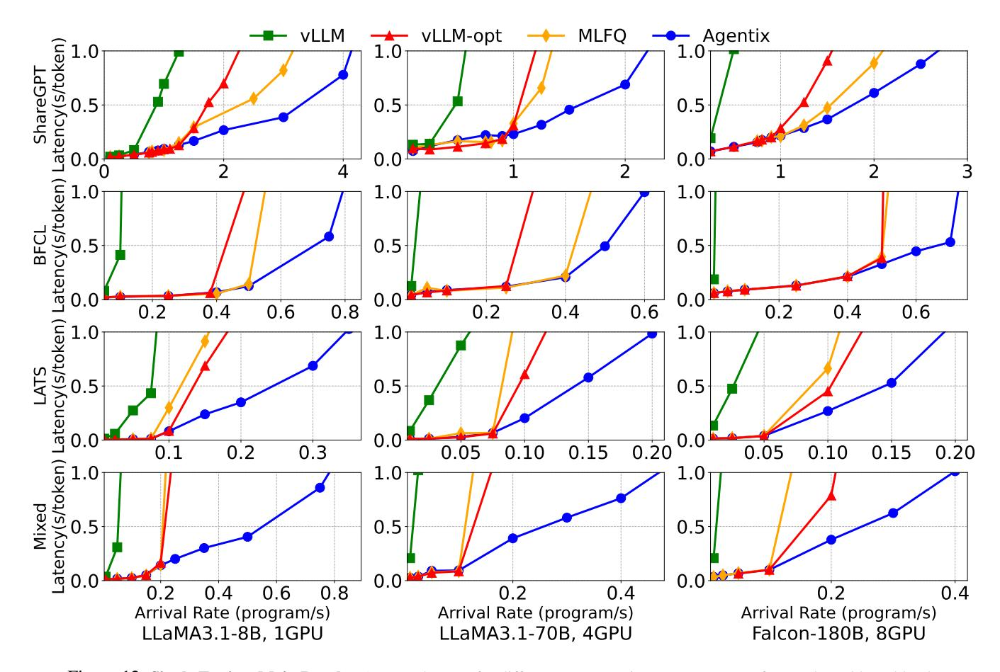

Figure 12: Single Engine, Main Results. Average latency for different LLM serving systems across four real-world workloads.

call averages 467.2 and 72.6 tokens respectively (Fig. 11c). These distributions highlight MCTS's inherently iterative, parallel nature, pushing LLM serving systems to handle large volumes of concurrent calls efficiently.

**Mixed.** We combine all three workloads, sampling equally from each to ensure diversity. This workload stress tests Agentix's performance across different program classes.

For our experiments, we synthesize a trace by randomly sampling programs, not LLM calls, from the above workloads and generating programs' arrivals using a Poisson process  $\lambda$ , following established methodologies [36, 76]. This approach ensures our setup closely reflects real-world scenarios.

### 6.2 Experimental Setup

Models & Testbed. We evaluate on three models: LLaMA-3.1-8B, 70B and Falcon-180B, running on 1, 4, and 8 GPUs, respectively. Experiments are conducted on a GCP Compute Engine a2-ultragpu-8g instance with eight A100-SXM4-80GB GPUs connected via NVLink, 1360 GB host memory, PCIe-4.0×16, and 2 TB of disk space.

**Metrics.** Existing LLM serving systems focus on request-level metrics, such as Time-to-First-Token (TFTT) and Time-per-Output-Token (TPOT), also referred to as token latency [36, 76, 94]. However, these metrics overlook end-to-

end latency for agentic programs. To that end, we introduce program-level token latency, defined as the average of total program response time divided by the number of tokens generated<sup>4</sup>. A high-throughput system for programs should retain low program-level latency during high request rates. We note that program-level latency is directly proportional to programs' average job completion times (JCT). For simplicity, we refer to our metric as *latency* throughout the evaluation.

**Baselines.** Our evaluation considers three baselines. All baselines, including Agentix, use the same max batch size.

- vLLM [36]. vLLM is the state-of-the-art, high throughput LLM serving system that integrates continuous batching [86] and PagedAttention [36] to reduce KV cache fragmentation. Its default scheduling policy is FCFS, which is application-unaware and suffers from call-level and program-level HoL blocking. We use vLLM v0.6.1.
- vLLM-opt. An optimized version of vLLM that enables chunk-prefill [3], prefix-caching [41, 90], and multi-step scheduling. Based on vLLM's blogpost [71], it's performance closely matches SGLang [90] and TensorRT [46].
- MLFQ. On top of vLLM-opt, it implements preemption via the Multi-Level Feedback Queue algorithm [76]. This base-

<span id="page-9-0"></span><sup>&</sup>lt;sup>4</sup>For multi-threaded programs, *program-level* token latency is computed as the critical path response time divided by the total tokens across all threads.

<span id="page-10-0"></span>> **[图片提取文字 (无描述)]:**
> vLLM vLLM-opt MLFQ Agentix P95 P99 1.0 1.0 ShareGPT Latency(s/token) 0.5 0.5 0.0 0.0 2 2 1.0 1.0 BFCL Latency(s/token) 0.5 0.5 0.0 0.0 0.6 0.2 0.2 0.4 0.4 0.6 1.0 1.0 LATS Latency(s/token) 0.5 0.5 0.0 0.0 1.0 0.0 0.2 0.1 0.1 0.2 1.0 Mixed Latency(s/token) 0.5 0.5 0.0 0.0 0.3 0.2 0.1 0.2 0.1 0.3 Arrival Rate (program/s)
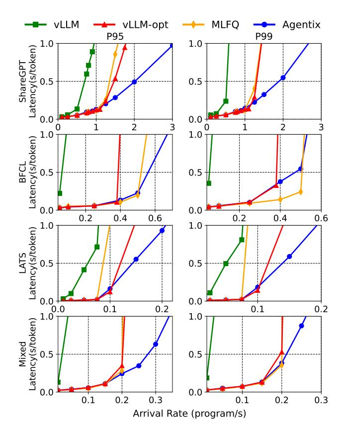

Figure 13: **Single Engine, Tail Latencies.** 95<sup>th</sup> (P95) and 99<sup>th</sup> (P99) percentile latencies of different serving systems.

line ablates the impact of program and call-level blocking.

### 6.3 End-to-End Single-Engine Performance

Figure 12 compares Agentix against vLLM, vLLM-opt, and MLFO on four workloads—ShareGPT, BFCL (singlethreaded), LATS (multi-threaded), and Mixed. Agentix delivers the highest throughput for the same token latency, while vLLM trails due to lacking prefix cache (Fig. 7), forcing expensive state recomputation. On ShareGPT and BFCL, FCFS in vLLM and vLLM-opt incurs severe head-of-line (HoL) blocking as arrival rates grow. MLFQ leverages preemption to reduce call-level HoL, yielding 1.5x the throughput of vLLM-opt. By applying PLAS to both calland program-level HoL, Agentix achieves up to 8× vLLM, 2× vLLM-opt, and 1.5× MLFQ throughput at high load. On LATS, Agentix beats vLLM by 5x, MLFQ by 2.5x, and vLLM-opt by 2x. Unlike MLFQ, which stalls programs by chasing short requests, Agentix's ATLAS gang-schedules programs' threads to ensure programs' consistent progress. Finally, on Mixed workloads, Agentix delivers up to 15×, 5.5×, and 5× higher throughput than vLLM, MLFQ, and vLLM-opt respectively, capitalizing on programs' heterogeneity.

**Tail latency.** Preemptive scheduling strategies can reduce average latency but risk increasing tail latency by starving long-running programs. Figure 13 reports the 95<sup>th</sup> (P95) and

<span id="page-10-1"></span>> **[图片提取文字 (无描述)]:**
> Least Used P95 Round Robin Preble ---Agentix P99 avg \_atency(s/token 1.0 1.0 1.0 ShareGPT(8B) 0.7 0.7 0.7 0.3 16 13 9 9 13 Latency(s/token) ShareGPT(70B) 1.0 1.0 1.0 0.7 0.7 0.7 0.3 0.3 0.3 6 3 3 4 \_atency(s/token)Latency(s/token)I 1.0 1.0 1.0 LATS(8B) 0.6 0.6 0.6 0.1 0.1 0.1 2 0.5 1.0 0.5 1.0 1.0 1.0 1.0 LATS(70B) 0.6 0.6 0.6 0.40.1 0.1 0. 1.0 0.1 0.5 0.2 0.3 0.2 Arrival Rate(Program/s)
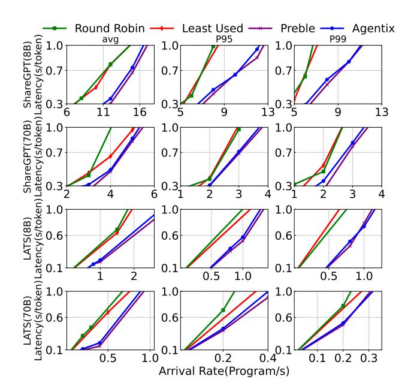

Figure 14: **Multi-engine, Main Results.** Latencies (Avg., P95/99) w.r.t. different load balancing policies.

99<sup>th</sup> (P99) percentile latencies across different workloads on LLaMA-3.1-8B. For ShareGPT, MLFQ significantly improves average latency compared to vLLM-opt (Fig. 12), but exhibits poor P95/99 tail latencies. In contrast, for BFCL, MLFQ outperforms vLLM-opt in both cases. In 7 of 8 scenarios, Agentix maintains consistently lower tail latencies than MLFQ and vLLM-opt and improves throughput by up to 1.7× for P95/99 tail latencies, demonstrating robust performance gains in both average and tail performance metrics.

### 6.4 End-to-End Multi-Engine Performance

To evaluate the effectiveness of Agentix's data locality-aware load balancer (§4.3), we compare against three load balancing strategies under identical scheduling policies (*PLAS*, *ATLAS*):

- Round Robin (RR). Requests are assigned to engines in cyclic order—ensuring an even distribution of requests—default load-balancer policy for Kubernetes [33].
- Least Used. Requests are assigned to the engine with the lowest number of LLM calls in the system, effectively balancing engine workloads.
- Preble [67]. Maintains a global prefix tree that routes long-prefix matched requests to the most data-local engine and short-prefix matched requests to the least-used engine; Agentix approximates this strategy with only program IDs.

We conduct experiements using four replicas of LLaMA3.1-8B and two replicas of LLaMA3.1-70B with the ShareGPT and LATS workloads. The results, shown in Figure 14, demonstrate Agentix's effectiveness in maintaining low average and tail latencies across all configurations. Agentix delivers up to 1.4× higher throughput compared to naive baselines while closely matching Preble's performance

<span id="page-11-0"></span>> **[图片提取文字 (无描述)]:**
> Replica Number
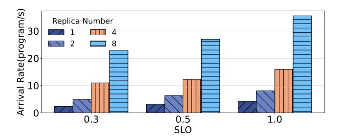

Figure 15: **Scalability Experiments.** Given same SLO (defined as s/tok), Agentix's max arrival rate (program/s) scales linearly w.r.t number of replicas, or LLM engines.

<span id="page-11-1"></span>> **[图片提取文字 (无描述)]:**
> Policy VLLM MLFQ vLLM-opt Agentix Makespan 1000 2000 **Number of Programs**
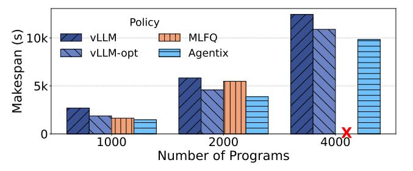

Figure 16: **Offline batch inference.** Agentix decreases the time, or makespan, required to process a batch of programs.

<span id="page-11-2"></span>> **[图片提取文字 (无描述)]:**
> Latency(s/token) Latency(s/token) Execution Scheduler Swap Wait Agentix Agentix MLFQ VLLM-OPT MLFQ VLLM-OPT Algorithm Algorithm (a) ShareGPT (b) LATS
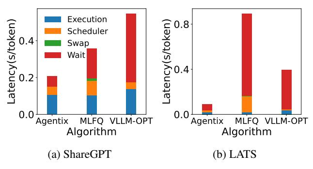

Figure 17: **Breakdown of Inference Overheads.** Agentix significantly reduces wait time and introduces minor scheduler overheads to vLLM. Agentix also reduces swap times with its improved kernel.

without maintaining complex prefix trees. The benefit is more pronounced with ShareGPT, where chat history reuse significantly improves KV-cache locality. These advantages become even more evident as the number of replicas increases, as a larger pool of engines reduces the likelihood of a request being routed to one with it's locality.

**Scalability.** To evaluate Agentix's scalability, we assess performance as the number of replicas increases under various latencies, using the ShareGPT workload with the LLaMA3.1-8B model. Figure 15 shows linear scaling in all cases. Leveraging program-level load balancing, Agentix effectively scales horizontally without data locality overhead (i.e. prefix trees), making it a robust solution for large-scale LLM deployments.

#### 6.5 Ablations

For consistency, all ablations run LLaMA3.1-8B [24] over ShareGPT [1] and LATS [91].

<span id="page-11-3"></span>> **[图片提取文字 (无描述)]:**
> 1.0 150 VLLM 254k Latency(s/token) Swap Time (s) Agentix 120k 84k VLLM 14k 10k 8k Agentix 3.5 4.0 3.5 4.0 Arrival Rate(program/s) Arrival Rate(program/s) (a) Swap Times (b) Throughput
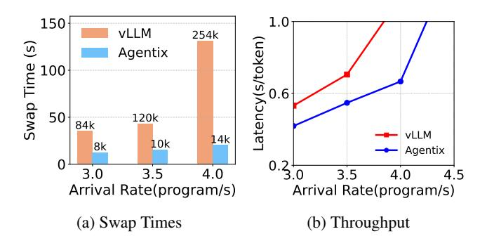

Figure 18: **Impact of Agentix's swap kernel** Agentix reduces total swaps and GPU-CPU swap times, improving throughput.

Offline Inference. In offline scenarios that prioritize throughput over latency, large batches of programs are processed in bulk rather than interactively or in a streaming fashion. We consider a use case where all programs are submitted at the start. Figure 16 presents the makespan of all programs across all systems using the ShareGPT dataset. Agentix consistently outperforms the baselines, decreasing the average makespan by 10-40%. At 4000 programs, MLFQ fails to complete execution. By assigning all new requests to the highest-priority queue, it creates many active LLM requests, causing severe memory contention and frequent GPU-CPU swapping. This overwhelms system resources, resulting in Out-Of-Memory (OOM) errors despite a large swap space (>1.2TB).

**Timing Breakdown.** Figure 17 decomposes LLM-serving latency for Agentix and it's baselines. Agentix cuts token latency on ShareGPT and LATS by trimming wait (via program-level scheduling) and swap (via optimized swap kernels). Preemption results in Agentix and MLFQ incurring higher scheduling overheads than vLLM-opt's FCFS, but Agentix still outperforms MLFQ by using program-aware priorities to spread LLM calls across queues.

**Swapping Kernel.** Preemptive scheduling increases active LLM calls in the system, incurring high GPU memory utilization. This leads to frequent GPU-CPU swaps for fetching relevant KV cache and significant swapping overheads at high request rates [76]. Agentix mitigates this by batching parallel KV block transfers into a single operation—reducing swaps by up to 18x, swap times by 3-7x, and achieving 1.3x higher throughput than vLLM's implemented kernel (Fig. 18).

### 7 Conclusion

We introduce Agentix, a distributed LLM-serving system for general, dynamic programs rather than individual LLM calls. By tracking program-level statistics—like cumulative service time—Agentix prioritizes and schedules LLM calls to reduce programs' end-to-end latency. Our experiments demonstrate that Agentix improves throughput of programs by 4×–15× compared to state-of-the-art systems like vLLM.

