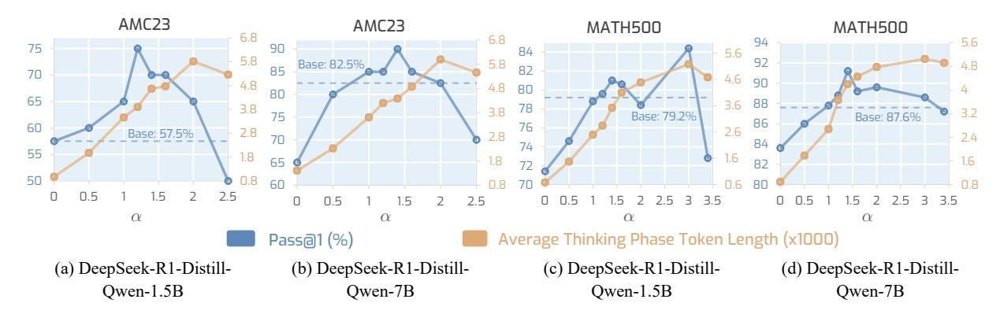
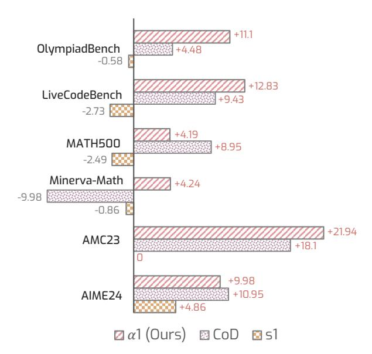

# **4.3.2** Can $\alpha$ -moment scale the thinking phase budget?

Fig. 5 shows the results of  $\alpha 1$  with different  $\alpha$ -moments determined by scaling  $\alpha$  from 0 to a maximum value subject to the 8192 token length budget. We observe: i)  $\alpha$ -moment enables a *scalable thinking phase budgeting*. By scaling up  $\alpha$ , the average thinking phase token length is accordingly scaled up. ii) Interestingly, while the thinking phase is scaled up, there exists a trade-off between the optimal value of  $\alpha$  and the resulting reasoning accu-

> **[图片提取文字 (无描述)]:**
> AMC23 AMC23 MATH500 MATH500 6.8 6.8 5.6 75 90 84 5.6 5.8 92 Base: 82.5% 5.8 4.8 82 85 70 4.6 90 4.8 4.8 80 80 65 88 3.6 78 3.8 3.8 3.2 Base: 79.2% Base: 87.6% 86 60 76 2.6 Base: 57.5% 2.8 2.4 74 84 55 1.8 1.6 1.8 1.6 65 82 50 0.8 60 2.5 2.5 2.5  $\alpha$ Average Thinking Phase Token Length (x1000) Pass@1 (%) (b) DeepSeek-R1-Distill-(c) DeepSeek-R1-Distill-(d) DeepSeek-R1-Distill-(a) DeepSeek-R1-Distill-Owen-1.5B Owen-7B Owen-1.5B Owen-7B

Figure 5: **Scaling property of**  $\alpha$ **.** We scale  $\alpha$  from 0 to the maximum value restricted by the maximum token length, and plot the corresponding reasoning Pass@1 and average thinking phase token length on AMC23 and MATH500.

> **[图片提取文字 (无描述)]:**
> +11.1 OlympiadBench +4.48 -0.58+12.83 LiveCodeBench +9.43 -2.73 +4.19 MATH500 +8.95 -2.49 Minerva-Math +4.24 -9.98-0.86 +21.94 AMC23 +18.1+9.98 +10.95 AIME24 +4.86 α1 (Ours) 
> ⊠ CoD 
> □ s1

Figure 6: Scaling efficiency analysis with REP using Deepseek-R1-distill-Qwen-1.5B. The REP metric is introduced in Eq. (2).

racy. This indicates that monotonously increasing the thinking phase budget does not consistently bring better reasoning performance, and it is critical to find the optimal  $\alpha$ -moment that results in a satisfactory improvement.

#### 4.3.3 Does $\alpha 1$ scale more efficiently?

To quantitatively evaluate how different methods trade off reasoning efficiency and accuracy, we introduce the  $\mathcal{F}_{REP}(\mathcal{A}_{method}; \mathcal{A}_{base}, T_{norm})$  (Reasoning Efficiency-Performance, REP) metric. The REP metric is defined as:

$$\mathcal{F}_{\text{REP}}(\mathcal{A}_{\text{method}}; \mathcal{A}_{\text{base}}, T_{\text{norm}}) = \frac{\mathcal{A}_{\text{method}} - \mathcal{A}_{\text{base}}}{T_{\text{norm}}}$$
(2)

where  $A_{\text{method}}$  and  $A_{\text{base}}$  denote the reasoning accuracy of the evaluated method and the base model, respectively.  $T_{\text{norm}}$  is the normalized thinking

phase token length, computed by dividing the current thinking phase token length by the maximum token length. Higher REP indicates stronger performance with better reasoning efficiency.

We report the REP of CoD, s1, and  $\alpha$ 1 on six reasoning benchmarks with Deepseek-R1-distill-Qwen-1.5B. Fig. 6 shows that  $\alpha$ 1 achieves higher REP on most benchmarks, indicating a more favorable balance between reasoning performance and efficiency. Notably,  $\alpha$ 1 outperforms CoD by +6.62 and s1 by +11.68 on Olympiad-Bench, and exceeds CoD by +14.22 on Minerva-Math.

