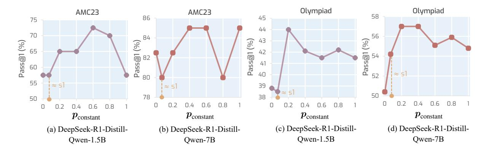

# **4.3.4** How frequent should slow thinking transitioning be?

 $\alpha$ 1 modulate slow thinking transitioning via sampling from  $Bernoulli(p_{wait})$ , which leads to another question of how large should  $p_{\mathrm{wait}}$  be that can bring a better result. To study this question, we use the constant scheduling function and scale  $p_{\text{constant}}$  from 0 to 1 to increase the frequency of transitioning to slow thinking. This is because the constant scheduling is a sampling process with a certain probability, and the value of the probability determines how frequently the slow thinking transitioning token will be sampled. Fig. 7 shows the results, from which we observe: i) An extremely low or high frequency of transitioning to slow thinking brings unsatisfactory results (e.g.,  $p_{constant} = 0.1$ ). Similar to the scaling of the thinking phase dedget (e.g., modulating  $\alpha$ ), the slow thinking frequency also needs to be carefully selected. ii) While an extremely dense or sparse slow thinking transitioning leads to unsatisfactory results, the reasoning performance is decent across a large range of  $p_{\text{constant}}$ , demonstrating that increasing slow thinking generally brings improved reasoning.

> **[图片提取文字 (无描述)]:**
> Olympiad Olympiad AMC23 AMC23 58 86 45 75 44 % 56 70 84 43 (%) (%) (%) 65 42 Pass@1 Pass@1 Pass@1 Pass@1 41 60 40 ≈ 5 52 55 ≈ 5 39 ≈ 5] ≈ s1 78 38 50 0.2 0.4 0.6 0.6 0.8 0.4 0.6 0.8 0.4 0.6  $\boldsymbol{p}_{\text{constant}}$  $\boldsymbol{p}_{\text{constant}}$  $\boldsymbol{p}_{\text{constant}}$  $p_{\rm constant}$ (a) DeepSeek-R1-Distill-(b) DeepSeek-R1-Distill-(d) DeepSeek-R1-Distill-(c) DeepSeek-R1-Distill-Qwen-1.5B Owen-1.5B Owen-7B Owen-7B

Figure 7: Scaling property of "**wait**" frequency under constant scheduling on AMC23 and OlympiadBench. Increasing pconstant leads to a higher frequency of yielding "wait" in the Bernoulli process Bernoulli(pwait).

Table 2: Ablation study on post-α moment modulation. Without post-α modulation represents our α1 without the suppression of the slow thinking inertia after the α moment.

| Method                        | Post-α Moment |      | AIME24 | AMC23 |      |  |  |  |
|-------------------------------|---------------|------|--------|-------|------|--|--|--|
|                               | Modulation    | P@1  | #Tk    | P@1   | #Tk  |  |  |  |
| DeepSeek-R1-Distill-Qwen-1.5B |               |      |        |       |      |  |  |  |
| BASE                          | N/A           | 23.3 | 7280   | 57.5  | 5339 |  |  |  |
| α1 (Ours)                     | ×             | 26.7 | 7929   | 47.5  | 6903 |  |  |  |
| α1 (Ours)                     | ✓             | 30.0 | 5916   | 70.0  | 4951 |  |  |  |
| DeepSeek-R1-Distill-Qwen-7B   |               |      |        |       |      |  |  |  |
| BASE                          | N/A           | 38.8 | 5999   | 82.5  | 4624 |  |  |  |
| α1 (Ours)                     | ×             | 30.0 | 7666   | 75.0  | 5878 |  |  |  |
| α1 (Ours)                     | ✓             | 50.0 | 6826   | 90.0  | 4397 |  |  |  |

