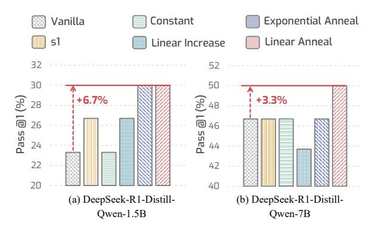
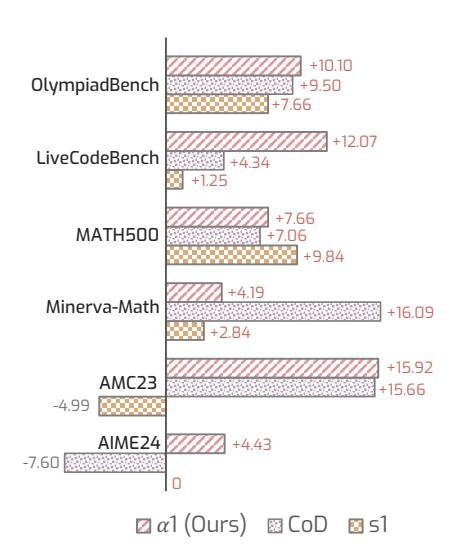

# APPENDIX

| A |     | Additional Implementation Details  | 15 |
|---|-----|------------------------------------|----|
|   | A.1 | Computaional Budget                | 15 |
|   | A.2 | Hyper-parameters & Parameters      | 15 |
|   | A.3 | Benchmarks                         | 15 |
| B |     | Additional Ablation Study          | 16 |
|   | B.1 | Scheduling Strategy                | 16 |
|   | B.2 | Scaling Efficiency Analysis        | 16 |
|   | B.3 | Slow Thinking Transitioning Tokens | 16 |
| C |     | Artifacts Statements               | 16 |
|   | C.1 | Model Artifacts                 | 16 |
|   | C.2 | Data Artifacts                  | 16 |
| D |     | Future Works                       | 17 |
| E |     | Qualitative Examples               | 17 |

## A Additional Implementation Details

#### A.1 Computaional Budget

We used 8 NVIDIA L40S GPUs and 4 NVIDIA A100 80GB GPUs for the experiments.

#### A.2 Hyper-parameters & Parameters

For reproducibility, we provide the complete set of average thinking phase token length Nthink in Table [3,](#page-15-7) which are obtained by randomly sampling 10 test questions on each benchmark and averaging the generated token lengths. Since the effective range of α observed in Figure [5](#page-6-0) is relatively broad, practical implementations can tolerate variance in this measurement.

#### A.3 Benchmarks

AIME 2024 The AIME 2024 dataset is a specialized benchmark collection consisting of 30 problems from the 2024 American Invitational Mathematics Examination [\(Mathematical Association](#page-11-6) [of America,](#page-11-6) [2024\)](#page-11-6). These problems cover core secondary-school mathematics topics such as arithmetic, combinatorics, algebra, geometry, number theory and probability. The collection places rigorous demands on both solution accuracy and conceptual depth.

AMC 2023 The AMC 2023 dataset consists of 40 problems selected from the AMC 12A and 12B contests. These exams are sponsored by the Mathematical Association of America and target U.S. students in grade 12 and below, featuring challenges in algebra, geometry, number theory, and combinatorics [\(AI-MO,](#page-8-0) [2024\)](#page-8-0).

Minerva Math Minerva Math [\(Lewkowycz](#page-10-4) [et al.,](#page-10-4) [2022\)](#page-10-4) consists of 272 undergraduate-level STEM problems harvested from MIT's Open-CourseWare. These problems span solid-state chemistry, information and entropy, differential equations, and special relativity. Each includes a clearly delineated answer—191 verifiable by numeric checks and 81 by symbolic solutions. The benchmark is specifically designed to evaluate multi-step scientific reasoning capabilities in language models.

MATH500 MATH500 comprises a selection of 500 problems extracted from the MATH benchmark [\(Lightman et al.,](#page-10-7) [2024\)](#page-10-7). The collection covers a range of high-school mathematics domains, including Prealgebra, Algebra and Number Theory. To ensure comparability with prior work, we use the exact problem set originally curated by OpenAI for evaluation.

LiveCodeBench LiveCodeBench [\(Jain et al.,](#page-10-5) [2025\)](#page-10-5) is a contamination-free benchmark for evaluating large language models on code. The suite is continuously updated, gathering new problems over time. It currently comprises 400 Python programming tasks released between May 2023 and March 2024, each paired with test samples for correctness verification. Beyond basic code generation, LiveCodeBench also measures advanced capabilities such as self-repair, code execution and test-output prediction.

OlympiadBench OlympiadBench [\(He et al.,](#page-10-6) [2024\)](#page-10-6) consists of 8,476 Olympiad-level problems that evaluate mathematical and physical reasoning in AI systems. It features a wide difficulty range, open-ended problem generation, expert solution annotations, detailed difficulty labels, and multilingual coverage. The subset we use in our paper contains 675 open-ended, text-only math competition problems in English.

Table 3: Average thinking phase token length  $\overline{N}_{\text{think}}$  across different benchmarks. The results are obtained by running LRMs on randomly sampled 10 samples.

| Model                         | AIME24 | AMC23 | Minerva | MATH500 | LiveCodeBench | OlympiadBench |
|-------------------------------|--------|-------|---------|---------|---------------|---------------|
| DeepSeek-R1-Distill-Qwen-1.5B | 4130   | 3303  | 3101    | 2435    | 2172          | 3417          |
| DeepSeek-R1-Distill-Qwen-7B   | 4751   | 3243  | 3064    | 2352    | 3120          | 3330          |
| Qwen QwQ-32B                  | 2597   | 2124  | 1710    | 1493    | 4915          | 2052          |

> **[图片提取文字 (无描述)]:**
> Constant Exponential Anneal Vanilla Linear Anneal 51 Linear Increase 52 30 50 +6.7% +3.3% **%** 28 © 26 @ 46 Pass 22 42 20 40 (a) DeepSeek-R1-Distill-(b) DeepSeek-R1-Distill-Qwen-1.5B Qwen-7B

Figure 8: **Ablation study of different scheduling strategies** on AIME24.

#### **B** Additional Ablation Study

#### **B.1** Scheduling Strategy

In addition to the results in Fig. 4 tested on AMC23 and Olympiad, we also show the results tested on AIME24 in Fig. 8. From the results, we observe that the linear increase consistently yields the best performance, which aligns with our previous observation. This further provides evidence that slow-then-fast thinking is an efficient slow-thinking scheduling strategy.

## **B.2** Scaling Efficiency Analysis

As shown in Fig. 9,  $\alpha 1$  consistently achieves positive REP with Deepseek-R1-distill-Qwen-7B, demonstrating stable gains over the base model. Similar to Fig. 6, it outperforms CoD and s1 across nearly all benchmarks, particularly on Live-CodeBench and AIME24.

#### **B.3** Slow Thinking Transitioning Tokens

We provide an ablation study on different slow-thinking transitioning tokens on the AIME2024 dataset. As illustrated in Table 4, the empirical results show that using "Wait," can help the model excel in both performance and efficiency. Other reasoning transition tokens like "Hmm," and "Alternatively," do not achieve comparable results, likely because they introduce less effective cues for reasoning modulation.

> **[图片提取文字 (无描述)]:**
> OlympiadBench +7.66 +12.07 LiveCodeBench +4.34 +1.25 +7.66 MATH500 +7.06 +4.19 Minerva-Math +16.09 +2.84 +15.92 AMC23 +15.66 -4.99 AIME24 +4.43 -7.60 α1 (Ours)

Figure 9: **Scaling efficiency analysis with REP** using Deepseek-R1-distill-Qwen-7B.

## C Artifacts Statements

#### C.1 Model Artifacts

We utilize three models in our work: DeepSeek-R1-Distill-Qwen-1.5B and DeepSeek-R1-Distill-Qwen-7B, both released under the MIT License, which permits commercial use, modification, and redistribution. These models are distilled from Qwen-2.5 series (Apache 2.0 License). Additionally, we use Qwen QwQ-32B, which is released under the Apache License 2.0, allowing both research and commercial usage. We comply with all respective license terms in our use of these models.

#### C.2 Data Artifacts

We employ publicly available datasets in our experiments. AIME24, Minerva-Math, LiveCodeBench, and OlympiadBench are released under the MIT License, which permits unrestricted use, modification, and redistribution. The AMC23 dataset does not have an explicitly specified license, so we treat it as having an unspecified license and exercise caution in its usage. We ensure full compliance with the respective license terms of all datasets used.

