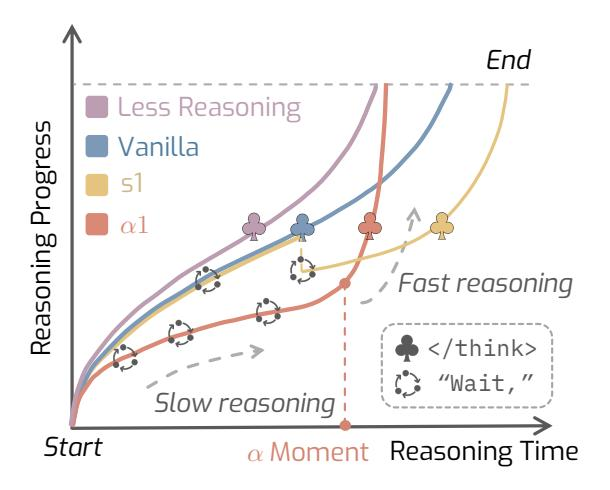
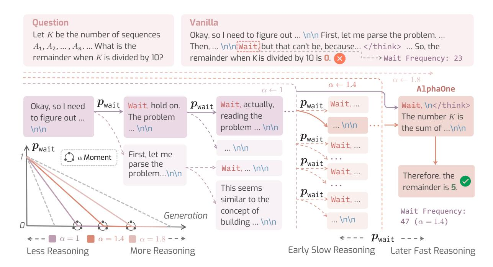

#### ALPHA ONE: Reasoning Models Thinking Slow and Fast at Test Time

Junyu Zhang † Runpei Dong † Han Wang Xuying Ning Haoran Geng Peihao Li Xialin He Yutong Bai Jitendra Malik Saurabh Gupta Huan Zhang

University of Illinois Urbana-Champaign UC Berkeley †Equal contributions. Correspondence: {junyuz6, runpeid2, huanz}@illinois.edu

## Abstract

This paper presents ALPHA ONE ( α1), a universal framework for modulating reasoning progress in large reasoning models (LRMs) at test time. α1 first introduces α moment, which represents the scaled thinking phase with a universal parameter α. Within this scaled preα moment phase, it dynamically schedules slow thinking transitions by modeling the insertion of reasoning transition tokens as a Bernoulli stochastic process. After the α moment, α1 deterministically terminates slow thinking with the end-of-thinking token, thereby fostering fast reasoning and efficient answer generation. This approach unifies and generalizes existing monotonic scaling methods by enabling flexible and dense slow-to-fast reasoning modulation. Extensive empirical studies on various challenging benchmarks across mathematical, coding, and scientific domains demonstrate α1's superior reasoning capability and efficiency. Project page: [https://alphaone-project.github.io/](alphaone-project.github.io)

## 1 Introduction

"The most effortful forms of slow thinking are those that require you to think fast."

> *Thinking, Fast and Slow [\(Kahneman](#page-10-0) , [2011](#page-10-0) )*

Large Reasoning Models (LRMs) such as OpenAI o1 [\(Jaech et al.](#page-10-1) , [2024\)](#page-10-1) and DeepSeek-R1 [\(DeepSeek-AI et al.,](#page-9-0) [2025\)](#page-9-0) have demonstrated unprecedented progress in approaching humanlike system-2 reasoning capabilities, enabling *slow thinking*—slowing down *reasoning progress* [1](#page-0-0) at test time—for solving complex reasoning problems that require high-order cognitive processing. These advanced models are trained to utilize slow thinking via reinforcement learning, enabling LRMs

> **[图片提取文字 (无描述)]:**
> End Less Reasoning Reasoning Progress Vanilla  $\alpha 1$ /Fast reasoning 🐥 </think> "Wait," Slow reasoning Start α Moment Reasoning Time

Figure 1: Conceptual illustration of reasoning modulation strategies. Our α1 employs a *slow-to-fast* reasoning schedule controlled by α. α1 scales more efficiently than *monotonously increasing* method s1 (yellow) and generally outperforms *monotonously decreasing* (purple) approaches.

to slow down reasoning progress automatically. Is such automatic slowing down of reasoning progress determined by LRMs sufficiently reliable? According to [Kahneman](#page-10-0) [\(2011\)](#page-10-0), humans typically think fast first and activate slow thinking when running into difficulty, through a conscious control of system-1-to-2 reasoning transitioning, resulting in overall comprehensive but efficient reasoning. While similar to human systems and interesting results have been observed, a lot of works have pointed out that the LRMs themselves are prone to *overthinking* [\(Chen et al.](#page-9-1) , [2024b](#page-9-1) ; [Sui et al.](#page-11-0) , [2025](#page-11-0) ; [Pu et al.](#page-11-1) , [2025](#page-11-1) ; [Yang et al.](#page-12-0) , [2025c\)](#page-12-0) or *underthinking* [\(Su et al.,](#page-11-2) [2025;](#page-11-2) [Yang et al.,](#page-12-1) [2025d;](#page-12-1) [Wang et al.,](#page-12-2) [2025\)](#page-12-2). This is because of the inability of LRMs to find the optimal human-like system-1-to-2 reasoning transitioning and limited reasoning capabilities, leading to unsatisfactory reasoning performance.

To overcome this limitation, existing works scale LRMs at test time in mainly two ways. i) *paral-*

1Consider reasoning progress as a metric ranging from 0 to 1, indicating the start and the end of reasoning, respectively. It increases slowly or fast at the pace of thinking. See Fig. [1](#page-0-1) and Section [2](#page-2-0) for a more illustrative and detailed explanation.

> **[图片提取文字 (无描述)]:**
> Vanilla Ouestion Let *K* be the number of sequences Okay, so I need to figure out ... \n\n First, let me parse the problem. ... Then, ... \n\n\Wait, but that can't be, because... </think> ... So, the  $A_1, A_2, \dots, A_n$ .... What is the ----> Wait Frequency: 23 remainder when K is divided by 10? remainder when K is divided by 10 is 0.  $\alpha \leftarrow 1.8$  $\alpha \leftarrow 1.4$ Alpha0ne  $\alpha \leftarrow$  $p_{\mathsf{wait}}$  Wait,...  $p_{\mathsf{wait}}$ Wait, actually,  $p_{\textsf{wait}}$ Wait, hold on. Wait, \n</think> Okay, so I need reading the The number K is The problem to figure out ... ...\n\n problem ... \n\n the sum of ...\n\n ...\n\n  $\ln \ln$  $\boldsymbol{p}_{\textsf{wait}}$ > Wait, ...  $\boldsymbol{p}_{\textsf{wait}}$ ...\n\n First, let me  $\alpha$  Moment parse the Wait, ... \n\n problem...\n\n Therefore, the remainder is 5. This seems  $p_{\tt wait}$   $\geq \tt Wait ...$ similar to the concept of Wait Frequency: Generation ...\n\n building ... \n\n 47 ( $\alpha = 1.4$ )  $\leftarrow$  ---  $p_{\textsf{wait}}$  --->  $\alpha = 1.4$ Early Slow Reasoning Less Reasoning More Reasoning Later Fast Reasoning

Figure 2: Overview of ALPHAONE (α1). Here represents α moment (Section [3.1\)](#page-3-0). α1 applies dense reasoning modulation via a user-defined slow thinking scheduling in pre-α moment. In addition, α1 utilizes a post-α moment modulation by replacing slow thinking transitioning tokens "wait" to "</think>", which fosters fast thinking. Specifically, α determines when the slow-to-fast reasoning transition occurs. For example, reducing α from 1.4 to 1.0 shifts the α moment earlier, resulting in shorter slow reasoning phase and accelerating the annealing of pwait.

*lel scaling*: this line of research follows a *Best of* N strategy and typically samples N times and outputs the best answer using criteria such as self-consistency [\(Wang et al.,](#page-12-3) [2023;](#page-12-3) [Wan et al.,](#page-11-3) [2024a;](#page-11-3) [Zhou et al.,](#page-13-0) [2025;](#page-13-0) [Ma et al.,](#page-10-2) [2025\)](#page-10-2) and perplexity [\(Fang et al.,](#page-9-2) [2025\)](#page-9-2). ii) *sequential scaling*: this family of approaches addresses the overthinking/underthinking issues via early reasoning stopping [\(Fu et al.,](#page-9-3) [2025;](#page-9-3) [Yang et al.,](#page-12-4) [2025a;](#page-12-4) [Xu](#page-12-5) [et al.,](#page-12-5) [2025\)](#page-12-5) and promoting for reinforcing reasoning [\(Muennighoff et al.,](#page-11-4) [2025;](#page-11-4) [Wang et al.,](#page-12-2) [2025\)](#page-12-2), respectively. For example, [Xu et al.](#page-12-5) [\(2025\)](#page-12-5) proposes Chain of Draft, prompting LRMs to think fast strictly within 5 words to significantly reduce overthinking. s1 [\(Muennighoff et al.,](#page-11-4) [2025\)](#page-11-4) proposes to foster reasoning continuously via appending a slow-reasoning transition token "wait" multiple times when LRMs are about to end. However, it is unclear if such monotonous reasoning increment or reduction is optimal, and the appropriate moment for slow thinking transitioning is still underexplored. Hence, instead of test-time scaling with an automatic slowing down by LRMs themselves or simply increasing or reducing slow thinking, we are interested in finding: *Can we modulate reasoning progress universally, and develop a better slow thinking transitioning strategy with it?*

To answer this question, we present ALPHAONE (α1), which efficiently scales LRMs at test time through a *universal* reasoning progress modulation. We introduce *alpha moment*, parameterized by α ≥ 0, where the thinking process is scaled by α times throughout the whole generation sequence. To be specific, within a certain token length scaled by α, we stochastically append the reasoning transition token "wait" after structural delimiters "\n\n" under Bernoulli(pwait), inspired by the observation that these two frequently co-exist [\(Yang et al.,](#page-12-0) [2025c\)](#page-12-0). Here, pwait is scheduled to change over time to *activate* slow thinking. For example, a simple linear annealing over time indicates a slow thinking first, then fast thinking strategy.

However, we observe that amplifying slow thinking enables LRMs to sustain it automatically. Thus, when pwait reaches 0, we replace "wait" with "</think>" to deactivate slow thinking and switch to fast reasoning. In this fashion, α1 unifies prior methods like s1 [\(Muennighoff et al.,](#page-11-4) [2025\)](#page-11-4), where α1 reduces to s1 if pwait is 1 or 0 at the end of a reasoning segment within a certain reasoning token length. However, different from these works that only explore sparse slow reasoning modulation, α1 modulates reasoning continuously, supporting both *sparse* and *dense* modulation strategies.

**Takeaways** We present some insightful findings from evaluating three different  $\alpha 1$  LRMs, ranging from 1.5B to 32B across six reasoning benchmarks, including math, code generation, and scientific problem reasoning: i) Slow thinking first, then fast thinking, leads to better LRM reasoning. Surprisingly, this differs from humans who commonly think fast, followed by slow thinking (Kahneman, 2011), emphasizing the requirement of dedicated test-time scaling strategies for LRMs. ii) Slow thinking can bring efficient test-time scaling. While slow thinking slows down reasoning, the overall token length is significantly reduced with  $\alpha 1$ , inducing more informative reasoning progress brought by slow thinking. iii) Slow thinking transitioning in high frequency is helpful. Interestingly, we find that  $\alpha 1$  appending "wait" significantly more (e.g., over  $2 \times$  more than s1) achieves much better results.

### 2 Background & Problem Statement

Revisiting Reasoning Models Following the success of OpenAI's o1 model (Jaech et al., 2024), modern LRMs solve complex reasoning problems via a *thinking-then-answering* paradigm (DeepSeek-AI et al., 2025; Qwen Team, 2025; Huang et al., 2024b). Generally, a special end-of-thinking token "

end-of-thinking moment, transitioning from the thinking phase to the answering phase. During the thinking process, LRMs automatically transit between slow thinking and fast thinking, utilizing self-reflection as chain of thoughts (Wei et al., 2022).

Slow Thinking Transitioning To leverage human-like system-2 slow thinking that helps solve complex reasoning problems, o1-style LRMs automatically transit between fast thinking and slow thinking. To be specific, during the thinking process, LRMs frequently generate slow thinking transitioning tokens such as "wait", "hmm", and "alternatively", etc. Once these tokens are generated, LRMs slow down reasoning, where previous reasoning chains are self-reflected and corrected immediately. Hence, reasoning following the transitioning token can be viewed as slow thinking, while the rest is generally fast thinking.

**Reasoning Progress** Let the overall answer sequence generation process be a *reasoning progress*  $\mathcal{P} \in [0,1]$ , where 0 and 1 indicate the start and the end of reasoning, respectively. Notably, reasoning progress represents the overall problem-solving

progress instead of the number of generated tokens, where a reasoning progress closer to 1 represents the reasoning chain is more informative. For example, the reasoning progress can be closer to 1 while generating fewer tokens, indicating more efficient reasoning. However, it is intractable to measure the exact progress obtained. Hence, we define the reasoning progress following a reasoning velocity assumption. Given the total time t=T>0 spent on generating the whole sequence, the reasoning velocity at timestep t,  $\mathcal{V}_t$  is defined as  $\frac{d\mathcal{P}}{dt}$ , where dt is the infinitesimal of time. We assume:

**Assumption 1.** The reasoning velocity of slow thinking is smaller than that of fast thinking.

See Fig. 1, different reasoning strategies result in different reasoning progress achieved over time.

## 2.1 Reasoning Progress Modulation: A Universal View of Test-Time Scaling

There are mainly two components that must be modulated: i) Thinking phase budget. As discussed before, o1-like LRMs follow a "think-then-answer" paradigm. Therefore, modulating reasoning via scaling up or down the thinking phase budget is required. ii) Slow thinking scheduling. Within the thinking phase, the transition to slow thinking should also be modulated, thus increasing or reducing slow thinking according to a certain plan specified by users (e.g., slow thinking first, and then fast thinking). With user-defined scheduling, the modulation of slow thinking transitions vary arbitrarily, ranging from sparse modulation—where little is adjusted—to dense modulation, where adjustments are frequent and extensive.

Based on the above analysis, we establish a unified perspective on test-time scaling and identify key limitations in existing approaches—namely, their failure to consider both reasoning schedule and overall thinking budget jointly. For instance, s1 modulates reasoning by sparsely increasing slow thinking (i.e., adding two wait tokens), but overlooks broader thinking budget adjustments (Muennighoff et al., 2025). Conversely, Chain-of-Draft (CoD) reduces the thinking budget while neglecting the scheduling of slow thinking (Xu et al., 2025). As a result, while LRMs are indirectly guided to reason more or less—sometimes achieving deeper reasoning or pruning unproductive thoughts—we instead aim to explicitly and universally modulate the reasoning process by jointly considering both components, as introduced next.

## 3 ALPHAONE

We introduce ALPHAONE (α1), a universal reasoning progress modulation framework for test-time scaling of LRMs, which is illustrated in Fig. [2.](#page-1-0) In the following, we first introduce α moment in Section [3.1,](#page-3-0) a moment that the thinking phase budget is scaled at least α×. In Section [3.2](#page-3-1) and Section [3.3,](#page-3-2) we detail how we modulate slow thinking scheduling pre-α moment and modulating fast thinking encouragement post-α moment, respectively.

## 3.1 α Moment for Universal Modulation

To modulate the thinking phase budget, we propose to scale the thinking phase by at least α×, where α > 1 is a universal modulating parameter. Formally, given the average thinking phase token length Nthink > 0 generated by an LRM, we scale the thinking phase token length to αN, where the moment when the generated token length reaches αN is dubbed as "α *moment*". In addition to scaling the thinking phase, we modulate the thinking phase via slow thinking scheduling before the α moment, thus achieving both controllable and scalable thinking. Note that α moment does not represent the new thinking phase transitioning moment, because the thinking phase typically continues after α moment, which we will elaborate later.

