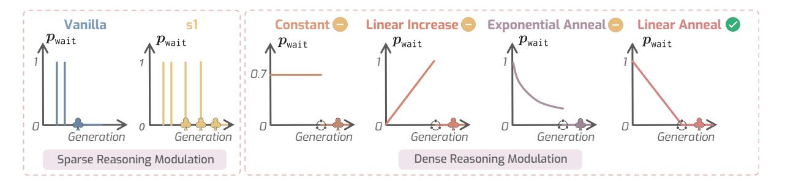
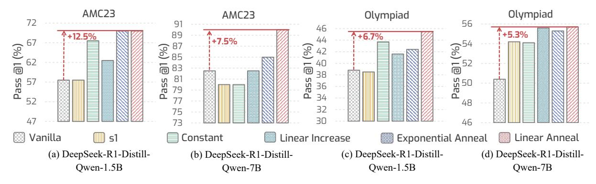

# 3.2 Pre-α Moment Modulation

Following previous works [\(Yang et al.,](#page-12-0) [2025c;](#page-12-0) [Muennighoff et al.,](#page-11-4) [2025\)](#page-11-4), we activate slow thinking before α moment via appending "wait" after a frequently co-generated structural delimiters "\n\n". Moreover, the activation of slow thinking is conducted following a user-specified scheduling plan, such as slow thinking, then fast thinking.

Stochastic Reasoning Transitioning Our α1 achieves such scheduling by modeling the activation of slow thinking as a Bernoulli stochastic process. Specifically, α1 append "wait" following Bernoulli(pwait). Let t = 0, 1, . . . , Tm be the timestamps of generated tokens before α moment, where Tm = αNthink represents the timestamp of α moment. pwait is determined by a user-specified scheduling function S(t),

$$\boldsymbol{p}_{\text{wait}} := \mathcal{S}(t), t = 0, 1, \dots, T_m. \tag{1}$$

This scheduling function can be arbitrary functions, such as linear annealing and linear increase. α1 adopts linear annealing, which we find the most effective and efficient (See Section [4.3.1\)](#page-5-0).

## 3.3 Post-α Moment Modulation

While an LRM significantly increases slow thinking through pre-α modulation, this extended thinking phase often exhibits *slow thinking inertia*, making it difficult to transition back to fast thinking. Notably, without post-α moment modulation, the LRM substantially reduces the likelihood of generating "</think>". Furthermore, inserting a few "</think>" tokens does not effectively overcome the inertia, failing to fully restore fast thinking.

Deterministic Reasoning Termination After the α moment, we guide α1 to transition into fast reasoning by disabling further slow thinking. Specifically, any generated slow reasoning transition token "wait" is replaced with "</think>" to explicitly mark the end of the thinking phase, reinforcing a shift to fast thinking before entering the answering phase. This deterministic termination strategy allows α1 to conclude reasoning naturally and consistently, enabling more efficient test-time scaling.

## 4 Experiments

## 4.1 Experimental Setup

Benchmarks To comprehensively evaluate the reasoning capability of LRMs, we conduct systematic evaluations on six benchmarks covering three reasoning categories: i) mathematical reasoning, including AIME 2024 (AIME24) [\(Mathematical](#page-11-6) [Association of America,](#page-11-6) [2024\)](#page-11-6), , AMC23 [\(AI-MO,](#page-8-0) [2024\)](#page-8-0), and Minerva-Math (Minerva) [\(Lewkowycz](#page-10-4) [et al.,](#page-10-4) [2022\)](#page-10-4); ii) code generation, including Live-CodeBench (LiveCode) [\(Jain et al.,](#page-10-5) [2025\)](#page-10-5); iii) scientific problems, including OlympiadBench (Olympiad) [\(He et al.,](#page-10-6) [2024\)](#page-10-6). We report the problem-solving accuracy by average Pass@1 (%), and the average number of generated tokens.

Base Models We use three o1-like open-source LRMs as the base model, including DeepSeek R1 distilled DeepSeek-R1-Distill-Qwen-1.5B and DeepSeek-R1-Distill-Qwen-7B [\(DeepSeek-AI](#page-9-0) [et al.,](#page-9-0) [2025\)](#page-9-0), as well as a recently larger LRM Qwen QwQ 32B [\(Qwen Team,](#page-11-5) [2025\)](#page-11-5).

Implementations Without additional specifications, we use a temperature of 0.6, top-p of 0.95, and the maximum token length is set to 8192. We set α as 1.4, and we obtain the average thinking phase token length generated by an LRM on any benchmark by randomly sampling 10 test questions and averaging the generated token length before benchmarking. See more details in Section [A.](#page-14-0)

Table 1: Systematic comparison of reasoning results on mathematical, coding, and science reasoning benchmarks with DeepSeek-R1-Distill-Qwen-1.5B, DeepSeek-R1-Distill-Qwen-7B, and Qwen QwQ 32B. P@1: Pass@1 (%); #Tk: number of generated tokens; ∆P@1 (%): average Pass@1 result boost over the base model. ∗For a fair comparison, S1 [\(Muennighoff et al.,](#page-11-4) [2025\)](#page-11-4) directly applies budget forcing at test-time without supervised fine-tuning, which is same as CoD and our α1 that are training-free.

|                               | MATHEMATICAL |      |           |      |          |      | CODING   |      | SCIENCE  |      |          |      |       |
|-------------------------------|--------------|------|-----------|------|----------|------|----------|------|----------|------|----------|------|-------|
| Method                        | AIME24       |      | AMC23     |      | Minerva  |      | MATH500  |      | LiveCode |      | Olympiad |      |       |
|                               | P@1          | #Tk  | P@1       | #Tk  | P@1      | #Tk  | P@1      | #Tk  | P@1      | #Tk  | P@1      | #Tk  | ∆P@1  |
| DeepSeek-R1-Distill-Qwen-1.5B |              |      |           |      |          |      |          |      |          |      |          |      |       |
| BASE                          | 23.3         | 7280 | 57.5      | 5339 | 32.0     | 4935 | 79.2     | 3773 | 17.8     | 6990 | 38.8     | 5999 | N/A   |
| s1∗                           | 26.7+3.4     | 7798 | 57.5+0.0  | 6418 | 31.6-0.4 | 5826 | 78.2-1.0 | 4733 | 17.0-0.8 | 7025 | 38.5-0.3 | 6673 | +0.15 |
| COD                           | 30.0+6.7     | 6994 | 65.0+7.5  | 5415 | 29.0-3.0 | 4005 | 81.4+2.2 | 3136 | 20.3+2.5 | 6657 | 40.6+1.8 | 5651 | +2.95 |
| α1 (Ours)                     | 30.0+6.7     | 5916 | 70.0+12.5 | 4952 | 34.2+2.2 | 4586 | 81.0+1.8 | 3852 | 24.8+7.0 | 5426 | 45.5+6.7 | 4944 | +6.15 |
| DeepSeek-R1-Distill-Qwen-7B   |              |      |           |      |          |      |          |      |          |      |          |      |       |
| BASE                          | 46.7         | 6648 | 82.5      | 4624 | 40.4     | 4191 | 87.6     | 3239 | 43.5     | 5885 | 50.4     | 5385 | N/A   |
| s1∗                           | 46.7+0.0     | 7295 | 80.0-2.5  | 5673 | 42.3+1.9 | 6510 | 92.8+5.2 | 5848 | 44.0+0.5 | 5979 | 54.2+3.8 | 6007 | +1.48 |
| COD                           | 43.3-3.4     | 6078 | 87.5+5.0  | 3594 | 43.4+3.0 | 2142 | 88.8+1.2 | 2094 | 45.0+1.5 | 5593 | 53.5+3.1 | 4520 | +1.73 |
| α1 (Ours)                     | 50.0+3.3     | 6827 | 90.0+7.5  | 4397 | 42.3+1.9 | 4124 | 91.2+3.6 | 4337 | 49.8+6.3 | 5067 | 55.7+5.3 | 4883 | +4.65 |
| Qwen QwQ-32B                  |              |      |           |      |          |      |          |      |          |      |          |      |       |
| BASE                          | 40.0         | 4058 | 77.5      | 2901 | 47.8     | 2199 | 90.2     | 1951 | 67.0     | 5092 | 53.6     | 3230 | N/A   |
| s1∗                           | 43.3+3.3     | 4221 | 77.5+0.0  | 3068 | 46.7-1.1 | 2433 | 90.8+0.6 | 2218 | 66.5-0.5 | 5260 | 55.1+1.5 | 3454 | +0.63 |
| COD                           | 46.7+6.7     | 3959 | 80.0+2.5  | 2400 | 47.4-0.4 | 1464 | 90.6+0.4 | 1421 | 66.8-0.2 | 4984 | 57.2+3.6 | 2844 | +2.10 |
| α1 (Ours)                     | 53.3+13.3    | 3141 | 87.5+10.0 | 2286 | 46.0-1.8 | 1441 | 89.4-0.8 | 1668 | 75.8+8.8 | 5824 | 56.1+2.5 | 2504 | +5.33 |

Baselines We compare our α1 against the vanilla LRM and two training-free, test-time scaling baselines. i) BASE: The original LRM that transitions between slow and fast thinking *automatically*, without any external modulation. ii) S1 [\(Muennighoff](#page-11-4) [et al.,](#page-11-4) [2025\)](#page-11-4): A baseline that enforces a *monotonically increasing* slow thinking pattern by appending approximately two "wait" tokens near the end of the reasoning phase to prolong slow thinking. For a fair comparison, we apply S1 at test time without supervised fine-tuning used in its original implementation. iii) CHAIN OF DRAFT (COD) [\(Xu et al.,](#page-12-5) [2025\)](#page-12-5): A baseline that enforces a *monotonically decreasing* slow thinking pattern by prompting the model to constrain each slow thinking step to no more than five words, thereby sharply reducing the thinking budget.

## 4.2 Main Results

Table [1](#page-4-0) shows the systematic comparison results of our α1 and baseline methods, and we observe: i) α1 consistently yields a higher problem-solving

accuracy than all baseline methods across all models and benchmarks. Notably, compared to the base model, α1 improves the 1.5B LRM by a clear margin of +6.15%, while reducing nearly 14% token length. This demonstrates both the effectiveness and efficiency of α1. ii) Compared to baseline test-time scaling methods, including s1 and CoD, α1 still achieves significantly better results. Specifically, the average accuracy boost over all benchmarks and models of α1 is +3.12% and +4.62% higher than CoD and s1, respectively. iii) Surprisingly, we observe that while α1 modulates reasoning densely without restrictions on reducing the thinking budget (instead, we use α > 1 that increases the thinking budget), the average thinking phase token length generated by α1 is only about +4.4% higher than the monotonically decreasing baseline CoD (4231 *vs.* 4053), which is about +21.0% more efficient than the monotonically increasing baseline s1 (4231 *vs.* 5357). This indicates that α1 achieves more efficient reasoning than baselines, which we provide analysis later.

> **[图片提取文字 (无描述)]:**
> Linear Increase Exponential Anneal Linear Anneal Vanilla Constant  $p_{\mathsf{wait}}$  $p_{\mathtt{wait}}$  $p_{\mathtt{wait}}$  $p_{\mathsf{wait}}$  $p_{\mathsf{wait}}$  $p_{\mathsf{wait}}$ Generation Generation Generation Generation Generation Generation Dense Reasoning Modulation Sparse Reasoning Modulation

Figure 3: **Visualization of different scheduling strategies.** We detail the functions in Section 4.3.1. Here  $\bigcirc$  represents  $\alpha$  moment, which we elaborate in Section 3.1, and  $\clubsuit$  denotes the end of the thinking phase.

> **[图片提取文字 (无描述)]:**
> AMC23 Olympiad AMC23 Olympiad 56 91 46 +5.3% 89 **?+12.5%** ^+6.7% (%) (62) (62) +7.5% 87 85 (%) 40 <u>ا</u> @ 83 38 81 Pass **S** 50 36 34 52 48 32 Vanilla Linear Increase Exponential Anneal Linear Anneal Constant 51 (a) DeepSeek-R1-Distill-(b) DeepSeek-R1-Distill-(c) DeepSeek-R1-Distill-(d) DeepSeek-R1-Distill-Owen-1.5B Owen-1.5B Owen-7B Owen-7B

Figure 4: Ablation study of different scheduling strategies on (a-b) AMC23 and (c-d) OlympaidBench.

#### 4.3 Analytic Results

In this section, we analyze  $\alpha 1$  by systematically addressing the following five questions:

## **4.3.1** What scheduling strategy is better?

As shown in Fig. 3, we study four variants of scheduling strategies for  $\mathcal{S}(t)$  defined in Eq. (1), where  $T_m = \alpha \overline{N}_{\text{think}}$  represents the timestamp of  $\alpha$  moment:

- Constant:  $\mathcal{S}(t) := p_{\text{constant}}$ , where  $p_{\text{constant}} \in [0,1]$  is a constant probability. This represents a consistently more slow thinking strategy, and the increase is large when  $p_{\text{constant}}$  is larger. Note that when  $p_{\text{constant}} = 0$  and  $\alpha = 1$ , it degenerates to vanilla reasoning models; and when  $p_{\text{constant}} < 0.1$  and  $\alpha > 1$ , it degenerates to s1-like model, where only about two "wait" are appended.
- Linear increase:  $S(t) := \frac{1}{T_m}t$ , where  $t = \{0, 1, \ldots, T_m\}$  and  $\frac{1}{T_m} > 0$  indicates the increasing coefficient. This scheduling function indicates a fast-to-slow thinking strategy.
- Exponential anneal:  $S(t) := \exp(-\gamma t)$ , where  $t = \{0, 1, \dots, T_m\}$  and  $\gamma > 0$  is a hyperparameter that controls annealing speed (here we use  $\gamma = 0.3$ ). This scheduling function indicates a slow-to-fast thinking strategy.

• Linear anneal:  $S(t) := -\frac{1}{T_m}t + 1$ , where  $-\frac{1}{T_m} < 0$  indicates the annealing coefficient. Its modulation is similar to exponential anneal scheduling.

Fig. 4 shows the results of  $\alpha 1$  using these four different scheduling strategies. We observe: i) Linear anneal consistently yields the highest reasoning accuracy, indicating that the *slow thinking first*, then fast thinking is a better slow thinking scheduling strategy. ii) Similar to linear anneal, exponential anneal also follows an annealing slow thinking scheduling, where the improvement on the 1.5B model further demonstrates the efficacy of the slow thinking, then fast thinking strategy. However, such annealing scheduling may lead to an unstable performance boost compared to linear anneal.

