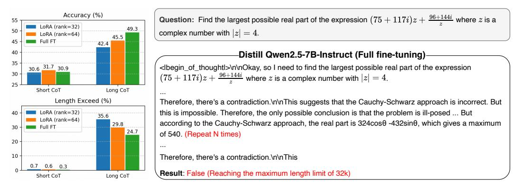
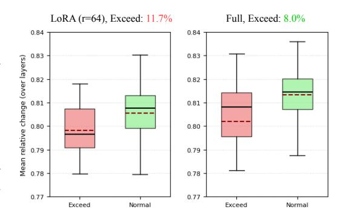
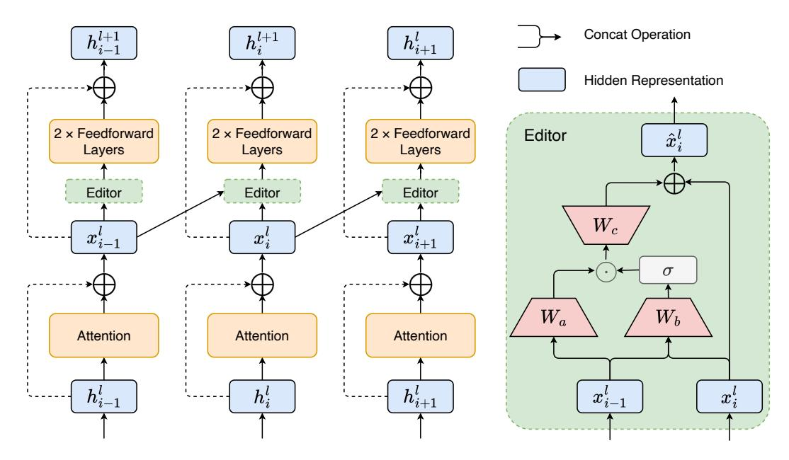
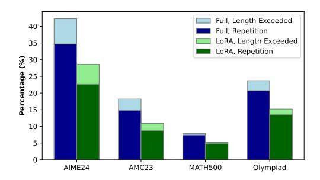
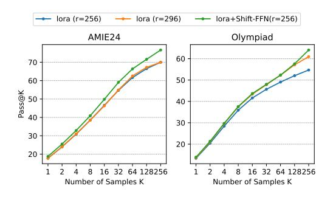
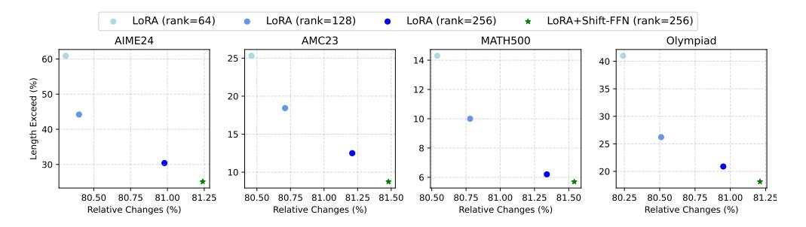
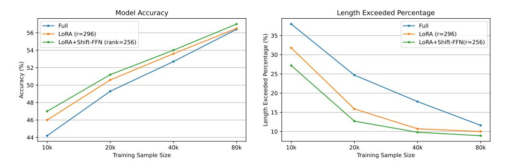

# 2 Related Work

Parameter-Efficient Fine-Tuning methods (PEFTs). PEFT methods adapt models to downstream tasks by updating only a small subset of parameters. Existing PEFT methods can be categorized into the following three categories [\[7\]](#page-9-3):

- 1. Addition based methods train additional lightweight modules that are positioned within the frozen model. Adapters insert small adapter layers between LM attention or MLP layers [\[11,](#page-9-6) [34,](#page-11-4) [9\]](#page-9-7). Prompt tuning inserts randomly-initialized soft tokens at the beginning of the input texts and trains their embeddings while keeping the LM weights frozen [\[14,](#page-10-4) [17\]](#page-10-5).
- 2. LoRA [\[12\]](#page-9-4) and its variants [\[46,](#page-11-5) [21\]](#page-10-6) employ low-rank matrix approximations for weight updates during training, while introducing no inference overhead as the updates can be directly merged into the base model parameters.
- 3. Representation editing based methods are motivated by representation engineering which demonstrates that adding "steering vectors" to the representation of each hidden layer can control pretrained LM generations [\[28,](#page-10-7) [20,](#page-10-8) [31\]](#page-10-9). Therefore, these methods learn to modify the hidden representations generated by multi-head attentions or FFNs [\[22,](#page-10-10) [39,](#page-11-6) [40\]](#page-11-7)

> **[图片提取文字 (无描述)]:**
> Accuracy (%) **Question:** Find the largest possible real part of the expression  $(75 + 117i)z + \frac{96 + 144i}{z}$  where z is a LoRA (rank=32) 49.3 50 complex number with |z|=4. LoRA (rank=64) 45.5 Full FT 42.4 Distill Qwen2.5-7B-Instruct (Full fine-tuning) 35 -<lbegin\_of\_thoughtl>\n\nOkay, so I need to find the largest possible real part of the expression  $(75+117i)z+\frac{96+144i}{z}$  where z is a complex number with |z|=4. Long CoT Short CoT Length Exceed (%) Therefore, there's a contradiction.\n\nThis suggests that the Cauchy-Schwarz approach is incorrect. But LoRA (rank=32) this is impossible. Therefore, the only possible conclusion is that the problem is ill-posed ... But 35.6 LoRA (rank=64) according to the Cauchy-Schwarz approach, the real part is 324cosθ -432sinθ, which gives a maximum 29.8 Full FT of 540. (Repeat N times) 10 Therefore, there's a contradiction.\n\nThis 0.6 0.3 Result: False (Reaching the maximum length limit of 32k) Short CoT Long CoT

Figure 1: (**Left**), performance comparison of LoRA and Full Fine-Tuning (Full FT) on Accuracy (%) and Length Exceed (%) metrics for short CoT and long CoT datasets. "Accuracy" represents the average accuracy across four mathematical tasks. "Length Exceed" indicates the percentage of model outputs that exceed the maximum length limit. (**Right**), an example of *Cyclical Reasoning*.

Our proposed Shift-FFN can be viewed as a representation editing-based method, but it incorporates preceding token information in the updating of representation.

Long CoT Distillation. Extensive studies have demonstrated that distilling long CoT data from powerful reasoning models into student models can significantly enhance the students' reasoning capabilities [3, 43, 38]. Furthermore, LIMO [44] reveals that a small set of carefully selected examples suffices to elicit the model's complex mathematical reasoning capabilities. [15] finds that the structure of long CoT proves essential for effective learning, while the specific content within individual reasoning steps exhibits minimal impact. DLCoT [23] proposes to optimize long CoT through segmentation, redundancy elimination, and error correction. Their experimental results demonstrated that eliminating redundant reasoning paths leads to improvements in distillation efficiency. While existing approaches primarily investigate from a data perspective, this paper focuses on model architecture, enabling Shift-FFN to be complementary with such methods.

**Token Shift**. RWKV [24] introduces time-mixing and channel-mixing by computing linear projections from weighted combinations of the current and previous input representations within each block. KV shift [41] performs linear combinations of the current token's key/value vectors with those of the preceding token, and demonstrates that Shift-KV attention exhibits enhanced capability in learning induction heads. Fox [19] dynamically computes the weighting coefficient for the preceding token in the shift operation, followed by RMSNorm (Root Mean Square Normalization) [45] of the weighted results. These methods focus on training a model from scratch, whereas this paper studies how to fine-tune a model better by shifting tokens.

#### 3 Method

#### 3.1 Motivation

**Feature Definition.** [35] explores the internal workings of LLMs by treating the sequence of hidden states as a Chain-of-Embedding (CoE), representing the model's latent thought process. Their analysis reveals distinct patterns in these CoE features when LLMs produced correct versus incorrect answers. Motivated by this work, we pose the question: Can the internal hidden states of a model be leveraged to detect instances of *Cyclical Reasoning*?

Instead of averaging token representations per layer and forming an embedding trajectory from these layer-wise averages [35, 36], we utilize the sequence of token representations from each layer as our embedding trajectory. The embedding trajectory at layer l, denoted as  $X^l$ , is formalized as follows:

$$\boldsymbol{X}^l = \boldsymbol{x}_0^l \rightarrow \boldsymbol{x}_1^l \rightarrow ... \rightarrow \boldsymbol{x}_{I-1}^l \rightarrow \boldsymbol{x}_I^l$$

where  $x_i^l$  denotes the hidden state of the *i*-th token after attention in the *l*-th layer, *I* is the length of the generated sequence. We measure the LLMs' thinking process by using the relative change in

hidden states at each time step.

$$s(\boldsymbol{x}_{i-1}^{l}, \boldsymbol{x}_{i}^{l}) = \frac{\|\boldsymbol{x}_{i}^{l} - \boldsymbol{x}_{i-1}^{l}\|_{2}}{\|\boldsymbol{x}_{i-1}^{l}\|_{2}}$$
(2)

Then we define the overall relative change of the embedding trajectories, denoted as M(X), as the average of the relative changes between every adjacent tokens across all layers. This can be formalized as follows:

$$M(\mathbf{X}) = \frac{1}{L \times I} \sum_{l=1}^{L} \sum_{i=1}^{I} s(\mathbf{x}_{i-1}^{l}, \mathbf{x}_{i}^{l})$$
(3)

where L is the total number of layers in the LLM, I is the length of the generated sequence.

Analysis Setup and Findings. We train two models on a 20k long CoT using LoRA and full fine-tuning, respectively. We evaluate these models on a randomly selected set of 100 questions from the MATH500 [10], with a sampling of eight times, and exclude questions where all eight generated responses exceed the maximum length limit. For the remaining length-exceeded responses, we truncate them to the average length of the normal (non-length-exceeded) responses and remove all repeated text segments. Finally, we calculate the M(X) values for both the normal and the length-exceeded responses. The results are shown in Figure 2, we can find that the "Exceed" samples tend to exhibit a lower mean relative change compared to the "Normal" samples in both models, as indicated by the

> **[图片提取文字 (无描述)]:**
> Full, Exceed: 8.0% LoRA (r=64), Exceed: 11.7% 0.84 0.84 0.83 0.83 Mean relative change (over layers) 0.82 0.82 0.81 0.81 0.80 0.80 0.79 0.79 0.78 0.78 0.77 0.77 Exceed Normal Exceed Normal

Figure 2: Distribution of the  $M(\boldsymbol{X})$  for Exceed and Normal samples, comparing LoRA and Full fine-tuned models. The dashed red line represents the mean value.

lower median and mean (dashed red line) of the "Exceed" box plots. This suggests that when the models engage in  $Cyclical\ Reasoning$  (section 4.2 elaborates on the rationale for using the  $Length\ Exceeded\ Percentage$  to measure  $Cyclical\ Reasoning$ ), the relative change in their adjacent hidden states tends to be less pronounced on average. Furthermore, this paper finds that the full fine-tuned model exhibits a lower proportion of Exceed samples, and concurrently, the M(X) value across all its generated samples is also higher.

Based on these findings, a natural research question arises: Can we mitigate models' Cyclical Reasoning issues and consequently enhance its performance by dynamically amplifying representation differences between adjacent tokens?

#### 3.2 Shift Feedforward Network

Motivated by the aforementioned considerations, we propose Shift Feedforward Network (Shift-FFN), an architecture that introduces an Editor module before the FFN. This module uses the preceding token's representation to edit the current token's representation, thereby dynamically amplifying the representation differences between adjacent tokens. The mathematical formulation of this process is as follows:

$$Shift-FFN(x_i) = FFN(x_i + f_s(x_{i-1}, x_i))$$
(4)

where FFN is the original feedforward layer,  $f_x(\cdot)$  represents shift function, which is defined as:

$$f_s(\boldsymbol{x_{i-1}}, \boldsymbol{x_i}) = W_c \left[ ReLU(W_b \left[ \boldsymbol{x_{i-1}}; \boldsymbol{x_i} \right]) \odot (W_a \, \boldsymbol{x_{i-1}}) \right] \tag{5}$$

where  $x_i \in \mathbb{R}^d$  is the representation of token i after attention, [;] denotes concatenate operation,  $W_b \in \mathbb{R}^{r \times 2d}$ ,  $W_a \in \mathbb{R}^{r \times d}$  and  $W_c \in \mathbb{R}^{d \times r}$  are parameter matrices in the Editor module, and they are trained from scratch. To maintain a manageable increase in the number of parameters, we set the dimensionality r to be significantly smaller than d ( $r \ll d$ ), In LoRA fine-tuning, the value of r corresponds to the rank of the LoRA. To ensure training stability in the initial stages, we initialize the matrix  $W_c$  as an all-zero matrix. This initialization causes the Shift-FFN to degenerate into the original FFN during the early phase of training.

> **[图片提取文字 (无描述)]:**
> **Concat Operation**  $h_i^{l+1}$  $h_{i+1}^l$ Hidden Representation 2 x Feedforward 2 × Feedforward 2 × Feedforward Editor  $\hat{x}_i^l$ Layers Layers Layers Editor Editor Editor  $x_{i+1}^\iota$  $\sigma$  $W_a$  $W_b$ Attention Attention Attention  $h_{i-1}^l$  $h_{i+1}^l$  $x_i^l$

Figure 3: The architecture of Shift-FFN, the **left** side describes the process of shifting token, the **right** side demonstrates the detail of the Editor module.  $\sigma$  is the ReLU function.  $\odot$  and  $\oplus$  are element-wise multiplication and addition, respectively.

#### 3.3 Analysis

From simplicity, we consider  $f_s(\boldsymbol{x_{i-1}}, \boldsymbol{x_i}) = W_c \, W_b \, \boldsymbol{x_{i-1}} = W_s \, \boldsymbol{x_{i-1}} = \hat{\boldsymbol{x}_{i-1}}$  and use standard FFN $(x_i) = W_{down}[\sigma(W_{up} \, x_i)]$  in this section.

From the Perspective of Neural Memory. [5, 4] proposes that FFN can be regarded as a form of Unnormalized Key-Value Memory [30, 29], where the first linear layer generates the keys, computing a set of retrieval weights for each token. Subsequently, the second linear layer produces the values, which are then multiplied by their corresponding retrieval weights and summed to complete the retrieval process [27]. Therefore, the FFN layer can be also defined as:

$$FFN(x_i) = \sum_{j=1}^{d_m} w_{i,j} \cdot \boldsymbol{v}_j$$
 (6)

where  $w_{i,j} = \sigma(\boldsymbol{x}_i^T \boldsymbol{k}_j)$ ,  $\boldsymbol{k}_j$  denotes the j-th row of  $W_{up}$ ,  $\boldsymbol{v}_j$  denotes the j-th column of  $W_{down}$ . The  $w_{i,j}$  is the coefficient that assigns weights to the corresponding value vector  $\boldsymbol{v}_j$ . In the scenario of Shift-FFN, the  $w_{i,j}$  is changed as follows:

$$w_{i,j} = \sigma(\mathbf{x}_i^T \mathbf{k}_j) + \sigma(\hat{\mathbf{x}}_{i-1}^T \mathbf{k}_j)$$
(7)

Therefore, our Shift-FFN can be viewed as extending the single key retrieval mechanism in **Key-Value Memory to a multi-key retrieval in the FFN**. This process is also similar to applying Multi-Ouery Attention [25] in the FFN.

**From the Perspective of Self Attention**. As defined previously, the output of the Shift-FFN can be expressed as:

$$\mathbf{h}_{i}^{l+1} = W_{down}[\sigma(W_{up}(\mathbf{x}_{i} + \hat{\mathbf{x}}_{i-1})] = \mathbf{h}_{i} + \hat{\mathbf{h}}_{i}$$
 (8)

where  $h_i$  is the original FFN output,  $\hat{h}_i = W_{down}[\sigma(W_{up}\hat{x}_{i-1})]$  is introduced by Shift-FFN additionally. Then, the attention score  $\alpha_{i,j}$  between token i and j at layer l+1 is calculated as follows (residual connections and normalization are omitted):

$$\alpha_{i,j} = [W_q(\mathbf{h}_i + \hat{\mathbf{h}}_i)]^T [W_k(\mathbf{h}_j + \hat{\mathbf{h}}_j)]$$

$$= \alpha'_{i,j} + (W_q \mathbf{h}_i)^T (W_k \hat{\mathbf{h}}_j) + (W_q \hat{\mathbf{h}}_i)^T (W_k \mathbf{h}_j) + (W_q \hat{\mathbf{h}}_i)^T (W_k \hat{\mathbf{h}}_j)$$
(9)

Table 1: Performance of models on mathematical reasoning benchmarks with different training setups. Each cell presents the Accuracy followed by the Length Exceeded Percentage  $P_E$  (in parentheses) which indicates the percentage of generated responses exceeding the 32k token limit. The "Param" column indicates the number of trainable parameters. The best performance within each LoRA configuration is highlighted in bold.

| Method                 | Param                                                                                                                                                                                                                                                          | AIME24                                                                                                                                                                                                                                                                                                                                                                                                                                                                                                                                                                                                                                                     | AMC23                                                                                                                                                                                                                                                                                                                                                                                                                                                                                                                                                                                                                                                                                                                                                                                                                                                                                                                                    | MATH500                                                                                                                                                                                                                                                                                                                                                                                                                                                                                                                                                                                                                                                                                                                                                                                                                                                                                                                                                                                                                                                                                                                                                                                                                          | Olympiad                                                                                                                                                                                                                                                                                                                                                                                                                                                                                                                                                                                                                                                                                                                                                                                                                                                                                                                                                                                                                                                                                                                                                                                                                                                                                                                 | Avg                                                                                                                                                                                                                                                                                                                                                                                                                                                                                                                                                                                                                                                                                                                                                                                                                                                                                                                                                                                                                                                                                                                                                                                                                                                                                                                                             |
|------------------------|----------------------------------------------------------------------------------------------------------------------------------------------------------------------------------------------------------------------------------------------------------------|------------------------------------------------------------------------------------------------------------------------------------------------------------------------------------------------------------------------------------------------------------------------------------------------------------------------------------------------------------------------------------------------------------------------------------------------------------------------------------------------------------------------------------------------------------------------------------------------------------------------------------------------------------|------------------------------------------------------------------------------------------------------------------------------------------------------------------------------------------------------------------------------------------------------------------------------------------------------------------------------------------------------------------------------------------------------------------------------------------------------------------------------------------------------------------------------------------------------------------------------------------------------------------------------------------------------------------------------------------------------------------------------------------------------------------------------------------------------------------------------------------------------------------------------------------------------------------------------------------|----------------------------------------------------------------------------------------------------------------------------------------------------------------------------------------------------------------------------------------------------------------------------------------------------------------------------------------------------------------------------------------------------------------------------------------------------------------------------------------------------------------------------------------------------------------------------------------------------------------------------------------------------------------------------------------------------------------------------------------------------------------------------------------------------------------------------------------------------------------------------------------------------------------------------------------------------------------------------------------------------------------------------------------------------------------------------------------------------------------------------------------------------------------------------------------------------------------------------------|--------------------------------------------------------------------------------------------------------------------------------------------------------------------------------------------------------------------------------------------------------------------------------------------------------------------------------------------------------------------------------------------------------------------------------------------------------------------------------------------------------------------------------------------------------------------------------------------------------------------------------------------------------------------------------------------------------------------------------------------------------------------------------------------------------------------------------------------------------------------------------------------------------------------------------------------------------------------------------------------------------------------------------------------------------------------------------------------------------------------------------------------------------------------------------------------------------------------------------------------------------------------------------------------------------------------------|-------------------------------------------------------------------------------------------------------------------------------------------------------------------------------------------------------------------------------------------------------------------------------------------------------------------------------------------------------------------------------------------------------------------------------------------------------------------------------------------------------------------------------------------------------------------------------------------------------------------------------------------------------------------------------------------------------------------------------------------------------------------------------------------------------------------------------------------------------------------------------------------------------------------------------------------------------------------------------------------------------------------------------------------------------------------------------------------------------------------------------------------------------------------------------------------------------------------------------------------------------------------------------------------------------------------------------------------------|
| Full                   | 3.09B (100%)                                                                                                                                                                                                                                                   | 3.1 (80.3)                                                                                                                                                                                                                                                                                                                                                                                                                                                                                                                                                                                                                                                 | 29.4 (53.2)                                                                                                                                                                                                                                                                                                                                                                                                                                                                                                                                                                                                                                                                                                                                                                                                                                                                                                                              | 51.2 (34.8)                                                                                                                                                                                                                                                                                                                                                                                                                                                                                                                                                                                                                                                                                                                                                                                                                                                                                                                                                                                                                                                                                                                                                                                                                      | 20.2 (55.5)                                                                                                                                                                                                                                                                                                                                                                                                                                                                                                                                                                                                                                                                                                                                                                                                                                                                                                                                                                                                                                                                                                                                                                                                                                                                                                              | 26.0 (55.9)                                                                                                                                                                                                                                                                                                                                                                                                                                                                                                                                                                                                                                                                                                                                                                                                                                                                                                                                                                                                                                                                                                                                                                                                                                                                                                                                     |
| LoRA (r=128)           | 0.24B (7.8%)                                                                                                                                                                                                                                                   | 4.3 (62.3)                                                                                                                                                                                                                                                                                                                                                                                                                                                                                                                                                                                                                                                 | 30.6 (40.1)                                                                                                                                                                                                                                                                                                                                                                                                                                                                                                                                                                                                                                                                                                                                                                                                                                                                                                                              | 54.4 (25.1)                                                                                                                                                                                                                                                                                                                                                                                                                                                                                                                                                                                                                                                                                                                                                                                                                                                                                                                                                                                                                                                                                                                                                                                                                      | 21.9 (41.7)                                                                                                                                                                                                                                                                                                                                                                                                                                                                                                                                                                                                                                                                                                                                                                                                                                                                                                                                                                                                                                                                                                                                                                                                                                                                                                              | 27.8 (42.3)                                                                                                                                                                                                                                                                                                                                                                                                                                                                                                                                                                                                                                                                                                                                                                                                                                                                                                                                                                                                                                                                                                                                                                                                                                                                                                                                     |
| LoRA+Shift-FFN (r=128) | 0.28B (9.1%)                                                                                                                                                                                                                                                   | <b>4.6</b> (57.1)                                                                                                                                                                                                                                                                                                                                                                                                                                                                                                                                                                                                                                          | <b>31.5</b> (34.7)                                                                                                                                                                                                                                                                                                                                                                                                                                                                                                                                                                                                                                                                                                                                                                                                                                                                                                                       | <b>55.0</b> (21.2)                                                                                                                                                                                                                                                                                                                                                                                                                                                                                                                                                                                                                                                                                                                                                                                                                                                                                                                                                                                                                                                                                                                                                                                                               | <b>23.7</b> (37.0)                                                                                                                                                                                                                                                                                                                                                                                                                                                                                                                                                                                                                                                                                                                                                                                                                                                                                                                                                                                                                                                                                                                                                                                                                                                                                                       | <b>28.7</b> (37.5)                                                                                                                                                                                                                                                                                                                                                                                                                                                                                                                                                                                                                                                                                                                                                                                                                                                                                                                                                                                                                                                                                                                                                                                                                                                                                                                              |
| LoRA (r=256)           | 0.48B (15.6%)                                                                                                                                                                                                                                                  | 5.4 (49.4)                                                                                                                                                                                                                                                                                                                                                                                                                                                                                                                                                                                                                                                 | 32.7 (31.6)                                                                                                                                                                                                                                                                                                                                                                                                                                                                                                                                                                                                                                                                                                                                                                                                                                                                                                                              | 57.6 (17.2)                                                                                                                                                                                                                                                                                                                                                                                                                                                                                                                                                                                                                                                                                                                                                                                                                                                                                                                                                                                                                                                                                                                                                                                                                      | 24.1 (31.3)                                                                                                                                                                                                                                                                                                                                                                                                                                                                                                                                                                                                                                                                                                                                                                                                                                                                                                                                                                                                                                                                                                                                                                                                                                                                                                              | 30.0 (32.3)                                                                                                                                                                                                                                                                                                                                                                                                                                                                                                                                                                                                                                                                                                                                                                                                                                                                                                                                                                                                                                                                                                                                                                                                                                                                                                                                     |
| LoRA+Shift-FFN (r=256) | 0.55B (18.2%)                                                                                                                                                                                                                                                  | <b>7.0</b> (43.2)                                                                                                                                                                                                                                                                                                                                                                                                                                                                                                                                                                                                                                          | <b>35.2</b> (24.9)                                                                                                                                                                                                                                                                                                                                                                                                                                                                                                                                                                                                                                                                                                                                                                                                                                                                                                                       | <b>60.2</b> (13.9)                                                                                                                                                                                                                                                                                                                                                                                                                                                                                                                                                                                                                                                                                                                                                                                                                                                                                                                                                                                                                                                                                                                                                                                                               | <b>25.6</b> (28.2)                                                                                                                                                                                                                                                                                                                                                                                                                                                                                                                                                                                                                                                                                                                                                                                                                                                                                                                                                                                                                                                                                                                                                                                                                                                                                                       | <b>32.0</b> (27.5)                                                                                                                                                                                                                                                                                                                                                                                                                                                                                                                                                                                                                                                                                                                                                                                                                                                                                                                                                                                                                                                                                                                                                                                                                                                                                                                              |
| Full                   | 8.03B (100%)                                                                                                                                                                                                                                                   | 6.7 (23.3)                                                                                                                                                                                                                                                                                                                                                                                                                                                                                                                                                                                                                                                 | 41.4 (13.5)                                                                                                                                                                                                                                                                                                                                                                                                                                                                                                                                                                                                                                                                                                                                                                                                                                                                                                                              | 63.2 (5.3)                                                                                                                                                                                                                                                                                                                                                                                                                                                                                                                                                                                                                                                                                                                                                                                                                                                                                                                                                                                                                                                                                                                                                                                                                       | 30.7 (12.6)                                                                                                                                                                                                                                                                                                                                                                                                                                                                                                                                                                                                                                                                                                                                                                                                                                                                                                                                                                                                                                                                                                                                                                                                                                                                                                              | 35.5 (13.7)                                                                                                                                                                                                                                                                                                                                                                                                                                                                                                                                                                                                                                                                                                                                                                                                                                                                                                                                                                                                                                                                                                                                                                                                                                                                                                                                     |
| LoRA (r=128)           | 0.34B (4.2%)                                                                                                                                                                                                                                                   | <b>4.6</b> (35.7)                                                                                                                                                                                                                                                                                                                                                                                                                                                                                                                                                                                                                                          | 34.0 (22.1)                                                                                                                                                                                                                                                                                                                                                                                                                                                                                                                                                                                                                                                                                                                                                                                                                                                                                                                              | 58.2 (9.3)                                                                                                                                                                                                                                                                                                                                                                                                                                                                                                                                                                                                                                                                                                                                                                                                                                                                                                                                                                                                                                                                                                                                                                                                                       | 26.0 (22.2)                                                                                                                                                                                                                                                                                                                                                                                                                                                                                                                                                                                                                                                                                                                                                                                                                                                                                                                                                                                                                                                                                                                                                                                                                                                                                                              | 30.7 (22.4)                                                                                                                                                                                                                                                                                                                                                                                                                                                                                                                                                                                                                                                                                                                                                                                                                                                                                                                                                                                                                                                                                                                                                                                                                                                                                                                                     |
| LoRA+Shift-FFN (r=128) | 0.40B (5.0%)                                                                                                                                                                                                                                                   | 3.6 (34.5)                                                                                                                                                                                                                                                                                                                                                                                                                                                                                                                                                                                                                                                 | <b>34.3</b> (17.6)                                                                                                                                                                                                                                                                                                                                                                                                                                                                                                                                                                                                                                                                                                                                                                                                                                                                                                                       | <b>60.2</b> (9.0)                                                                                                                                                                                                                                                                                                                                                                                                                                                                                                                                                                                                                                                                                                                                                                                                                                                                                                                                                                                                                                                                                                                                                                                                                | <b>27.0</b> (18.3)                                                                                                                                                                                                                                                                                                                                                                                                                                                                                                                                                                                                                                                                                                                                                                                                                                                                                                                                                                                                                                                                                                                                                                                                                                                                                                       | <b>31.3</b> (19.8)                                                                                                                                                                                                                                                                                                                                                                                                                                                                                                                                                                                                                                                                                                                                                                                                                                                                                                                                                                                                                                                                                                                                                                                                                                                                                                                              |
| LoRA (r=256)           | 0.67B (8.4%)                                                                                                                                                                                                                                                   | <b>5.4</b> (25.9)                                                                                                                                                                                                                                                                                                                                                                                                                                                                                                                                                                                                                                          | 37.8 (15.1)                                                                                                                                                                                                                                                                                                                                                                                                                                                                                                                                                                                                                                                                                                                                                                                                                                                                                                                              | 62.5 (6.6)                                                                                                                                                                                                                                                                                                                                                                                                                                                                                                                                                                                                                                                                                                                                                                                                                                                                                                                                                                                                                                                                                                                                                                                                                       | 29.3 (15.7)                                                                                                                                                                                                                                                                                                                                                                                                                                                                                                                                                                                                                                                                                                                                                                                                                                                                                                                                                                                                                                                                                                                                                                                                                                                                                                              | 33.7 (15.8)                                                                                                                                                                                                                                                                                                                                                                                                                                                                                                                                                                                                                                                                                                                                                                                                                                                                                                                                                                                                                                                                                                                                                                                                                                                                                                                                     |
| LoRA+Shift-FFN (r=256) | 0.81B (10.0%)                                                                                                                                                                                                                                                  | 5.1 (22.8)                                                                                                                                                                                                                                                                                                                                                                                                                                                                                                                                                                                                                                                 | <b>38.0</b> (12.1)                                                                                                                                                                                                                                                                                                                                                                                                                                                                                                                                                                                                                                                                                                                                                                                                                                                                                                                       | <b>63.2</b> (5.1)                                                                                                                                                                                                                                                                                                                                                                                                                                                                                                                                                                                                                                                                                                                                                                                                                                                                                                                                                                                                                                                                                                                                                                                                                | <b>29.4</b> (13.7)                                                                                                                                                                                                                                                                                                                                                                                                                                                                                                                                                                                                                                                                                                                                                                                                                                                                                                                                                                                                                                                                                                                                                                                                                                                                                                       | <b>34.0</b> (13.4)                                                                                                                                                                                                                                                                                                                                                                                                                                                                                                                                                                                                                                                                                                                                                                                                                                                                                                                                                                                                                                                                                                                                                                                                                                                                                                                              |
| Full                   | 7.62B (100%)                                                                                                                                                                                                                                                   | 20.0 (42.3)                                                                                                                                                                                                                                                                                                                                                                                                                                                                                                                                                                                                                                                | 58.1 (17.3)                                                                                                                                                                                                                                                                                                                                                                                                                                                                                                                                                                                                                                                                                                                                                                                                                                                                                                                              | 78.7 (8.0)                                                                                                                                                                                                                                                                                                                                                                                                                                                                                                                                                                                                                                                                                                                                                                                                                                                                                                                                                                                                                                                                                                                                                                                                                       | 42.1 (23.6)                                                                                                                                                                                                                                                                                                                                                                                                                                                                                                                                                                                                                                                                                                                                                                                                                                                                                                                                                                                                                                                                                                                                                                                                                                                                                                              | 49.3 (24.7)                                                                                                                                                                                                                                                                                                                                                                                                                                                                                                                                                                                                                                                                                                                                                                                                                                                                                                                                                                                                                                                                                                                                                                                                                                                                                                                                     |
| LoRA (r=128)           | 0.32B (4.2%)                                                                                                                                                                                                                                                   | 17.8 (42.5)                                                                                                                                                                                                                                                                                                                                                                                                                                                                                                                                                                                                                                                | 54.7 (20.2)                                                                                                                                                                                                                                                                                                                                                                                                                                                                                                                                                                                                                                                                                                                                                                                                                                                                                                                              | 76.1 (8.2)                                                                                                                                                                                                                                                                                                                                                                                                                                                                                                                                                                                                                                                                                                                                                                                                                                                                                                                                                                                                                                                                                                                                                                                                                       | 39.9 (24.1)                                                                                                                                                                                                                                                                                                                                                                                                                                                                                                                                                                                                                                                                                                                                                                                                                                                                                                                                                                                                                                                                                                                                                                                                                                                                                                              | 47.1 (23.7)                                                                                                                                                                                                                                                                                                                                                                                                                                                                                                                                                                                                                                                                                                                                                                                                                                                                                                                                                                                                                                                                                                                                                                                                                                                                                                                                     |
| LoRA+Shift-FFN (r=128) | 0.37B (4.9%)                                                                                                                                                                                                                                                   | <b>18.2</b> (35.6)                                                                                                                                                                                                                                                                                                                                                                                                                                                                                                                                                                                                                                         | <b>55.6</b> (15.3)                                                                                                                                                                                                                                                                                                                                                                                                                                                                                                                                                                                                                                                                                                                                                                                                                                                                                                                       | <b>78.1</b> (7.0)                                                                                                                                                                                                                                                                                                                                                                                                                                                                                                                                                                                                                                                                                                                                                                                                                                                                                                                                                                                                                                                                                                                                                                                                                | <b>41.0</b> (19.1)                                                                                                                                                                                                                                                                                                                                                                                                                                                                                                                                                                                                                                                                                                                                                                                                                                                                                                                                                                                                                                                                                                                                                                                                                                                                                                       | <b>48.2</b> (19.2)                                                                                                                                                                                                                                                                                                                                                                                                                                                                                                                                                                                                                                                                                                                                                                                                                                                                                                                                                                                                                                                                                                                                                                                                                                                                                                                              |
| LoRA (r=256)           | 0.64B (8.4%)                                                                                                                                                                                                                                                   | 21.0 (28.6)                                                                                                                                                                                                                                                                                                                                                                                                                                                                                                                                                                                                                                                | 58.5 (10.9)                                                                                                                                                                                                                                                                                                                                                                                                                                                                                                                                                                                                                                                                                                                                                                                                                                                                                                                              | 79.1 (5.2)                                                                                                                                                                                                                                                                                                                                                                                                                                                                                                                                                                                                                                                                                                                                                                                                                                                                                                                                                                                                                                                                                                                                                                                                                       | 43.0 (15.2)                                                                                                                                                                                                                                                                                                                                                                                                                                                                                                                                                                                                                                                                                                                                                                                                                                                                                                                                                                                                                                                                                                                                                                                                                                                                                                              | 50.4 (15.0)                                                                                                                                                                                                                                                                                                                                                                                                                                                                                                                                                                                                                                                                                                                                                                                                                                                                                                                                                                                                                                                                                                                                                                                                                                                                                                                                     |
| LoRA+Shift-FFN (r=256) | 0.75B (9.8%)                                                                                                                                                                                                                                                   | <b>21.8</b> (23.5)                                                                                                                                                                                                                                                                                                                                                                                                                                                                                                                                                                                                                                         | <b>59.1</b> (9.9)                                                                                                                                                                                                                                                                                                                                                                                                                                                                                                                                                                                                                                                                                                                                                                                                                                                                                                                        | <b>79.9</b> (4.1)                                                                                                                                                                                                                                                                                                                                                                                                                                                                                                                                                                                                                                                                                                                                                                                                                                                                                                                                                                                                                                                                                                                                                                                                                | <b>43.8</b> (13.1)                                                                                                                                                                                                                                                                                                                                                                                                                                                                                                                                                                                                                                                                                                                                                                                                                                                                                                                                                                                                                                                                                                                                                                                                                                                                                                       | <b>51.2</b> (12.7)                                                                                                                                                                                                                                                                                                                                                                                                                                                                                                                                                                                                                                                                                                                                                                                                                                                                                                                                                                                                                                                                                                                                                                                                                                                                                                                              |
|                        | Full  LoRA (r=128)  LoRA (r=256)  LoRA+Shift-FFN (r=256)  Full  LoRA (r=128)  LoRA+Shift-FFN (r=128)  LoRA (r=256)  LoRA+Shift-FFN (r=256)  Full  LoRA (r=256)  LoRA+Shift-FFN (r=256)  Full  LoRA (r=128)  LoRA (r=128)  LoRA (r=128)  LoRA+Shift-FFN (r=128) | Full         3.09B (100%)           LoRA (r=128)         0.24B (7.8%)           LoRA+Shift-FFN (r=128)         0.28B (9.1%)           LoRA (r=256)         0.48B (15.6%)           LoRA+Shift-FFN (r=256)         0.55B (18.2%)           Full         8.03B (100%)           LoRA (r=128)         0.34B (4.2%)           LoRA+Shift-FFN (r=128)         0.40B (5.0%)           LoRA (r=256)         0.67B (8.4%)           LoRA+Shift-FFN (r=256)         0.81B (10.0%)           Full         7.62B (100%)           LoRA (r=128)         0.32B (4.2%)           LoRA+Shift-FFN (r=128)         0.37B (4.9%)           LoRA (r=256)         0.64B (8.4%) | Full         3.09B (100%)         3.1 (80.3)           LoRA (r=128)         0.24B (7.8%)         4.3 (62.3)           LoRA+Shift-FFN (r=128)         0.28B (9.1%)         4.6 (57.1)           LoRA (r=256)         0.48B (15.6%)         5.4 (49.4)           LoRA+Shift-FFN (r=256)         0.55B (18.2%)         7.0 (43.2)           Full         8.03B (100%)         6.7 (23.3)           LoRA (r=128)         0.34B (4.2%)         4.6 (35.7)           LoRA+Shift-FFN (r=128)         0.40B (5.0%)         3.6 (34.5)           LoRA (r=256)         0.67B (8.4%)         5.4 (25.9)           LoRA+Shift-FFN (r=256)         0.81B (10.0%)         5.1 (22.8)           Full         7.62B (100%)         20.0 (42.3)           LoRA (r=128)         0.32B (4.2%)         17.8 (42.5)           LoRA+Shift-FFN (r=128)         0.37B (4.9%)         18.2 (35.6)           LoRA (r=256)         0.64B (8.4%)         21.0 (28.6) | Full         3.09B (100%)         3.1 (80.3)         29.4 (53.2)           LoRA (r=128)         0.24B (7.8%)         4.3 (62.3)         30.6 (40.1)           LoRA+Shift-FFN (r=128)         0.28B (9.1%)         4.6 (57.1)         31.5 (34.7)           LoRA (r=256)         0.48B (15.6%)         5.4 (49.4)         32.7 (31.6)           LoRA+Shift-FFN (r=256)         0.55B (18.2%)         7.0 (43.2)         35.2 (24.9)           Full         8.03B (100%)         6.7 (23.3)         41.4 (13.5)           LoRA (r=128)         0.34B (4.2%)         4.6 (35.7)         34.0 (22.1)           LoRA+Shift-FFN (r=128)         0.40B (5.0%)         3.6 (34.5)         34.3 (17.6)           LoRA (r=256)         0.67B (8.4%)         5.4 (25.9)         37.8 (15.1)           LoRA+Shift-FFN (r=256)         0.81B (10.0%)         5.1 (22.8)         38.0 (12.1)           Full         7.62B (100%)         20.0 (42.3)         58.1 (17.3)           LoRA (r=128)         0.32B (4.2%)         17.8 (42.5)         54.7 (20.2)           LoRA+Shift-FFN (r=128)         0.37B (4.9%)         18.2 (35.6)         55.6 (15.3)           LoRA (r=256)         0.64B (8.4%)         21.0 (28.6)         58.5 (10.9) | Full         3.09B (100%)         3.1 (80.3)         29.4 (53.2)         51.2 (34.8)           LoRA (r=128)         0.24B (7.8%)         4.3 (62.3)         30.6 (40.1)         54.4 (25.1)           LoRA+Shift-FFN (r=128)         0.28B (9.1%)         4.6 (57.1)         31.5 (34.7)         55.0 (21.2)           LoRA (r=256)         0.48B (15.6%)         5.4 (49.4)         32.7 (31.6)         57.6 (17.2)           LoRA+Shift-FFN (r=256)         0.55B (18.2%)         7.0 (43.2)         35.2 (24.9)         60.2 (13.9)           Full         8.03B (100%)         6.7 (23.3)         41.4 (13.5)         63.2 (5.3)           LoRA (r=128)         0.34B (4.2%)         4.6 (35.7)         34.0 (22.1)         58.2 (9.3)           LoRA+Shift-FFN (r=128)         0.40B (5.0%)         3.6 (34.5)         34.3 (17.6)         60.2 (9.0)           LoRA (r=256)         0.67B (8.4%)         5.4 (25.9)         37.8 (15.1)         62.5 (6.6)           LoRA+Shift-FFN (r=256)         0.81B (10.0%)         5.1 (22.8)         38.0 (12.1)         63.2 (5.1)           Full         7.62B (100%)         20.0 (42.3)         58.1 (17.3)         78.7 (8.0)           LoRA (r=128)         0.32B (4.2%)         17.8 (42.5)         54.7 (20.2)         76.1 (8.2)           LoRA+Shift-FFN (r=128) | Full         3.09B (100%)         3.1 (80.3)         29.4 (53.2)         51.2 (34.8)         20.2 (55.5)           LoRA (r=128)         0.24B (7.8%)         4.3 (62.3)         30.6 (40.1)         54.4 (25.1)         21.9 (41.7)           LoRA+Shift-FFN (r=128)         0.28B (9.1%)         4.6 (57.1)         31.5 (34.7)         55.0 (21.2)         23.7 (37.0)           LoRA (r=256)         0.48B (15.6%)         5.4 (49.4)         32.7 (31.6)         57.6 (17.2)         24.1 (31.3)           LoRA+Shift-FFN (r=256)         0.55B (18.2%)         7.0 (43.2)         35.2 (24.9)         60.2 (13.9)         25.6 (28.2)           Full         8.03B (100%)         6.7 (23.3)         41.4 (13.5)         63.2 (5.3)         30.7 (12.6)           LoRA (r=128)         0.34B (4.2%)         4.6 (35.7)         34.0 (22.1)         58.2 (9.3)         26.0 (22.2)           LoRA+Shift-FFN (r=128)         0.40B (5.0%)         3.6 (34.5)         34.3 (17.6)         60.2 (9.0)         27.0 (18.3)           LoRA (r=256)         0.67B (8.4%)         5.4 (25.9)         37.8 (15.1)         62.5 (6.6)         29.3 (15.7)           LoRA+Shift-FFN (r=256)         0.81B (10.0%)         5.1 (22.8)         38.0 (12.1)         63.2 (5.1)         29.4 (13.7)           Full         7.62B (100%)         20.0 (42. |

where  $W_q$  and  $W_k$  denote the Query and Key parameter matrices at layer l+1,  $\alpha'_{i,j} = (W_q \mathbf{h}_i)^T (W_k \mathbf{h}_j)$  is the original attention score, and we have

$$(W_q \mathbf{h}_i)^T (W_k \hat{\mathbf{h}}_j) = \mathbf{h}_i^T W_q^T W_k W_{down} [\sigma(W_{up} \hat{\mathbf{x}}_{j-1})]$$
(10)

Let  $A_i = \boldsymbol{h}_i^T W_q^T W_k W_{down}$ . Finally, neglecting the higher-order infinitesimal terms, and substituting  $\hat{\boldsymbol{x}}_{i-1} = W_s \, \boldsymbol{x}_{i-1}$ , we can express  $\alpha_{ij}$  as:

$$\alpha_{i,j} = \alpha'_{i,j} + A_i [\sigma(W_{up} W_s x_{j-1})] + A_j [\sigma(W_{up} W_s x_{i-1})]$$
(11)

As evident from the derived formulas, the Shift-FFN effectively augments the original attention score with a correction term that is contingent on the (i-1)-th and (j-1)-th tokens.

### 4 Experiment

## 4.1 Experiment Setup

**Training Data.** To compare the models' performance under short CoT and long CoT conditions, we specifically select the mathematics portion of the OpenThoughts dataset [32], which collects long CoT from DeepSeek-R1 [3]. Our short CoT data is from the Numina-Math dataset [16]. Additionally, we exclude OpenThoughts samples with response lengths exceeding 16k to prevent our models from learning incomplete reasoning processes. After this filtering, we retain a total of 89k training examples, from which we randomly sample 20k for our main experiment.

**Training Setup.** We utilize the LlamaFactory framework [47] and LoRA [12] to fine-tune the Qwen2.5-3B-Instruct, Qwen2.5-7B-Instruct and Llama3.2-8B-Instruct with a batch size of 96 and a learning rate of 1e-4, employing a warm-up ratio of 0.1 and a linear learning rate decay schedule, similar to [15]. For full fine-tuning, we maintain the same hyperparameters except for a learning rate of 1e-5. The max sequence length is set to 16k for all training. All experiments are conducted on  $8 \times 80 \text{ G L} 20 \text{ GPUs}$ .

**Evaluation Setup.** We evaluate our models on four mathematical reasoning datasets: AIME24, AMC23, MATH500 [10], and OlympiadBench [8]. We use a sampling temperature of 0.6 and set the maximum generation length to 32k tokens. To mitigate the impact of randomness in the results, we average over 32 runs for AIME and AMC, and 4 runs for the other tasks.

Table 2: Comparison of models' performance w.t./w.o. Shift-FFN under comparable trainable parameters. Each cell presents the *Accuracy* followed by the *Length Exceeded Percentage*  $P_E$  (in parentheses) which indicates the percentage of generated responses exceeding the 32k token limit.

| Method                 | Param        | AIME24             | AMC23              | MATH500           | Olympiad           | Avg                |
|------------------------|--------------|--------------------|--------------------|-------------------|--------------------|--------------------|
| Lora (r=128)           | 0.32B (4.2%) | 17.8 (42.5)        | 54.7 (20.2)        | 76.1 (8.2)        | 39.9 (24.1)        | 47.1 (23.7)        |
| LoRA (r=148)           | 0.37B (4.9%) | 17.5 (40.9)        | 55.3 (18.2)        | 76.8 (8.6)        | 40.6 (22.1)        | 47.5 (22.4)        |
| LoRA+Shift-FFN (r=128) | 0.37B (4.9%) | <b>18.2</b> (35.6) | <b>55.6</b> (15.3) | <b>78.1</b> (7.0) | <b>41.0</b> (19.1) | <b>48.2</b> (19.2) |
| LoRA (r=256)           | 0.64B (8.4%) | 21.0 (28.6)        | 58.5 (10.9)        | 79.1 (5.2)        | 43.0 (15.2)        | 50.4 (15.0)        |
| LoRA (r=296)           | 0.75B (9.8%) | 21.2 (28.4)        | 58.5 (13.6)        | 79.3 (6.0)        | 43.2 (15.5)        | 50.6 (15.9)        |
| LoRA+Shift-FFN (r=256) | 0.75B (9.8%) | <b>21.8</b> (23.5) | <b>59.1</b> (9.9)  | <b>79.9</b> (4.1) | <b>43.8</b> (13.1) | <b>51.2</b> (12.7) |

> **[图片提取文字 (无描述)]:**
> Full, Length Exceeded 40 Full, Repetition 35 LoRA, Length Exceeded LoRA, Repetition § 30 Percentage 25 20 15 10 5 AIME24 AMC23 MATH500 Olympiad

> **[图片提取文字 (无描述)]:**
> lora (r=256) lora (r=296) lora+Shift-FFN(r=256) AMIE24 Olympiad 60 70 50 60 Pass@K 50 40 40 30 30 20 20 32 64 128256 32 64 128256 Number of Samples K Number of Samples K

Figure 4: Proportion of length-exceeded and repetition samples in different models.

Figure 5: Pass@K of models with different training setups on AIME24 and OlympiadBench.

#### 4.2 Main Results

Table 1 presents the results of full fine-tuning and LoRA fine-tuning (with and without Shift-FFN) for various models. The results reveal several findings as follows:

Long CoT Learning Requires Higher LoRA Rank. We find that in long CoT scenarios, achieving performance with LoRA comparable to full fine-tuning necessitates a higher LoRA rank, such as 256, in contrast to simpler tasks like common-sense reasoning where a much lower rank (e.g., 32) often suffices to approximate full fine-tuning performance.

Cyclical Reasoning. We quantify the Cyclical Reasoning by using the Length Exceeded Percentage (denoted as  $P_E$ ) – the proportion of generated samples exceeding the 32k token limit. Given the maximum training sequence length of 16k, a 32k limit during inference is ample for generating correct answers; therefore, exceeding this limit is considered indicative of the model getting stuck in a loop. We further analyze the proportion of repetitive output within these length-exceeded samples, where the model repeatedly generates the same segment of text until the maximum limit is reached. The results of this analysis are presented in Figure 4. We find that over 80% of the length-exceeded samples exhibit exact textual repetition. While the remaining 20% do not show identical text repetition, they still demonstrate patterns of Cyclical Reasoning, such as repeatedly verifying the same step or iterating through the same few inference steps, concrete examples can be found in Appendix D. Therefore, utilizing the  $P_E$  as a metric for Cyclical Reasoning is a justifiable approach. Using this metric, we find that models trained on long CoT data tend to exhibit Cyclical Reasoning. Even the full fine-tuned Qwen2.5-7B-Instruct shows a 24.7% Cyclical Reasoning ratio. When using LoRA fine-tuning, this ratio decreases as the rank increases. Interestingly, we find that LoRA fine-tuned Qwen2.5-7B-Instruct with a rank of 256 significantly reduces the Cyclical *Reasoning* ratio by 12% compared to full fine-tuning.

Effectiveness of Shift-FFN. It can be found that the integration of Shift-FFN consistently yields performance improvements across all settings. Specifically, the Qwen2.5-7B-Instruct model trained with LoRA at rank 256 already achieves an average accuracy 0.9% higher than the full fine-tuned model. Upon introducing Shift-FFN, the model's average performance further improves by 0.8% to 51.2%, surpassing the full fine-tuned baseline and the original LoRA model across all datasets. Furthermore, Shift-FFN not only enhances performance but also significantly reduces *Cyclical Reasoning*, which is reflected by the decreasing of  $P_E$  from 15.0% to 12.7%.

> **[图片提取文字 (无描述)]:**
> LoRA (rank=64) LoRA (rank=128) LoRA+Shift-FFN (rank=256) LoRA (rank=256) AIME24 AMC23 MATH500 Olympiad 25 40 Length Exceed (%) 35 20 30 15 25 10 20 80.75 81.00 81.25 80.75 81.00 81.25 81.50 80.75 81.00 81.25 80.75 81.00 81.25 80.50 80.50 80.50 81.50 80.25 80.50 Relative Changes (%) Relative Changes (%) Relative Changes (%) Relative Changes (%)

Figure 6: Comparison of *Mean Relative Change* M(X) and *Length Exceeded Percentage*  $P_E$  for non-length-exceeded samples across models trained with different settings on four datasets.

### 4.3 Compared to LoRA With the Same Number of Parameters

As Shift-FFN introduces extra parameters, to compare it more fairly with standard LoRA, we increase LoRA's rank (e.g., from 256 to 296) in the training of Qwen2.5-7B-Instruct. This makes the total number of parameters the same as LoRA+Shift-FFN. Table 2 shows the experimental results. It can be found that compared to simply increasing the rank, introducing Shift-FFN brings a larger improvement with a similar number of added parameters. Specifically, when the rank is 256, increasing it to 296 only slightly improves the average performance from 50.4% to 50.6% and also increases the  $P_E$ . However, introducing Shift-FFN raises it to 51.2% and also further reduces the  $P_E$ . A possible explanation is that at a rank of 256, LoRA is nearing its performance limit, so further increasing the rank yields diminishing returns. However, introducing Shift-FFN can further improve the model's performance limit from the perspective of representation learning.

To further validate the effectiveness of Shift-FFN, we evaluate the pass@K metric on the AMIE 24 and OlympiadBench datasets. For computational efficiency, we select the first 64 questions from OlympiadBench and set the maximum generation length to 16k. The results of these experiments are presented in Figure 5. It demonstrates that incorporating Shift-FFN leads to improvements across all pass@K metrics. Specifically, on the AIME 24 dataset, pass@256 increases from 70.0% to 76.7% with the addition of Shift-FFN. A potential reason for this is that Shift-FFN reduces the tendency of the model to engage in *Cyclical Reasoning* ( $P_E$  decreases from 28.4% to 23.5%), thereby enhancing the model's exploration efficiency. On OlympiadBench, the  $P_E$  only decreases by 2.1% with the integration of Shift-FFN. Consequently, the difference in pass@K is not significant for  $K \leq 64$ . The performance gap only becomes more apparent as K increases further. Shift-FFN also consistently achieves the best performance across different sampling temperatures, more details can be found in Appendix C.

## 4.4 Mean Relative Changes with Shift-FFN

To further investigate the relationship between  $Mean\ Relative\ Change\ M(X)$  and  $Length\ Exceeded\ Percentage\ P_E$ , as well as the impact of Shift-FFN, we analyze these metrics for Qwen2.5-7B-Instruct with different training settings across the datasets, as shown in Figure 6. We find that as the LoRA rank increases, the model's M(X) also increases, while  $P_E$  decreases correspondingly. This indicates a negative correlation between M(X) and  $P_E$ . Specifically, for the AIME24 dataset, when the rank increases from 64 (light blue point) to 256 (dark blue point), M(X) increases from 80.31% to 80.98%, and  $P_E$  correspondingly decreases from 60.9% to 30.4%. This suggests that as the model has more trainable parameters in the LoRA settings, it becomes less prone to generating  $Cyclical\ Reasoning$ , and the relative changes between its internal adjacent tokens become more pronounced. The introduction of Shift-FFN consistently achieves the lowest  $P_E$  and the highest M(X). For example, on the AIME24 dataset, introducing Shift-FFN increases M(X) from 80.98% to 81.24%, and also further reduces  $P_E$  from 30.4% to 25.1%. Furthermore, we find that the higher the original  $P_E$  of the model on a dataset, the greater the benefit brought by introducing Shift-FFN. This indicates that Shift-FFN effectively mitigates the issue of  $Cyclical\ Reasoning$  by enabling a dynamic amplifying the representation differences between adjacent tokens.

> **[图片提取文字 (无描述)]:**
> Model Accuracy Length Exceeded Percentage - Full - Full 56 -LoRA (r=296) 35 (%) Sercentage (%) 25 (%) LoRA (r=296) LoRA+Shift-FFN (rank=256) LoRA+Shift-FFN(r=256) 54 Accuracy (%) 05 05 Length Exceeded P 48 46 10 44 -20k 80k 10k 20k 40k 10k 40k 80k Training Sample Size Training Sample Size

Figure 7: The Accuracy (left) and the Length Exceeded Percentage  $P_E$  (right) of different fine-tuned models under varying training sample sizes. Accuracy and Length Exceeded Percentage are the average values obtained on four datasets.

#### 4.5 Performance of Shift-FFN with Varying Training Data Sizes

To evaluate the performance of Shift-FFN with varying training data sizes, we randomly sample 10k, 20k, 40k, and 80k examples from OpenThoughts for training. For each data size, we train three models: Full fine-tuning, LoRA (r=296), and LoRA+Shift-FFN (r=256). The results are depicted in Figure 7. We notice that as the training sample size increases, the performance of all models improves, and the  $P_E$  decreases. Interestingly, LoRA fine-tuned models consistently outperform the full fine-tuned model across all data scales and are less prone to generating length-exceeded outputs, particularly with smaller training datasets. Specifically, with only 10k training samples, the full fine-tuned model shows a 38.0% of  $P_E$ , while the LoRA fine-tuned model exhibits only 31.9%. This gap narrows as the training data increases to 80k. Furthermore, incorporating Shift-FFN consistently enhances the performance of the original LoRA model across all data sizes. Even with 80k training samples, the LoRA+Shift-FFN model achieves an average accuracy 0.6% higher than the full fine-tuned model and demonstrates superior performance on all datasets. This experiment further illustrates the scalability of Shift-FFN.

## 4.6 Ablation Studies

Table 3 presents the results of ablation studies, where we evaluate four configurations: (1) w/o  $x_{i-1}$ , which removes the preceding token's participation in the Editor module,  $f_s = W_c \left[ \textit{ReLU}(W_b \, x_i) \odot (W_a \, x_i) \right]$ ; (2) w/o  $x_i$  in gate, which only use the  $x_{i-1}$  in the gating mechanism,  $f_s = W_c \left[ \textit{ReLU}(W_b \, x_{i-1}) \odot (W_a \, x_{i-1}) \right]$ ; (3) w/o gate, which disables the gating mechanism,  $f_s = W_c \left( W_a \, x_{i-1} \right)$ ; (4) w/o MLP, which directly performs a linear com-

Table 3: Ablation Studies on Qwen2.5-7B-Instruct.

|                                  | Accuracy (†) | Exceed (\dagger) |
|----------------------------------|--------------|------------------|
| LoRA                             | 50.4         | 15.0             |
| LoRA+Shift-FFN                   | 51.2         | 12.7             |
| - w/o $\boldsymbol{x}_{i-1}$     | 50.2         | 14.2             |
| - w/o $\boldsymbol{x}_i$ in gate | 49.8         | 13.8             |
| - w/o gate                       | 49.3         | 14.3             |
| - w/o MLP                        | 50.3         | 17.0             |

bination of adjacent tokens,  $f_s = tanh(\mathbf{w}^T \mathbf{x}_{i-1}) \mathbf{x}_{i-1}$ . The experimental results demonstrate that excluding the preceding token leads to performance nearly identical to standard LoRA, indicating that traditional representation learning offers negligible improvement under the LoRA. Furthermore, we find that the gate mechanism that considering both  $\mathbf{x}_{i-1}$  and  $\mathbf{x}_i$  is crucial in the Editor module. Without it, performance is even lower than standard LoRA. Thus, dynamically editing representations based on adjacent tokens is vital. It can also be found that performing a linear combination of adjacent tokens without applying MLP to the preceding token doesn't bring any benefit.

## 5 Conclusion

This work finds that fine-tuning LLMs with full parameters or LoRA with a low rank on long CoT data often leads to *Cyclical Reasoning*, where models repeatedly reiterate previous inference steps until the maximum length limit. Investigating the models' internal states, this paper finds that *Cyclical Reasoning* is more likely when the representation differences between adjacent tokens are small.

To address this, we propose Shift-FFN, an architecture that introduces an Editor module before the FFN. This module uses the preceding token's representation to edit the current token's representation, thereby dynamically amplifying the representation differences between adjacent tokens. Experimental results demonstrate that LoRA combined with Shift-FFN achieves higher accuracy and a lower rate of *Cyclical Reasoning* across various data sizes compared to full fine-tuning and standard LoRA.

