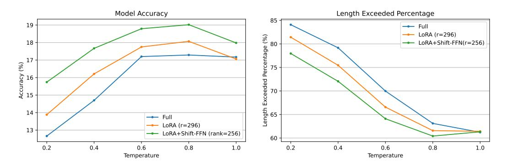

# References

- [1] Qiguang Chen, Libo Qin, Jinhao Liu, Dengyun Peng, Jiannan Guan, Peng Wang, Mengkang Hu, Yuhang Zhou, Te Gao, and Wanxiang Che. Towards Reasoning Era: A Survey of Long Chain-of-Thought for Reasoning Large Language Models, April 2025. arXiv:2503.09567 [cs].
- [2] Christopher Clark, Kenton Lee, Ming-Wei Chang, Tom Kwiatkowski, Michael Collins, and Kristina Toutanova. Boolq: Exploring the surprising difficulty of natural yes/no questions. *arXiv preprint arXiv:1905.10044*, 2019.
- [3] DeepSeek-AI, Daya Guo, Dejian Yang, Haowei Zhang, Junxiao Song, Ruoyu Zhang, Runxin Xu, Qihao Zhu, Shirong Ma, Peiyi Wang, Xiao Bi, et al. DeepSeek-R1: Incentivizing Reasoning Capability in LLMs via Reinforcement Learning, January 2025. arXiv:2501.12948 [cs].
- [4] Mor Geva, Avi Caciularu, Kevin Ro Wang, and Yoav Goldberg. Transformer feed-forward layers build predictions by promoting concepts in the vocabulary space. *arXiv preprint arXiv:2203.14680*, 2022.
- [5] Mor Geva, Roei Schuster, Jonathan Berant, and Omer Levy. Transformer Feed-Forward Layers Are Key-Value Memories. In *Proceedings of the 2021 Conference on Empirical Methods in Natural Language Processing*, pages 5484–5495, Online and Punta Cana, Dominican Republic, November 2021. Association for Computational Linguistics.
- [6] Aaron Grattafiori, Abhimanyu Dubey, Abhinav Jauhri, Abhinav Pandey, Abhishek Kadian, Ahmad Al-Dahle, Aiesha Letman, Akhil Mathur, Alan Schelten, Alex Vaughan, et al. The llama 3 herd of models. *arXiv preprint arXiv:2407.21783*, 2024.
- [7] Zeyu Han, Chao Gao, Jinyang Liu, Jeff Zhang, and Sai Qian Zhang. Parameter-Efficient Fine-Tuning for Large Models: A Comprehensive Survey, September 2024. arXiv:2403.14608 [cs].
- [8] Chaoqun He, Renjie Luo, Yuzhuo Bai, Shengding Hu, Zhen Leng Thai, Junhao Shen, Jinyi Hu, Xu Han, Yujie Huang, Yuxiang Zhang, et al. Olympiadbench: A challenging benchmark for promoting agi with olympiad-level bilingual multimodal scientific problems. *arXiv preprint arXiv:2402.14008*, 2024.
- [9] Shwai He, Liang Ding, Daize Dong, Miao Zhang, and Dacheng Tao. Sparseadapter: An easy approach for improving the parameter-efficiency of adapters. *arXiv preprint arXiv:2210.04284*, 2022.
- [10] Dan Hendrycks, Collin Burns, Saurav Kadavath, Akul Arora, Steven Basart, Eric Tang, Dawn Song, and Jacob Steinhardt. Measuring mathematical problem solving with the math dataset. *arXiv preprint arXiv:2103.03874*, 2021.
- [11] Neil Houlsby, Andrei Giurgiu, Stanislaw Jastrzebski, Bruna Morrone, Quentin De Laroussilhe, Andrea Gesmundo, Mona Attariyan, and Sylvain Gelly. Parameter-efficient transfer learning for nlp. In *International conference on machine learning*, pages 2790–2799. PMLR, 2019.
- [12] Edward J. Hu, Yelong Shen, Phillip Wallis, Zeyuan Allen-Zhu, Yuanzhi Li, Shean Wang, Lu Wang, and Weizhu Chen. LoRA: Low-Rank Adaptation of Large Language Models, October 2021. arXiv:2106.09685 [cs].
- [13] Aaron Jaech, Adam Kalai, Adam Lerer, Adam Richardson, Ahmed El-Kishky, Aiden Low, Alec Helyar, Aleksander Madry, Alex Beutel, Alex Carney, et al. Openai o1 system card. *arXiv preprint arXiv:2412.16720*, 2024.

- [14] Brian Lester, Rami Al-Rfou, and Noah Constant. The power of scale for parameter-efficient prompt tuning. *arXiv preprint arXiv:2104.08691*, 2021.
- [15] Dacheng Li, Shiyi Cao, Tyler Griggs, Shu Liu, Xiangxi Mo, Shishir G. Patil, Matei Zaharia, Joseph E. Gonzalez, and Ion Stoica. LLMs Can Easily Learn to Reason from Demonstrations Structure, not content, is what matters!, February 2025. arXiv:2502.07374 [cs].
- [16] Jia LI, Edward Beeching, Lewis Tunstall, Ben Lipkin, Roman Soletskyi, Shengyi Costa Huang, Kashif Rasul, Longhui Yu, Albert Jiang, Ziju Shen, Zihan Qin, Bin Dong, Li Zhou, Yann Fleureau, Guillaume Lample, and Stanislas Polu. Numinamath. [\[https://huggingface.co/AI-MO/NuminaMath-CoT\]\(https://github.com/]([https://huggingface.co/AI-MO/NuminaMath-CoT](https://github.com/project-numina/aimo-progress-prize/blob/main/report/numina_dataset.pdf)) [project-numina/aimo-progress-prize/blob/main/report/numina\\_dataset.pdf\)]([https://huggingface.co/AI-MO/NuminaMath-CoT](https://github.com/project-numina/aimo-progress-prize/blob/main/report/numina_dataset.pdf)), 2024.
- [17] Xiang Lisa Li and Percy Liang. Prefix-Tuning: Optimizing Continuous Prompts for Generation, January 2021. arXiv:2101.00190 [cs].
- [18] Xuechen Li, Tianyi Zhang, Yann Dubois, Rohan Taori, Ishaan Gulrajani, Carlos Guestrin, Percy Liang, and Tatsunori B Hashimoto. Alpacaeval: An automatic evaluator of instruction-following models, 2023.
- [19] Zhixuan Lin, Evgenii Nikishin, Xu Owen He, and Aaron Courville. Forgetting Transformer: Softmax Attention with a Forget Gate, March 2025. arXiv:2503.02130 [cs].
- [20] Sheng Liu, Haotian Ye, Lei Xing, and James Zou. In-context vectors: Making in context learning more effective and controllable through latent space steering. *arXiv preprint arXiv:2311.06668*, 2023.
- [21] Weiyang Liu, Zeju Qiu, Yao Feng, Yuliang Xiu, Yuxuan Xue, Longhui Yu, Haiwen Feng, Zhen Liu, Juyeon Heo, Songyou Peng, et al. Parameter-efficient orthogonal finetuning via butterfly factorization. *arXiv preprint arXiv:2311.06243*, 2023.
- [22] Wenhao Liu, Xiaohua Wang, Muling Wu, Tianlong Li, Changze Lv, Zixuan Ling, Jianhao Zhu, Cenyuan Zhang, Xiaoqing Zheng, and Xuanjing Huang. Aligning large language models with human preferences through representation engineering. *arXiv preprint arXiv:2312.15997*, 2023.
- [23] Yijia Luo, Yulin Song, Xingyao Zhang, Jiaheng Liu, Weixun Wang, GengRu Chen, Wenbo Su, and Bo Zheng. Deconstructing Long Chain-of-Thought: A Structured Reasoning Optimization Framework for Long CoT Distillation, March 2025. arXiv:2503.16385 [cs].
- [24] Bo Peng, Eric Alcaide, Quentin Anthony, Alon Albalak, Samuel Arcadinho, Stella Biderman, Huanqi Cao, Xin Cheng, Michael Chung, Matteo Grella, et al. Rwkv: Reinventing rnns for the transformer era. *arXiv preprint arXiv:2305.13048*, 2023.
- [25] Noam Shazeer. Fast transformer decoding: One write-head is all you need. *arXiv preprint arXiv:1911.02150*, 2019.
- [26] Noam Shazeer. Glu variants improve transformer. *arXiv preprint arXiv:2002.05202*, 2020.
- [27] Ying Shen and Lifu Huang. LLM Braces: Straightening Out LLM Predictions with Relevant Sub-Updates, March 2025. arXiv:2503.16334 [cs].
- [28] Nishant Subramani, Nivedita Suresh, and Matthew E Peters. Extracting latent steering vectors from pretrained language models. *arXiv preprint arXiv:2205.05124*, 2022.
- [29] Sainbayar Sukhbaatar, Edouard Grave, Guillaume Lample, Herve Jegou, and Armand Joulin. Augmenting self-attention with persistent memory. *arXiv preprint arXiv:1907.01470*, 2019.
- [30] Sainbayar Sukhbaatar, Jason Weston, Rob Fergus, et al. End-to-end memory networks. *Advances in neural information processing systems*, 28, 2015.
- [31] Xinyu Tang, Xiaolei Wang, Zhihao Lv, Yingqian Min, Wayne Xin Zhao, Binbin Hu, Ziqi Liu, and Zhiqiang Zhang. Unlocking General Long Chain-of-Thought Reasoning Capabilities of Large Language Models via Representation Engineering, March 2025. arXiv:2503.11314 [cs].

- [32] OpenThoughts Team. Open Thoughts. https://open-thoughts.ai, January 2025.
- [33] Ashish Vaswani, Noam Shazeer, Niki Parmar, Jakob Uszkoreit, Llion Jones, Aidan N. Gomez, Lukasz Kaiser, and Illia Polosukhin. Attention Is All You Need, December 2017. arXiv:1706.03762 [cs].
- [34] Yaqing Wang, Sahaj Agarwal, Subhabrata Mukherjee, Xiaodong Liu, Jing Gao, Ahmed Hassan Awadallah, and Jianfeng Gao. Adamix: Mixture-of-adaptations for parameter-efficient model tuning. *arXiv preprint arXiv:2205.12410*, 2022.
- [35] Yiming Wang, Pei Zhang, Baosong Yang, Derek F. Wong, and Rui Wang. Latent Space Chainof-Embedding Enables Output-free LLM Self-Evaluation, March 2025. arXiv:2410.13640 [cs].
- [36] Yiming Wang, Pei Zhang, Baosong Yang, Derek F. Wong, Zhuosheng Zhang, and Rui Wang. Embedding Trajectory for Out-of-Distribution Detection in Mathematical Reasoning, October 2024. arXiv:2405.14039 [cs].
- [37] Jason Wei, Xuezhi Wang, Dale Schuurmans, Maarten Bosma, Brian Ichter, Fei Xia, Ed Chi, Quoc Le, and Denny Zhou. Chain-of-Thought Prompting Elicits Reasoning in Large Language Models, January 2023. arXiv:2201.11903 [cs].
- [38] Liang Wen, Yunke Cai, Fenrui Xiao, Xin He, Qi An, Zhenyu Duan, Yimin Du, Junchen Liu, Lifu Tang, Xiaowei Lv, Haosheng Zou, Yongchao Deng, Shousheng Jia, and Xiangzheng Zhang. Light-r1: Curriculum sft, dpo and rl for long cot from scratch and beyond. *arXiv preprint arXiv:2503.10460*, 2025.
- [39] Muling Wu, Wenhao Liu, Xiaohua Wang, Tianlong Li, Changze Lv, Zixuan Ling, Jianhao Zhu, Cenyuan Zhang, Xiaoqing Zheng, and Xuanjing Huang. Advancing Parameter Efficiency in Fine-tuning via Representation Editing, June 2024. arXiv:2402.15179 [cs].
- [40] Zhengxuan Wu, Aryaman Arora, Zheng Wang, Atticus Geiger, Dan Jurafsky, Christopher D. Manning, and Christopher Potts. ReFT: Representation Finetuning for Language Models, May 2024. arXiv:2404.03592 [cs].
- [41] Mingyu Xu, Wei Cheng, Bingning Wang, and Weipeng Chen. KV Shifting Attention Enhances Language Modeling, December 2024. arXiv:2411.19574 [cs].
- [42] Xiaohan Xu, Ming Li, Chongyang Tao, Tao Shen, Reynold Cheng, Jinyang Li, Can Xu, Dacheng Tao, and Tianyi Zhou. A survey on knowledge distillation of large language models. *arXiv preprint arXiv:2402.13116*, 2024.
- [43] An Yang, Baosong Yang, Beichen Zhang, Binyuan Hui, Bo Zheng, Bowen Yu, Chengyuan Li, Dayiheng Liu, Fei Huang, Haoran Wei, Huan Lin, Jian Yang, Jianhong Tu, Jianwei Zhang, Jianxin Yang, Jiaxi Yang, Jingren Zhou, Junyang Lin, Kai Dang, Keming Lu, Keqin Bao, Kexin Yang, Le Yu, Mei Li, Mingfeng Xue, Pei Zhang, Qin Zhu, Rui Men, Runji Lin, Tianhao Li, Tingyu Xia, Xingzhang Ren, Xuancheng Ren, Yang Fan, Yang Su, Yichang Zhang, Yu Wan, Yuqiong Liu, Zeyu Cui, Zhenru Zhang, and Zihan Qiu. Qwen2.5 technical report. *arXiv preprint arXiv:2412.15115*, 2024.
- [44] Yixin Ye, Zhen Huang, Yang Xiao, Ethan Chern, Shijie Xia, and Pengfei Liu. LIMO: Less is More for Reasoning, February 2025. arXiv:2502.03387 [cs].
- [45] Biao Zhang and Rico Sennrich. Root mean square layer normalization. *Advances in Neural Information Processing Systems*, 32, 2019.
- [46] Qingru Zhang, Minshuo Chen, Alexander Bukharin, Nikos Karampatziakis, Pengcheng He, Yu Cheng, Weizhu Chen, and Tuo Zhao. AdaLoRA: Adaptive Budget Allocation for Parameter-Efficient Fine-Tuning, December 2023. arXiv:2303.10512 [cs].
- [47] Yaowei Zheng, Richong Zhang, Junhao Zhang, Yanhan Ye, Zheyan Luo, Zhangchi Feng, and Yongqiang Ma. Llamafactory: Unified efficient fine-tuning of 100+ language models. *arXiv preprint arXiv:2403.13372*, 2024.

> **[图片提取文字 (无描述)]:**
> Model Accuracy Length Exceeded Percentage 85 19 - Full % ,, 80 n LoRA (r=296) -- LoRA+Shift-FFN(r=256) 18 Length Exceeded Percentage **⊗** 17 Accuracy 12 14 - Full LoRA (r=296) 13 LoRA+Shift-FFN (rank=256) 60 0.2 0.4 0.6 0.8 1.0 0.2 0.4 0.6 0.8 1.0 Temperature Temperature

Figure 8: The *Accuracy* (left) and the *Length Exceeded Percentage* (right) of different fine-tuned models for under varying sampling temperatures on AIME24.

## **A** Limitation

Our study has two main limitations: (1) Due to resource constraints, we do not conduct experiments with larger datasets (e.g., 1M) or models (e.g., 32B), so the scalability of Shift-FFN remains an open question. (2) We only observe that the smaller the difference between adjacent tokens, the more prone the model is to cyclical reasoning. However, we do not conduct further analysis into the deeper reasons behind this phenomenon.

#### B Feedforward Network

A Transformer language model [33] consists of layers of multi-head self-attention (MHSA) and position-wise feedforward networks (FFN). Each feedforward layer operates independently on individual position vectors in the sequence. The standard FFN can be expressed as follows (bias terms are omitted):

$$FFN(\mathbf{x}_i) = W_{down}[\sigma(W_{up}\,\mathbf{x}_i)] \tag{12}$$

where  $W_{down} \in \mathbb{R}^{d_m \times d}$  and  $W_{up} \in \mathbb{R}^{d \times d_m}$  are parameter matrices,  $\boldsymbol{x}_i \in \mathbb{R}^d$  is the representation of token i after MHSA and  $\sigma$  represents a nonlinear activation function.

An alternative to the standard FFN is the Gated Linear Unit [26] variant, which has shown improved performance in some scenarios. The GLU-FFN is defined as (bias terms are omitted):

$$FFN_{GLU}(\boldsymbol{x}_i) = W_{down}(\sigma(W_{qate}\,\boldsymbol{x}_i) \odot (W_{up}\,\boldsymbol{x}_i))$$
(13)

where  $\odot$  denotes element-wise multiplication, and  $W_{gate}, W_{up} \in \mathbb{R}^{d \times d_m}, W_{down} \in \mathbb{R}^{d_m \times d}$  are parameter matrices. This gating mechanism allows for more flexible information flow and has better performance [26]. Contemporary models such as LLaMA [6] and Qwen [43] predominantly employ GLU-FFN. Our Shift-FFN can be applied to any type of FFN.

