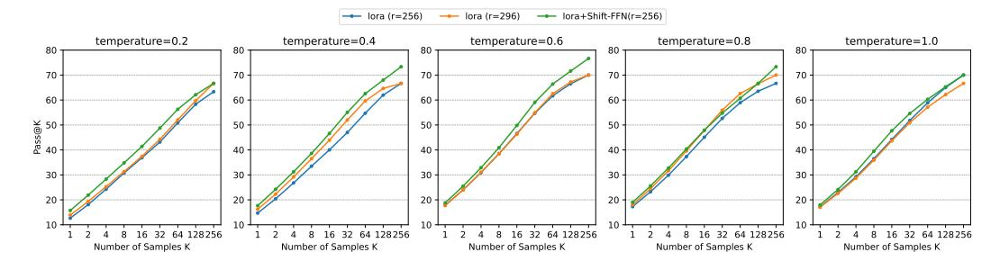

# **C** Performance under Varying Sampling Temperatures

We also further investigate the impact of sampling temperature on model performance and the rate of *Cyclical Reasoning*. Specifically, we examine the performance of Qwen2.5-7B-Instruct, fine-tuned with different strategies, at sampling temperatures of 0.2, 0.4, 0.6, 0.8, and 1.0. The maximum generation length is set to 16k for computational efficiency. The experimental results are shown in Figure 8. We observe that at lower sampling temperatures, the models exhibit not only lower accuracy but also a higher *Length Exceeded Percentage*, indicating a greater tendency for *Cyclical Reasoning*. The overall performance of the models appears optimal within the sampling temperature range of 0.6 to 0.8; further increases beyond this range tend to result in a decline in performance. Notably, LoRA+Shift-FFN (r=256) consistently achieves the highest accuracy across all tested sampling temperatures. Based on Figure 9, we also investigate the Pass@K performance of the models at different sampling temperatures. The trend in Pass@K values aligns with the average accuracy observed earlier, with peak performance generally occurring at a temperature of 0.6. In the

> **[图片提取文字 (无描述)]:**
> -- lora (r=256) lora (r=296) → lora+Shift-FFN(r=256) temperature=0.2 temperature=0.4 temperature=0.6 temperature=0.8 temperature=1.0 80 80 70 70 -60 60 60 ¥ 50 40 50 30 30 20 16 32 64 128256 32 64 128256 16 32 64 128256 32 64 128256 32 64 128256 Number of Samples K Number of Samples K Number of Samples K Number of Samples K Number of Samples K

Figure 9: The Pass@K of different fine-tuned models for under varying sampling temperatures on AIME24.

temperature range of 0.2 to 0.6, LoRA+Shift-FFN (r=256) exhibits a clear advantage in Pass@K. However, this advantage diminishes at higher sampling temperatures (0.8 and 1.0). A potential explanation for this reduction is that the difference in *Length Exceeded Percentage* between the models decreases at these higher temperatures, leading to similar exploration efficiency. Nevertheless, at the optimal sampling temperature of 0.6, LoRA+Shift-FFN (r=256) still demonstrates a significant improvement in Pass@K, validating the effectiveness of our proposed method.

## D Cyclical Reasoning Examples

Table 4 and 5 show examples of *Cyclical Reasoning* in full fine-tuned Qwen2.5-7B-Instruct on AIME24 and MATH500, alongside correct answers generated by the model with Shift-FFN. It can be found that these problems can actually be solved after generating around 10k tokens, but if the model falls into *Cyclical Reasoning*, it will keep generating tokens until it reaches the 32k length limit, which not only reduces the average accuracy but also seriously affects the reasoning efficiency.

Table 4: Generation comparison of Qwen2.5-7B-Instruct under full and LoRA fine-tuning, where the full fine-tuned model shows *Cyclical Reasoning*.

|                                 | full fine-tuned model shows Cyclical Reasoning.                                                                                                                                                                                                                                                                                                                                                                                                                                                                                                                                                             |
|---------------------------------|-------------------------------------------------------------------------------------------------------------------------------------------------------------------------------------------------------------------------------------------------------------------------------------------------------------------------------------------------------------------------------------------------------------------------------------------------------------------------------------------------------------------------------------------------------------------------------------------------------------|
| Instruction (AIME24)         | 96+144i Find the largest possible real part of (75+117i)z+ where z is a complex z number with  z  = 4.                                                                                                                                                                                                                                                                                                                                                                                                                                                                                          |
| Full                            | < begin_of_thought >\n\nOkay, so I need to find the largest possible real part of the expression \[(75+117i)z + \frac96+144iz\] where \( z \) is a complex number with \(  z  = 4 \). Hmm, let's start by understanding what the problem is asking.                                                                                                                                                                                                                                                                                                                                                   |
|                                 |  Therefore, the correct answer is 540.\n\nBut according to the Lagrange multiplier method, it's 518.4. Therefore, there's a contradiction.\n\nThis suggests that the Cauchy-Schwarz approach is incorrect.                                                                                                                                                                                                                                                                                                                                                                                      |
|                                 |  Therefore, the correct answer is 540.\n\nBut according to the Lagrange multiplier method, it's 518.4. Therefore, there's a contradiction.\n\nThis suggests that the Cauchy-Schwarz approach is incorrect.                                                                                                                                                                                                                                                                                                                                                                                      |
|                                 |  Therefore, the correct answer is 540.\n\nBut according                                                                                                                                                                                                                                                                                                                                                                                                                                                                                                                                                  |
|                                 | Generation Length: 32768 Result: Wrong (Reaching the maximum length limit)                                                                                                                                                                                                                                                                                                                                                                                                                                                                                                                               |
| LoRA+Shift FFN (rank=256) | < begin_of_thought > \n\nOkay, so I need to find the largest possible real part of the expression (75 + 117i)z + (96 + 144i)/z, where z is a complex number with  z  = 4. Hmm, let's see. First, I remember that when dealing with complex numbers,                                                                                                                                                                                                                                                                                                                                                |
|                                 |  Expanding and combining like terms, this paper finds the real part of the expres sion:\n\n\[\n324\cos\theta - 432\sin\theta\n\]\n\nThis real part can be written in the form \(C\cos(\theta + \phi)\), where \(C = \sqrt{3242 + (-432) ˆ 2} = 540\). The ˆ maximum value of this expression is therefore \(540\).\n\nTo verify, we check specific values of \(\theta\) that align the coefficients with the vector \((324, -432)\). This confirms that the maximum real part is indeed \(540\).\n\nThus, the largest possible real part is \(\boxed{540}\).\n\n< end_of_solution > |
|                                 | Generation Length: 9902 Result: Correct                                                                                                                                                                                                                                                                                                                                                                                                                                                                                                                                                                  |

Table 5: Generation comparison of Qwen2.5-7B-Instruct under full and LoRA fine-tuning, where the full fine-tuned model shows *Cyclical Reasoning*.

## Instruction (MATH500)

The expression 2 · 3 · 4 · 5 + 1 is equal to 121, since multiplication is carried out before addition. However, we can obtain values other than 121 for this expression if we are allowed to change it by inserting parentheses. For example, we can obtain 144 by writing (2 · (3 · 4)) · (5 + 1) = 144.In total, how many values can be obtained from the expression 2·3·4·5+1 by inserting parentheses? (Note that rearranging terms is not allowed, only inserting parentheses).

Full <|begin\_of\_thought|>\n\nOkay, so I need to figure out how many different values can be obtained from the expression 2·3·4·5 + 1 by inserting parentheses. The key here is that changing the grouping with parentheses can alter the order of operations, which might lead to different results. Let me start by recalling the original expression and how parentheses can affect the calculation.

...

Wait, no, they are the same. Wait, 2·(3·4·5) = 2·60 = 120, same as (2·3)·4·5 = 6·20 = 120. So different groupings can lead to the same product.\n\nBut inserting parentheses around different parts can lead to different products. For example, 2·(3·4·5) = 120, but (2·3)·(4·5) = 120, but 2·(3·4·5) is different. Wait, no, they are the same. Wait, 2·(3·4·5) = 2·60 = 120, same as (2·3)·4·5 = 6·20 = 120. So different groupings can lead to the same product.\n\nBut inserting parentheses around different parts can lead to different products. For example, 2·(3·4·5) = 120, but (2·3)·(4·5) = 120, but 2·(3·4·5) is different. Wait, no, they are the same. Wait, 2

Generation Length: 32768

Result: Wrong (Reaching the maximum length limit)

## LoRA+Shift-FFN (rank=256)

<|begin\_of\_thought|>|\n\nOkay, so I need to figure out how many different values can be obtained from the expression 2×3×4×5 +1 by inserting parentheses. The problem says that rearranging terms isn't allowed, so we have to keep the original order but group the operations differently with parentheses.

... \*7. (2·3·4·5) +1\*\*: \n \[\n 120 + 1 = 121.\n \]\n\n - \*\*8. (2·(3·(4·5))) +1\*\*: \n \[\n 2 \cdot (120) + 1 = 241.\n \]\n\n - \*\*9. (2·3·4) + (5·1)\*\*: \n \[\n 24 + 5 = 29.\n \]\n\n - \*\*10. (2·3)·(4·(5+1))\*\*: \n \[\n 6 \cdot (4 \cdot 6) = 6 \cdot 24 = 144.\n \]\n\n - \*\*11. (2·(3·4))·(5+1)\*\*: \n \[\n 24 \cdot 6 = 144.\n \]\n\n - \*\*12. 2·((3·4)·(5+1))\*\*: \n \[\n 2 \cdot (12 \cdot 6) = 2 \cdot 72 = 144.\n \]\n\n3. \*\*Distinct Values\*\*: \n The distinct results from the valid parenthesizations are: \n - \(121\), \n - \(241\), \n - \(29\), \n - \(144\). \n\nThus, the total number of distinct values obtainable is \(\boxed{4}\).\n\n<|end\_of\_solution|>

Generation Length: 11053

Result: Correct