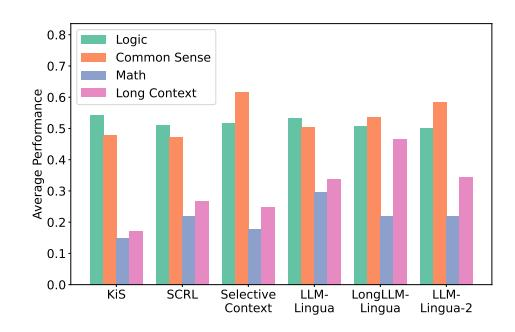
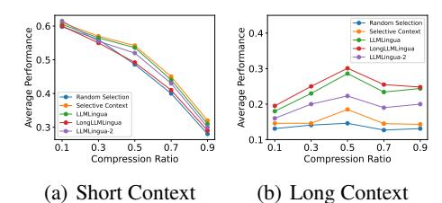
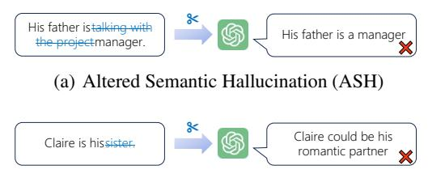
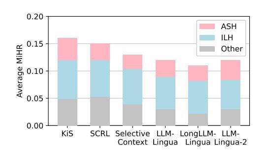
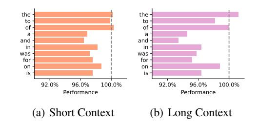

# **Question 2:** How does compression ratio affect the performance of different methods?

Figure 3 illustrates the performance of various prompt compression methods across different compression ratios. Similarly, Figure 5 shows the impact of compression ratio on QA tasks. For shorter contexts, the performance of all methods uniformly declines as the compression ratio increases. However, for longer contexts, a different trend emerges: performance initially improves with increasing compression ratio up to a point, after which it begins to deteriorate. From these observations, we draw the following conclusions:

- (Long)LLMLingua and LLMLingua-2 show an advantage at higher compression ratios, as evidenced in Figure 3 and 5.
- For longer contexts, a moderate amount of compression may help in abstracting and retaining the critical information better, thereby improving performance.

> **[图片提取文字 (无描述)]:**
> 0.8 Logic Common Sense 0.7 Math Average Performance Long Context 0.1 0.0 KiS SCRL Selective LLM-LongLLM-LLM-Context Lingua Lingua Lingua-2

Figure 4: **Performance on different QA categories.** We categorized the QA tasks into four categories: logic (Boolean Expression, Web of Lies), common sense (Causal Judgement), math (GSM8K), and long context (LongBench), and calculated the average performance of six prompt compression methods on these four categories. Considering the different metrics, we scaled the results based on the mean performance for each task.

> **[图片提取文字 (无描述)]:**
> Random Selection Average Performance Average Performance Selective Context LLMLIngua LongLLMLingua - LLMLingua-2 Random Selection Selective Context LLMLingua LongLLMLingua LLMLingua-2 0.1 0.3 0.5 0.7 0.9 0.1 0.3 0.5 0.7 0.9 Compression Ratio Compression Ratio (a) Short Context (b) Long Context

Figure 5: **Performance on QA tasks under different compression ratios.** The tasks are categorized into short context and long context. Considering the different metrics, we scaled the results based on the mean performance for each task before averaging.

Table 4: LLM response length for different prompt compression methods. We recorded the number of words in the responses of three LLMs on 1000 QA tasks using different prompt compression methods. "Average" indicates the average response length for all prompt compression methods. Numbers in parentheses show the difference compared to the original prompt.

| Method            | GPT-3.5- turbo          | GPT-40- mini | Claude-3- Haiku                 |
|-------------------|----------------------------|-----------------|------------------------------------|
| Original Prompt   | 56.8                       | 74.9            | 124.6                              |
| Random Selection  | $\overline{60.1}_{(+3.3)}$ | $78.0_{(+3.1)}$ | $12\overline{1.6}_{(-3.0)}$        |
| KiS               | $58.4_{(+1.6)}$            | $76.4_{(+1.4)}$ | $122.1_{(-2.5)}$                   |
| SCRL              | $57.4_{(+0.6)}$            | $75.6_{(+0.6)}$ | $121.0_{(-3.7)}$                   |
| Selective Context | 58.1(+1.3)                 | $76.0_{(+1.1)}$ | $122.4_{(-2.2)}$                   |
| LLMLingua         | $57.1_{(+0.3)}$            | $75.2_{(+0.3)}$ | $121.8_{(-2.8)}$                   |
| LongLLMLingua     | 57.7(+0.9)                 | $75.8_{(+0.9)}$ | $122.2_{(-2.4)}$                   |
| LLMLingua-2       | 57.2(+0.4)                 | $75.4_{(+0.5)}$ | $121.5_{(-3.1)}$                   |
| Average           | -58.0 (+1.2)    | $76.0_{(+1.1)}$ | $\bar{1}2\bar{1}.\bar{8}_{(-2.8)}$ |

#### 5.2 EFFECTS ON LLM RESPONSE

**Question 3:** Will prompt compression affect the length of the model's response?

Some works (Zheng et al., 2023; Singhal et al., 2024) leverage LLMs' perception of response length to optimize inference processes, which underscores the importance of understanding how factors like prompt compression can influence the output length. Notably, as shown in Table 4, the effect of different prompt compression methods on the response length of the same LLM demonstrates a uniform trend. For GPT-3.5-turbo and GPT-40-mini, all prompt compression methods (even random selection) lead to an increase in response length. Conversely, for Claude-3-Haiku, all methods result in a decrease in response length. One possible interpretation is:

- GPT-3.5-turbo and GPT-4o-mini generally produce shorter responses, and the increase in length might be an attempt by these models to mitigate the loss of information due to prompt compression.
- For Claude-3-Haiku, which typically generates longer responses, the reduced response length could imply that compression helps to streamline the output, resulting in more concise answers.

Additional details are provided in Appendix B.

**Question 4:** Will prompt compression enhance the hallucination?

The hallucination problem in LLMs has been widely acknowledged (Ji et al., 2023; Gudibande et al., 2024). Due to the fact that prompt compression can lead to some grammatically incorrect or overly succinct expressions, we posited that it might cause hallucinations in LLMs. Following the methodology of Li et al. (2024), we investigated the hallucination induced by prompt compression across different tasks, as detailed in Table 5.

In Figure 6, we divided the hallucinations induced by prompt compression into two categories: Altered Semantic Hallucination (ASH) and Information Loss Hallucination (ILH). Figure 7 depicts the proportions of each type of hallucination across different prompt compression methods. Our findings are as follows:

- All compression methods result in some degree of enhanced hallucination. As shown in Table 5, LLMLingua-2 exhibited the least amount of hallucination in reconstruction and summarization, while LongLLMLingua showed the lowest hallucination rate in long-context QA.
- Information loss is a primary trigger for hallucinations in prompt compression. The generation of incomplete sentences often prompts LLMs to fill in gaps with their own generated content, leading to hallucinations.

Table 5: **The impact of prompt compression on LLM hallucination.** We randomly sampled 120 instances from each task category (40 samples each from GPT-3.5-turbo, GPT-40-mini, and Claude-3-Haiku), manually annotated hallucinations, and computed their MaHR and MiHR according to the definitions described by Li et al. (2024).

| Method            | Reconstruction |          | Summarization |                    | QA (Short) |          | QA (Long) |          | Average  |          |
|-------------------|----------------|----------|---------------|--------------------|------------|----------|-----------|----------|----------|----------|
|                   | MaHR (↓)       | MiHR (↓) | MaHR (↓)      | MiHR (↓)           | MaHR (↓)   | MiHR (↓) | MaHR (↓)  | MiHR (↓) | MaHR (↓) | MiHR (↓) |
| Original Prompt   | _              | _        | 0.10          | 0.03               | 0.18       | 0.04     | 0.33      | 0.08     | _        | =        |
| Random Selection  | 0.83           | 0.54     | 0.77 _        | $-0.4\overline{2}$ | - 0.53     | 0.31     | 0.65      | 0.48     | 0.70     | 0.44     |
| KiS               | 0.36           | 0.17     | 0.23          | 0.12               | 0.28       | 0.15     | 0.41      | 0.21     | 0.32     | 0.16     |
| SCRL              | 0.31           | 0.16     | 0.21          | 0.11               | 0.24       | 0.13     | 0.39      | 0.18     | 0.29     | 0.15     |
| Selective Context | 0.24           | 0.14     | 0.19          | 0.08               | 0.22       | 0.12     | 0.34      | 0.17     | 0.25     | 0.13     |
| LLMLingua         | 0.23           | 0.11     | 0.16          | 0.09               | 0.20       | 0.13     | 0.31      | 0.15     | 0.23     | 0.12     |
| LongLLMLingua     | 0.21           | 0.11     | 0.13          | 0.09               | 0.23       | 0.13     | 0.24      | 0.12     | 0.20     | 0.11     |
| LLMLingua-2       | 0.19           | 0.10     | 0.13          | 0.08               | 0.24       | 0.14     | 0.27      | 0.14     | 0.21     | 0.12     |

> **[图片提取文字 (无描述)]:**
> His father istalking with His father is a manager the project manager. (a) Altered Semantic Hallucination (ASH) Claire could be his Claire is hissister romantic partner

(b) Information Loss Hallucination (ILH)

Figure 6: The types of hallucinations caused by prompt compression. We categorized the hallucinations induced by prompt compression into two types: (a) Altered Semantic Hallucination (ASH), which arises from incorrect compression that alters the original text's meaning, and (b) Information Loss Hallucination (ILH), which stems from the loss of information and incomplete sentence structures.

> **[图片提取文字 (无描述)]:**
> 0.20 ASH Average MiHR ...0 ILH Other 0.05 0.00 KiS SCRL Selective LLM- LongLLM- LLM-Context Lingua Lingua-1

Figure 7: **Proportion of each type of hal- lucination caused by prompt compression.**We calculated the proportion of different types of hallucinations in the average MiHR for six prompt compression methods. Hallucinations that could not be easily attributed to ASH or ILH were classified as "Other".

### 5.3 EFFECTIVENESS ON MULTIMODAL TASKS

**Question 5:** Are current prompt compression approaches generally effective when applied to MLLMs for multimodal tasks?

Since all prompt compression methods are designed and trained based on text-only tasks, their applicability to multimodal tasks remains to be explored. Table 6 provides an extensive evaluation of different prompt compression methods when applied to VQA tasks. We observe the following:

- SCRL, Selective Context, and LLMLingua-2 exhibit varied performance across different datasets. This inconsistency is likely due to differences in question complexity and required reasoning capabilities inherent to the datasets.
- LLMLingua and LongLLMLingua maintain stable but suboptimal per-

Table 6: **Performance of prompt compression methods on VQA tasks.** We selected 500 samples each from IconQA-txt, IconQA-blank, and OK-VQA for evaluation. For each setting, we averaged the scores between GPT-40-mini and Claude-3-Haiku.

| Method            | IconQA- txt | IconQA- blank | OK-VQA |  |
|-------------------|----------------|------------------|--------|--|
| Original Prompt   | 0.705          | 0.232            | 0.758  |  |
| Random Selection  | 0.668          | 0.161            | 0.498  |  |
| KiS               | 0.660          | 0.226            | 0.696  |  |
| SCRL              | 0.699          | 0.200            | 0.726  |  |
| Selective Context | 0.662          | 0.230            | 0.686  |  |
| LLMLingua         | 0.681          | 0.225            | 0.752  |  |
| LongLLMLingua     | 0.684          | 0.228            | 0.754  |  |
| LLMLingua-2       | 0.683          | 0.229            | 0.620  |  |

formance across datasets. Their generalized design may lack the necessary adaptations for excelling in multimodal tasks, suggesting a need for further optimization.

> **[图片提取文字 (无描述)]:**
> 300k 1 20.5% 200k -100k -Top 10 Omitted Words the to of a and in was for on is Other Words (a)

Figure 8: Word omitted across prompt compression methods. (a) Frequency of the top 10 omitted words across all prompt compression methods. (b) Proportion of these words in the original text, regardless of whether they were omitted.

> **[图片提取文字 (无描述)]:**
> the the . to to of of a a and and in in was was for for on on is is 92.0% 96.0% 100.0% 92.0% 96.0% 100.0% Performance Performance (a) Short Context (b) Long Context

Figure 9: Impact of word removal on performance. We randomly sampled 500 instances each from short context QA and long context QA to evaluate the impact of removing individual words. Each result is normalized by dividing by the score of the original prompt to obtain percentages.

### 5.4 ANALYSIS ON WORD OMISSION

Question 6: *What kind of words can be omitted when prompting?*

Figure [8](#page-8-0) shows the most frequently omitted words across various prompt compression methods, while Figure [9](#page-8-0) depicts the performance impact of removing these words on QA tasks. Although the thorough removal of words like "the" has almost no impact, we have observed some noteworthy phenomena:

- *Removing the same word has a larger impact on performance in long-context tasks.* This can be attributed to the need for clarity and coherence when dealing with larger amounts of information. In longer contexts, these words may help maintain structure and meaning, preventing confusion and loss of detail.
- *Even words that seem less informative can play notable roles in maintaining the effectiveness of prompts.* For instance, in English, the plurality of nouns can be indicated directly on the nouns themselves, and the word "a" seems to convey limited information. However, its removal has an adverse effect on performance. This phenomenon might be analogous to observations in vision transformers (ViTs) [\(Darcet et al., 2024\)](#page-9-7): ViTs produce high-norm tokens in low-informative areas (such as background regions) during inference. These tokens are used to store and manage intermediate data in computational processes. We speculate that a similar mechanism may exist in LLMs, where tokens for less informative words could serve as registers that facilitate intermediate computations.

