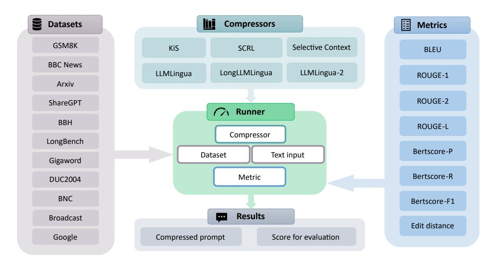

# A.2 METRICS

In this section, we outline the evaluation metrics used in our study.

BLEU. Proposed by [Papineni et al.](#page-12-9) [\(2002a\)](#page-12-9), Bilingual Evaluation Understudy (BLEU) is a metric used to evaluate machine-translated text by comparing it to reference translations. The BLEU score is computed as follows:

BLEU = 
$$\exp\left(\min\left(1 - \frac{r}{c}, 0\right)\right) \cdot \prod_{n=1}^{N} p_n^{w_n}.$$
 (2)

Here c is the length of the candidate translation, r is the length of the reference translation, pn is the precision of n-grams, and wn are weights assigned to each pn.

ROUGE. Proposed by [Lin](#page-11-11) [\(2004a\)](#page-11-11), Recall-Oriented Understudy for Gisting Evaluation (ROUGE) encompasses several variants including ROUGE-N, ROUGE-L, ROUGE-W and ROUGE-S. These metrics are used for evaluating the quality of summaries produced by automatic summarization systems. In our experiments, we specifically use ROUGE-L, which measures the longest common subsequence (LCS) between the reference and candidate summaries. The formula for ROUGE-L is defined as:

$$Precision = \frac{LCS(r,c)}{|c|},$$
(3)

$$Recall = \frac{LCS(r,c)}{|r|},\tag{4}$$

$$F1 = \frac{2 \cdot Precision \cdot Recall}{Precision + Recall}.$$
 (5)

Here LCS(r, c) is the length of LCS between the reference r and candidate c, and |r| and |c| denotes the length of r and c, respectively. In our experiments, we use the F1 score as the ROUGE-L value.

BERTScore. Proposed by [Zhang\\* et al.](#page-13-7) [\(2020\)](#page-13-7), BERTScore evaluates text similarity using contextual embeddings from BERT [\(Devlin et al., 2019\)](#page-9-0). The formula for BERTScore can be defined as follows:

$$Precision(r,c) = \frac{1}{|c|} \sum_{c_i \in c} \max_{r_j \in r} sim(c_i, r_j),$$
(6)

$$\operatorname{Recall}(r,c) = \frac{1}{|r|} \sum_{r_j \in r} \max_{c_i \in c} \operatorname{sim}(c_i, r_j), \tag{7}$$

$$F1(r,c) = \frac{2 \times \operatorname{Precision}(r,c) \times \operatorname{Recall}(r,c)}{\operatorname{Precision}(r,c) + \operatorname{Recall}(r,c)}.$$
 (8)

Here ci and rj are the i-th tokens of c and r, and sim denotes cosine similarity between embeddings of ci and rj . In our experiments, we use the F1 score as the BERTScore value.

F1. Following [Bai et al.](#page-9-6) [\(2024\)](#page-9-6), we utilize the F1 score to measure the similarity between the predicted output and the ground truth by considering common elements between the two. Specifically, this F1 score calculation accounts for the overlap at the character or token level between the predicted and reference texts, which is different from the F1 scores used in other metrics like ROUGE-L or BERTScore. The formula adapted for F1 score is:

$$Precision = \frac{|common\ tokens|}{|predicted\ tokens|},$$
(9)

$$Recall = \frac{|common\ tokens|}{|ground\ truth\ tokens|},$$
(10)

$$F1 = \frac{2 \cdot \text{Precision} \cdot \text{Recall}}{\text{Precision} + \text{Recall}}.$$
 (11)

Here common tokens denotes the set of tokens that appear in both the predicted text and the reference text.

Micro Hallucination Rate (MiHR). Following [Li et al.](#page-11-10) [\(2024\)](#page-11-10), MiHR measures the proportion of hallucinatory statements within each response. It is calculated as:

$$MiHR = \frac{1}{n} \sum_{i=1}^{n} \frac{Count(hallucinatory facts)}{Count(all facts in r_i)}.$$
 (12)

Here n is the total number of samples in every domain and ri is the i-th response.

Macro Hallucination Rate (MaHR). Also following [Li et al.](#page-11-10) [\(2024\)](#page-11-10), MaHR calculates the proportion of responses containing hallucinatory statements. It is computed as:

$$MaHR = \frac{Count(hallucinatory responses)}{n}.$$
 (13)

Here n represents the total number of samples.

> **[图片提取文字 (无描述)]:**
> Compressors **Datasets** Metrics GSM8K Selective Context SCRL KiS BLEU **BBC News** LLMLingua LongLLMLingua LLMLingua-2 **ROUGE-1** Arxiv ROUGE-2 ShareGPT Runner BBH ROUGE-L Compressor LongBench Bertscore-P Dataset Text input Gigaword Bertscore-R Metric DUC2004 BNC Bertscore-F1 Results Broadcast Edit distance Google Compressed prompt Score for evaluation

Figure 10: Architecture of PCToolkit. The *compressors* module encompasses prompt compression methods that can be accessed through a unified interface with customizable parameters. The *datasets* module includes diverse datasets. The *metrics* module comprises primary metrics utilized for evaluating the performance of compressors. The *runner* module offers a generalized interface for executing evaluations or simply retrieving the compressed prompt generated by the compressors.

