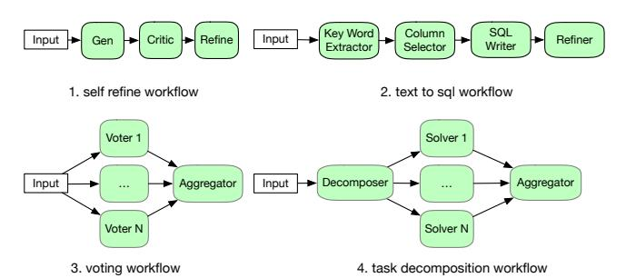
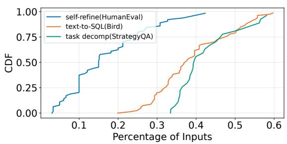
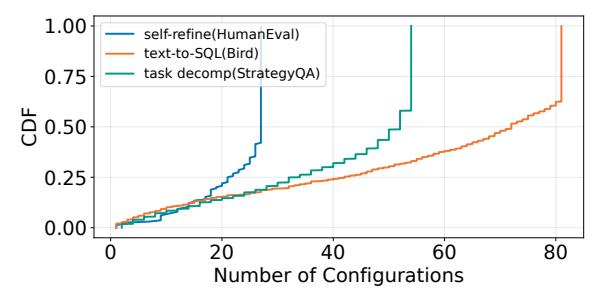
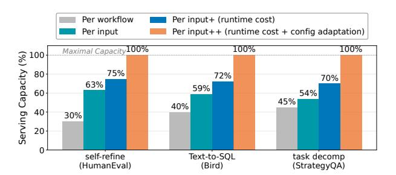
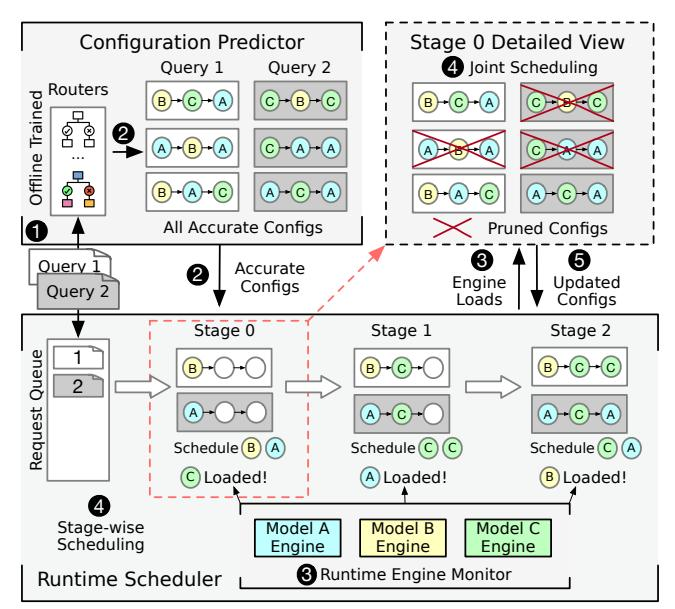

# 1 Introduction

Autonomous agents, or Large Language Models (LLMs) augmented with tools, memory, and planning, have shown impressive ability to tackle complex tasks autonomously [\[39,](#page-13-0) [52\]](#page-14-0). However, fully autonomous agentic systems often lack the structure and reliability needed in production [\[5\]](#page-12-0). This has led to the rise of agentic workflows: directed acyclic graphs with fixed structures that orchestrate multiple agents [\[18,](#page-12-1) [20,](#page-12-2) [22,](#page-12-3) [50\]](#page-14-1), each responsible for a welldefined subtask and passing outputs downstream (Figure [1\)](#page-1-0). These workflows preserve the generative strengths of agents while offering the observability and debuggability of traditional software. Yet serving them at scale remains expensive, largely due to the inflated number of LLM invocations per request. Indeed, a single workflow execution typically triggers several agent invocations, each making multiple LLM calls; the net effect is that LLM inference can account for nearly 80% of end-to-end request time in workflows ([§2.1\)](#page-1-1).

The predominant strategy for reducing these inference costs focuses on intelligently selecting *workflow configurations* – i.e., assignments of specific LLMs to each agent in the workflow – that minimize cost while preserving accuracy. Existing systems make configuration decisions either periodically offline [\[6,](#page-12-4) [9,](#page-12-5) [17\]](#page-12-6) or once per input at request arrival time [\[35,](#page-13-1)[41,](#page-13-2)[57\]](#page-14-2). Regardless, they all commit to configurations before executing a request, focusing on optimizing fixed cost metrics such as API dollars or FLOPs. Unfortunately, such a priori decision making is fundamentally misaligned with the heterogeneous and lengthy nature of workflows: as a request slowly moves through a multi-stage graph, the overall system load it encounters can rapidly fluctuate due to the diverse overheads each agent imposes, and the arrival/departure of other requests. Consequently, a configuration selected at the start may quickly become suboptimal during a request's lifecycle, e.g., an agent assigned a small model to save FLOPs may perform worse than necessary (latency- and throughput-wise) if that model is overloaded and a larger model is idle when the request reaches the agent.

To make matters worse, this early-binding behavior fails to fully exploit the *enhanced configuration flexibility* that workflows naturally afford through multi-stage processing. Specifically, we observe that workflows exhibit substantial fault tolerance – errors introduced at intermediate stages can often be corrected downstream, e.g., via refinement agents. This, in turn, dramatically expands the set of configurations that preserve end-to-end accuracy, providing a means to cope with (and support) the diverse runtime scenarios that could be encountered during serving. Yet, by binding configurations early, existing approaches forego such opportunities, leaving 25-70% of the potential gains from configuration adaptation on the table for diverse agentic workloads ([§2.2\)](#page-1-2).

We present Aragog, an agentic workflow serving system that capitalizes on the aforementioned flexibility by performing stage-wise configuration adaptation.[1](#page-0-0) The primary challenge is one of runtime overheads: per-stage adaptation is prohibitively expensive because it requires frequently exploring an exponentially large configuration space that scales with workflow size and model options. To handle this, our key insight is that, for a given input, the accuracy of a configuration is fixed, whereas its runtime performance can change dramatically as system load fluctuates. Aragog leverages this asymmetry by decomposing configuration selection into two complementary steps. It first performs the expensive, accuracy-related analysis once per request (i.e., when it arrives) to identify all configurations that preserve accuracy. Then, as the request moves through the workflow, Aragog rapidly selects among only the pre-validated configurations for each upcoming stage, using current runtime signals to stay aligned with system conditions.

To realize this decoupling approach while maximizing

1 In this paper, we use the terms stage and agent interchangeably to refer to individual execution steps in an agentic workflow.

serving throughput and avoiding any added latency from configuration adaptation, Aragog embeds two optimized components. First, to identify the set of accuracy-preserving configurations, Aragog decomposes the routing problem into many simple binary classification problems and exploits the near-monotonic relationship between configuration FLOPs and accuracy to prune configuration space quickly; this keeps routing both accurate and lightweight enough to overlap with request queuing delays. Second, Aragog's (stage-wise) runtime scheduler leverages how FIFO priorities and pruned configuration sets naturally structure the assignment space: earlier requests in the queue have only a few viable configurations – since each choice at an earlier stage can invalidate options that use a different model for that stage - and once chosen, they constrain later requests rather than letting the space fan out. This, in turn, creates a compact search space that beam search can traverse efficiently, avoiding both exhaustive exploration and greedy myopia.

We evaluate Aragog by comparing with existing configuration optimizers - both per-workflow [6, 9, 17] and perinput [35, 41, 57] - augmented with oracle accuracy information about configurations, i.e., representing their best possible performance. Across four popular agentic workflows and diverse model families (Qwen 2.5 [37], Llama 3 [1], and Phi 4 [2]), we find that Aragog improves maximum serving throughput by 42.8-76.3% over per-input optimizations and 78.1–217.0% over per-workflow optimizations. Further, Aragog consistently reduces latency across varying request rates. For instance, at peak load, median and P95 reductions were 32.5-71.1% and 46.2-76.2% over per-input optimizations, and 60.0-86.1% and 63.2-89.0% over per-workflow optimizations. Crucially, Aragog achieves these performance wins while maintaining accuracy within 2% of that when always using the most expensive configuration. We will open source Aragog post publication.

#### 2 Background and Motivation

We begin by providing an overview of agentic workflows (§2.1), highlighting the limitations of current optimization approaches and opportunities they overlook (§2.2). We then discuss the practical challenges in realizing them (§2.3).

#### 2.1 Agentic Workflows

Agentic workflows are directed graphs of agent invocations, where each agent—a prompted LLM augmented with tools, memory, and planning capabilities—executes a well-scoped sub-task and passes its output to downstream agents. As shown in Figure 1, example patterns and application domains include: (1) self-refine workflows [9, 32] that iteratively improve outputs through generation, critique, and refinement agents; (2) natural language to SQL systems [36, 43] that decompose query construction into keyword extraction, column selection, SQL generation, and refinement; (3) task decomposition workflows [50, 51] that split complex prob-

> **[图片提取文字 (无描述)]:**
> Key Word Column SQL Critic Input Refine Refiner Input + Gen Selector Writer Extractor self refine workflow 2. text to sal workflow Voter 1 Solver 1 Aggregator Input Decomposer Aggregator Input ... ... Voter N Solver N voting workflow 4. task decomposition workflow

Figure 1: Examples of common agentic workflows that vary in terms of both structure and application domains.

lems into parallel sub-tasks handled by different agents before aggregating their results; and (4) multi-agent voting systems [8, 47] that ensemble multiple agents for robust decision-making. In practice, these workflows are explicitly encoded using frameworks like LangChain [22] and DSPy [20]. Once a workflow graph is defined, developers can specify a *configuration* that assigns each agent to a chosen LLM, enabling accuracy-cost tradeoffs without modifying workflow logic. These configurations often utilize heterogeneous models – i.e., smaller models for easier agent tasks, specialized models for domain-specific tasks – that are each hosted on different serving engines and GPUs [9].

Yet despite these intuitive benefits, agentic workflows face significant practical challenges, largely centered around the high costs they bring. Indeed, each agent invocation incurs the inference cost of powerful yet resource-intensive LLM calls. These expenses scale quickly since workflows generally involve multiple sequential or parallel agent calls. For instance, coding workflows require 3–5 agent calls per query to plan, generate, test, and verify solutions [52,60], while even simple workflows such as multi-hop question answering for legal or scientific search can involve 4+ agent calls [4,24,54]. Across our workloads, a request invokes 5.2 LLM calls on average. These LLM calls account for 79.4% of end-toend latency on average, with tool calls and framework (e.g., DSPy) overhead accounting for the remaining 20.6%.

#### 2.2 Limitations of Existing Optimizations

Existing systems primarily focus on configuration selection to reduce these LLM inference costs while preserving workflow accuracy. We categorize and discuss these techniques below, highlighting their limitations; complementary optimizations are covered in §6.

**Per-workflow optimization.** Systems like Cognify [17], LLMSelector [9], and Murakkab [6] perform one-time or periodic configuration selection based on sample data, minimizing costs (e.g., FLOPs, API costs) while preserving accuracy relative to the most expensive configuration. Once selected, a configuration is fixed for all requests, eliminating runtime overhead but sacrificing per-input adaptability.

**Per-input optimization.** In single-LLM serving, existing LLM *routing* approaches [35,46] leverage input heterogene-

> **[图片提取文字 (无描述)]:**
> 1.00 self-refine(HumanEval) text-to-SQL(Bird) 0.75 task decomp(StrategyQA) 0.50 0.25 0.00 0.5 Percentage of Inputs

Figure 2: Agentic workflows exhibit robustness by recovering from intermediate errors. For each configuration, we track the inputs with intermediate errors, and record the fraction subsequently corrected by the remained workflow. The plot shows the CDF of correction percentages across all configurations.

ity by training routers to forward each input to the most cost-efficient model that can accurately respond to that input. Recent works extend this routing paradigm to agentic workflows [41,57] by selecting not just singular models, but a workflow configuration for each input. Routers are often transformer-based and are trained using accuracy labels relative to the most expensive configuration, enabling cost reduction while preserving accuracy.

**The problem.** Though effective, existing optimizations fail to adapt to the intrinsic runtime dynamics of workflows, falling short in two key ways. First, they bind configurations before workflow execution, i.e., either once before all inputs, or at the start of each input. The core issue is that as a request is executing, system states can change rapidly, rendering these a priori selections suboptimal by execution time. Natural LLM dynamics already introduce significant variance: output lengths vary unpredictably, queue depths fluctuate continuously, and dynamic batching reshapes execution efficiency moment by moment [54]. The lengthy, multistage nature of agentic workflows only exacerbates this; the load for each concurrent request can change dramatically as it shifts between workflow agents with different overheads (and potentially different models), and the set of concurrent requests can fluctuate many times as a request slowly passes through the entire workflow graph. Consequently, upfront configuration selections can increasingly become suboptimal as requests progress through multi-stage execution.

Second, these same dynamics make the approach of *optimizing for static cost metrics* problematic. Indeed, current systems all minimize predetermined costs like FLOPs or API call prices, but these commonly fail to translate to actual runtime costs (and thus, performance goals), i.e., for metrics such as throughput, resource utilization, and latency. Instead, what truly governs these aspects is how configurations fit into the current system states and utilize the currently available resources. For instance, a "more expensive" 70B-parameter model on an idle GPU can return results faster than a "cheaper" 14B model with a saturated request queue.

These drawbacks are even more problematic when contextualized relative to the unique opportunities that workflows

> **[图片提取文字 (无描述)]:**
> 1.00 self-refine(HumanEval) text-to-SQL(Bird) task decomp(StrategyQA) 0.75 0.50 0.25 0.00 Number of Configurations

Figure 3: Numerous workflow configurations can match the accuracy of the most expensive configuration at for each input.

> **[图片提取文字 (无描述)]:**
> Per workflow Per input+ (runtime cost) Per input Per input++ (runtime cost + config adaptation) Maximal Capacity 100% 100% 100% Serving Capacity (%) 00 00 00 00 00 00 00 00 00 00 00 00 00 75% 72% 70% 63% 59% 60 54% 45% 40% 40 30% 20 self-refine Text-to-SQL task decomp (HumanEval) (Bird) (StrategyQA)

Figure 4: Static approaches (per-workflow, per-input) achieve suboptimal serving capacity. Incorporating runtime cost metrics and runtime configuration adaptation incrementally improves serving capacity. Results are evaluated on HumanEval [10], Bird [25], and StrategyQA [15].

bring. Most notably, despite the increased LLM inference overheads, the multi-stage execution of workflows provides remarkable configuration flexibility that exceeds what is typically possible with single-model pipelines, e.g., with classic model routing. Concretely, given multiple model options per stage, agentic workflows elicit an exponentially large configuration space that presents remarkable error tolerance when upstream agents produce suboptimal outputs, downstream agents can often recover from those intermediate errors (Figure 2). This self-correcting behavior dramatically expands the viable configuration space (Figure 3), highlighting an untapped potential: the enhanced configuration flexibility provides support for frequently adapting to dynamic runtime scenarios via stage-wise configuration adaptation using the many options. By making static configuration decisions prior to workflow execution, all existing approaches fail to fully take advantage of this enhanced flexibility.

To quantify this potential (and the drawbacks of existing approaches), we follow the setup from §5.1 and evaluate three representative workflows—self refine, text-to-sql, and task decomposition—with their corresponding datasets (HumanEval [10], Bird [25], StrategyQA [15]) and Qwen {7,14,32}B as model options. We compare the serving capacity (max achieved throughput, normalized to the best approach) of Per-workflow and Per-input configuration strategies (as described above), as well as two more schemes:

• Per-input+, which improves upon Per-input by factoring in runtime observations (in particular, the predicted la-

tency based on current load for each model and serving engine) rather than solely FLOPs when selecting a configuration prior to each request, and

• Per-input++, which improves Per-input+ by continuously re-evaluating and updating configuration selections at each workflow stage (rather than solely before each request) to adapt to changing system dynamics.

To isolate impact of selection strategy, all approaches are given perfect knowledge of accuracy per configuration.

As shown in Figure [4,](#page-2-2) despite the benefits that Per-input strategies bring via input-level configuration adaptation (i.e., 9–33% improvement in serving capacity over Per-workflow schemes), their early binding and static cost metrics leave substantial performance gains on the table. In particular, our results highlight that incorporating dynamic cost metrics (Per-input+) and stage-wise configuration adaptation (Perinput++) can further improve serving capacity by 12–16% and 25–30% when they are incrementally incorporated – a 37–46% increase in maximum achieved throughput over even the best possible version of existing Per-input schemes.

#### 2.3 Challenges

Despite the benefits, realizing stage-wise configuration adaptation requires solving fundamental systems challenges in managing runtime overheads, given the large configuration space to explore and the need for frequent reconfiguration.

C1: Prohibitive and frequent routing overheads. Agentic workflows create configuration spaces that grow exponentially with workflow complexity: *MN* configurations for *N* agents and *M* models. Routing must evaluate this massive space to select configurations for each input. Yet, routing overhead scales poorly with the configuration space: stateof-the-art routers already build on large transformers for accurate single-LLM selection [\[35,](#page-13-1) [46\]](#page-13-8), and workflow routing demands substantially more complexity to evaluate exponentially more candidates. Moreover, adapting to rapid system dynamics requires frequent rerouting for every input. The untenable and frequent routing cost for every input can offset the benefit of flexible configuration adaptation.

C2: Joint runtime reconfiguration under concurrency. Beyond per-input routing overheads, runtime reconfiguration amplifies the coordination that serving platforms must consider when managing concurrent requests. Specifically, capitalizing on each request's configuration flexibility can constrain other requests. For instance, consider two requests where R1 can achieve target accuracy with either 7B or 14B models, while R2 needs either 7B or 32B models. If the serving engine for the 7B model can only house one more request in its batch before resorting to queuing, independent scheduling might grant R1 use of the 7B model first (its cheapest option), forcing R2 to use the expensive 32B model. In contrast, joint scheduling would recognize that R1 can make a slight performance sacrifice by using 14B, allowing R2 to

> **[图片提取文字 (无描述)]:**
> Configuration Predictor Stage 0 Detailed View 4 Joint Scheduling Query 1 Query 2 Routers Offline Trained C)-(B)+(C) All Accurate Configs **Pruned Configs** 0 Query 1 Accurate 2 Engine Updated Configs Query 2 Loads Configs Stage 0 Stage 1 Stage 2 Request Queue 2 A)-(C) Schedule (B) Schedule (C) Schedule (C) C) Loaded! A Loaded! B Loaded! Stage-wise Model C Model B Model A Scheduling Engine Engine Engine 3 Runtime Engine Monitor Runtime Scheduler

Figure 5: Aragog predicts a set of accurate configurations for each input before execution and performs stage-wise scheduling at runtime. In this stage 0 example, model C is overloaded, limiting query 2 to model A. To jointly optimize both queries, the scheduler exploits query 1's flexibility, picking configurations that start with model B.

take the scarce 7B slot—improving overall system throughput and latency. However, such joint optimization becomes computationally expensive as it scales exponentially with the number of concurrent requests and their configurations.

