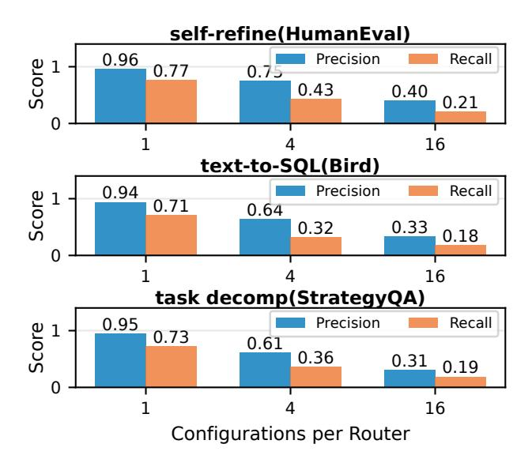
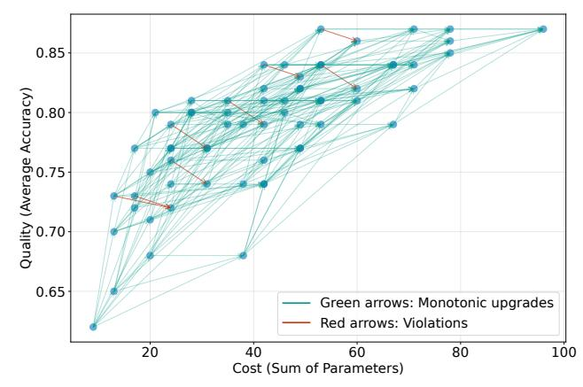
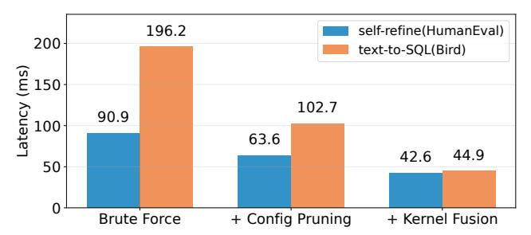

# 3 Design

We present Aragog, an efficient agentic workflow serving system that progressively adapts each request's configuration to cater to runtime system dynamics, i.e., resource availability. Its overarching goal is to maximize serving capacity (throughput) while preserving accuracy. To do so, our key insight is that the accuracy of a configuration for a given request remains constant, while its runtime cost (achieved throughput, latency, utilization) rapidly fluctuates with system dynamics. By recognizing this fundamental asymmetry – accuracy (static but expensive to compute) vs. cost (dynamic but cheap to assess) – we decouple them to make frequent runtime reconfiguration practical. Specifically, Aragog embeds (1) a configuration predictor ([§3.1\)](#page-4-0) that efficiently identifies *all* accurate configurations for each input *once* before execution, rather than just a single configuration as in prior work, to address C1 from [§2.3,](#page-3-0) and (2) a runtime scheduler ([§3.2\)](#page-5-0) that progressively adapts configurations stage by stage (when actual runtime costs are observable) from only this candidate set, efficiently coordinating configuration selection across concurrent requests to maximize serving capacity (addressing C2).

Figure [5](#page-3-1) overviews Aragog's architecture, which runs as a layer between agentic workflow applications and LLM serving engines. Prior to deployment, 1 Aragog trains configuration predictors using representative data for the target workflow, following existing strategies [\[35,](#page-13-1) [46\]](#page-13-8). Additionally, Aragog profiles the latency and throughput of serving engines under different batch sizes to estimate engine available capacity and configuration cost at runtime. Once deployed, 2 incoming requests are queued in FIFO order and first pass through the configuration predictor to obtain their set of accurate configurations. To align the stage-wise scheduling with runtime system states, the runtime scheduler periodically polls each serving engine's load 3 . When serving engines have available resources, the scheduler initiates a scheduling round 4 : using the profiled latency-throughput profiles and current load observations, it jointly selects which requests to dispatch and which models to use for their current stages such that overall serving throughput is maximized. After each scheduling round, Aragog prunes invalid configurations – i.e., those that would have used a different model than the one selected for the current stage – from each scheduled request's set of candidates 5 .

#### 3.1 Efficiently Predicting Accurate Configuration Sets

To effectively achieve stage-wise configuration adaptation, Aragog first needs to exploit the configuration flexibility of agentic workflows. To do that, Aragog's configuration predictor fundamentally differs from traditional routers – instead of selecting a single best configuration, it must identify *the set* of accurate configurations for a given input. This configuration set is essential to Aragog's operation: the prediction must be cheap enough to avoid becoming a bottleneck, while remaining accurate and presenting the maximum number of configurations to maximize adaptation flexibility.

Problem formulation. We formalize configuration prediction as follows. Given an input *x* and a workflow DAG *G* with *n* agents, let *M* = {*m*1,...,*mk*} denote the set of candidate models ordered by size (e.g., Qwen-7B through Qwen-32B), where *C*all = *M n* represents the full configuration space. We define *c* ∗ as the most expensive configuration where all agents use the largest model *mk*, and a configuration is *accurate* if it achieves equivalent accuracy to *c* ∗ for a given input. Following standard practice [\[35,](#page-13-1) [41,](#page-13-2) [46\]](#page-13-8), we employ learned routers to predict accurate configurations, where each router uses a two-layer architecture: an embedding model encodes the input, and is then followed by a classifier. Routers are trained offline on a labeled dataset in which, for each sample, we execute all configurations and label those matching the accuracy of *c* ∗ positively.

Routing strategy. The key question is how to design routers (and the routing approach) such that accuracy is preserved but overheads are bounded, e.g., with a limit on the number of model parameters used for routing. This leads to a challenging space of options to consider. At one extreme, a single large router evaluates all |*M* | *n* configurations simultaneously; at the other, |*M* | *n* small binary routers each eval-

> **[图片提取文字 (无描述)]:**
> self-refine(HumanEval) Recall 0.96 Precision Score 0.77 0.75 0.430.400.21 16 text-to-SQL(Bird) 0.94 Precision Recall Score 0.71 0.64 0.33 0.320.18 16 task decomp(StrategyQA) Precision Recall 0.95 Score 0.73 0.61 0.36 0.31 0.19 16 Configurations per Router

Figure 6: Overall routing accuracy drops as each router's configuration space increases. Binary routers achieve the best precision and recall for a given parameter budget.

uate one configuration independently. Navigating this space is non-trivial: larger routers are more capable, but each must consider more configurations making its task more difficult and the accuracy-compute tradeoff unclear.

To systematically explore this space, we use three representative workflows to evaluate how overall routing accuracy scales with the number of configurations per router under a fixed total router parameter budget. For each workflow, we consider a space of 16 randomly-selected configurations of Qwen model options (7-32B) and evaluate three partitioning schemes: 16 routers each handling 1 configuration (binary routing), 4 routers each handling 4 configurations, and 1 router handling all 16 configurations, with all routers using the same train-test split. For the single-router case, we use the router described in [§5.1.](#page-8-0) As the number of routers increases, we scale down each router's width proportionally to maintain a constant total parameter budget.

Figure [6](#page-4-1) shows the overall routing accuracy results. Despite allocating the same total parameters across all approaches, the overall accuracy degrades with increasing subset size. Binary routers excel in both recall (i.e., finding more viable configurations for runtime scheduling), and even more importantly, precision (i.e., picking fewer inaccurate configurations). Specifically, binary routers achieve 94–96% precision and 71–77% recall, while a single router (handling 16 configurations) achieves only 31–40% precision and 18- 21% recall. Building on this, Aragog adopts binary routers to maximize routing accuracy and focuses on enabling efficient inference of those (many) routers via two core techniques, described in turn.

Pruning router inferences. With the trained binary routers, our goal is for routing to complete during queuing for the first stage of a given request, i.e., to avoid added end-to-end serving latency from configuration adaptation. However, naively running all routers can inflate end-to-end request latency by up to 15.4% across our workloads.

Our strategy to address this is rooted in a key empirical observation: the accuracy of a workflow exhibits nearmonotonicity under model upgrades, where replacing any agent's model with a more capable one (i.e., one with more parameters) maintains or improves end-to-end accuracy in the vast majority of cases. Figure 7 validates this property experimentally across all configurations of a self-refine workflow used for code generation, where green arrows indicate accuracy-preserving upgrades and red arrows indicate rare violations (only 8 out of 288 upgrade cases, with accuracy drops capped at 1.5%); note that we observe a similar trend across all other workloads in our evaluation.

Aragog exploits this observation to carefully prune the configuration search space. Intuitively, if we run a router on a configuration and it deems a configuration accurate enough, then any configuration that upgrades one or more agents to more capable models is expected to be accurate. Conversely, if a configuration is deemed inaccurate, downgrading any agent will likely remain inaccurate. Crucially, Aragog leverages this non-guaranteed property solely to prune the set of configurations, *i.e.*, it affects search efficiency, not accuracy; all selected configurations still run through their corresponding routers before being considered during serving with Aragog. Thus, violations of this property can only result in reduced configuration flexibility by missing accurate configurations.

More specifically, Aragog applies this pruning strategy through a binary search. We first structure the search space into monotonic configuration chains, each starting from the base configuration where all agents use  $m_1$ . These chains are built via depth-first search (DFS) by individually upgrading each agent's model while keeping the others fixed. Then, along each chain, we use binary search to locate the transition boundary between inaccurate and accurate configurations. At each step in the search, we evaluate the selected configuration by running its binary router. Again, after the binary search completes, Aragog verifies all remaining configurations by running their routers and retains only those predicted to be accurate for our final candidate set.

Efficient router inference. While pruning reduces the number of routers to evaluate, executing them efficiently requires further optimization. The core issue is that the specialized classifiers from different routers cannot be batched like the shared embedding model—each classifier is router-specific, resulting in sequential execution. Worse, these classifiers are lightweight, leading to underutilized GPU resources. To address this, Aragog fuses the classifiers layer by layer via custom kernels to maximize the parallelism.

Figure 8 shows the cumulative impact of our optimizations on average per-input routing latency for two represen-

> **[图片提取文字 (无描述)]:**
> 0.85 Quality (Average Accuracy) 0.65 Green arrows: Monotonic upgrades Red arrows: Violations 20 40 60 80 100 Cost (Sum of Parameters)

Figure 7: Workflow accuracy is largely monotonic under model upgrades. Green: valid monotonic upgrades; Red: rare violations (8 out of 288 model upgrades, with mild accuracy drops < 1.5%). The trend holds for other workflows.

> **[图片提取文字 (无描述)]:**
> 196.2 self-refine(HumanEval) 200text-to-SQL(Bird) S 150 102.7 Latency 90.9 100 63.6 44.9 42.6 50 Brute Force + Config Pruning + Kernel Fusion

Figure 8: Reduction in average per-input routing latency from cumulative optimizations.

tative workflows. Starting from naive exhaustive evaluation of  $|\mathcal{M}|^n$  routers with embedding batching enabled (baseline), Aragog's configuration pruning optimization reduces routing overheads by 30.0–47.6%. Kernel fusion for router classifiers further reduces latency by 33.1–56.3%. Together, these optimizations reduce average per-input routing latency from 90.9–196.2 ms to 42.6–44.9 ms per request; we show in §5.3 that the resultant overheads sufficiently ensure that routing minimally affects end-to-end response times.

Overall operation. When deployed online, Aragog adapts configuration search to the time budget – i.e., the configuration search for a request must complete before its first stage can be executed. Specifically, Aragog estimates request queuing delays via exponential moving averages of observed per-stage queue times across all requests. Based on this estimate, Aragog adjusts the embedding model batch size and classifier fusion degree to maximize router inference efficiency while meeting the deadline. If configuration search is incomplete when a request must execute, Aragog uses the verified configurations found so far, or defaults to the most expensive configuration if none exist.

