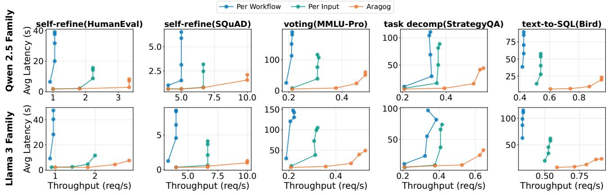
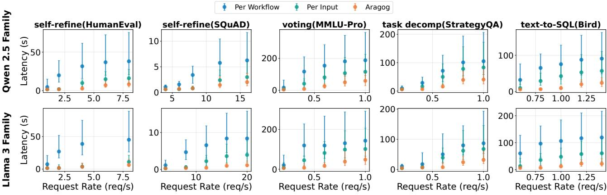
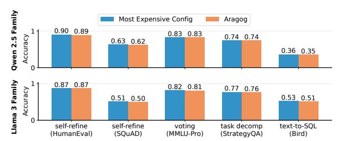
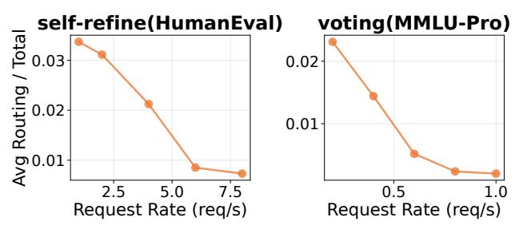
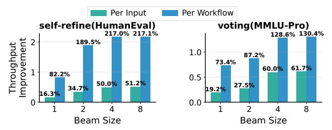
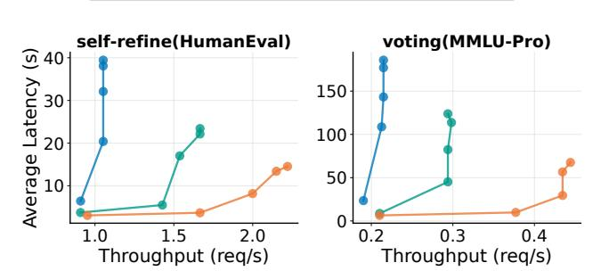

# 5 Evaluation

We evaluated Aragog across a wide range of agentic workloads, model families, and varying request rates. Our key findings are:

- Aragog improves maximum serving throughput by 42.8– 76.3% and 78.1–217.0% over per-input and per-workflow optimizations, respectively.
- Aragog maintains lower latency under increasing load. Under the highest load for all workloads, Aragog reduces P25, median, and P95 end-to-end latency by 23.6–60.1%, 32.5–71.1%, and 46.2–76.2% over per-input optimization and 58.4–82.8%, 60.0–86.1%, and 63.2–89.0% over perworkflow optimization, respectively.
- Aragog preserves accuracy compared to always using the largest model, with maximum degradation of 2%.
- Aragog demonstrates robust improvements over baselines across mixed model families, router architectures, configuration space sizes, and GPU allocation schemes.

#### 5.1 Experimental Setup

Models. We use the Qwen-2.5 (7B, 14B, 32B) [\[37\]](#page-13-3) and Llama 3 (3B, 8B, 70B) [\[1\]](#page-12-7) model families. This provides a diverse range of capability-cost tradeoffs for each agent in the workflows. We use Snowflake Arctic-Embed-L-v2.0 [\[55\]](#page-14-7) as the router's embedding model, which has a small number of parameters while providing high-quality embeddings and supporting relatively long context lengths. The router's classifier is an MLP with 6 hidden layers that maps embeddings to configuration predictions. Additionally, we explore heterogeneous model options across different families, and different embedding models in [§5.3.](#page-10-0)

Testbed. We conduct our experiments on an H100 GPU node, which contains 8 NVIDIA H100 80GB GPUs interconnected via NVLink and a 96-core Intel Sapphire Rapids CPU. We use SGLang as our model serving engine. For models larger than 7B, we enable tensor parallelism with a degree of 2 for 14B models and 4 for 32B and larger models, following standard practice. We dedicate the remaining GPU to router inference. For baselines without routing components, this GPU instead serves an additional 7B model to ensure fair resource allocation. We also explore different initial GPU allocation configurations in [§5.3.](#page-10-0) As in prior work [\[21,](#page-12-15)[30,](#page-13-11)[62\]](#page-14-6), we simulate request arrivals using a Poisson process with varying arrival rates to capture different load conditions.

Workflows and datasets. We evaluate Aragog across diverse workflow patterns (Figure [1\)](#page-1-0) and datasets.

- *Self-refine for coding* on HumanEval [\[10\]](#page-12-12) (164 programming problems), using a three-agent workflow with generation, critique, and refinement agents.
- *Self-refine for QA* on SQuAD v2.0 [\[38\]](#page-13-12) (1000 sampled questions), following the same three-stage pattern.
- *Text-to-SQL* on Bird-SQL [\[25\]](#page-12-13) (780 samples), where query generation is decomposed into keyword extraction, column selection, SQL generation, and refinement stages.
- *Voting* (four voters and one aggregator) on MMLU-Pro [\[48\]](#page-13-13) (1500 sampled questions), where multiple reasoning paths are generated in parallel and aggregated.
- *Task decomposition* on StrategyQA [\[15\]](#page-12-14) (1500 sampled questions), where problems first pass through the decomposer, then invoke sub-task solvers in parallel, and finally the answer aggregator.

Baselines. We compare Aragog against two baselines that represent optimal performance for each category: (1) Perworkflow optimization: selects the cheapest configuration among all configurations that match the most expensive configuration's accuracy, the configuration stays fixed for all requests; and (2) Per-input optimization: performs routerbased selection for each request. Both baselines are given an oracle with perfect accuracy knowledge for selecting their best configurations, representing the performance upper bound of each approach. Additionally, we remove the router inference overhead for the per-input baseline. Moreover, all baselines incorporate the same state-of-the-art graph-aware scheduling for agentic workflows as Aragog ([§3.2\)](#page-5-0).

Metrics. We measure serving capacity (maximal throughput), latency (Average/P25/P50/P90) under varying request rates, and accuracy preservation relative to the most expensive configuration (using the largest model for all agents).

#### 5.2 End-to-End Performance

Figures [12–](#page-9-0)[14](#page-10-1) compare Aragog with two baselines across five agentic workloads and two model families. Overall, Aragog significantly improves the maximal serving capacity and lowers latencies, while matching the accuracy when always using the largest model.

Serving capacity improvement. Figure [12](#page-9-0) shows throughput-latency curves under varying request rates across workloads and model families. For each workload, we sweep the request rate from low to high and measure the achieved throughput and average latency at each rate, shown as individual points on the curves. Across both Llama and Qwen model families, Aragog consistently achieves the highest throughput and lowest average latency under varying request rates. Specifically, Aragog improves maximum serving throughput by 42.8–76.3% over per-input optimization and 78.1–217.0% over per-workflow optimization. Additionally, Aragog reduces average latency under the highest request rates by 25.4–69.4% and 60.0–85.3% over per-input and per-workflow optimization, respectively.

> **[图片提取文字 (无描述)]:**
> --- Aragog Per Workflow --- Per Input voting(MMLU-Pro) self-refine(HumanEval) self-refine(SQuAD) task decomp(StrategyQA) text-to-SQL(Bird) <u>s</u> 40 100 75 5.0 50 100 20 50 2.5 Avg 7.5 10.0 0.4 0.4 0.6 0.8 S 100 150 100 atency 20 100 50 50 50 Avg 10.0 0.2 0.4 0.6 0.50 0.75 0.4 Throughput (reg/s) Throughput (req/s) Throughput (reg/s) Throughput (reg/s) Throughput (reg/s)

Figure 12: Average latency and throughput comparison under varying request rates and across five workflow dataset pairs and two model families. Each dot represents the average latency and throughput under a specific request rate.

> **[图片提取文字 (无描述)]:**
> Per Workflow Per Input Aragog Family voting(MMLU-Pro) self-refine(HumanEval) self-refine(SQuAD) task decomp(StrategyQA) text-to-SQL(Bird) 200 10 >50· 100 200 100 2.5 10 0.5 0.5 0.75 1.00 1.25 200 200 200 10 ਹੇ 50∙ 100 100 0.5 0.75 1.00 1.25 Request Rate (req/s) Request Rate (reg/s) Request Rate (reg/s) Request Rate (reg/s) Request Rate (reg/s)

Figure 13: Median latency for workloads and model families at varying loads. Error bars show P25 and P95.

These results show that Aragog both scales efficiently under high load and its optimization generalizes across agentic workloads and model families.

We observe several important trends across both model families. First, compared to per-input optimization, Aragog's capacity improvements grow with workflow complexity. The throughput improvement increases from 42.8-50.1% for self-refine workflows to 54.0-76.3% for more complex workflows with longer sequential chains (text-to-sql) or parallel branches (task decomposition and voting). This is because workflows with more stages exacerbate the limitations of per-input optimization's static, upfront configuration. Configuration staleness increases with workflow complexity, leading to increasingly suboptimal configuration decisions. In contrast, Aragog exploits runtime reconfiguration and flexible request scheduling to maximize resource utilization across stages, yielding higher throughput gains. Second, compared to per-workflow, Aragog's capacity improvements are more pronounced for simpler workflows (100.2–217.0%) than complex ones (78.1–142.4%). This is because complex workflows offer fewer opportunities for requests to exploit cheaper configurations, as tasks are harder. Similarly, the gap between per-workflow and per-input optimization narrows as workflow complexity increases.

Latency reduction. Figure 13 presents latency distributions across workloads and model families under the same request rates from Figure 12. At low request rates where systems are underutilized, all approaches achieve comparable latency, as expected. However, as load increases, Aragog's latency reductions become increasingly pronounced. Under the highest load across all workloads, Aragog reduces P25, median, and P95 end-to-end latency by 23.6–60.1%, 32.5–71.1%, and 46.2–76.2% over per-input optimization and 58.4–82.8%, 60.0–86.1%, and 63.2–89.0% over perworkflow optimization. The improvements are most pronounced at P95, where Aragog achieves up to 89.0% reductions. This is because through flexible runtime reconfiguration, Aragog avoids excessive queuing at individual models, reducing tail latency compared to static baselines.

Accuracy preservation. Figure 14 shows that Aragog maintains accuracy across all five workloads and two model families while achieving significant throughput and latency improvements. Aragog's accuracy matches the most expensive configuration, with differences of at most 2%. This demonstrates that Aragog's configuration predictor maintains high

> **[图片提取文字 (无描述)]:**
> **Qwen 2.5 Family** Most Expensive Config Aragog Accuracy 0.90 0.89 0.83 0.83 0.74 0.74 0.63 0.62 0.36 0.35 Accuracy Llama 3 Family 0.87 0.87 0.82 0.81 0.77 0.76 0.53 0.51 0.51 0.50 self-refine self-refine voting text-to-SQL task decomp (HumanEval) (SOuAD) (MMLU-Pro) (StrategyQA) (Bird)

Figure 14: Evaluating Aragog's end-to-end accuracy against the case when always using the largest model.

> **[图片提取文字 (无描述)]:**
> self-refine(HumanEval) voting(MMLU-Pro) 0.03 0.02 -Routing , 0.01 ნ 0.01 ≹ Request Rate (reg/s) Request Rate (reg/s)

Figure 15: Ratio of average routing latency to total end-to-end latency across workloads and request rates.

prediction accuracy while providing configuration flexibility for runtime scheduling.

#### 5.3 Microbenchmarks

Results here use two representative workflows: self-refine on HumanEval and voting on MMLU-Pro, using models from the Qwen family; the observed trends hold for all our workloads. Unless otherwise specified, all other experimental settings remain the same as described in §5.1.

Routing overheads. Figure 15 shows the ratio of average routing latency to total end-to-end latency for different request rates. Routing overhead remains minimal, accounting for at most 3.5% of total latency at low request rates and <1% at high request rates (when queueing delays are high). However, these percentages reflect absolute overheads; with Aragog, routing does not impose any additional delay on end-to-end latencies for requests. Indeed, at the highest request rates, routing completes 100% of the time during queuing of each request's first stage; at the lowest request rates, Aragog's budget-based routing (§3.1) does rarely terminate routing early, but even in such cases, 90% (on average) of routing work completes to ensure sufficient flexibility.

**Beam search with different beam sizes.** Figure 16 shows the impact of beam size on Aragog's wins. For self-refine on HumanEval, throughput improvement over per-input optimization grows from 16.3% to 51.2% as beam size increases from 1 to 8, while improvements over per-workflow optimization increase from 82.2% to 217.1%. Similarly, for voting on MMLU-Pro, gains rise from 19.2% to 61.7% over perinput and 73.4% to 130.4% over per-workflow. Performance gains plateau with increasing beam size, as beam search finds

> **[图片提取文字 (无描述)]:**
> Per Input Per Workflow self-refine(HumanEval) voting(MMLU-Pro) 217.0% 217.1% 128.6% 130.4% Throughput Improvement 189.5% 1.0 87.2% 73.4% 61.7% 60.0% 82.2% 0.5 51.2% 50.0% 27.5% 34.7% 19.2% 16.3% 0.0 Beam Size Beam Size

Figure 16: Impact of beam size on throughput improvement.

--- Per Input

Aragog

Per Workflow

> **[图片提取文字 (无描述)]:**
> self-refine(HumanEval) voting(MMLU-Pro) S 40 Latency 05 06 150 100 Average 10 50 1.5 2.0 0.3 Throughput (reg/s) Throughput (reg/s)

Figure 17: Average latency and throughput comparison under varying request rates using a mixed model family (Llama 8B, Phi 14B, and Qwen 32B). Each dot represents the average latency and throughput under a request rate.

better configuration assignments than greedy search (beam size 1) but with diminishing returns.

**Mixture of Model Family.** Figure 17 shows Aragog's generality to heterogeneous model families by using models from mixed model families: Llama3 8B, Phi4 14B, and Qwen2.5 32B. While maintaining the accuracy as the most expensive configuration, Aragog improves serving throughput by 33.7–68.5% over per-input baseline and 109.5–111.4% over per-workflow baseline. Additionally, Aragog reduces average latency under the highest request rates by 37.9–45.4% and 63.1–63.6% over per-input and per-workflow optimization, respectively.

Impact of router architectures. Table 1a compares two embedding models for the router: Arctic-Embed-L-v2.0 (our default) and Google's EmbeddingGemma [45]. Both have similar parameter counts and deliver comparable throughput performance (within 1.9%). The negligible performance differences show that Aragog's routing mechanism is robust to the choice of embedding model, provided that it can capture semantic similarity between workflow requests.

Impact of different GPU allocation schemes. We evaluate Aragog's robustness to resource constraints by reducing GPU allocation from 8 to 4 H100 GPUs. With fewer GPUs, we reduce tensor parallelism accordingly: Qwen 32B from TP=4 to TP=2, Qwen 14B from TP=2 to TP=1, while Qwen 7B remains on a single GPU. This scenario favors the perinput baseline, which prioritizes smaller models based on static costs, while Aragog's advantage comes from runtime reconfiguration that shifts load from overloaded small mod-

Table 1: Throughput improvement under different router embedding models, GPU allocations, and configuration space sizes (a) Impact of router embedding models

|                     | Self-refine |        | Voting |        |
|---------------------|-------------|--------|--------|--------|
| Router's Embedder   | vs PI       | vs PW  | vs PI  | vs PW  |
| Arctic-Embed-L-v2.0 | 50.0%       | 217.0% | 60.0%  | 128.6% |
| EmbeddingGemma      | 50.3%       | 216.8% | 58.3%  | 126.7% |

#### (b) Impact of GPU allocation schemes

|                     | Self-refine |        | Voting |        |
|---------------------|-------------|--------|--------|--------|
| Resource Allocation | vs PI       | vs PW  | vs PI  | vs PW  |
| 8 H100 GPUs         | 50.0%       | 217.0% | 60.0%  | 128.6% |
| 4 H100 GPUs         | 28.3%       | 205.2% | 32.1%  | 117.4% |

#### (c) Impact of configuration space sizes

|                     | Self-refine |        | Voting |        |
|---------------------|-------------|--------|--------|--------|
| Configuration Space | vs PI       | vs PW  | vs PI  | vs PW  |
| Full Space          | 50.0%       | 217.0% | 60.0%  | 128.6% |
| Constrained Space   | 34.2%       | 164.6% | 52.1%  | 106.5% |

All improvements measured at the highest request rate from the main evaluation ([§5.2\)](#page-8-1). PI = per-input baseline, PW = per-workflow baseline. All experiments maintain the same or better accuracy as the main evaluation.

els to underutilized larger models. With 4 GPUs, limited capacity for larger models restricts such reconfiguration opportunities. Table [1b](#page-11-1) shows that Aragog still achieves significant throughput improvements over the per-input baseline with 4 GPUs: 28.3% for self-refine and 32.1% for voting, compared to 50.0% and 60.0% with 8 GPUs. Gains over per-workflow optimization remain stable across both workloads (205.2% and 117.4% with 4 GPUs vs. 217.0% and 128.6% with 8 GPUs), as it selects a fixed configuration with large models to meet worst-case accuracy requirements, making it similarly resource-constrained.

Impact of the size of configuration space. Aragog by default explores the full configuration space given a workflow and model candidates. Table [1c](#page-11-1) investigates performance under a constrained space with additional restrictions: for selfrefine workflows, the critic and refine agents must use the same model; for voting workflows, all voters must use the same model. With the constrained space, Aragog achieves 34.2% and 52.1% throughput improvements over per-input optimization for self-refine and voting, respectively, versus 50.0% and 60.0% with the full space. Gains over perworkflow optimization decrease from 217.0% and 128.6% to 164.6% and 106.5% for the two workloads. Despite reduced configuration flexibility, Aragog maintains significant advantages through joint scheduling that leverages each request's available flexibility. This also demonstrates that Aragog allows users to configure the configuration space size, which can be useful for managing complexity in larger workflows with more agents.

