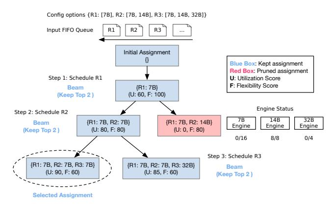
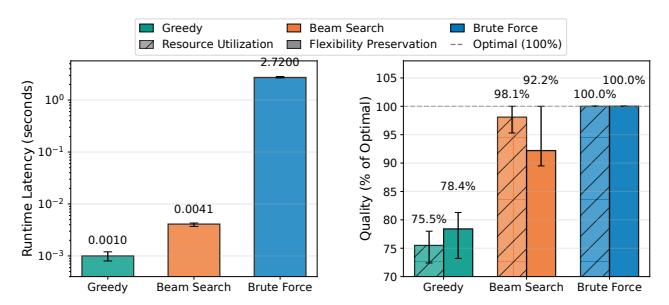

# <span id="page-5-0"></span>3.2 Runtime Configuration Selection and Scheduling

Given the set of viable configurations per request (§3.1) and serving engines with provisioned resources to manage all

model options, Aragog's goal is to maximize overall serving capacity. Key to this is ensuring that stage-wise configuration decisions factor in the latest information about resource availability and also jointly optimize across all concurrent requests.

To realize this, Aragog's scheduler works as follows. It periodically polls each engine's current load and estimates available capacity relative to offline-profiled saturation points, i.e., the batch size for that model and serving engine beyond which throughput no longer improves. When any engine has available capacity, the scheduler triggers a scheduling round. All requests awaiting scheduling are held in a meta-queue organized in FIFO order (as in existing systems [44]), with each request being tagged with both its (remaining) viable configurations and its current workflow stage. With this fresh view of system state and configuration options, each scheduling round involves (1) jointly selecting requests from the queue and assigning them models to use for their current stages, and (2) dispatching those stage-wise inference jobs to the corresponding serving engines which each manage their own queues and execution logic (e.g., chunked prefill decisions). Once dispatched, requests remain in the meta-queue as pending rather than re-entering upon stage completion to preserve FIFO ordering.

**Joint optimization across requests and time.** Aragog's runtime scheduler operates using the following inputs for each scheduling round: (i)  $Q = \{r_1, r_2, ..., r_n\}$ , the request queue in FIFO order where each  $r_i$  is at a specific workflow stage; (ii)  $C(r_i)$ , the set of viable configurations for request  $r_i$ ; and (iii)  $S_m(t)$ , the available slots for model m's engine at time t (considering current batch occupancy and maximum batch size, as per the offline profiles). In selecting request stages to schedule (and the models to use for each), Aragog strives to maximize overall serving throughput.

This involves not only maximizing current utilization across all serving engines, but also preserving future scheduling flexibility. The reason is that each scheduling round's configuration assignment has two effects: it determines resource utilization in the current round, and it potentially prunes the set of viable configurations for future stages of the considered requests. Put differently, a model selection for a given stage can render previously viable configuration options invalid (if they conflict at that stage), thereby limiting future adaptation flexibility and (potentially) compromising future resource utilization. Aragog must therefore jointly optimize across requests and time. However, the assignment space is prohibitively large – exponential in the number of requests and the size of their configuration sets – making exhaustive search impractical for real-time scheduling.

To handle this, our key insight is that FIFO ordering and shrinking configuration sets together narrow the assignment space for efficient exploration. First, FIFO ordering prioritizes earlier requests in the queue, and their assignments constrain the available options for later requests due to shared

<span id="page-6-0"></span>> **[图片提取文字 (无描述)]:**
> Config options {R1: [7B], R2: [7B, 14B], R3: [7B, 14B, 32B]} R3 Input FIFO Queue R1 R<sub>2</sub> Initial Assignment Blue Box: Kept assignment Red Box: Pruned assignment Step 1: Schedule R1 U: Utilization Score F: Flexibility Score Beam {R1: 7B} (U: 60, F: 100) (Keep Top 2) Engine Status Step 2: Schedule R2 7B 14B 32B {R1: 7B, R2: 7B} {R1: 7B, R2: 14B} Beam Engine Engine Engine (U: 80, F: 80) (U: 0, F: 80) (Keep Top 2) 0/16 8/8 0/4 Step 3: Schedule R3 {R1: 7B, R2: 7B, R3: 7B} {R1: 7B, R2: 7B, R3: 32B} Beam (U: 90, F: 60) (U: 85, F: 60) (Keep Top 2) Selected Assignment


Figure 9: Beam search efficiently navigates the exponential configuration space by iteratively scheduling requests in FIFO order. Given current engine status, at each step it explores configuration options to extend the partial assignment, ranks them by utilization improvement (U) and flexibility preservation (F), and retains only the top-B (B=2 here) for further exploration.

<span id="page-6-1"></span>> **[图片提取文字 (无描述)]:**
> Greedy Beam Search Brute Force Resource Utilization Flexibility Preservation Optimal (100%) 2.7200 105 92.2% 100.0% Runtime Latency (seconds) 98.1% 100.0% Quality (% of Optimal) 95 90 78.4% 85 0.0041 75.5% 80 -0.0010 75 70 Greedy Beam Search Brute Force Greedy Beam Search Brute Force


Figure 10: Comparing scheduling algorithms in Aragog: beam search achieves near-optimal resource utilization (current engine utilization) and flexibility preservation (future configuration options) comparable to brute-force, with greedy-level efficiency. Bars show averages with min-max error bars.

resources. Moreover, earlier requests in the queue are typically at later workflow stages with already-pruned configuration sets, leaving them with few viable options. Together, these two factors create a narrow search space: earlier requests have limited options, and once assigned, they further restrict later requests. This makes *beam search* ideal – it avoids both the intractability of exhaustive search and the myopia of greedy assignment by iteratively extending a small set of promising partial assignments in FIFO order.

Aragog uses beam search to efficiently navigate the exponential configuration space (Figure 9). Aragog maintains only the top-*B* (B is set to 4 by default, but we evaluate different values in §5.3) most promising partial assignments at each step, where each partial assignment represents a subset of scheduled requests with their configuration assignments. Partial assignments are ranked by two criteria: (1) utilization improvement, i.e., the total forecasted throughput improvement from the assignment, estimated using offline-profiled throughput-load curves for each model engine. This metric

accounts for both each engine's inherent throughput characteristics and its current utilization. For example, the scheduler prefers assignments that distribute load across a lightlyloaded 32B engine and a 7B engine with high marginal throughput gains, rather than assignments that further saturate an already near-capacity 7B engine, and *(2) flexibility preservation* as a tiebreaker, i.e., the average percentage of configuration options preserved across requests for future stages. This balances immediate resource utilization with flexibility preservation for downstream scheduling.

At each step, the scheduler expands partial assignments in FIFO order by considering all valid configuration assignments for the next unscheduled request in the queue. To avoid blocking, we employ a look-ahead mechanism (that still respects FIFO priorities): when a request cannot be scheduled due to resource constraints, the scheduler skips it and proceeds to the next request in the queue. This is critical for heterogeneous workflows where requests require different models; strict FIFO would block subsequent requests with flexible configurations behind a constrained request waiting for an overloaded model. Our relaxation preserves FIFO fairness because: (1) skipped requests add no additional delay, i.e., they remain blocked regardless of whether subsequent requests are scheduled, and (2) Aragog still iterates through requests in FIFO order in future rounds, ensuring skipped requests are never overtaken by later joint requests requiring the same models.

By retaining only top *B* partial assignments throughout the search, Aragog makes joint optimization tractable while finding high-quality assignments. The search terminates when all feasible requests are assigned or no available serving resources remain. To evaluate the performance of beam search in Aragog, we take periodic snapshots of our evaluation workloads during serving. Figure [10](#page-6-1) shows that beam search achieves near-optimal assignment quality (measured by resource utilization and flexibility preservation) that is comparable to exhaustive search while maintaining efficiency close to greedy approaches, i.e., orders of magnitude faster than brute-force search.

Supporting complex workflows. Thus far, we have assumed sequential workflows. However, agentic workflows extend beyond sequential workflows, often containing parallel branches and complex dependencies. Aragog leverages topological sorting to ensure correct execution order while maximizing parallelism. Before execution, Aragog performs a topological sort [\[27,](#page-13-10) [44\]](#page-13-9) on the workflow DAG and precomputes each agent's depth, i.e., the longest path from that agent to any leaf node. During execution, Aragog follows a two-level priority scheme: *(1) inter-request*: FIFO ordering prioritizes earlier requests over later ones, and *(2) intrarequest*: agents are prioritized by depth in descending order to schedule critical-path agents first. For example, given two requests *R*<sup>1</sup> (arrived first) and *R*<sup>2</sup> (arrived second), where *R*<sup>1</sup> has ready agents *A* (depth=4) and *B* (depth=3), and *R*<sup>2</sup> has

```
class Workflow(ABC):
@abstractmethod
def extract_workflow_graph(
   self, dspy_program: dspy.Module
) :
   """Extract workflow DAG from DSPy
       program."""
   pass
@abstractmethod
async def execute_stage(
   self,
   stage: int,
   model_idx: int,
   lm: dspy.LM,
   request_state: RequestState
):
   """Execute a stage with the specified
       model."""
   pass
```

Figure 11: Aragog's DSPy wrapper abstraction for enabling graph structure extraction and stage-wise scheduling.

ready agent *C* (depth=5). Agent *A* from *R*<sup>1</sup> (highest depth in earlier request) will be scheduled earlier than agent *C*, despite agent *C* having the globally highest depth. With this ordering, Aragog's optimization applies seamlessly to complex workflows.

