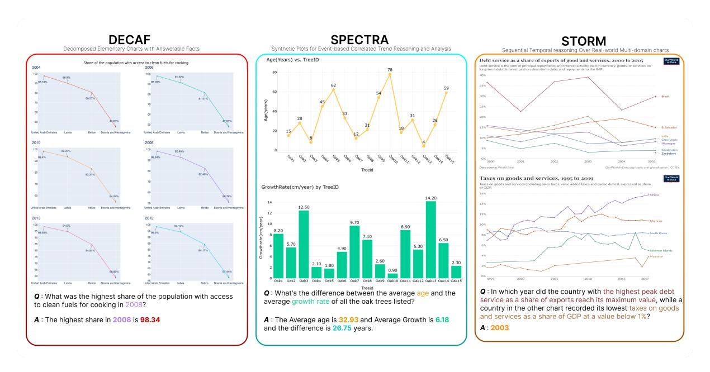
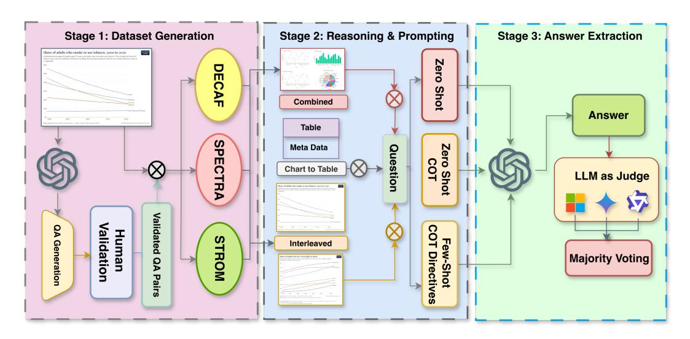

## INTERCHART: Benchmarking Visual Reasoning Across Decomposed and Distributed Chart Information

Anirudh Iyengar Kaniyar Narayana Iyengar ∗ , Srija Mukhopadhyay ∗ , Adnan Qidwai ∗ , Shubhankar Singh , Dan Roth , Vivek Gupta

Arizona State University IIIT, Hyderabad Mercer Mettl University of Pennsylvania

akaniyar@asu.edu, srija.mukhopadhyay@research.iiit.ac.in, adnan.qidwai@students.iiit.ac.in, Shubhankar.singh@mercer.com, danroth@seas.upenn.edu, vgupt140@asu.edu

#### Abstract

We introduce INTERCHART, a diagnostic benchmark that evaluates how well visionlanguage models (VLMs) reason across multiple related charts, a task central to real-world applications such as scientific reporting, financial analysis, and public policy dashboards. Unlike prior benchmarks focusing on isolated, visually uniform charts, INTERCHART challenges models with diverse question types ranging from entity inference and trend correlation to numerical estimation and abstract multi-step reasoning grounded in 2-3 thematically or structurally related charts. We organize the benchmark into three tiers of increasing difficulty: (1) factual reasoning over individual charts, (2) integrative analysis across synthetically aligned chart sets, and (3) semantic inference over visually complex, real-world chart pairs. Our evaluation of state-of-the-art open- and closedsource VLMs reveals consistent and steep accuracy declines as chart complexity increases. We find that models perform better when we decompose multi-entity charts into simpler visual units, underscoring their struggles with crosschart integration. By exposing these systematic limitations, INTERCHART provides a rigorous framework for advancing multimodal reasoning in complex, multi-visual environments.

## 1 Introduction

Real-world settings such as scientific publications, business reports, and journalism dashboards rarely communicate data through a single chart. Instead, insight often emerges from comparing or synthesizing information across multiple visualizations. These charts may differ in type, styling, or even semantic framing, yet they jointly convey trends, correlations, and complex relationships. For humans, reasoning across such heterogeneous visual

inputs is intuitive. However, vision-language models (VLMs) continue to face significant challenges when required to integrate information across visually heterogeneous chart collections.

While recent VLMs have shown strong performance on single-chart visual question answering (VQA) tasks [\(Masry et al.,](#page-10-0) [2022;](#page-10-0) [Methani et al.,](#page-10-1) [2020\)](#page-10-1), they perform inconsistently to aggregate information across multiple charts. Existing benchmarks [\(Li and Tajbakhsh,](#page-10-2) [2023;](#page-10-2) [Kantharaj et al.,](#page-10-3) [2022\)](#page-10-3) have begun exploring multi-chart reasoning, but they often rely on simplified scenarios, synthetic data, static chart styles, or limited visual variation. Consequently, these datasets fail to capture key challenges in real-world chart reasoning: visual inconsistency, semantic misalignment, temporal discontinuity, and multi-step aggregation. Moreover, their evaluation metrics typically depend on string matching, which inadequately reflects semantic understanding.

We introduce INTERCHART, a diagnostic benchmark designed to probe how well VLMs can reason across multiple charts with increasing levels of complexity. Unlike prior datasets, INTERCHART spans both synthetic and real-world charts, and introduces a structured tiering system to evaluate performance under controlled and unconstrained conditions. It targets a range of reasoning abilitiesfrom simple fact extraction to multi-step, crossdomain inference-allowing researchers to disentangle visual parsing errors from reasoning failures.

INTERCHART is organized into three structured subsets, each designed to isolate distinct reasoning challenges rather than to establish a predictive hierarchy. The first tier, *DECAF* (Decomposed Elementary Charts with Answerable Facts), evaluates atomic fact retrieval and localized comparisons within visually simplified, decomposed charts. The second tier, *SPECTRA* (Synthetic Plots for Eventbased Correlated Trend Reasoning and Analysis), probes correlated trend reasoning across synthetic

∗These authors contributed equally to this work

chart pairs that share axes and stylistic variations, testing a model's ability to align related quantities and interpret event-based trends. The third and most advanced tier, *STORM* (Sequential Temporal Reasoning Over Real-world Multi-domain charts), examines semantic abstraction and temporal alignment across visually and thematically diverse real-world chart pairs. Collectively, these subsets serve a diagnostic purpose revealing modelspecific failure modes tied to visual complexity, semantic drift, and temporal aggregation rather than implying transferable performance or ranking consistency across tiers.

To ensure reliable assessment, we propose a novel LLM-assisted evaluation pipeline. Instead of relying solely on an exact string match, we employ multiple LLMs as semantic judges and aggregate their decisions through majority voting. It enables evaluators to assess paraphrased answers, numeric approximations, and equivalent units flexibly, producing more robust performance estimates.

We summarize our contributions as follows:

- 1. We present INTERCHART, the first multi-tier benchmark for multi-chart VQA, spanning decomposed, synthetic, and real-world chart contexts.
- 2. We design structured reasoning tasks to benchmark on various closed and open-source VLMs across three visual tiers, capturing localized and cross-visual dependencies, including trend correlation and temporal abstraction.
- 3. We propose an LLM-assisted semantic evaluation framework that improves alignment with human judgment and enables fine-grained error analysis.

The dataset and resources are publicly available at [https://coral-lab-asu.github.io/](https://coral-lab-asu.github.io/interchart/) [interchart/](https://coral-lab-asu.github.io/interchart/).

#### 2 The INTERCHART Benchmark

We introduce INTERCHART to systematically evaluate how reasoning difficulty, chart diversity, and visual complexity affect performance in visionlanguage models (VLMs). The benchmark contains 5,214 validated question-answer (QA) pairs divided into three subsets: *DECAF*, *SPECTRA*, and *STORM*. These subsets represent distinct levels of real-world chart interpretation difficulty. [Ap](#page-13-0)[pendix B](#page-13-0) summarizes the benchmark construction and annotation workflow for all three subsets, with

detailed pipeline diagrams in Figures [3,](#page-13-1) [4,](#page-14-0) and [5,](#page-14-0) and corresponding generation algorithms in [Ap](#page-15-0)[pendix C.](#page-15-0)

## 2.1 DECAF - Decomposed Elementary Charts with Answerable Facts

The *DECAF* subset establishes a foundation for evaluating baseline chart understanding. It includes both real and synthetic charts that represent single variables with minimal visual clutter. The QA tasks focus on factual lookup, comparisons, and parallel reasoning across clearly presented data.

| DECAF Distributions   |       |                        |       |  |  |  |  |  |  |
|-----------------------|-------|------------------------|-------|--|--|--|--|--|--|
| Chart Type            |       | Original Chart Sources |       |  |  |  |  |  |  |
| Line                  | 22    | ChartQA                | 153   |  |  |  |  |  |  |
| Horizontal Bar        | 52    | DVQA                   | 70    |  |  |  |  |  |  |
| Vertical Bar          | 149   | ChartInfo              | 27    |  |  |  |  |  |  |
| Box Plot              | 58    | ChartLlama             | 105   |  |  |  |  |  |  |
| Heat Map              | 37    |                        |       |  |  |  |  |  |  |
| Dot                   | 37    |                        |       |  |  |  |  |  |  |
| QA Generation Methods |       | Total                  |       |  |  |  |  |  |  |
| Original QA           | 665   | QA Pairs               | 2,809 |  |  |  |  |  |  |
| Table-LLM             | 1,467 | Original Charts        | 355   |  |  |  |  |  |  |
| Table-SQL-LLM         | 677   | Decomposed Charts      | 1,188 |  |  |  |  |  |  |

Table 1: Summary of chart types, sources, QA generation, and totals for *DECAF*.

Chart Construction We selected compound charts from ChartQA [\(Masry et al.,](#page-10-0) [2022\)](#page-10-0), ChartLlama [\(Han et al.,](#page-10-4) [2023\)](#page-10-4), ChartInfo [\(Davila et al.,](#page-9-0) [2025\)](#page-9-0), and DVQA [\(Kafle et al.,](#page-10-5) [2018\)](#page-10-5), ensuring diverse sources of real-world chart styles and semantics. These charts span common types such as vertical and horizontal bar plots, line charts, box plots, dot plots, and heatmaps, covering a wide spectrum of visual encodings frequently used in analytical documents. To support reasoning at a granular level, we aimed to isolate atomic facts from multi-variable visuals. When necessary, we used DePlot [\(Liu et al.,](#page-10-6) [2023\)](#page-10-6) to regenerate missing tables from raw chart images, ensuring data fidelity and completeness. We then employed a custom decomposition script that extracted individual rows from these tables, aligned them with chart legends and axis labels, and rendered simplified single-variable charts using Plotly. This transformation allowed us to break down dense compound visuals into interpretable units, promoting focused reasoning over elementary visual elements. The

> **[图片提取文字 (无描述)]:**
> DECAF **SPECTRA** STORM Decomposed Elementary Charts with Answerable Facts Synthetic Plots for Event-based Correlated Trend Reasoning and Analysis Sequential Temporal reasoning Over Real-world Multi-domain charts Age(Years) vs. TreeID Debt service as a share of exports of good and services, 2000 to 2005 Share of the population with access to clean fuels for cooking Debt service is the sum of principal represents and interest actually said in currency, assets, or services on long-term debt, interest paid on short-term debt, and repayments to the IMF. 28 United Arab Emirates 2010 2008 100 10.37% 92.49% Zirrbabwa 2005 Taxes on goods and services, 1995 to 2019 GrowthRate(cm/year) by TreeID 14.20 2013 2012 6.50 Q: What's the difference between the average age and the Q: In which year did the country with the highest peak debt Q: What was the highest share of the population with access service as a share of exports reach its maximum value, while a average growth rate of all the oak trees listed? to clean fuels for cooking in 2008? country in the other chart recorded its lowest taxes on goods and services as a share of GDP at a value below 1%? A: The Average age is 32.93 and Average Growth is 6.18 A: The highest share in 2008 is 98.34 and the difference is 26.75 years. A: 2003

Figure 1: Illustrative examples from our INTERCHART benchmark: DECAF, SPECTRA, and STORM. The DECAF example shows a decomposed version of a chart similar to one found in STORM.

complete data decomposition pipeline is illustrated in Appendix - Figure [3](#page-13-1) and Algorithm [1.](#page-15-1) This resulted in 355 compound charts and 1,188 decomposed charts.

QA Generation We employed a SQL-based sampling strategy to generate table slices. We then used deterministic query templates and Gemini 1.5 pro to create natural language QA pairs, including both chart- and table-derived prompts. A filtering process reduced over 36,000 pairs to 5,800 candidates, followed by manual review to finalize 2,809 QA pairs. Table [1](#page-1-0) details the chart types, sources, and QA generation methods in *DECAF*.

## 2.2 SPECTRA - Synthetic Plots for Event-based Correlated Trend Reasoning and Analysis

The *SPECTRA* subset evaluates a model's ability to integrate distributed information across visually distinct but thematically aligned synthetic charts. These scenarios simulate real-world reasoning, such as interpreting relationships between variables that evolve over time or across regions.

Chart Construction We created structured tables with shared axes to emulate real-world analyses (e.g., linking urban green space with happiness), ensuring that each table reflected plausible entity relationships across dimensions such as time, geography, or category. These base tables served as input to a two-step synthetic chart construction

pipeline. First, we used Gemini 1.5 Pro to generate tabular data with natural variability across rows and columns, guided by template-based prompt scaffolds that preserved semantic consistency while allowing domain shifts (e.g., GDP vs. life expectancy). Second, the structured tables were rendered into visually diverse charts using a humanin-the-loop chart generation module. This included manual oversight to ensure balanced axis scales, legend consistency, and type diversity (e.g., barline overlays, multi-axis scales). The resulting charts preserved shared axes across pairs, promoting alignment in subsequent QA tasks. The corresponding generation flow is detailed in Appendix - Figure [4](#page-14-0) and Algorithm [2.](#page-16-0) Through this pipeline, we generated synthetic yet realistic chart combinations that encouraged event-based correlation and cross-variable reasoning.

QA Generation We prompted the model to generate questions targeting *low-level reasoning*, such as computing totals or averages; *trend analysis*, including directional inferences and value predictions; and *scenario-based inference*, such as multicondition comparisons. We used a Python-enabled LLM agent to validate answers through intermediate computation before converting outputs into natural language. After validation, the *SPECTRA* subset contains 1,717 QA pairs across 333 visual context sets and 870 unique charts. Table [2](#page-3-0) provides detailed distributions.

> **[图片提取文字 (无描述)]:**
> Stage 1: Dataset Generation Stage 2: Reasoning & Prompting Stage 3: Answer Extraction Share of adults who smoke or use tobacco, 2000 to 2020 DECAF Shot Combined Answer Table SPECTRA Zero Meta Data Question Chart to Table Sh LLM as Judge Validated QA Generation Validation STROM Few-Shot Interleaved Directives **Majority Voting** QA Pairs

Figure 2: Overview of the INTERCHART Benchmark Pipeline.

## 2.3 STORM - Sequential Temporal reasoning Over Real-world Multi-domain charts

The *STORM* subset probes the upper limits of current VLM capabilities. It contains complex realworld line chart pairs with diverse styles and domains. These chart combinations reflect realistic analysis settings such as economic reports, environmental trends, and public health dashboards.

| SPECTRA       |       | STORM              |     |  |  |
|---------------|-------|--------------------|-----|--|--|
| Correlated    | 1,481 | Range Estimation   | 198 |  |  |
| Independent   | 245   | Abstract Numerical | 275 |  |  |
|               |       | Entity Inference   | 295 |  |  |
| Totals        |       |                    |     |  |  |
| QA Pairs      | 1,717 | QA Pairs           | 768 |  |  |
| Context Sets  | 333   | Original Charts    | 324 |  |  |
| Unique Charts | 870   | Unique Images      | 648 |  |  |

Table 2: Distribution of question types and overall counts in *SPECTRA* and *STORM*.

Chart Collection We crawled charts and associated metadata from the Our World in Dat[a\\*](#page-3-1) repository. Using semantic cues and metadata attributes, we applied a semantic pairing module to group charts into coherent visual contexts that share related entities across time. The pairing process identified candidate chart pairs with aligned topics or axes, such as GDP and healthcare spending over the same time period. Each candidate pair was manually reviewed to ensure contextual relevance and analytical coherence. The chart construction pipeline followed the *STORM* algorithmic design outlined in Appendix - Algorithm [3,](#page-16-1) incorporating structured metadata extraction, entity alignment, and refinement steps to yield 324 validated chart sets comprising 648 distinct images. A visual overview of this pipeline is provided in Appendix - Figure [5.](#page-14-0)

QA Curation We used Gemini 2.5 Pro to generate candidate QA pairs grounded in both the chart images and their metadata, while Gemini 1.5 Pro was consistently used across all subsets (*DECAF*, *SPECTRA*, and *STORM*) for model evaluation to maintain benchmarking uniformity. The QA generation process focused on multi-step reasoning that spans both charts in a pair, including contextual range estimation, numerical comparisons, temporal trend evaluation, and entity-based inference. Human annotators refined the generated QA pairs to ensure clarity, correctness, and depth of reasoning. Each pair was reviewed, categorized, and finalized through a collaborative validation loop, as described in Algorithm [3.](#page-16-1) The resulting *STORM* subset includes 768 QA pairs across the verified chart sets. Table [2](#page-3-0) summarizes the distribution of question types and chart contexts.

Chart Type Rationale We focused the *STORM* subset on line charts because they dominate realworld analytical settings involving temporal reasoning. Domains such as public health, macroeconomics, and environmental science often present related time series (e.g., GDP vs. CO2 emissions) using side-by-side line charts. By restricting to this chart type, we ensured consistent axis alignment

\* Our World in Data: <https://ourworldindata.org/>

and minimized confounding factors from mixed visual styles, allowing us to construct multi-step aggregation and temporal inference questions while preserving semantic interpretability.

#### 2.4 INTERCHART Verification

We implemented a multi-stage verification pipeline that combined automated filtering and human validation to ensure the quality of INTERCHART.

We first used LLM-based acceptability checks to remove ambiguous or malformed QA pairs. Next, a team of 6 graduate-level annotators manually reviewed each item in DECAF and SPECTRA, ensuring correctness and diversity. Two graduate-level annotators independently verified every QA pair of STORM, with arbitration used to resolve disagreements.

|        | QA Samples | DECAF | SPECTRA |
|--------|------------|-------|---------|
| Pre    | 13,000     | 5,800 | 4,800   |
| Post   | 5,214      | 2,809 | 1,717   |
| % Drop | 59.9%      | 51.6% | 64.2%   |

Table 3: INTERCHART human filtering statistics showing QA sample counts before and after manual verification for subsets *DECAF* and *SPECTRA*.

Table [3](#page-4-0) shows filtering statistics for the *DECAF* and *SPECTRA* subsets, revealing retention rates after manual curation. Table [4](#page-4-1) shows the interannotator agreement for the *STORM* subset, measured using Cohen' Kappa. We achieved a agreement score of 70.63%, reflecting consistent annotations for complex multi-chart reasoning.

|         | QA Samples | Cohen's κ | Jaccard Index |  |  |
|---------|------------|-----------|---------------|--|--|
| Overall | 768        | 70.63%    | 94.75%        |  |  |

Table 4: Overall inter-annotator agreement (Cohen's κ) for the STORM annotated subsets.

Final Dataset Overview: INTERCHART includes 5,214 validated QA pairs across 1,012 multi-chart contexts and 2,706 unique chart images. These examples span diverse reasoning types, visual structures, and real-world complexities, making INTERCHART a comprehensive diagnostic resource for evaluating multi-chart visual question answering.

## 3 Experiments

We benchmark visual reasoning on INTERCHART using a diverse set of vision-language models (VLMs) and multiple input strategies. Our experiments address four core questions: (1) Does chart decomposition improve accuracy? (2) How does visual complexity affect multi-chart reasoning? (3) Can prompt engineering enhance performance? (4) Do structured tables offer an advantage over direct visual inputs?

VLMs We evaluate both closed- and opensource VLMs. Closed-source models include Google Gemini 1.5 Pro [\(Team,](#page-10-7) [2024\)](#page-10-7) and OpenAI GPT-4o Mini [\(OpenAI,](#page-10-8) [2024\)](#page-10-8). Open-source models include Qwen2-VL-7B-Instruct [\(Yang](#page-11-0) [et al.,](#page-11-0) [2024b\)](#page-11-0), MiniCPM-V-2\_6 [\(Hu et al.,](#page-10-9) [2024\)](#page-10-9), InternVL-2-8B [\(Chen et al.,](#page-9-1) [2024\)](#page-9-1), and Idefics3- 8B-LLaMA3 [\(Laurençon et al.,](#page-10-10) [2024\)](#page-10-10). We also include DePlot [\(Liu et al.,](#page-10-6) [2023\)](#page-10-6) and Chart-to-Text [\(Kantharaj et al.,](#page-10-3) [2022\)](#page-10-3) to assess reasoning over structured outputs.

#### 3.1 Evaluation Pipelines

We compare two reasoning pathways: direct chartbased VQA and a chart-to-table pipeline using intermediate structured representations.

Direct Chart Question Answering We test two visual formats: (i) Combined, where charts are stitched into a unified image, and (ii) Interleaved, where charts are passed sequentially. For DECAF, we also evaluate original compound charts to quantify gains from simplification.

Prompting styles include Zero-Shot, Zero-Shot CoT (stepwise reasoning), and Few-Shot with Directives [\(Tannert et al.,](#page-10-11) [2023\)](#page-10-11), which gives structured step-level guidance. Due to input size limits, InternVL and Idefics3 are excluded from interleaved inputs.

Table as Intermediate Representation This setup evaluates whether structured conversion aids reasoning. It includes: (1) *Chart-to-Table Conversion*, where models extract metadata and tables from images, and (2) *Table-Based QA*, where models answer using these tables via CoT prompts. We compare Gemini 1.5 Pro, Qwen2-VL, and MiniCPM. To address DePlot's title extraction issues, we augment it using Gemini title generation, yielding an improved hybrid we term DePlot++. This isolates the benefit of structure vs. visual inputs under matched prompts.

Evaluation Strategy We use LLM-based semantic judges to score answers beyond exact string matching, supporting paraphrases, numerics, and

| Model                   | Zero-Shot |      |                     |                               | Zero-Shot CoT |                            |                     | Few-Shot CoTD |      |      |                     |      |
|-------------------------|-----------|------|---------------------|-------------------------------|---------------|----------------------------|---------------------|---------------|------|------|---------------------|------|
|                         | Net       |      | DECAF SPECTRA STORM |                               | Net           |                            | DECAF SPECTRA STORM |               | Net  |      | DECAF SPECTRA STORM |      |
|                         |           |      |                     | Combined Visual Context Image |               |                            |                     |               |      |      |                     |      |
| GPT-4o-mini             | 44.8      | 59.3 | 45.6                | 29.7                          | 48.5          | 68.3                       | 47.9                | 29.4          | 48.8 | 68.6 | 47.2                | 30.6 |
| Gemini-1.5-Pro          | 53.0      | 65.2 | 59.1                | 34.8                          | 55.0          | 71.6                       | 58.5                | 34.9          | 56.3 | 73.9 | 61.5                | 33.7 |
| Qwen2-VL-7B             | 37.3      | 50.2 | 32.8                | 28.9                          | 41.8          | 59.9                       | 37.3                | 28.4          | 40.4 | 56.3 | 37.0                | 27.9 |
| MiniCPM-V-2_6           | 34.3      | 52.2 | 32.4                | 21.5                          | 35.3          | 52.7                       | 31.9                | 21.3          | 32.4 | 48.7 | 30.1                | 18.6 |
| InternVL-2-8B           | 30.4      | 40.0 | 26.6                | 24.8                          | 32.3          | 45.2                       | 28.2                | 23.6          | 31.6 | 46.3 | 27.3                | 21.2 |
| Idefics3-8B-Llama3 23.2 |           | 39.3 | 19.4                | 11.1                          | 23.8          | 38.8                       | 19.6                | 13.1          | 25.9 | 35.7 | 25.1                | 17.1 |
| Mean                    | 37.2      | 51.0 | 36.0                | 25.1                          | 39.5          | 56.1                       | 37.2                | 25.1          | 39.2 | 55.0 | 38.0                | 24.9 |
|                         |           |      |                     |                               |               | Interleaved Visual Context |                     |               |      |      |                     |      |
| GPT-4o-mini             | 41.9      | 44.4 | 50.0                | 31.5                          | 44.5          | 51.5                       | 50.3                | 31.9          | 44.4 | 51.7 | 50.4                | 31.1 |
| Gemini-1.5-Pro          | 52.7      | 64.7 | 57.4                | 36.0                          | 54.1          | 68.1                       | 57.8                | 36.4          | 54.2 | 70.3 | 59.6                | 32.9 |
| Qwen2-VL-7B             | 37.0      | 49.3 | 32.9                | 28.9                          | 39.4          | 52.8                       | 38.7                | 26.7          | 36.1 | 47.9 | 35.2                | 25.2 |
| MiniCPM-V-2_6           | 37.1      | 49.3 | 36.8                | 25.2                          | 36.6          | 49.6                       | 36.2                | 24.2          | 35.5 | 48.1 | 35.1                | 23.5 |
| Mean                    | 42.2      | 51.9 | 44.3                | 30.4                          | 43.7          | 55.5                       | 45.8                | 29.8          | 42.6 | 54.5 | 45.1                | 28.2 |

Table 5: Accuracies using our evaluation method with majority voting of evaluators on all models and prompting strategies. Results are grouped by visual context format (top: Combined, bottom: Interleaved), and broken down by set type (DECAF, SPECTRA, STORM) and strategy (Zero-Shot, Zero-Shot CoT, Few-Shot CoT with Directives). Net scores refer to the mean score of the model across different subsets.

unit variations if reasoning is correct. Evaluators include Gemini 1.5 Flash (8B) [\(Team,](#page-10-7) [2024\)](#page-10-7), Phi 4 [\(Abdin et al.,](#page-9-2) [2024\)](#page-9-2), and Qwen2.5-7B-Instruct [\(Yang et al.,](#page-11-1) [2024a\)](#page-11-1). These models were selected to ensure architectural diversity across families (Google Gemini, Microsoft Phi, and Alibaba Qwen), balanced parameter scales between 7B-8B for efficiency and semantic depth, and empirical reliability validated through agreement testing. Each receives the question, reference answer, and model output, and returns a binary correctness score along with its reasoning. Final scores use majority voting. A broader discussion comparing this evaluation framework with automatic text-based metrics such as BLEURT, MoverScore, and QuestEval is provided in [Appendix H.](#page-18-0)

To validate the majority voting agreement, we benchmarked 10,000 sampled responses. In over 78.67% of cases, all three evaluators agreed on a common answer. Per-model breakdowns appear in [Appendix J.](#page-19-0)

## 4 Results and Analysis

We analyze performance on INTERCHART across visual input formats, prompting strategies, and subset difficulty levels by answering targeted questions that highlight emerging trends, model strengths, and failure modes. Tables [5](#page-5-0) through [9](#page-7-0) summarize these results.

#### 4.1 Performance across Chart Subsets

Do Interleaved Charts Help Models Perform Better than Combined Charts? Not consistently. As shown in Table [5,](#page-5-0) interleaving charts sometimes improves performance but often leads to minimal or negative changes. For example, Gemini-1.5 Pro improves slightly in STORM from 34.8% to 36.0% but drops from 65.2% to 64.7% in DECAF. Qwen2-VL decreases in DECAF (50.2% to 49.3%) and SPECTRA (32.8% to 32.9%). MiniCPM improves modestly in STORM (21.5% to 25.2%). These results suggest interleaving may help with visual clutter in complex charts but does not offer consistent benefits across all subsets.

Does Decomposing Charts Improve Model Accuracy? Yes. As shown in Table [6,](#page-6-0) converting charts into structured tables improves accuracy in many cases. Gemini-1.5 Pro achieves 69.9% accuracy using structured DECAF tables, outperforming both DePlot (54.3%) and C2T (43.8%). De-Plot++ further improves performance to 63.2% by enhancing title and metadata alignment. Qwen2- VL and MiniCPM also benefit modestly, though their scores remain lower (50.1% and 33.8%, respectively). These results suggest that SQL-based decomposition paired with table-driven reasoning can improve clarity and support more accurate inference compared to image-only inputs.

Why Do Models Perform Poorly on Real-World Multi-Chart Tasks? As seen in Table [5,](#page-5-0) accuracy drops sharply in the STORM subset. Gemini-1.5 Pro falls to 34.8%, Qwen2-VL to 28.9%, and MiniCPM-V-2\_6 to 21.5%. These real-world chart pairs demand semantic alignment and temporal synthesis. Table [9](#page-7-0) shows abstract numerical reasoning is hardest (15.6%), followed by range estimation (33.4%) and entity inference (39.1%). These declines reflect the challenge of integrating misaligned metadata, irregular axes, and domainspecific trends across diverse visual styles.

Do Models Generalize Well from Synthetic to Real-World Chart Distributions? No. Table [5](#page-5-0) shows a consistent drop in performance from SPECTRA to STORM across all models. Gemini-1.5 Pro declines from 59.1% in SPECTRA to 34.8% in STORM. Qwen2-VL drops from 32.8% to 28.9%, and MiniCPM-V-2\_6 from 32.4% to 21.5%. These results suggest that while models handle synthetic trend-based reasoning to some extent, they struggle to transfer those skills to realworld chart pairs that involve domain shifts, visual diversity, and temporal reasoning.

#### 4.2 Effect of VLMs

Why Does Gemini-1.5 Pro leads within the tested baseline suite? Gemini-1.5 Pro consistently leads across all subsets and prompting strategies. As shown in Table [5,](#page-5-0) it scores 65.2% in DE-CAF, 59.1% in SPECTRA, and 34.8% in STORMwell ahead of all other models. GPT-4o-mini is the next best, but lags in STORM (29.7%). Opensource models like Qwen2 and MiniCPM perform reasonably in DECAF but decline sharply on harder subsets. Gemini's strength likely stems from its training on structured inputs and strong instructionfollowing capabilities. GPT-4o achieved performance levels that closely approach those of Gemini-1.5 Pro, particularly in the *STORM* subset that emphasizes semantic abstraction and temporal reasoning (see [Appendix E\)](#page-17-0).

How Do Open-Source Models Compare Across Subsets? Open-source models perform well in DECAF but struggle in SPECTRA and STORM. Qwen2-VL-7B drops from 50.2% in DECAF to 32.8% in SPECTRA and 28.9% in STORM. MiniCPM-V-2\_6 shows a similar decline: 52.2% → 32.4% → 21.5%. InternVL and Idefics3 perform lower across all subsets, particularly in STORM. These trends point to challenges in generalization, especially when models face domain shifts and complex temporal reasoning.

| Model          | DECAF | SPECTRA | STORM | DECAFo |
|----------------|-------|---------|-------|--------|
| C2T            | 43.8  | 46.3    | 14.7  | 62.6   |
| Gemini-1.5-Pro | 69.9  | 68.1    | 29.5  | 76.0   |
| Deplot         | 54.3  | 57.9    | 22.2  | 63.8   |
| Deplot++       | 63.2  | 58.1    | 23.6  | 61.9   |
| MiniCPM-V-2_6  | 33.8  | 22.1    | 12.2  | 35.6   |
| Qwen2-VL-7B    | 50.1  | 34.3    | 18.4  | 52.4   |

Table 6: Accuracies from the chart-to-table prompting and rendering strategies for *DECAF*, *SPECTRA*, *STORM*, and *DECAF* compound charts: *DECAF*o.

#### 4.3 Effect of Strategies

Which Prompting Strategies Work Best Across Subsets? Few-Shot Chain-of-Thought with Directives generally yields the highest accuracy across models and subsets. Table [5](#page-5-0) shows Gemini-1.5 Pro improves from 65.2% (Zero-Shot) to 71.6% (Zero-Shot CoT), and further to 73.9% using Few-Shot CoTD in DECAF. Qwen2-VL follows a similar pattern, improving from 50.2% to 59.9%, before dropping slightly to 56.3%. While MiniCPM sees minor gains with CoT, it drops slightly under Few-Shot CoTD. Overall, structured prompting helps most in DECAF and SPECTRA, but offers limited advantage in STORM due to its high complexity.

Does Chain-of-Thought (CoT) Consistently Help? Mostly in simpler subsets. Table [5](#page-5-0) shows that CoT improves performance in DECAF and SPECTRA but offers limited benefit in STORM. For example, Gemini-1.5 Pro jumps from 65.2% to 71.6% in DECAF and from 59.1% to 58.5% in SPECTRA. Qwen2-VL improves from 50.2% to 59.9% in DECAF, and MiniCPM sees only a marginal gain (52.2% to 52.7%). In STORM, scores remain largely unchanged or even decline slightly, indicating that verbal reasoning alone cannot compensate for high visual and semantic complexity.

#### 4.4 Effect of Intermediate Representation

How Do Different Table Extraction Methods Compare? DePlot++ consistently outperforms DePlot in DECAF and SPECTRA. As shown in Table [6,](#page-6-0) DePlot++ achieves 63.2% in DECAF and 58.1% in SPECTRA, compared to 54.3% and 57.9% with DePlot.

This improvement reflects better title and axis alignment, which helps structured models parse tabular input more accurately. The gains are modest but consistent, affirming the importance of clean preprocessing and metadata fidelity.

| DECAF Chart Type    | Mean  | Best  |
|---------------------|-------|-------|
| DECAF-Decomposition |       |       |
| Line                | 39.66 | 57.76 |
| Horizontal Bar      | 50.95 | 73.36 |
| Vertical Bar        | 56.17 | 78.63 |
| Box Plot            | 64.3  | 84.23 |
| Heat Map            | 55.36 | 81.35 |
| Dot                 | 58.24 | 78.63 |
|                     |       |       |

Table 7: Distribution of Accuracies for Chart Decomposition Approach for *DECAF*.

| SPECTRA Question Category                        | Mean           | Best           |  |  |
|--------------------------------------------------|----------------|----------------|--|--|
| DECAF-Decomposition Correlated Independent | 39.49 43.22 | 67.43 73.47 |  |  |

Table 8: Distribution of Accuracies for Question Categorization Approach for *SPECTRA*.

When Do Structured Tables Hurt Performance Instead of Helping? In STORM. As shown in Tables [6](#page-6-0) and [5,](#page-5-0) structured representations often degrade accuracy on complex real-world charts. Gemini-1.5 Pro drops from 34.8% with visual inputs to 29.5% using tables. C2T performs even worse at 14.7%. These trends suggest that tables cannot capture semantic and temporal alignment across axes, which are critical for accurate reasoning in real-world multi-chart settings.

## 4.5 Effect of Chart Types, Question Category, and Reasoning Type

Which Chart Types Are Easier or Harder in DE-CAF? According to Table [7,](#page-7-1) box plots (64.3%) and dot plots (58.24%) are the easiest for models to interpret, followed by vertical bars (56.17%). Line charts (39.66%) and horizontal bars (50.95%) yield lower accuracy, likely due to visual ambiguity in axis orientation and overlapping labels. These results suggest that models perform best when the chart layout is clean and the data encoding is visually distinct.

Which Question Types Are Easier in SPEC-TRA? Table [8](#page-7-2) shows that independent questions achieve higher accuracy (43.22%) than correlated ones (39.49%).

This suggests that isolating variables in SPECTRA makes reasoning easier for models, while correlated questions introduce multi-step dependencies across charts that are harder to track and align.

How Do Reasoning Demands Shift from SPEC-TRA to STORM? Comparing Table [8](#page-7-2) and Ta-

| STORM                                                      | Interleaved          |                      | Combined             |                      |  |  |
|------------------------------------------------------------|----------------------|----------------------|----------------------|----------------------|--|--|
| Reasoning Type                                             | Mean                 | Best                 | Mean                 | Best                 |  |  |
| Abstract Numerical Entity Inference Range Estimation | 13.6 42.1 31.2 | 23.7 51.3 52.3 | 15.6 39.1 33.4 | 25.5 50.9 47.5 |  |  |

Table 9: Distribution of accuracies for reasoning type categorization in *STORM*, comparing interleaved and combined visual formats.

ble [9](#page-7-0) shows that models perform well on independent trend analysis in *SPECTRA* but struggle with *STORM*'s abstract and range-based questions. This decline reflects a shift from visual correlation to semantic and temporal abstraction, where simple alignment no longer suffices. Even models exceeding 70% accuracy on SPECTRA's independent questions drop below 35% on STORM's range estimation tasks, underscoring that INTERCHART diagnoses distinct reasoning failures rather than cross-tier ranking.

