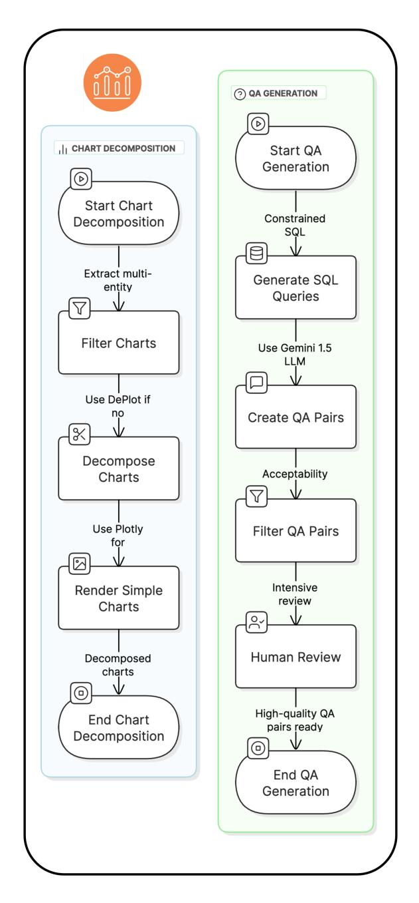
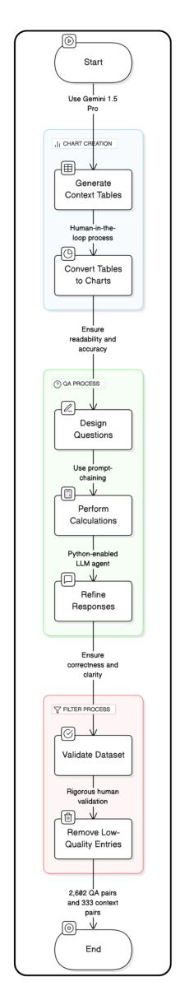
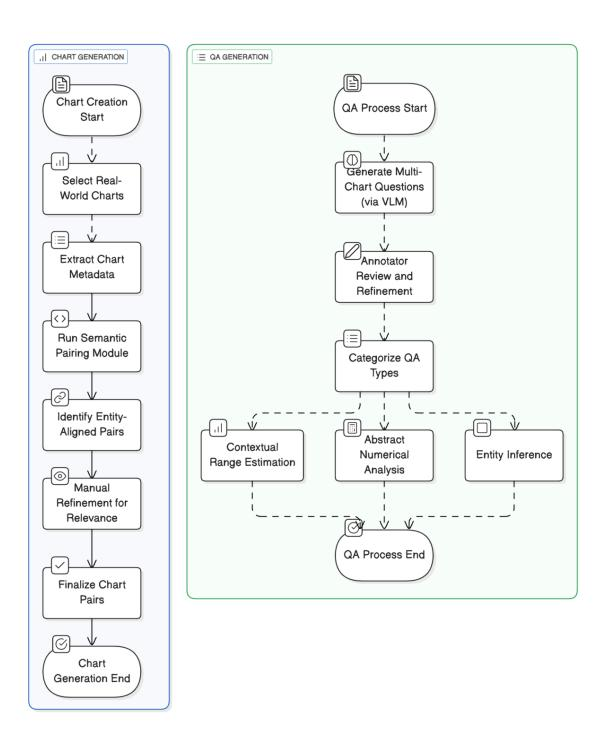

# How Consistent Are VLMs Across Chart Types?

Model performance varies significantly across chart types. Table [7](#page-7-1) shows accuracies ranging from 39.66% for line charts to 64.3% for box plots. This variation suggests VLMs lack consistent chart-type generalization and are sensitive to layout complexity, axis orientation, and label density. Even highperforming models like Gemini show dips on dense or ambiguous formats, highlighting the need for chart-aware visual parsing.

How Do Reasoning Types Impact Performance in STORM? As shown in Table [9,](#page-7-0) reasoning type has a clear impact on accuracy in STORM. Entity inference yields the highest mean accuracy (42.1% interleaved), followed by range estimation (33.4%), and abstract numerical reasoning is lowest (13.6- 15.6%). Interleaved visual formats offer modest gains for entity and range tasks but have limited effect on abstract numerical reasoning, where semantic alignment and aggregation across charts remain key challenges.

#### 5 Comparison with Related Work

Understanding visualizations through natural language has long been a goal in multimodal AI. Early chart-based VQA datasets such as FigureQA [\(Ka](#page-10-12)[hou et al.,](#page-10-12) [2017\)](#page-10-12), DVQA [\(Kafle et al.,](#page-10-5) [2018\)](#page-10-5), PlotQA [\(Methani et al.,](#page-10-1) [2020\)](#page-10-1), ChartQA [\(Masry](#page-10-0) [et al.,](#page-10-0) [2022\)](#page-10-0), and ChartLlama [\(Han et al.,](#page-10-4) [2023\)](#page-10-4) introduced benchmarks over synthetic or real-world

plots, focusing on factual or reasoning questions in isolated visual contexts. Recent efforts like Chart-Info [\(Davila et al.,](#page-9-3) [2024\)](#page-9-3) and SciGraphQA [\(Li](#page-10-2) [and Tajbakhsh,](#page-10-2) [2023\)](#page-10-2) extended this by incorporating structured data such as tables and graphs. However, these datasets center on single-chart scenarios and do not evaluate a model's reasoning ability across multiple, semantically related charts. Complementary work on multi-hop [\(Deng et al.,](#page-9-4) [2022\)](#page-9-4) and graph-based QA [\(Jin et al.,](#page-10-13) [2024\)](#page-10-13) has demonstrated that decomposing complex inputs into smaller units improves reasoning and interpretability. MultiChartQA [\(Zhu et al.,](#page-11-2) [2025\)](#page-11-2) takes a step toward multi-chart reasoning through synthetic chart triplets and four structured tasks: direct, parallel, comparative, and sequential. While it offers controlled diagnostics, the benchmark uses uniformly styled charts with fixed layouts and semantics. It does not assess model performance under visual diversity, semantic drift, or layout complexity, which are standard features in realworld chart collections. Recent benchmarks such as InfoChartQA [\(Lin et al.,](#page-10-14) [2025\)](#page-10-14), ChartMind [\(Wei](#page-10-15) [et al.,](#page-10-15) [2025\)](#page-10-15), and ChartQAPro [\(Masry et al.,](#page-10-16) [2025\)](#page-10-16) have expanded chart understanding toward more realistic visual and linguistic settings. These datasets emphasize broader coverage and visual diversity but primarily address single-chart or loosely connected infographic reasoning. In contrast, INTER-CHART particularly its *STORM* subset was explicitly designed to evaluate *multi-chart* reasoning that demands semantic drift handling, temporal alignment, and multi-step integration across cooccurring charts. An illustrative STORM example involving temporally aligned chart pairs from *Our World in Data* is provided in Appendix [Ap](#page-17-1)[pendix F,](#page-17-1) demonstrating how models must correlate trends across independent metrics to infer temporally grounded answers.

INTERCHART addresses these gaps with a broader diagnostic lens. It introduces three subsets *DECAF*, *SPECTRA*, and *STORM* spanning single-chart to real-world multi-chart reasoning under increasing difficulty and diversity. Unlike prior benchmarks, it combines synthetic and realworld charts to evaluate robustness to visual heterogeneity and abstraction. Additionally, it incorporates an LLM-based evaluation framework that assesses semantic correctness beyond string overlap. INTERCHART thus serves both as a benchmark for evaluating performance and a diagnostic framework for identifying where current models

fail in complex, multi-chart reasoning scenarios. To further clarify these distinctions, Appendix [Ap](#page-19-1)[pendix I](#page-19-1) presents a comparative table summarizing chart type coverage, reasoning scope, multi-chart design, semantic drift, temporal reasoning, and evaluation protocols across recent benchmarks (InfoChartQA, ChartMind, ChartQAPro, and INTER-CHART). This structured comparison highlights that INTERCHART uniquely couples real-world multi-chart reasoning with semantic and temporal abstraction while maintaining diagnostic granularity through its LLM-based majority-voting evaluation.

## 6 Conclusion and Future Directions

We introduced INTERCHART, a diagnostic benchmark for evaluating vision-language models (VLMs) on multi-chart visual reasoning. Structured across three progressively complex subsets *DECAF*, *SPECTRA*, and *STORM*. INTERCHART enables detailed analysis of model behavior under controlled visual transformations. Our findings show that while current VLMs perform well on simplified, decomposed visuals, their accuracy drops significantly when required to integrate or infer across visually complex, semantically misaligned chart sets. Rather than treating VQA as a binary success metric, INTERCHART provides a controlled setting to explore *why* models succeed or fail by varying presentation while holding semantic content constant. This enables diagnostic analysis of model robustness, attention mechanisms, and failure modes-offering insights relevant to model design, training strategies, and interface development.

In future work, we plan to expand INTERCHART beyond traditional charts to include infographics, annotated scientific plots, and hybrid layouts. We also plan to extend the *STORM* subset to heterogeneous chart combinations (e.g., line-bar or heatmap-scatter) to support broader reasoning analysis. We also aim to explore multilingual question sets and incorporate neuro-symbolic or retrievalaugmented approaches to support structured abstraction and cross-domain transfer. Furthermore, we plan to evaluate advanced prompting strategies such as self-consistency, reflection, and tree-ofthought (ToT) to assess their effectiveness in enhancing inter-chart reasoning. These directions can advance model transparency, scalability, and applicability in real-world decision-support settings.

## Limitations

INTERCHART offers a flexible diagnostic framework but comes with limitations. First, our evaluations rely entirely on zero- and few-shot prompting due to resource constraints. This setup does not capture the full potential of models that might benefit from fine-tuning on chart-specific data. Second, all questions and visual content are English-only, which limits multilingual applicability. Additionally, the current version does not support spatial reasoning tasks such as bounding box grounding or region referencing. While we plan to add finegrained annotations and structured parsing outputs in future versions, this study focuses solely on answer-level reasoning. Several potential extensions such as dynamic chart distillation, symbolic chart indexing, or JSON-based parsing supervision remain conceptual due to scope limitations. Despite these constraints, INTERCHART lays a foundation for expanding multimodal evaluation toward structured, visual-first tasks. Future extensions could include layout-aware fine-tuning pipelines, grounded CoT prompting, and multimodal summarization agents tailored for multi-chart analytics.

#### Ethics Statement

This work adheres to ethical standards in data collection, annotation, and reproducibility. All visual data used in INTERCHART originate from publicly available or synthetically generated sources under permissible licenses. No sensitive or personally identifiable information is included. Annotations were conducted by graduate-level volunteers based in the United States and India, all of whom provided informed consent. To promote transparency and reproducibility, we will publicly release the full dataset, evaluation scripts, prompt templates, and annotation guidelines. All filtering heuristics and design decisions have been carefully documented to facilitate future research and benchmarking efforts. We also employed AI tools, including large language models, to assist with aspects of the project such as prompt development and explanatory text generation. All AI-generated outputs were reviewed and refined by human authors to ensure accuracy and clarity. Overall, this project reflects our commitment to data privacy, transparency, annotator welfare, and the responsible integration of AI tools throughout the research process.

#### Acknowledgments

This research has been supported in part by the ONR Contract N00014-23-1-2364, and conducted as a collaborative effort between *Arizona State University* and the *University of Pennsylvania*. We gratefully acknowledge the Complex Data Analysis and Reasoning Lab at School of Augmented Intelligence, *Arizona State University* for providing computational resources and institutional support. We also thank the anonymous reviewers for their thoughtful feedback and constructive suggestions. We extend special appreciation to our lab cat, Coco, whose presence helped both our team and our professor maintain just the right balance of focus and levity during deadlines.

We further acknowledge *Varun Yerram, Prekshi Vyas, Mansi*, and *Devanshi Garg* for their assistance during the early development phase of this project. Finally, we thank our parents for their unwavering encouragement and support throughout this project.

#### References

Marah Abdin, Jyoti Aneja, Harkirat Behl, Sébastien Bubeck, Ronen Eldan, Suriya Gunasekar, Michael Harrison, Russell J. Hewett, Mojan Javaheripi, Piero Kauffmann, James R. Lee, Yin Tat Lee, Yuanzhi Li, Weishung Liu, Caio C. T. Mendes, Anh Nguyen, Eric Price, Gustavo de Rosa, Olli Saarikivi, and 8 others. 2024. [Phi-4 technical report.](https://arxiv.org/abs/2412.08905) Technical Report arXiv:2412.08905, Microsoft Research. V1.

Zhe Chen, Jiannan Wu, Wenhai Wang, Weijie Su, Guo Chen, Sen Xing, Muyan Zhong, Qinglong Zhang, Xizhou Zhu, Lewei Lu, and 1 others. 2024. Internvl: Scaling up vision foundation models and aligning for generic visual-linguistic tasks. In *Proceedings of the IEEE/CVF conference on computer vision and pattern recognition*, pages 24185–24198.

Kenny Davila, Rupak Lazarus, Fei Xu, Nicole Rodríguez Alcántara, Srirangaraj Setlur, Venu Govindaraju, Ajoy Mondal, and C. V. Jawahar. 2025. Chart-info 2024: A dataset for chart analysis and recognition. In *Pattern Recognition*, pages 297–315. Springer Nature Switzerland.

Kenny Davila, Rupak Lazarus, Fei Xu, Nicole Rodríguez Alcántara, Srirangaraj Setlur, Venu Govindaraju, Ajoy Mondal, and CV Jawahar. 2024. Chartinfo 2024: A dataset for chart analysis and recognition. In *International Conference on Pattern Recognition*, pages 297–315. Springer.

Zhenyun Deng, Yonghua Zhu, Qianqian Qi, Michael Witbrock, and Patricia Riddle. 2022. [Explicit graph](https://doi.org/10.18653/v1/2022.dlg4nlp-1.8)

- [reasoning fusing knowledge and contextual infor](https://doi.org/10.18653/v1/2022.dlg4nlp-1.8)[mation for multi-hop question answering.](https://doi.org/10.18653/v1/2022.dlg4nlp-1.8) In *Proceedings of the 2nd Workshop on Deep Learning on Graphs for Natural Language Processing (DLG4NLP 2022)*, pages 71–80, Seattle, Washington. Association for Computational Linguistics.
- Yucheng Han, Chi Zhang, Xin Chen, Xu Yang, Zhibin Wang, Gang Yu, Bin Fu, and Hanwang Zhang. 2023. Chartllama: A multimodal llm for chart understanding and generation. *arXiv preprint arXiv:2311.16483*.
- Shengding Hu, Yuge Tu, Xu Han, Chaoqun He, Ganqu Cui, Xiang Long, Zhi Zheng, Yewei Fang, Yuxiang Huang, Weilin Zhao, Xinrong Zhang, Zheng Leng Thai, Kaihuo Zhang, Chongyi Wang, Yuan Yao, Chenyang Zhao, Jie Zhou, Jie Cai, Zhongwu Zhai, and 6 others. 2024. Minicpm: Unveiling the potential of small language models with scalable training strategies. *arXiv preprint arXiv:2404.06395*.
- Bowen Jin, Chulin Xie, Jiawei Zhang, Kashob Kumar Roy, Yu Zhang, Zheng Li, Ruirui Tang, Suhang Wang, Yu Meng, and Jiawei Han. 2024. Graph chainof-thought: Augmenting large language models by reasoning on graphs. In *Findings of the Association for Computational Linguistics: ACL 2024*, pages 163–184, Bangkok, Thailand. Association for Computational Linguistics.
- Kushal Kafle, Brian Price, Scott Cohen, and Christopher Kanan. 2018. Dvqa: Understanding data visualizations via question answering. In *Proceedings of the IEEE conference on computer vision and pattern recognition*, pages 5648–5656.
- Samira Ebrahimi Kahou, Vincent Michalski, Adam Atkinson, Ákos Kádár, Adam Trischler, and Yoshua Bengio. 2017. Figureqa: An annotated figure dataset for visual reasoning. *arXiv preprint arXiv:1710.07300*.
- Shankar Kantharaj, Rixie Tiffany Leong, Xiang Lin, Ahmed Masry, Megh Thakkar, Enamul Hoque, and Shafiq Joty. 2022. Chart-to-text: A large-scale benchmark for chart summarization. In *Proceedings of the 60th Annual Meeting of the Association for Computational Linguistics (Volume 1: Long Papers)*, pages 4005–4023, Dublin, Ireland. Association for Computational Linguistics.
- Hugo Laurençon, Andrés Marafioti, Victor Sanh, and Léo Tronchon. 2024. Building and better understanding vision-language models: insights and future directions. *arXiv preprint arXiv:2408.12637*.
- Shengzhi Li and Nima Tajbakhsh. 2023. Scigraphqa: A large-scale synthetic multi-turn question-answering dataset for scientific graphs. *arXiv preprint arXiv:2310.04949*.
- Minzhi Lin, Tianchi Xie, Mengchen Liu, Yilin Ye, Changjian Chen, and Shixia Liu. 2025. Infochartqa: A benchmark for multimodal question answering on infographic charts. *arXiv preprint arXiv:2505.19028*.

- Fangyu Liu, Julian Eisenschlos, Francesco Piccinno, Syrine Krichene, Chenxi Pang, Kenton Lee, Mandar Joshi, Wenhu Chen, Nigel Collier, and Yasemin Altun. 2023. Deplot: One-shot visual language reasoning by plot-to-table translation. In *Findings of the Association for Computational Linguistics: ACL 2023*, pages 10381–10399, Toronto, Canada. Association for Computational Linguistics.
- Ahmed Masry, Mohammed Saidul Islam, Mahir Ahmed, Aayush Bajaj, Firoz Kabir, Aaryaman Kartha, Md Tahmid Rahman Laskar, Mizanur Rahman, Shadikur Rahman, Mehrad Shahmohammadi, and 1 others. 2025. Chartqapro: A more diverse and challenging benchmark for chart question answering. *arXiv preprint arXiv:2504.05506*.
- Ahmed Masry, Do Xuan Long, Jia Qing Tan, Shafiq Joty, and Enamul Hoque. 2022. Chartqa: A benchmark for question answering about charts with visual and logical reasoning. *arXiv preprint arXiv:2203.10244*.
- Nitesh Methani, Pritha Ganguly, Mitesh M Khapra, and Pratyush Kumar. 2020. Plotqa: Reasoning over scientific plots. In *Proceedings of the ieee/cvf winter conference on applications of computer vision*, pages 1527–1536.
- OpenAI. 2024. [Gpt-4o mini: Advancing cost-efficient](https://openai.com/index/gpt-4o-mini-advancing-cost-efficient-intelligence/) [intelligence.](https://openai.com/index/gpt-4o-mini-advancing-cost-efficient-intelligence/)
- Thomas Scialom, Paul-Alexis Dray, Sylvain Lamprier, Benjamin Piwowarski, Jacopo Staiano, Alex Wang, and Patrick Gallinari. 2021. Questeval: Summarization asks for fact-based evaluation. In *Proceedings of the 2021 conference on empirical methods in natural language processing*, pages 6594–6604.
- Thibault Sellam, Dipanjan Das, and Ankur Parikh. 2020. Bleurt: Learning robust metrics for text generation. In *Proceedings of the 58th annual meeting of the association for computational linguistics*, pages 7881– 7892.
- Simon Tannert, Marcelo G. Feighelstein, Jasmina Bogojeska, Joseph Shtok, Assaf Arbelle, Peter W. J. Staar, Anika Schumann, Jonas Kuhn, and Leonid Karlinsky. 2023. [FlowchartQA: The first large-scale benchmark](https://aclanthology.org/2023.limo-1.5/) [for reasoning over flowcharts.](https://aclanthology.org/2023.limo-1.5/) In *Proceedings of the 1st Workshop on Linguistic Insights from and for Multimodal Language Processing*, pages 34–46, Ingolstadt, Germany. Association for Computational Lingustics.
- Gemini Team. 2024. [Gemini 1.5: Unlocking multi](https://arxiv.org/abs/2403.05530)[modal understanding across millions of tokens of](https://arxiv.org/abs/2403.05530) [context.](https://arxiv.org/abs/2403.05530) *arXiv preprint arXiv:2403.05530*.
- Jingxuan Wei, Nan Xu, Junnan Zhu, Gaowei Wu, Qi Chen, Bihui Yu, Lei Wang, and 1 others. 2025. Chartmind: A comprehensive benchmark for complex real-world multimodal chart question answering. In *Proceedings of the 2025 Conference on Empirical Methods in Natural Language Processing*, pages 4555–4569.

- An Yang, Baosong Yang, Binyuan Hui, Bo Zheng, Bowen Yu, Chang Zhou, Chengpeng Li, Chengyuan Li, Dayiheng Liu, Fei Huang, Guanting Dong, Haoran Wei, Huan Lin, Jialong Tang, Jialin Wang, Jian Yang, Jianhong Tu, Jianwei Zhang, Jianxin Ma, and 43 others. 2024a. [Qwen2 technical report.](https://arxiv.org/abs/2407.10671) *Preprint*, arXiv:2407.10671.
- An Yang, Baosong Yang, Binyuan Hui, Bo Zheng, Bowen Yu, Chang Zhou, Chengpeng Li, Chengyuan Li, Dayiheng Liu, Fei Huang, and 1 others. 2024b. Qwen2 technical report. *arXiv preprint arXiv:2406.04852*.
- Wei Zhao, Maxime Peyrard, Fei Liu, Yang Gao, Christian M Meyer, and Steffen Eger. 2019. Moverscore: Text generation evaluating with contextualized embeddings and earth mover distance. *arXiv preprint arXiv:1909.02622*.
- Zifeng Zhu, Mengzhao Jia, Zhihan Zhang, Lang Li, and Meng Jiang. 2025. [MultiChartQA: Benchmarking](https://doi.org/10.18653/v1/2025.naacl-long.566) [vision-language models on multi-chart problems.](https://doi.org/10.18653/v1/2025.naacl-long.566) In *Proceedings of the 2025 Conference of the Nations of the Americas Chapter of the Association for Computational Linguistics: Human Language Technologies (Volume 1: Long Papers)*, pages 11341–11359, Albuquerque, New Mexico. Association for Computational Linguistics.

#### Appendix A Prompt Templates

#### Zero-Shot Prompt

#### Zero-Shot Prompt

Your task is to answer the question based on the given {img\_word}. Your final answer to the question should strictly be in the format "Final Answer:" <final\_answer>.

Question: {question}

#### Zero-Shot Chain-of-Thought Prompt

#### Zero-Shot Chain-of-Thought Prompt

Your task is to answer the question based on the given {img\_word}. Your final answer to the question should strictly be in the format "Final Answer:" <final\_answer>. Let's work this out in a step by step way to be sure we have the right answer.

Question: {question}

#### Data Extraction Prompt

#### Data Extraction Prompt

Your task is to extract all data from the chart image provided. Make sure to include the chart's title. Output the data in a structured format. Ensure every data point is accurately captured and represented. Be meticulous and do not omit any information.

Think step by step. Identify the chart type to extract data accordingly.

#### Table-Based Question Answering Prompt

#### Table-Based QA Prompt

You are tasked with answering a specific question. The answer must be derived solely from information provided, which is extracted from image(s) of chart(s). This information will include the data extracted from the chart, including the chart title. Your final answer to the question should strictly be in the format "Final Answer:" <final\_answer>. Let's work this out in a step-by-step way to be sure we have the right answer.

Data extracted from charts: {tables}

Question: {question}

#### Chart Title Extraction Prompt

#### Chart Title Extraction Prompt

Your task is to extract the main title of the chart image. The main title is typically located at the top of the chart, above the chart area itself, and describes the overall subject of the chart. The title usually describes what data is being presented, the time period, or the geographic location, if applicable.

If the chart does not have a discernible main title, your response should be "Title: None". Otherwise, your response should be in the format "Title: <title>".

## Few-Shot with Directives Prompt

#### Few-Shot with Directives Prompt

Your task is to answer a question based on a given {img\_word}. To ensure clarity and accuracy, you are required to break down the question into steps of extraction and reasoning. Your final answer should strictly rely on the visual information presented in the {img\_word}.

Here are a few directives that you can follow to reach your answer:

Step 1: Identify Relevant Entities First, identify the key entities or data points needed to answer the given question. These could be labels, categories, values, or trends in the chart or image.

Step 2: Extract Relevant Values Extract all necessary values related to the identified entities from the image. These values might be numerical (e.g., percentages, quantities) or categorical (e.g., labels, categories).

Step 3: Reasoning and Calculation Using the extracted values, apply logical reasoning and calculations to derive the correct answer. Explicitly state the reasoning process to ensure the steps leading to the final answer are understandable and correct.

Step 4: Provide the Final Answer Based on your reasoning, provide the final answer in the following format: Final Answer: <final\_answer>

Question: {question}

#### LLM-as-a-Judge Prompt

#### LLM-as-a-Judge Prompt

You will be given a question, the correct answer to that question (called the "Ground Truth answer"), and a student's attempt to answer the same question (called the "Student Written Answer"). Your task is to determine if the Student Written Answer is correct when compared to the Ground Truth answer.

#### Instructions:

- The answer should be based solely on the provided information in the question and the Ground Truth answer.
- An answer is correct if it contains the same information as the Ground Truth answer, even if phrased differently.
- Ignore minor differences in wording or phrasing that do not change the meaning.
- If the Ground Truth answer is a number, consider the Student Written Answer correct if it is approximately equal (e.g., 20.24553 vs 20.24). State assumptions clearly.
- For range-based questions, accept answers within the correct range.
- Provide a short explanation inside <reasoning> tags.
- Output <answer> 1 </answer> if correct, or <answer> 0 </answer> if incorrect.

Example: Question: What is the color of water? Ground Truth answer: Pink Student Answer: Final Answer: Water is colorless.

Response: <reasoning> The student answer does not match the ground truth. </reasoning> <answer> 0 </answer>

Now, answer the following: Question: {question} Ground Truth answer: {ground\_truth} Student Written Answer: {student\_answer}

#### Appendix B Flowcharts

> **[图片提取文字 (无描述)]:**
> QA GENERATION D | CHART DECOMPOSITION Start QA Generation Ø Start Chart Constrained Decomposition SQL Extract multi-Generate SQL entity Queries Filter Charts Use Gemini 1.5 LLM Use DePlot if Create QA Pairs Decompose Acceptability Charts Use Plotly Filter QA Pairs for  $\square$ Intensive Render Simple review Charts **Human Review** Decomposed charts (a) High-quality QA **End Chart** pairs ready Decomposition 0 End QA Generation

Figure 3: Pipeline for DECAF: Decomposing complex charts into simplified single-entity visuals and generating fact-based QA pairs.

> **[图片提取文字 (无描述)]:**
> (O) Start nini 1.5 Pro III CHART CREATION **(III)** Generate Context Tables V (0) Convert Tables to Charts Er adability and accuracy 3 QA PROCI (1) Design Questions V Perform Calculations لا رو Refine Responses En ectness and clarity /alidate Dataset V Remove Low-Quality Entries 2,602 ( and 333 context (O)-End

Figure 4: Pipeline for SPECTRA: Generating synthetic multi-chart contexts for correlated trend and scenariobased reasoning.

> **[图片提取文字 (无描述)]:**
> , I CHART GENERATION □ QA GENERATION Chart Creation QA Process Start Start Génerate Multi-Select Real-**Chart Questions** World Charts (via VLM) Extract Chart Annotator Metadata Review and Refinement Run Semantic Pairing Module Categorize QA Types Identify Entity-Aligned Pairs Abstract Contextual Entity Inference Numerical Range Estimation Analysis Manual Refinement for Relevance QA Process End Finalize Chart Pairs Chart Generation End

Figure 5: Pipeline for STORM: Constructing real-world chart pairs and QA for multi-step reasoning across misaligned domains.

