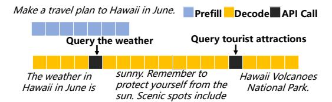

# **1 Introduction**

The widespread deployment of Large Language Models (LLMs) as cloud services, accessed via Web APIs, has catalyzed a new generation of powerful web applications. Meanwhile, LLMs are gradually evolving from language processors into intelligent agents (LLM Agents) capable of autonomous planning and task execution.

> **[图片提取文字 (无描述)]:**
> Make a travel plan to Hawaii in June. Prefill Decode API Call Query tourist attractions Query the weather sunny. Remember to The weather in Hawaii Volcanoes protect yourself from the Hawaii in June is National Park sun. Scenic spots include

**Figure 1: An example of an agentic inference workflow.**

These agents leverage external tools [\[10,](#page-9-0) [24](#page-9-1), [29](#page-9-2)] by programmatically issuing a series of **API calls** to web services and other resources, enabling them to accomplish more complex tasks, such as autonomously browsing the web [\[11,](#page-9-3) [46](#page-10-0), [51](#page-10-1)], solving issues on GitHub [\[16,](#page-9-4) [39,](#page-9-5) [44\]](#page-9-6), and proving challenging mathematical problems [\[9,](#page-9-7) [19](#page-9-8)].

The execution of these agentic tasks introduces a multi-stage inference workflow, which is structurally different from the process of traditional LLMs. A standard inference process involves two distinct stages: a compute-intensive **Prefill** stage that processes the input context in parallel, followed by a memory-bound **Decode** stage that generates tokens autoregressively. Throughout this process, the **key-value (KV) cache** is employed to store intermediate states, thereby accelerating the generation of subsequent tokens. However, an agent executes a more complex **agentic workflow** composed of multiple such inference processes, as illustrated in the example in Figure [1.](#page-0-0) When a user issues a request (e.g., "Make a travel plan to Hawaii in June."), the system executes the first inference process, which continues until the agent generates a special token to trigger an API call to query the weather. At this point, the LLM computation pauses, and the system enters an I/O wait state. Once the API returns a result (e.g.,"(The weather is) sunny."), this new information is appended to the context, and the process resumes with another Prefill and Decode cycle. This evolution from a single computational task into a dynamic, multi-stage workflow of alternating computation and external API calls introduces unprecedented challenges for the underlying service infrastructure, demanding a rethinking of how to schedule requests and manage resources for these advanced systems.

∗Corresponding author.

†Corresponding author.

This new agentic workflow exposes two flaws in existing LLM serving systems. First, current schedulers [\[22,](#page-9-9) [27\]](#page-9-10) are largely unaware to the duration of API calls, leading to severe Head-of-Line (HoL) blocking. These systems only focus on modeling the computation stages, for instance, 3 [[17](#page-9-11)] predicts decode length to improve GPU utilization and accelerate inference. However, in LLM Agent scenarios, decode time is often a negligible fraction of the request's total lifecycle. For example, an API call to SerpAPI for web search can last several seconds, while the decode phase is mere milliseconds. A scheduler which ignores dominant API duration cannot make effective resource allocation or scheduling decisions. Second, current systems like vLLM treat each segment of agentic workflow as an independent task. This approach optimizes for a local metric—the response time of the current segment—but fails to optimize the end-to-end Job Completion Time (JCT) for the entire multi-stage request. These dual shortcomings reveal a critical research gap and we need overcome two challenges to design a new paradigm filling this gap:

**Challenge 1:The High-Stakes Trade-off in State Management.** Agentic workflows introduce long I/O wait periods where the large KV cache remains idle on the GPU. This presents a critical resource management dilemma: preserving the cache in GPU memory reduces system throughput by occupying scarce resources, while discarding it incurs significant recomputation latency upon resumption. This creates an inherent trade-off between the single-request latency and system-wide throughput.

**Challenge 2: Lifecycle-Aware Scheduling for Global Optimization.**The local properties of a segment are severely decoupled from its global impact on the end-to-end JCT, as the latter is determined by future I/O phases. This disconnection introduces the risk of HoL blocking, where a decision to prioritize a seemingly optimal segment can starve other requests during a long API call duration, leading to disastrous global consequences.

To address the above challenges, we propose a novel scheduling paradigm, to unify a request's historical state with the prediction of its future behavior, and present Astraea, a lifecycle-centric inference service engine for LLM agentic workflows, which is to optimize the global Job Completion Time (JCT) rather than myopic per-segment metrics. Our main contributions are summarized as:

- We formalize the scheduling problem for LLM agent workflows and prove it to be NP-hard, providing a theoretical foundation for heuristic algorithm design (Sec. [3.1\)](#page-3-0).
- We design a novel state-aware hierarchical preemptive scheduling mechanism, named Astraea, which unifies historical workflow behavior and future predictions. At the macro level, requests are dynamically classified according to their computing and I/O characteristics; at the micro level, scheduling order is determined by a combination of the waiting time and predicted service duration, balancing efficiency and fairness (Sec. [4](#page-3-1)).
- We implement a prototype of Astraea based on the mainstream vLLM framework and experimentally demonstrate that, under heterogeneous workloads with mixed computing and I/O characteristics, Astraea reduces the average

job completion time (JCT) by up to 25.5% compared to baseline methods, significantly improving the quality of experience (QoE) for latency-sensitive interactive applications . Additionally, it exhibits superior robustness, with its performance degrading 3.2x less than baselines as system load increases (Sec. [5\)](#page-5-0).

