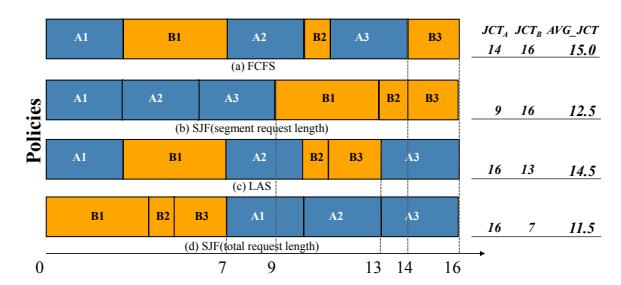

# **2.2 Motivation**

Although often designed to minimize end-to-end latency, traditional schedulers prove counterproductive in agentic workflows. By treating each computational segment as an independent task, they adopt a myopic perspective. While this may optimize local performance, it neglects the chained dependencies inherent in a

request's lifecycle, leading to suboptimal global performance and a decrease in overall system efficiency.

> **[图片提取文字 (无描述)]:**
> JCT, JCT, AVG JCT BI A2 **A3** B2 **B3** 16 15.0 (a) FCFS A3 B1 B2 A2 **B3 Policies** 9 16 12.5 (b) SJF(segment request length) B1 B2 **B3** A3 A2 16 13 14.5 (c) LAS BI B2 **B3** Al A2 **A3** 16 11.5 (d) SJF(total request length) 0 9 16 14

**Figure 2: Gantt charts visualizing the execution timelines for the two requests under the four scheduling policies.**

To illustrate this limitation, we present a motivating example with two concurrent requests, A and B, whose segment execution times are detailed in Figure [2.](#page-2-0) Request A consists of three segments, each requiring 3 time units to process. Request B is composed of three segments with processing times of 4, 1, and 2 time units, respectively. We compare the performance of four scheduling policies in this scenario:

- **First-Come-First-Served (FCFS):** A baseline policy that executes segments strictly by their arrival order. In this example, its arbitrary initial choice (prioritizing A1 over B1) creates a cascading delay for B's subsequent segments due to the chained dependencies of agentic workflow, resulting in a poor average JCT of 15.0.
- **Shortest-Job-First (SJF) at the segment level:** A myopic policy that always selects the ready segment with the shortest processing time. While this strategy rapidly completes all of Request A's short segments, achieving an excellent local JCT of 9.0 for A, it completely starves the longer Request B until A finishes, resulting in a bad JCT of 16.0 for B and a mediocre average JCT of 12.5.
- **Least-Attained-Service (LAS):** A fairness-oriented policy that prioritizes the request which has received the least cumulative service. It interleaves A and B, but fails to recognize that prioritizing B's short final segments (B2, B3) would be more globally efficient, resulting in a high average JCT of 14.5.
- **Shortest-Job-First (SJF) at the request level:** An oracle policy that prioritizes the request with the shortest total service time, representing the optimum. It intelligently prioritizes the completion of the shorter Request B first, thereby minimizing the average JCT to 11.5.

The analysis reveals that while traditional scheduling policies possess distinct merits, such as the simplicity and starvation-free guarantee of FCFS, the inter-request fairness of LAS and the proven effectiveness of segment-level SJF's greedy optimization in oneshot inference, their shared inability to model the multi-stage leads to severe cascading delays or HoL blocking. In this work, we propose Astraea, a state-aware scheduling engine designed to transcend these limitations. By unifying historical context with predictive forecasting, Astraea approximates the benefits of a global, lifecycle-oriented perspective in an online setting.

### 3 System Model and Problem Formalization

To address the scheduling challenges of alternating "compute-I/O" execution in LLM agent inference, this section will first formally models the agentic execution workflow and then defines the scheduling objectives.

#### 3.1 Problem Formalization

LLM agents accomplish complex tasks through using external tools, making their execution inherently multi-stage. We define an end-to-end inference task initiated by a user as a *parent request* (or complete request), denoted as  $R_i$ . Its execution process is not a single computational process but a dynamic, multi-stage workflow composed of several segments. We formally represent the lifecycle of  $R_i$  as an ordered sequence of segmented requests:

$$R_i = \langle S_i^1, S_i^2, \dots, S_i^k \rangle$$

where  $k_i$  is the total number of segments in request  $R_i$ , which is unknown upon the request's initial arrival.

The internal execution flow of each segmented request  $S_i^J$  can be further abstracted into three ordered stages with distinct resource consumption characteristics:

- Prefill Stage: This stage is responsible for a parallel Attention computation on the current context to generate the initial KV cache. Its execution speed is primarily limited by the GPU's floating-point operations per second (FLOPS). Therefore, we classify this stage as Compute-bound.
- Decoding Stage: This stage generates tokens one by one in an autoregressive manner. Its execution speed is mainly limited by the GPU's memory bandwidth. We classify this stage as Memory-bound.
- API Call Stage: This stage involves interaction with external network services, during which local compute and memory resources remain idle. We classify this stage as I/O-bound.

To formally model the segmented request  $S_i^l$ , we represent it as a triplet, where each element represents the expected service time cost of the corresponding stage:

$$S_i^j = (T(P_i^j), T(D_i^j), T(A_i^j)).$$

The alternating presence of different resource bottlenecks within a request's lifecycle is the core challenge of this scheduling problem. Traditional schedulers typically treat each ready computational task (i.e., segment  $S_i^j$ ) as an independent, stateless scheduling unit, which systematically penalizes requests with multiple I/O interruptions.

The core scheduling objective of this research is defined as minimizing the average end-to-end Job Completion Time (JCT) for all requests. We define the JCT of a complete request  $R_i$  as the total duration from its arrival time,  $t_{\rm arrival}(R_i)$ , to the completion of its final segment's computation,  $t_{\rm finish}(R_i)$ . This duration is composed of the actual processing time of all its segments and the waiting time in the ready queue. Let  $C(S_i^j)$  be the completion time of segment  $S_i^j$ , then  $t_{\rm finish}(R_i) = C(S_i^k)$ . The completion time of a segment can be recursively defined as:

$$C(S_i^j) = \begin{cases} t_{\text{arrival}}(R_i) + W(S_i^1) + T_{\text{comp}}(S_i^1) & \text{if } j = 1\\ C(S_i^{j-1}) + T(A_i^{j-1}) + W(S_i^j) + T_{\text{comp}}(S_i^j) & \text{if } j > 1 \end{cases}, (1)$$

where  $T_{\text{comp}}(S_i^J)$  and  $T(A_i^J)$  represent the actual time spent in the computation stages (prefill and decoding) and the API call stage of segment  $S_i^J$ , respectively.  $W(S_i^J)$  is the waiting time of the segment in the ready queue before being scheduled for execution. Thus, the JCT of request  $R_i$  can be expressed as:

$$JCT(R_i) = C(S_i^k) - t_{\text{arrival}}(R_i) = \sum_{j=1}^k \left( W(S_i^j) + T_{\text{comp}}(S_i^j) \right) + \sum_{j=1}^{k-1} T(A_i^j),$$
(2)

the problem's optimization objective can be formally defined as:

Minimize 
$$\frac{1}{|\mathcal{R}|} \sum_{R_i \in \mathcal{R}} \text{JCT}(R_i),$$
 (3)

where  $\mathcal{R}$  represents the set of all requests processed by the system.

### 3.2 Problem Complexity

We prove that the scheduling problem defined in Section 3.1 is NP-hard.

**Theorem 3.1.** The LLM agent scheduling problem is NP-hard.

PROOF. The detailed proof by reduction from the classic  $1|prec|\sum C_i$  problem is provided in Appendix A.

