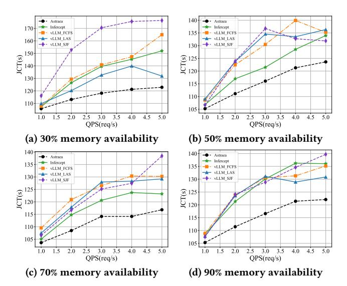
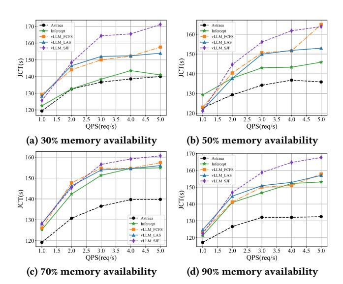
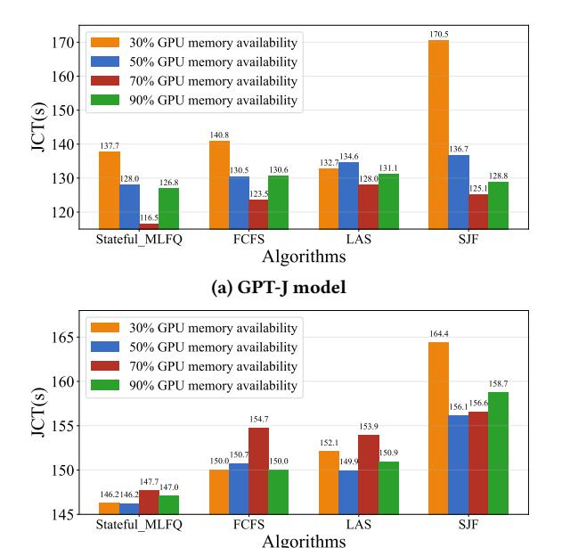

# **5.1 Experimental Setup**

*Testbed Implementation.* We implemented the Astraea system on top of vLLM, retaining its high-efficiency inference architecture while improving upon its original KV Cache management. Astraea introduces a dynamic scheduling policy based on GPU memory utilization. When memory availability is sufficient, the system prioritizes reducing request latency by enforcing the "Preserve" policy to ensure a fast response. Conversely, when memory resources become scarce, the system automatically adjusts its policy to prioritize maximizing overall resource utilization, employing the "Discard" and "Swap" strategies to balance memory occupation and system throughput. Our improvements in memory management and scheduling are highly modular, allowing for seamless integration with other non-interfering LLM optimization methods.

*Environment.* The experiments were conducted on a machine equipped with two NVIDIA A100 80GB GPUs connected via NVLink, a 28-core Intel Xeon Gold 6330 CPU at 2.0GHz, and 503GB of RAM. To evaluate the generality and robustness of the proposed algorithm across different model scales, we conducted experiments on two open-source large models: the 6B-parameter GPT-J [\[40\]](#page-9-18) and Vicuna-13B[[49\]](#page-10-4). GPT-J was run on a single A100, suitable for medium inference load scenarios, while Vicuna-13B was run in a multi-GPU environment with two A100s to create higher memory pressure scenarios, testing the policy's performance under complex resource contention conditions.

Dataset. We used the dataset released by Infercept for our experiments. This dataset comprises six sub-tasks:

- Arithmetic Operations: Based on the GSM8K-XL dataset [13], covering math problems that require multi-step reasoning.
- Knowledge Question Answering: Based on the Multi-Hop QA dataset [45], representing knowledge base retrieval requests.
- Virtual Environment: Based on the ALFWorld dataset [35], simulating an LLM controlling entities in a virtual environment to complete tasks.
- Multi-turn Dialogue: Based on the ShareGPT dataset [5], simulating multi-turn human interactions.
- Image Generation: Using ChatGPT [42] to automatically generate prompt sequences that trigger calls to the Stable Diffusion model [31].
- **Text-to-Speech:** Using ChatGPT to generate prompt sequences that trigger calls to the Bark TTS model [3].

The original dataset was uniformly sampled from these six task types. However, to better highlight the performance differences among various scheduling and memory policies, we artificially increased the sampling proportion of long-latency API requests in our experiments to construct a more challenging system load.

Baseline Methods. Our experiments will compare Astraea with the following four different policies: (1) vLLM with FCFS (First-Come-First-Served) scheduling; (2) vLLM with SJF (Shortest Job First) scheduling; (3) vLLM with LAS (Least Attained Service) scheduling, which is the core scheduling idea adopted by Autellix [25]; and (4) Infercept (with its default FCFS policy).

Metrics. Our primary evaluation metric is the average Job Completion Time (JCT), which measures the end-to-end latency from request submission to final completion. Unlike intermediate metrics like Time-To-First-Token (TTFT) or Time-Per-Output-Token (TPOT), JCT provides a holistic measure of system performance and user experience for multi-stage agentic workflows.

#### 5.2 End-to-End Performance Analysis

We conducted a series of experiments on both the 6B-parameter GPT-J model and the larger 13B-parameter Vicuna model. To evaluate performance under varying system load and memory pressure, we measured the average JCT across a range of Queries Per Second (QPS) at four distinct GPU memory availability levels: 30%, 50%, 70%, and 90%. The results for both models are presented in Figure 4 and Figure 5.

On the GPT-J model (Figures 4), Astraea outperforms all baseline methods. The performance advantage is most pronounced under high memory pressure (30% and 50% availability). In the most contentious scenario with 30% memory availability, the JCT of all baseline methods rises sharply with increasing QPS, indicating severe performance degradation. In contrast, Astraea's performance curve remains flatter, demonstrating its superior stability. For example, at QPS=5, Astraea's JCT is 122.88s, which is 19.1% lower than Infercept and 25.5% lower than vLLM-FCFS.

This performance advantage is even more critical on the larger Vicuna-13B model, where the higher memory footprint of the model

> **[图片提取文字 (无描述)]:**
> Astraca Astraca - Infercept Infercept 170 VLLM FCFS VLLM FCFS ★ vLLM LAS vLLM LAS 160 · vLLM SJF -- vLLM\_SJF 130 © 150 140 © 125 D 120 130 115 120 110 110 105 2.0 2.5 3.0 3.5 4.0 4.5 1.5 2.0 2.5 3.0 3.5 1.5 4.0 QPS(req/s) QPS(req/s) (a) 30% memory availability (b) 50% memory availability 140 140 Astraca - Infercent - Infercept · vLLM FCFS VLLM FCFS ★ VLLM LAS ★ VLLM\_LAS 130 vLLM SJF → vLLM SJF (S) 125) © 125 LO 120 115 115 110 110 105 105 3.0 3.5 2.5 3.0 3.5 1.5 2.0 2.5 4.0 4.5 1.5 2.0 4.0 4.5 5.0 QPS(req/s) QPS(reg/s) (c) 70% memory availability (d) 90% memory availability

Figure 4: Comparison of average JCT of various scheduling policies on the GPT-J model.

> **[图片提取文字 (无描述)]:**
> Astraca 170 Infercent Infercept VLLM FCFS VLLM FCFS VLLM LAS - vLLM LAS 160 → vLLM SJF -- vLLM SJF 150 (S) 150 E) 140 JCT(s) 140 130 130 120 120 3.0 3.5 2.5 3.0 3.5 1.5 2.0 2.5 4.0 4.5 1.5 2.0 4.0 4.5 QPS(req/s) QPS(req/s) (a) 30% memory availability (b) 50% memory availability 160 Astraca - Infercept VLLM FCFS → vLLM LAS 150 -- vLLM SJF 150 JCT(s) JCT(s) 140 Astraca 130 130 Infercept VLLM FCFS VLLM\_LAS 120 120 vLLM SJF 1.5 2.0 2.5 3.0 3.5 4.0 4.5 5.0 1.5 2.0 2.5 3.0 3.5 4.0 4.5 5.0 QPS(req/s) QPS(req/s) (c) 70% memory availability (d) 90% memory availability

Figure 5: Comparison of average JCT of various scheduling policies on the Vicuna-13B model.

itself intensifies resource contention. As shown in Figures 5, the performance degradation of baseline methods under memory pressure is more severe. At 30% memory availability and a high load of QPS=5, Astraea achieves a JCT of 140.02s. This is a significant improvement over vLLM-SJF (171.16s) and vLLM-LAS (153.96s), showcasing Astraea's robustness when scheduling for larger models. Even in the high-availability 90% memory scenario, Astraea's JCT at QPS=5 (132.53s) is 13.4% and 16.0% lower than Infercept and vLLM-FCFS, respectively.

In summary, the results across both models validate our state-aware scheduling and adaptive cache management are effective. The benefits of Astraea are particularly magnified in challenging, resource-constrained environments and on larger-scale models, which are representative of real-world production scenarios.

### 5.3 Ablation Study

To further dissect the sources of Astraea's performance advantages, we designed an ablation study to isolate the contribution of our core Stateful-MLFQ scheduling algorithm from the adaptive KV cache management policy. To achieve this, we deployed Stateful-MLFQ and all baseline scheduling algorithms on top of the native vLLM framework, which uses a PagedAttention memory manager without cache swapping or discarding.

> **[图片提取文字 (无描述)]:**
> 170.5 170 30% GPU memory availability 50% GPU memory availability 160 70% GPU memory availability 90% GPU memory availability 150 140.8 140 137.7 136.7 132.7 131.1 130.5 130.6 130 128.8 128.0 128.0 126.8 125.1 123.5 120 116.5 Stateful MLFQ **FCFS** LAS SJF Algorithms (a) GPT-J model 30% GPU memory availability 165 164.4 50% GPU memory availability 70% GPU memory availability 160 158.7 90% GPU memory availability 156.1 156.6 154.7 155 153.9 152.1 150.0\_150.7 150.9 150.0 149.9 150 146.2146.2 145 Stateful MLFQ **FCFS** LAS SJF Algorithms

Figure 6: Ablation study comparing the performance of different scheduling algorithms on the (a) GPT-J and (b) Vicuna-13B models at a fixed load of OPS=3.

(b) Vicuna-13B model

The results at a fixed system load of QPS=3 are shown in Figure 6. On the GPT-J model (Figure 6a), Stateful-MLFQ demonstrates the best performance across all memory configurations. Its advantage is particularly evident under high memory pressure. For instance, at 30% memory availability, Stateful-MLFQ's JCT of 137.66s is 2.3% lower than FCFS, and a significant 19.3% lower than SJF. This shows that even without our adaptive cache manager, the lifecycle-aware scheduling logic can effectively mitigate queuing delay and head-of-line blocking.

We further validated the algorithm's effectiveness on the larger Vicuna-13B model (Figure 6b). In the most memory-constrained (30%) scenario, Stateful-MLFQ's average JCT was 146.24s, yielding performance improvements of 2.5%, 3.8%, and 11.0% compared to FCFS, LAS, and SJF, respectively. This result confirms the robust advantage of our state-aware scheduling policy under high memory pressure on large-scale models. In summary, the ablation study proves that Stateful-MLFQ is a potent scheduling algorithm in its own right, exhibiting good generality and stability across different models and resource configurations.

### 5.4 Sensitivity, Overhead, and Stability

We conducted further analyses to evaluate the robustness of our hyperparameter choices and the practical overhead of our system. A parameter sensitivity study confirmed that our default-chosen thresholds for both the aging mechanism and the MLFQ token costs are effective and near-optimal. Furthermore, we quantified the computational overhead of the Astraea scheduler, finding it to be negligible, accounting for only 0.0006% of the average JCT in a high-load scenario.

We also analyzed system stability by measuring the degradation of JCT as QPS increases. Under high memory pressure (30% availability), the JCT of baseline methods like vLLM-SJF increased by as much as 51.9% when moving from low to high load, whereas Astraea's JCT increased by only 16.2%. This demonstrates Astraea's superior stability and robustness in contentious environments. The detailed results and corresponding figures for these analyses are provided in Appendix B and C.

### 6 Related Work

The optimization of LLM inference serving is a rapidly evolving field. Our work is positioned within the emerging domain of advanced scheduling for multi-stage agentic workflows, establishing a distinct research direction that differs from prior work in memory and batching optimizations and scheduling for one-shot queries.

Memory and Batching Optimizations. A lot of research aims to mitigate the large KV cache overhead to improve GPU throughput. Innovations in memory management, such as vLLM's PagedAttention [20], LightLLM's token-level management [26], and S3's pre-allocation scheme [18], focus on finer-grained control. Other approaches include OLLA [36], which optimizes array lifetime and location to cut memory usage without model changes, and FlashAttention [8], an IO-aware exact attention algorithm that reduces memory reads/writes for faster training and longer sequences. Concurrently, advanced batching techniques like ORCA's continuous batching [48] and the split-and-merge in Sarathi [2] and DeepSpeed-FastGen [14] optimize request grouping. Batching innovations also cover DVABatch [7], introducing diversity-aware multi-entry multiexit batching for DNN serving, and FlexGen [34], enabling highthroughput LLM inference on a single GPU via memory aggregation and compression. While foundational, these methods mainly optimize individual computational segments and not the inter segment scheduling in agentic workflows with long I/O phases.

Scheduling Policies. Another line of work focuses on scheduling policies. For single-request optimization, FastServe [43] uses job-level preemption to prioritize short queries. REEF [12] achieves microsecond-scale preemption for low-latency GPU-accelerated DNN inference. In multi-tenant scenarios, VTC [33] employs a cost function to ensure fairness. Other directions include disaggregation, with systems like Splitwise [28], TetriInfer [15], and Dist-Serve [50] separating prefill and decode stages for better load balancing. Model parallelism is leveraged by AlpaServe [23] for statistical multiplexing, improving latency under bursty workloads. Llumnix [37] introduces dynamic scheduling to handle heterogeneous requests and tail latencies. However, these schedulers target traditional, one-shot LLM queries. Infercept [1] and LAMPS [32]

pioneer offloading KV cache during I/O waits to improve memory utilization. Autellix[[25\]](#page-9-26) first proposed a request-level scheduling policy (LAS) for agentic tasks. In contrast to Autellix's retrospective policy, Astraea is the first to introduce proactive scheduling that leverages predictions of both compute and I/O durations to optimize for the global JCT.

