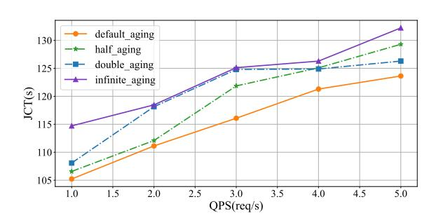
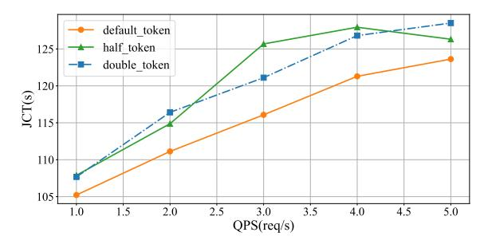

# **References**

- [1] Reyna Abhyankar, Zijian He, Vikranth Srivatsa, Hao Zhang, and Yiying Zhang. Infercept: efficient intercept support for augmented large language model inference. In *Proceedings of the 41st International Conference on Machine Learning*, pages 81–95, 2024.
- [2] Amey Agrawal, Nitin Kedia, Ashish Panwar, Jayashree Mohan, Nipun Kwatra, Bhargav Gulavani, Alexey Tumanov, and Ramachandran Ramjee. Taming {Throughput-Latency} tradeoff in {LLM} inference with {Sarathi-Serve}. In *18th USENIX Symposium on Operating Systems Design and Implementation (OSDI 24)*, pages 117–134, 2024.
- [3] Suno AI. Bark: text-to-speech model, 2023. [Accessed: Sep. 28, 2025].
- [4] Yuntao Bai, Saurav Kadavath, Sandipan Kundu, Amanda Askell, Jackson Kernion, Andy Jones, Anna Chen, Anna Goldie, Azalia Mirhoseini, Cameron McKinnon, et al. Constitutional ai: Harmlessness from ai feedback. *arXiv preprint arXiv:2212.08073*, 2022.
- [5] Lin Chen, Jinsong Li, Xiaoyi Dong, Pan Zhang, Conghui He, Jiaqi Wang, Feng Zhao, and Dahua Lin. Sharegpt4v: Improving large multi-modal models with better captions. In *European Conference on Computer Vision*, pages 370–387. Springer, 2024.
- [6] Lu Chen, Zhi Chen, Bowen Tan, Sishan Long, Milica Gašić, and Kai Yu. Agentgraph: Toward universal dialogue management with structured deep reinforcement learning. *IEEE/ACM Transactions on Audio, Speech, and Language Processing*, 27(9):1378–1391, 2019.
- [7] Weihao Cui, Han Zhao, Quan Chen, Hao Wei, Zirui Li, Deze Zeng, Chao Li, and Minyi Guo. {DVABatch}: Diversity-aware {Multi-Entry}{Multi-Exit} batching for efficient processing of {DNN} services on {GPUs}. In *2022 USENIX Annual Technical Conference (USENIX ATC 22)*, pages 183–198, 2022.
- [8] Tri Dao, Dan Fu, Stefano Ermon, Atri Rudra, and Christopher Ré. Flashattention: Fast and memory-efficient exact attention with io-awareness. *Advances in neural information processing systems*, 35:16344–16359, 2022.
- [9] Google DeepMind. Ai achieves silver-medal standard solving international mathematical olympiad problems, 2024. [Accessed: Nov. 18, 2024].
- [10] Luyu Gao, Aman Madaan, Shuyan Zhou, Uri Alon, Pengfei Liu, Yiming Yang, Jamie Callan, and Graham Neubig. Pal: Program-aided language models. In *International Conference on Machine Learning*, pages 10764–10799. PMLR, 2023.
- [11] Izzeddin Gur, Hiroki Furuta, Austin V Huang, Mustafa Safdari, Yutaka Matsuo, Douglas Eck, and Aleksandra Faust. A real-world webagent with planning, long context understanding, and program synthesis. In *The Twelfth International Conference on Learning Representations*, 2024.
- [12] Mingcong Han, Hanze Zhang, Rong Chen, and Haibo Chen. Microsecond-scale preemption for concurrent {GPU-accelerated}{DNN} inferences. In *16th USENIX Symposium on Operating Systems Design and Implementation (OSDI 22)*, pages 539–558, 2022.
- [13] Shibo Hao, Tianyang Liu, Zhen Wang, and Zhiting Hu. Toolkengpt: Augmenting frozen language models with massive tools via tool embeddings. *Advances in neural information processing systems*, 36:45870–45894, 2023.
- [14] Connor Holmes, Masahiro Tanaka, Michael Wyatt, Ammar Ahmad Awan, Jeff Rasley, Samyam Rajbhandari, Reza Yazdani Aminabadi, Heyang Qin, Arash Bakhtiari, Lev Kurilenko, et al. Deepspeed-fastgen: High-throughput text generation for llms via mii and deepspeed-inference. *arXiv preprint arXiv:2401.08671*, 2024.
- [15] Cunchen Hu, Heyang Huang, Liangliang Xu, Xusheng Chen, Jiang Xu, Shuang Chen, Hao Feng, Chenxi Wang, Sa Wang, Yungang Bao, et al. Inference without interference: Disaggregate llm inference for mixed downstream workloads. *arXiv preprint arXiv:2401.11181*, 2024.
- [16] Carlos E Jimenez, John Yang, Alexander Wettig, Shunyu Yao, Kexin Pei, Ofir Press, and Karthik Narasimhan. Swe-bench: Can language models resolve realworld github issues? In *12th International Conference on Learning Representations, ICLR 2024*, 2024.
- [17] Yunho Jin, Chun-Feng Wu, David Brooks, and Gu-Yeon Wei. ^3: Increasing gpu utilization during generative inference for higher throughput. *Advances in Neural Information Processing Systems*, 36:18015–18027, 2023.
- [18] Yunho Jin, Chun-Feng Wu, David Brooks, and Gu-Yeon Wei. ^3: Increasing gpu utilization during generative inference for higher throughput. *Advances in Neural Information Processing Systems*, 36:18015–18027, 2023.
- [19] Adarsh Kumarappan, Mo Tiwari, Peiyang Song, Robert Joseph George, Chaowei Xiao, and Anima Anandkumar. Leanagent: Lifelong learning for formal theorem proving. In *The Thirteenth International Conference on Learning Representations*, 2025.
- [20] Woosuk Kwon, Zhuohan Li, Siyuan Zhuang, Ying Sheng, Lianmin Zheng, Cody Hao Yu, Joseph Gonzalez, Hao Zhang, and Ion Stoica. Efficient memory management for large language model serving with pagedattention. In *Proceedings of the 29th symposium on operating systems principles*, pages 611–626, 2023.
- [21] LangChain. Langchain, 2023. [Accessed: Sep. 28, 2025].
- [22] Zhuohan Li, Lianmin Zheng, Yinmin Zhong, Vincent Liu, Ying Sheng, Xin Jin, Yanping Huang, Zhifeng Chen, Hao Zhang, Joseph E Gonzalez, et al. {AlpaServe}: Statistical multiplexing with model parallelism for deep learning

- serving. In *17th USENIX Symposium on Operating Systems Design and Implementation (OSDI 23)*, pages 663–679, 2023.
- [23] Zhuohan Li, Lianmin Zheng, Yinmin Zhong, Vincent Liu, Ying Sheng, Xin Jin, Yanping Huang, Zhifeng Chen, Hao Zhang, Joseph E Gonzalez, et al. {AlpaServe}: Statistical multiplexing with model parallelism for deep learning serving. In *17th USENIX Symposium on Operating Systems Design and Implementation (OSDI 23)*, pages 663–679, 2023.
- [24] Ruibo Liu, Jason Wei, Shixiang Shane Gu, Te-Yen Wu, Soroush Vosoughi, Claire Cui, Denny Zhou, and Andrew M Dai. Mind's eye: Grounded language model reasoning through simulation. *arXiv preprint arXiv:2210.05359*, 2022.
- [25] Michael Luo, Xiaoxiang Shi, Colin Cai, Tianjun Zhang, Justin Wong, Yichuan Wang, Chi Wang, Yanping Huang, Zhifeng Chen, Joseph E Gonzalez, et al. Autellix: An efficient serving engine for llm agents as general programs. *arXiv preprint arXiv:2502.13965*, 2025.
- [26] ModelTC. Lightllm, 2024. [Accessed: Sep. 28, 2025].
- [27] NVIDIA. Fastertransformer, 2023. [Accessed: Sep. 28, 2025].
- [28] Pratyush Patel, Esha Choukse, Chaojie Zhang, Aashaka Shah, Íñigo Goiri, Saeed Maleki, and Ricardo Bianchini. Splitwise: Efficient generative llm inference using phase splitting. In *2024 ACM/IEEE 51st Annual International Symposium on Computer Architecture (ISCA)*, pages 118–132. IEEE, 2024.
- [29] Ofir Press, Muru Zhang, Sewon Min, Ludwig Schmidt, Noah A Smith, and Mike Lewis. Measuring and narrowing the compositionality gap in language models. *arXiv preprint arXiv:2210.03350*, 2022.
- [30] Alec Radford, Karthik Narasimhan, Tim Salimans, Ilya Sutskever, et al. Improving language understanding by generative pre-training. Technical report, OpenAI, 2018.
- [31] Robin Rombach, Andreas Blattmann, Dominik Lorenz, Patrick Esser, and Björn Ommer. High-resolution image synthesis with latent diffusion models. In *Proceedings of the IEEE/CVF conference on computer vision and pattern recognition*, pages 10684–10695, 2022.
- [32] Rana Shahout, Cong Liang, Shiji Xin, Qianru Lao, Yong Cui, Minlan Yu, and Michael Mitzenmacher. Fast inference for augmented large language models. *arXiv preprint arXiv:2410.18248*, 2024.
- [33] Ying Sheng, Shiyi Cao, Dacheng Li, Banghua Zhu, Zhuohan Li, Danyang Zhuo, Joseph E Gonzalez, and Ion Stoica. Fairness in serving large language models. In *18th USENIX Symposium on Operating Systems Design and Implementation (OSDI 24)*, pages 965–988, 2024.
- [34] Ying Sheng, Lianmin Zheng, Binhang Yuan, Zhuohan Li, Max Ryabinin, Beidi Chen, Percy Liang, Christopher Ré, Ion Stoica, and Ce Zhang. Flexgen: Highthroughput generative inference of large language models with a single gpu. In *International Conference on Machine Learning*, pages 31094–31116. PMLR, 2023.
- [35] Mohit Shridhar, Xingdi Yuan, Marc-Alexandre Cote, Yonatan Bisk, Adam Trischler, and Matthew Hausknecht. Alfworld: Aligning text and embodied environments for interactive learning. In *International Conference on Learning Representations*, 2018.
- [36] Benoit Steiner, Mostafa Elhoushi, Jacob Kahn, and James Hegarty. Olla: Optimizing the lifetime and location of arrays to reduce the memory usage of neural networks. *arXiv preprint arXiv:2210.12924*, 2022.
- [37] Biao Sun, Ziming Huang, Hanyu Zhao, Wencong Xiao, Xinyi Zhang, Yong Li, and Wei Lin. Llumnix: Dynamic scheduling for large language model serving. In *18th USENIX symposium on operating systems design and implementation (OSDI 24)*, pages 173–191, 2024.
- [38] Hugo Touvron, Thibaut Lavril, Gautier Izacard, Xavier Martinet, Marie-Anne Lachaux, Timothée Lacroix, Baptiste Rozière, Naman Goyal, Eric Hambro, Faisal Azhar, et al. Llama: Open and efficient foundation language models. *arXiv preprint arXiv:2302.13971*, 2023.
- [39] Xingyao Wang, Boxuan Li, Yufan Song, Frank F Xu, Xiangru Tang, Mingchen Zhuge, Jiayi Pan, Yueqi Song, Bowen Li, Jaskirat Singh, et al. Openhands: An open platform for ai software developers as generalist agents. In *The Thirteenth International Conference on Learning Representations*, 2025.
- [40] Komatsuzaki A Wang B. Gpt-j-6b: a 6 billion parameter autoregressive language model, 2021. [Accessed: Sep. 28, 2025].
- [41] Jason Wei, Xuezhi Wang, Dale Schuurmans, Maarten Bosma, Fei Xia, Ed Chi, Quoc V Le, Denny Zhou, et al. Chain-of-thought prompting elicits reasoning in large language models. *Advances in neural information processing systems*, 35:24824–24837, 2022.
- [42] Philip Welsby and Bernard MY Cheung. Chatgpt, 2023.
- [43] Bingyang Wu, Yinmin Zhong, Zili Zhang, Shengyu Liu, Fangyue Liu, Yuanhang Sun, Gang Huang, Xuanzhe Liu, and Xin Jin. Fast distributed inference serving for large language models. *arXiv preprint arXiv:2305.05920*, 2023.
- [44] John Yang, Carlos E Jimenez, Alexander Wettig, Kilian Lieret, Shunyu Yao, Karthik Narasimhan, and Ofir Press. Swe-agent: Agent-computer interfaces enable automated software engineering. *Advances in Neural Information Processing Systems*, 37:50528–50652, 2024.
- [45] Zhilin Yang, Peng Qi, Saizheng Zhang, Yoshua Bengio, William Cohen, Ruslan Salakhutdinov, and Christopher D Manning. Hotpotqa: A dataset for diverse, explainable multi-hop question answering. In *Proceedings of the 2018 Conference*

-  on Empirical Methods in Natural Language Processing, pages 2369–2380, 2018.
   [46] Shunyu Yao, Howard Chen, John Yang, and Karthik Narasimhan. Webshop: Towards scalable real-world web interaction with grounded language agents. Advances in Neural Information Processing Systems, 35:20744–20757, 2022.
- [47] Shunyu Yao, Jeffrey Zhao, Dian Yu, Nan Du, Izhak Shafran, Karthik Narasimhan, and Yuan Cao. React: Synergizing reasoning and acting in language models. In International Conference on Learning Representations (ICLR), 2023.
- [48] Gyeong-In Yu, Joo Seong Jeong, Geon-Woo Kim, Soojeong Kim, and Byung-Gon Chun. Orca: A distributed serving system for {Transformer-Based} generative models. In 16th USENIX Symposium on Operating Systems Design and Implementation (OSDI 22), pages 521–538, 2022.
- [49] Lianmin Zheng, Wei-Lin Chiang, Ying Sheng, Siyuan Zhuang, Zhanghao Wu, Yonghao Zhuang, Zi Lin, Zhuohan Li, Dacheng Li, Eric Xing, et al. Judging Ilmas-a-judge with mt-bench and chatbot arena. Advances in neural information processing systems, 36:46595–46623, 2023.
- [50] Yinmin Zhong, Shengyu Liu, Junda Chen, Jianbo Hu, Yibo Zhu, Xuanzhe Liu, Xin Jin, and Hao Zhang. {DistServe}: Disaggregating prefill and decoding for goodput-optimized large language model serving. In 18th USENIX Symposium on Operating Systems Design and Implementation (OSDI 24), pages 193–210, 2024.
- [51] Shuyan Zhou, Frank F Xu, Hao Zhu, Xuhui Zhou, Robert Lo, Abishek Sridhar, Xianyi Cheng, Tianyue Ou, Yonatan Bisk, Daniel Fried, et al. Webarena: A realistic web environment for building autonomous agents. In *The Twelfth International* Conference on Learning Representations, 2024.

### A Problem Complexity

We prove that the scheduling problem is NP-hard by reduction from the classic NP-hard problem of minimizing the total completion time on a single machine with precedence constraints, denoted as  $1|prec|\sum C_i$ .

PROOF. An instance of  $1|prec|\sum C_j$  consists of a set of jobs  $J = \{J_1, J_2, ..., J_n\}$ , where each job  $J_k$  has a processing time  $p_k$ , and a precedence relation prec.

Given an arbitrary instance of  $1|prec|\sum C_j$ , we construct an instance of our LLM agent scheduling problem as follows. We consider a simplified version of our problem where the batch size is one, meaning the GPU can only process one computational segment at a time.

- (1) **Decomposition**: First, we decompose the precedence graph of jobs into a set of disjoint chains (e.g.,  $J_a \rightarrow J_b \rightarrow J_c$ ) and isolated jobs (e.g.,  $J_d$ ).
- (2) Mapping Construction:
  - For each chain of jobs, like Ja → Jb → Jc, we create
    a single parent request Ri composed of a sequence of
    segments ⟨Si1, Si2, Si3⟩.
  - For each isolated job  $J_d$ , we create a single-segment request  $R_i = \langle S_i^1 \rangle$ .
- (3) Service Time Assignment: The processing time pk of each job Jk is mapped to the computational service time of its corresponding segment Sk. For the purpose of this reduction, we assume the API call time for all constructed segments is zero. Specifically:
  - For the request  $R_i$  derived from the chain  $J_a \to J_b \to J_c$ , we set:  $T_{comp}(S_i^1) = p_a$  and  $T(A_i^1) = 0$ ;  $T_{comp}(S_i^2) = p_b$  and  $T(A_i^2) = 0$ ; and so on.
  - For the request  $R_j$  derived from the isolated job  $J_d$ , we set  $T_{comp}(S_j^1) = p_d$  and  $T(A_j^1) = 0$ .

This construction is completed in polynomial time. By setting the API call times to zero, the dependency between segments  $S_i^j$  and  $S_i^{j+1}$  becomes an immediate precedence constraint that perfectly mimics the  $J_k \to J_l$  relationship in the original problem. A

valid schedule for the constructed requests is thus a permutation of the computational tasks  $\{T_{comp}(S_1), ..., T_{comp}(S_n)\}$  that respects the intra-request ordering, which directly corresponds to a valid schedule for the jobs  $\{J_1, ..., J_n\}$ .

The completion time of a job  $J_k$  ( $C_k$ ) is equivalent to the completion time of the computational part of its corresponding segment  $S_k$ . Therefore, minimizing the sum of job completion times  $\sum C_k$  is equivalent to minimizing the sum of segment completion times. As minimizing the total (or average) Job Completion Time (JCT) of all requests requires minimizing the sum of its underlying segment completion times, a solution to our problem provides a solution to the  $1|prec|\sum C_i$  problem.

Since an arbitrary instance of the NP-hard problem  $1|prec|\sum C_j$  can be reduced in polynomial time to a special case of our LLM agent scheduling problem (where batch size is 1 and API times are 0), our general problem is also NP-hard.

### **B** Parameter Sensitivity Analysis

To validate the rationality and robustness of the key hyperparameter choices in our proposed method, this section conducts a sensitivity analysis on the aging threshold and the queue cost thresholds. All experiments were performed on the GPT-J model with 50% memory availability.

### **B.1** Analysis of Aging Threshold

The aging mechanism is key to ensuring fairness in the Stateful-MLFQ algorithm. To investigate the impact of its core parameter, the aging threshold, we conducted a series of sensitivity experiments, setting the threshold (response ratio) to its default value of 5, a halved value of 2.5, a doubled value of 10, and infinity (disabling the mechanism). The results in Figure 7 show that disabling the aging mechanism performed the worst at all tested QPS loads, with its JCT being up to 7% higher than the default configuration. This confirms the critical role of the anti-starvation mechanism. Furthermore, the results show that halving or doubling the threshold from the default value both led to an increase in average JCT, proving that an optimal parameter range exists.

> **[图片提取文字 (无描述)]:**
> default\_aging 130 half\_aging double\_aging 125 infinite\_aging (S) 120-115 110 105 5.0 1.0 1.5 2.0 2.5 3.0 3.5 4.0 4.5 QPS(req/s)

Figure 7: Impact of the aging threshold on performance under different system loads.

### **B.2** Analysis of Queue Cost Thresholds

In the Stateful-MLFQ algorithm, queue migration thresholds are determined by the computational cost (token count) of a segment. The default thresholds for the six queues were set to [128, 256,

384, 512, 640]. To examine the sensitivity of this parameter, we halved and doubled the thresholds while keeping other configurations constant. The results in Figure 8 show that the default configuration maintained optimal performance across all loads. Setting the thresholds too low caused medium-length segments to be demoted prematurely, while setting them too high weakened the protection for I/O-intensive requests.

> **[图片提取文字 (无描述)]:**
> default token half token 125 double\_token 120 JCT(s) 115 110 105 3.0 QPS(req/s) 1.5 5.0 2.0 2.5 3.5 4.0 4.5 1.0

Figure 8: Impact of queue cost thresholds on performance under different system loads.

### C System Overhead and Stability Analysis

To quantify the computational overhead of the Stateful-MLFQ scheduling logic itself, we tested the duration of a single scheduling decision. Under a typical high-load scenario (GPT-J 6B model, 50%

memory availability, QPS=5), the average single scheduling decision time for Astraea was 0.132 milliseconds. Given that a complete request in the workload averages 5.17 segments, the total scheduling overhead for a full request lifecycle is approximately 0.68 milliseconds. Compared to the average JCT of 123.6 seconds in this scenario, the total computational overhead of the scheduler itself is negligible, accounting for only 0.0006%.

The stability of Astraea is best demonstrated by its performance under high-load and memory-constrained conditions, as shown in the performance evaluation (Figure 4). Stability can be measured by the steepness of the JCT curve as QPS increases. In the most contentious scenarios (e.g., 30% memory availability on GPT-J, Figure 4a), baseline methods exhibit high instability. For instance, the JCT of vLLM-SJF skyrockets from 116.05s at QPS=1 to 176.34s at QPS=5, a 51.9% increase, indicating severe performance degradation under load. In contrast, Astraea's JCT curve remains significantly flatter, rising from 105.77s to only 122.88s, an increase of just 16.2%. This demonstrates that Astraea possesses superior load adaptability and scheduling stability. By effectively mitigating resource contention and head-of-line blocking through its state-aware policies, it maintains a predictable and robust performance profile, which is a critical requirement for deploying LLM agent services in production environments with fluctuating loads and stringent resource constraints.