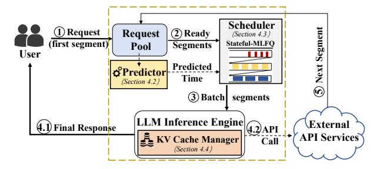

# 4 Scheduling Mechanism Design

#### 4.1 Overall Architecture

> **[图片提取文字 (无描述)]:**
> Scheduler Segment Request Request Ready (Section 4.3) (first segment) Stateful-MLFQ Segments Pool User Predicted o Predictor Time (Section 4.2) (3) Batch segments LLM Inference Engine External Final Response 4.2)API API Services KV Cache Manager Call (Section 4.4)

Figure 3: The overall architecture of Astraea.

To address the complexities of agentic workflows, we have designed a scheduling system named Astraea. Its architecture, illustrated in Figure 3, is composed of several key components designed to work in concert: a unified Request Pool, a **Service Time Predictor**, a state-aware **Scheduler**, an LLM Inference Engine, and an adaptive **KV Cache Manager**. The three core components are overviewed below to illustrate their primary functions.

- Service Time Predictor (Sec. 4.2): This component annotates request segments with estimated computation time and API duration. It combines offline profiling for prefill latency, a segment-level generation length oracle, and category-based API latency statistics to provide essential metadata for scheduling decisions.
- Stateful-MLFQ Scheduler (Sec. 4.3): As the system's core decision-maker, this scheduler implements a multi-level feedback queue algorithm that dynamically classifies requests

based on compute and I/O behavior. It uses token cost thresholds for priority migration and an enhanced HRRN policy for intra-queue ordering to balance efficiency and fairness.

 KV Cache Manager (Sec. 4.4): This manager handles the latency-throughput tradeoff during I/O waits by dynamically selecting strategy based on GPU memory pressure to minimizes memory waste.

These components operate in a coordinated, cyclic workflow: After ready segments are collected in the Request Pool, they are annotated by the Predictor with crucial metadata, including estimated computation times and API call durations. The Scheduler then prioritizes and batches them for execution by the Inference Engine. Once a segment triggers an external API call, its state is managed by the KV Cache Manager during the wait. This orchestrated workflow enables global optimization across the entire request lifecycle.

