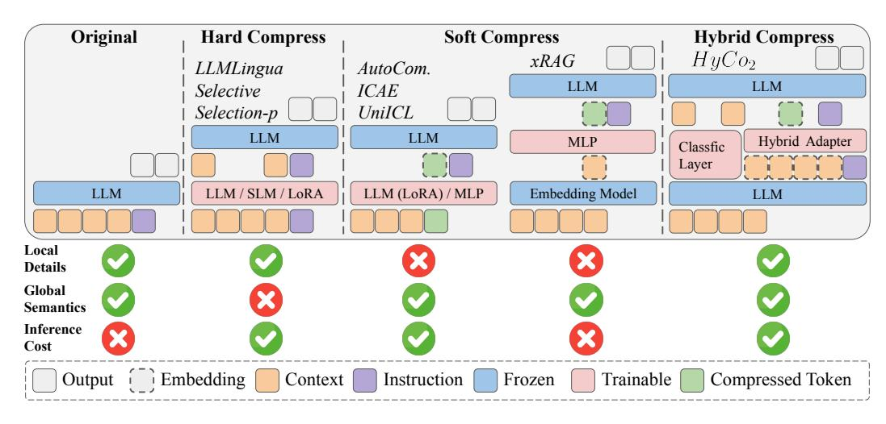

# 1 Introduction

Large Language Models (LLMs) [\[1,](#page-9-0) [14,](#page-9-1) [67\]](#page-13-0) demonstrate strong performance across diverse real-world tasks, particularly those requiring the processing of extensive text inputs [\[43\]](#page-11-0), such as documents and literature [\[12,](#page-9-2) [66,](#page-13-1) [70\]](#page-13-2). Handling extended context is essential for advanced applications like retrieval-augmented generation (RAG) [\[19,](#page-10-0) [73\]](#page-13-3), long-term memory systems [\[21,](#page-10-1) [59\]](#page-12-0), and complex reasoning frameworks [\[39,](#page-11-1) [41\]](#page-11-2). However, supporting such capabilities often requires processing prompts (including instruction, documents, examples, thought process, etc.) containing tens of thousands of tokens [\[40\]](#page-11-3), which presents significant challenges. Primarily, the quadratic complexity of the attention mechanism [\[65\]](#page-13-4) leads to escalating computational and financial costs. It also weakens the model's capacity to provide relevant information when addressing specific tasks, particularly in the presence of noisy or overly lengthy inputs [\[44,](#page-11-4) [56,](#page-12-1) [64\]](#page-13-5). Furthermore, LLM architectures typically enforce strict context window limitations, imposing explicit upper bounds on input size.

∗Corresponding author

> **[图片提取文字 (无描述)]:**
> Original **Hard Compress Soft Compress Hybrid Compress**  $HyCo_2$ xRAGLLMLingua AutoCom. LLM LLM Selective **ICAE** Selection-p UniICL LLM LLM Hybrid Adapter MLP Classfic Layer LLM / SLM / LoRA LLM (LoRA) / MLP **Embedding Model** LLM LLM Local Details Global Semantics Inference Cost Embedding Context Instruction Trainable Compressed Token Frozen

Figure 1: Different paradigms for processing long-text inputs: (a) original input, (b) hard compression, (c) soft compression and (d) our hybrid compression. We categorize representative methods under each paradigm and evaluate them based on three criteria: local details (whether retains important local details), global semantics (whether facilitates understanding of overall context), and inference cost (whether reduces memory usage and inference latency).

Context compression alleviates the difficulties of processing long contexts and reduces computational demands by selectively preserving critical information from extensive texts [\[5,](#page-9-3) [36\]](#page-11-5). However, retaining sufficient information in long-context scenarios remains a substantial challenge. As shown in Figure [2](#page-3-0) and Appendix [A,](#page-13-6) the *George Rankin* example highlights the importance of preserving both global semantics (distinguishing two individuals) and local details like names and roles (Sir George Claus Rankin, a British judge vs. Major General George James Rankin, an Australian soldier and politician). Losing either compromises the quality of reasoning and downstream task performance. Therefore, achieving a balance among several critical information remains a key challenge: (1) Local Detail Preservation, which requires accurately retaining important information units without introducing redundancy; (2) Global Semantic Completeness, demanding the compressed text capture the core meaning, maintain contextual coherence, and avoid omitting critical semantics; and (3) Inference Efficiency, requiring minimizing computational resources while maintaining high information density.

Current context compression research primarily focuses on hard compression and soft compression, each involving inherent trade-offs among efficiency, detail, and semantic preservation (Figure [1\)](#page-1-0). Hard compression selects natural language segments based on metrics like logits or perplexity [\[26,](#page-10-2) [35,](#page-11-6) [48\]](#page-12-2), but often sacrifices fluency, coherence, and the handling of removed context [\[52,](#page-12-3) [55\]](#page-12-4), while its reliance on chunking increases time complexity [\[9,](#page-9-4) [27,](#page-10-3) [71\]](#page-13-7). Conversely, soft compression encodes text into dense latent representations for higher compression rates and scalability [\[8,](#page-9-5) [47,](#page-12-5) [74\]](#page-13-8). However, this approach disrupts sequential structure, neglects local details, reduces interpretability, and complicates information tracing [\[12,](#page-9-2) [33\]](#page-11-7). Given these limitations, a key research question arises: *Can we combine the specificity of explicit tokens with the abstraction of latent representations to achieve a balance between local detail and global information retention in context compression?*

To answer the above question, we propose Hybrid Context Compression (HyCo2) to achieve effective information retention from both global and local perspectives. As shown in Figure [1](#page-1-0) right, drawing inspiration from how humans process information from a coarse global understanding to fine local details, HyCo2 employs a dual-level compression framework designed to retain both global semantics and local details. Global Compression leverages a hybrid adapter, combining the strengths of MLPs [\[42\]](#page-11-8), Q-Former [\[34\]](#page-11-9), and Resampler [\[2\]](#page-9-6), which captures overarching contextual information through joint local and global attention mechanisms: *Local attention* segments the input context into groups and compresses each group into a single token, maintaining structural coherence and emphasizing subregions. *Global attention* utilizes learnable tokens that interact with both the instruction and the entire context to extract key global semantics. Local Compression employs an auxiliary classification layer trained to identify and retain critical tokens [\[10\]](#page-9-7), ensuring fine-grained details necessary for accurate reasoning are preserved. The outputs of local and global attention are then softly fused, producing a rich, instruction-aware representation that is subsequently passed to the frozen LLM.

At the same time, we find that it is challenging to train the global and local compression simultaneously. To fully leverage HyCo2's potential, we propose pretraining the global and the local compression module using paraphrase and completion tasks respectively before instruction tuning. This alternating training strategy enables effective learning and utilization of both global and local representations. Extensive empirical studies validate the effectiveness of our HyCo2. Remarkably, our approach achieves leading performance across various models on 7 datasets with significantly fewer costs, even matching the performance of the original context. Our main contributions are listed as follows:

- We propose HyCo2, a hybrid context compression method for LLMs that balances hard and soft compression using a dual-level compression strategy. HyCo2 effectively reduces computational costs while enabling efficient understanding of long context.
- HyCo2 is designed for minimal parameter updates without relying on additional compressors or external embedding models, which ensures that both the training and inference are lightweight.
- We propose an alternating pretraining strategy for global and local compression modules using paraphrase and completion tasks respectively to further enhance the effectiveness of HyCo2.
- Extensive experiments on multiple benchmarks show that HyCo2 achieves superior performance compared to existing methods with significantly lower computational overhead, thereby offering valuable insights into designing effective hybrid context compression strategies for LLMs.

