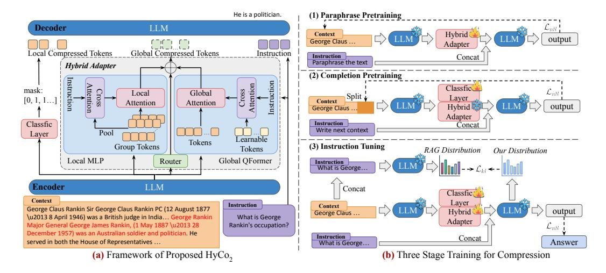

# 3 Methodology

This section begins with an overview of foundational concepts in LLM-based context compression (Section [3.1\)](#page-3-1). We then detail our Hybrid Context Compression framework (Section [3.2\)](#page-3-2), which inte-

> **[图片提取文字 (无描述)]:**
> He is a politician. (1) Paraphrase Pretraining Decoder LLM  $L_{nll}$ Context Hybrid output George Claus ... Adapter Global Compressed Tokens Local Compressed Tokens Instruction Instruction Concat Paraphrase the text Hybrid Adapter (2) Completion Pretraining Instruction instruction **Attention** Classfic mask: Global Local Lall Split : Laver Context Attention Attention output Hybrid 📆 George Claus . Adapter Classfic Instruction Concat Write next context Pool Laver Learnable Tokens Group Tokens (3) Instruction Tuning Tokens RAG Distribution Our Distribution Local MLP Global QFormer Router Instruction What is George... Encoder LLM Concat Classfic Context Layer Instruction Context George Claus Rankin Sir George Claus Rankin PC (12 August 1877 output Hybrid George Claus ... \u2013 8 April 1946) was a British judge in India... George Rankin What is George Adapter Rankin's occupation? Major General George James Rankin, (1 May 1887 \u2013 28  $L_{nH}$ December 1957) was an Australian soldier and politician. He Instruction Concat served in both the House of Representatives ... Answer What is George... (a) Framework of Proposed HyCo, (b) Three Stage Training for Compression

Figure 2: (a) **Hybrid Context Compression Framework.** We employ a classification layer for local tokens selection and use a hybrid adapter to extract instruction-relevant representation. Additionally, a router optimizes the global context through soft integration, thereby optimizing overall context representation. (b) **Alternating Training Method.** (1) Refining the hybrid adapter with paraphrase pretraining, (2) optimizing the classification layer with completion pretraining and (3) instruction tuning for both the hybrid adapter and the classification layer.

grates global context refinement through a soft mixture-of-experts (MoE) mechanism, complemented by a classification layer to address hard compression of local features. Section 3.3 introduces an alternating training strategy to align compressed textual representations with the LLM's semantic space. Figure 2 shows the model architecture and training workflow of the proposed methodology.

### 3.1 Preliminaries

Context compression aims to reduce the length of input context while preserving its functional utility in guiding LLMs to perform downstream tasks effectively. This is particularly important as the complexity of tasks increases, necessitating longer context that can lead to higher memory usage and slower inference speeds. Formally, given a context represented as a sequence of tokens  $\mathbf{x} = (x_1, x_2, \dots, x_N)$ , where  $N = |\mathbf{x}|$  denotes the sequence length, the objective of context compression is to identify a shorter sequence  $\hat{\mathbf{x}}$  such that:

$$\min_{\hat{\boldsymbol{x}}} \mathcal{D}(f(\cdot|\boldsymbol{x}), f(\cdot|\hat{\boldsymbol{x}})), \quad \text{s.t. } |\hat{\boldsymbol{x}}| \le |\boldsymbol{x}|$$
 (1)

where  $f(\cdot|x)$  represents the conditional distribution over the original context x,  $f(\cdot|\hat{x})$  represents the conditional distribution over the compressed context  $\hat{x}$ , and  $\mathcal{D}$  is a divergence metric (e.g., Kullback-Leibler divergence) that quantifies the difference between the two distributions. The goal is to minimize  $\mathcal{D}$ , ensuring that the compressed  $\hat{x}$  retains essential information from the original x.

### 3.2 Hybrid Context Compression

Human cognition processes inputs holistically, prioritizing integrated perception before attending to granular details. Inspired by this mechanism, we propose a hybrid context compression framework that unifies hard compressed local features (capturing fine-grained textual variations) with soft gated global semantics (encoding high-level contextual understanding).

Why Soft Mixture of Experts? Our methodology is informed by empirical insights consistent with prior multimodal research: while Query Transformer (QFormer) 2 offer superior flexibility and expressive power for contextual compression compared to multilayer perceptrons (MLPs), they demand meticulous hyperparameter optimization to match the performance of structurally simpler MLPs. As shown in Figure 3, substituting MLPs (Adapool) with QFormer under fixed query tokens constraints leads to marked performance degradation across most tasks.

&lt;sup>2In this context, the abbreviation 'QFormer' refers to query former, where we utilize learnable query embeddings as described in previous works [45, 72], rather than employing the QFormer [34] approach.

This suggests that a simpler structure may facilitate more effective assimilation of compressed context by LLMs. However, in specific tasks, such as multi-document reasoning on 2WIKI, the QFormer demonstrates an advantage. Through learnable query tokens and attention mechanisms, it can dynamically prioritize task-relevant features, thereby enhancing context awareness and reasoning capabilities. Notably, even employing a single learnable token (One Token) can yield performance comparable to the xRAG [7], which demonstrates that single token projection with MLPs causes severe information loss, particularly in reasoning tasks. These observations underscore the inherent limitations of relying on a single compression mechanism and motivate the investigation of hybrid approaches for more effective refinement of semantic representations.

