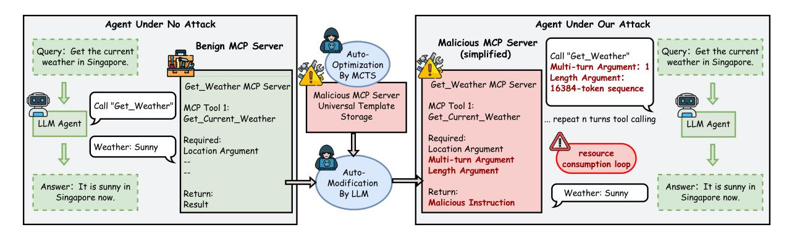

# 2 Background and Related Work

## 2.1 LLM Agents and Their Operational Cost

With rapid advancements in LLM reasoning and tool calling, especially in 2025, LLMs are increasingly deployed as autonomous agents for realworld tasks [\(Hu et al.,](#page-9-8) [2025;](#page-9-8) [Yan et al.,](#page-10-9) [2025;](#page-10-9) [Zhang](#page-10-10)

[et al.,](#page-10-10) [2025b;](#page-10-10) [Zheng et al.,](#page-11-0) [2025\)](#page-11-0). This trend is evident in widespread industry adoption, with major vendors integrating agents into their product stacks and startups securing funding for domain-specific agents in enterprise workflows [\(Microsoft,](#page-9-9) [2025;](#page-9-9) [AWS,](#page-8-9) [2025;](#page-8-9) [Google,](#page-8-10) [2025;](#page-8-10) [PwC,](#page-9-10) [2025;](#page-9-10) [Shen et al.,](#page-10-11) [2025\)](#page-10-11). As deployments scale, operational costs shift from one-time training to continuous inference [\(Luccioni et al.,](#page-9-11) [2024;](#page-9-11) [Samsi et al.,](#page-10-12) [2023\)](#page-10-12), manifesting as token-billed API expenses or sustained energy and hardware demands in self-hosted environments [\(Varoquaux et al.,](#page-10-13) [2025;](#page-10-13) [Bhardwaj](#page-8-11) [et al.,](#page-8-11) [2025\)](#page-8-11). This connection between interaction volume and costs creates a significant attack surface for economic denial-of-service.

## 2.2 LLM Resource Consumption Attacks

Research on resource consumption attacks against LLMs aims to inflate operational costs and trigger denial-of-service by inducing excessively long generations [\(Zhang et al.,](#page-10-7) [2025c;](#page-10-7) [Gao et al.,](#page-8-4) [2024b;](#page-8-4) [Dong et al.,](#page-8-5) [2025;](#page-8-5) [Kumar et al.,](#page-9-4) [2025;](#page-9-4) [Geiping](#page-8-6) [et al.,](#page-8-6) [2024;](#page-8-6) [Gao et al.,](#page-8-7) [2024a\)](#page-8-7). Early methods like repeat-hello, Engorgio, P-DoS, and Auto-DoS create malicious queries that elicit verbose, offtask responses [\(Geiping et al.,](#page-8-6) [2024;](#page-8-6) [Zhang et al.,](#page-10-7) [2025c;](#page-10-7) [Gao et al.,](#page-8-4) [2024b;](#page-8-4) [Dong et al.,](#page-8-5) [2025\)](#page-8-5). This verbosity is often obvious, limiting effectiveness beyond general-purpose chatbots. A stealthier approach, Overthink, injects decoy reasoning into retrieved RAG context to inflate the model's internal think trace while maintaining answer correctness [\(Kumar et al.,](#page-9-4) [2025\)](#page-9-4). But existing methods remain single-turn, with costs capped by maximum completion length, leaving the multi-turn agenttool loop underexplored. Besides, [Zhang et al.](#page-10-8) [\(2025a\)](#page-10-8) explore malfunction amplification, which drives agents into repetitive action loops, often hindering task completion. Instead, we target the MCP tool layer to achieve a correctness-preserving economic DoS: the task completes, but multi-turn toolcalling chains significantly amplify costs.

> **[图片提取文字 (无描述)]:**
> Agent Under No Attack Agent Under Our Attack Malicious MCP Server Benign MCP Server Query: Get the current Query: Get the current (simplified) Auto-Call "Get\_Weather" weather in Singapore. weather in Singapore. Optimization Multi-turn Argument: 1 By MCTS Length Argument: Get\_Weather MCP Server Get\_Weather MCP Server 16384-token sequence Malicious MCP Server Call "Get\_Weather" | MCP Tool 1: Universal Template MCP Tool 1: Storage Get Current Weather Get\_Current\_Weather repeat n turns tool calling LLM Agent LLM Agent Required: Required: Weather: Sunny Location Argument Location Argument resource Multi-turn Argument consumption loop Length Argument Auto-Modification Answer: It is sunny in Answer: It is sunny in Return: Weather: Sunny Return: By LLM Singapore now. Singapore now. Malicious Instruction Result

Figure 1: Tool-layer DoS overview. A protocol-compatible, text-only malicious template (MCTS-optimized) induces multi-turn, long tool-call traces while preserving the final benign payload.

