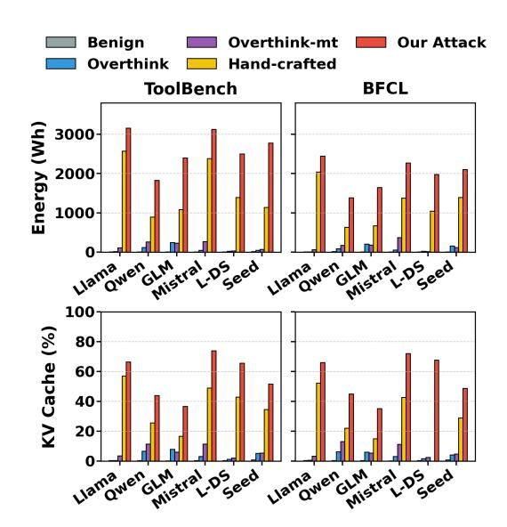

# 4.2 Evaluation of Attack Effectiveness and Correctness

Correctness under resource amplification. Despite the dramatic token inflation, task success remains high. Across both benchmarks, our ASR (which requires both the targeted behavior and Succ(u, τ, o)=1) stays close to the benign TSR. For example, on ToolBench, Llama-3.3-70B-Instruct achieves 96.2% ASR versus 98.1% benign TSR while averaging 81,830 tokens per query; on BFCL, it reaches 93.9% ASR with 77,052 tokens. Meanwhile, cost amplification is pervasive: the largest factors include ×658.10 on Mistral-Large (BFCL; 57,255 vs. 87) and ×314.73 on Llama-3.3-70B-Instruct (ToolBench; 81,830 vs. 260), and even the smallest case remains ×65.51 (Seed-32B on ToolBench). This illustrates a key property of tool-layer DoS: the final answer can remain correct while the intermediate tool-calling process becomes orders-of-magnitude more expensive, making output-only validation insufficient.

Comparison with baselines. Table [2](#page-6-1) contrasts three baseline families. Overthink is fundamentally single-turn and therefore bounded by the pergeneration cap M, yielding at most ∼ 104 tokens on our non-RAG setting (e.g., 8,743 on Qwen-3-32B/ToolBench), far below our typical 6×104– 9×104 ranges. Overthink-mt repeats the contextlayer trigger across multiple tool calls to match our budget, but still leaves the tool server benign; it increases cost for some models yet remains less consistent in sustaining both ordered multi-turn behavior and long tool-call outputs. Hand-crafted isolates the effect of tool-layer templating without MCTS: it often achieves long trajectories, but at noticeably lower ASR and/or shorter outputs than our optimized templates (e.g., on ToolBench/Qwen, 51.3% → 80.5% ASR with 37,425 → 65,273 tokens). Overall, these comparisons attribute the strongest amplification with high correctness to (i) shifting the long-output site to the tool-calling step and compounding across turns, and (ii) MCTSbased text-only optimization that enhances robustness under black-box agent policies.

> **[图片提取文字 (无描述)]:**
> Overthink-mt Our Attack Benign Overthink Hand-crafted ToolBench BFCL 3000 Energy (Wh. 2000 1000 Llamaner Clinistral. O Seed Llamawer Glinstral Deed 100 KV Cache (%) 80 60 40 20 Liangwer chystral Deed Liangwer chystral Deed

Figure 2: Resource impact (ToolBench/BFCL): energy (Wh) and peak KV-cache occupancy (%).

