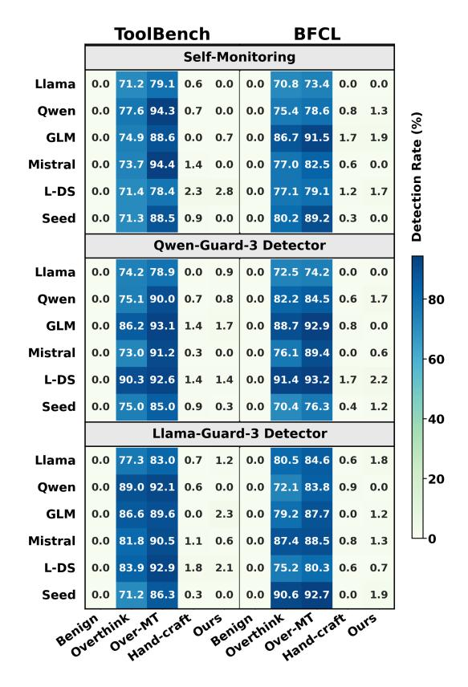
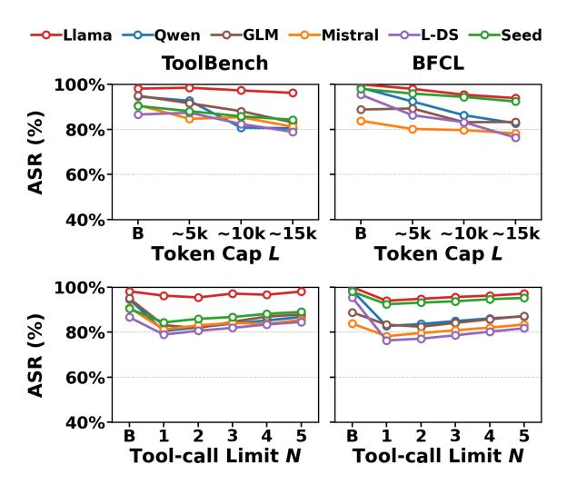

# 4.4 Impact on System Throughput

Beyond direct resource consumption, our attack materially degrades the system's overall throughput efficiency for concurrent benign workloads, as shown in Table [3.](#page-6-2) Our attack consistently halves the throughput (measured in tokens/s) of a co-

|        |              | ToolBench |             |       |              | BFCL        |             |              |       |       |              |       |             |
|--------|--------------|-----------|-------------|-------|--------------|-------------|-------------|--------------|-------|-------|--------------|-------|-------------|
| Metric | Method       | Llama     | Qwen        | GLM   | Mistral L-DS |             | Seed        | Llama        | Qwen  | GLM   | Mistral L-DS |       | Seed        |
|        | Benign       | 260       | 638         | 634   | 127          | 197         | 1298        | 195          | 770   | 389   | 87           | 157   | 950         |
|        | Overthink    | 389       | 8743        | 12580 | 1453         | 725         | 4223        | 369          | 9459  | 13053 | 1397         | 901   | 5753        |
| Length | Overthink-mt | 2253      | 14389       | 11720 | 11704        | 842         | 5197        | 2341         | 15426 | 12492 | 9049         | 725   | 4835        |
|        | Hand-crafted | 71032     | 37425       | 39958 | 48294        | 42794       | 51938       | 63927        | 36203 | 32853 | 37937        | 47394 | 69273       |
|        | Our attack   | 81830     | 65273       | 63694 | 61354        | 65546       | 85037       | 77052        | 67585 | 67656 | 57255        | 68464 | 90298       |
| TSR    | Benign       | 98.1%     | 94.6%       | 95.0% | 90.8%        | 86.6%       | 90.4%       | 100.0% 98.5% |       | 88.8% | 83.8%        | 95.4% | 98.0%       |
|        | Overthink    |           | 99.6% 80.1% | 57.5% | 79.3%        |             | 91.4% 83.6% | 99.5% 74.1%  |       | 55.3% | 61.4%        |       | 93.4% 87.8% |
|        | Overthink-mt |           | 99.6% 78.9% | 52.4% | 69.5%        | 37.6%       | 48.2%       | 96.5%        | 73.1% | 56.3% | 59.5%        | 45.2% | 29.1%       |
| ASR    | Hand-crafted | 88.5%     | 51.3%       | 54.4% | 64.0%        | 50.2%       | 55.9%       | 86.3%        | 50.3% | 53.8% | 62.4%        | 51.8% | 64.0%       |
|        | Our attack   | 96.2%     | 80.5%       | 83.1% |              | 81.2% 78.9% | 84.3%       | 93.9%        | 82.7% | 83.3% | 78.2% 76.3%  |       | 92.4%       |

Table 2: Attack effectiveness. Overthink-mt uses 6 tool calls to match our budget; Hand-crafted is a text-only, payload-preserving template without MCTS optimization. L-DS: Llama-DeepSeek-70B.

| ToolBench Dataset |              |      |      |                             |      |      |  |  |  |
|-------------------|--------------|------|------|-----------------------------|------|------|--|--|--|
| Method            |              |      |      | Llama Qwen GLM Mistral L-DS |      | Seed |  |  |  |
| Benign            | 3594         | 4602 | 3753 | 2898                        | 3812 | 4001 |  |  |  |
| Overthink         | 3728         | 4550 | 3189 | 2724                        | 3711 | 4058 |  |  |  |
| Overthink-mt      | 3342         | 4396 | 3081 | 2531                        | 3746 | 3815 |  |  |  |
| Hand-crafted      | 2068         | 2692 | 2660 | 1996                        | 2596 | 2302 |  |  |  |
| Our attack        | 1672         | 1793 | 2324 | 1716                        | 2106 | 1417 |  |  |  |
|                   | BFCL Dataset |      |      |                             |      |      |  |  |  |
| Method            |              |      |      | Llama Qwen GLM Mistral L-DS |      | Seed |  |  |  |
| Benign            | 3563         | 5093 | 3734 | 2871                        | 3845 | 4082 |  |  |  |
| Overthink         | 3822         | 4561 | 3185 | 2289                        | 3752 | 4078 |  |  |  |
| Overthink-mt      | 3571         | 3949 | 3205 | 2483                        | 3729 | 3890 |  |  |  |
| Hand-crafted      | 2248         | 2559 | 2791 | 1902                        | 2451 | 2529 |  |  |  |
| Our attack        | 1668         | 1738 | 2410 | 1740                        | 2130 | 1536 |  |  |  |

Table 3: Throughput efficiency (tokens/s).

running benign task, causing an average performance drop of approximately 50% across both ToolBench and BFCL. In several cases, the degradation exceeds 60% (e.g., Seed-32B on ToolBench sees a 64.6% drop from 4001 to 1417 tokens/s). In stark contrast, the single-turn Overthink baseline induces only negligible changes, confirming that sustained, multi-turn engagement is the primary driver of this system-level penalty. This collapse in throughput is a direct consequence of the resource pressure detailed in the previous subsection. The prolonged, multi-turn generations, coupled with a sharp increase in peak GPU KV cache usage to the 35–74% range (up from <1% benignly), create significant KV-cache pressure and scheduler contention. This sustained resource occupancy significantly reduces scheduling headroom for co-located tasks, throttling the processing of normal traffic [\(Kwon et al.,](#page-9-15) [2023\)](#page-9-15).

## 4.5 Defense Evaluation

Defense settings. We evaluate three representative classes of defenses under the same episodes

used for efficacy and resource measurements: (i) a prompt-level perplexity (PPL) filter applied to both the user query and the tool response (we conservatively score each episode by the larger of the two) with detector-specific thresholds calibrated from benign tool docstrings [\(Alon and Kamfonas,](#page-8-15) [2023;](#page-8-15) [Jain et al.,](#page-9-16) [2023\)](#page-9-16); (ii) output/trajectory monitoring, including a generation-level self-monitoring prompt that asks the model whether to abort suspicious behavior and trajectory-level safety judges (Qwen-Guard-3 and Llama-Guard-3) applied to the full interaction trace [\(Wang et al.,](#page-10-16) [2024;](#page-10-16) [Zeng et al.,](#page-10-17) [2024;](#page-10-17) [Zhao et al.,](#page-10-18) [2025;](#page-10-18) [Inan et al.,](#page-9-17) [2023\)](#page-9-17); and (iii) hard budget controls via per-session token caps and tool-call limits, reporting residual ASR under different caps/limits (Figure [5\)](#page-7-0).

Input detection via PPL. We evaluate a promptlevel PPL filter that scores both (i) the user query and (ii) the tool response text, since our attack is triggered by tool-facing messages and can inflate content on either side of the agent–tool boundary[\(Alon and Kamfonas,](#page-8-15) [2023;](#page-8-15) [Jain et al.,](#page-9-16) [2023\)](#page-9-16). Concretely, for each episode we compute PPL on the query input and the first tool response (when available) and take the larger value as a conservative score. We set a baseline threshold per detector LM as the maximum PPL over the union of benign tool docstrings (ToolBench/BFCL original servers); this is intentionally conservative so that benign tool text defines the allowable range. Figure [3](#page-7-1) shows that our attack remains well within this benignderived envelope, so a PPL-based input filter is ineffective in detecting our tool-layer manipulation.

Output monitoring through self-reflection. We next test a generation-level self-monitoring defense that prompts the model to reflect on whether its own behavior should be aborted[\(Wang et al.,](#page-10-16) [2024;](#page-10-16) [Zeng](#page-10-17)

| Baseline     | 59.31 | 38.57     | 93.70 |   |
|--------------|-------|-----------|-------|---|
| Overthink    | 17.23 | 14.98     | 18.79 | 7 |
| Overthink-mt | 20.41 | 19.89     | 21.04 | 5 |
| Hand-crafted | 14.84 | 12.15     | 16.70 |   |
| Ours         | 13.34 | 11.35     | 15.10 | 2 |
| •            | Hama  | Ministral | Owen  |   |

Figure 3: PPL filter on query and tool response (we report the larger side per episode). Detectors: Llama-3.1-8B, Ministral-8B, and Qwen3-8B.

> **[图片提取文字 (无描述)]:**
> ToolBench BFCL Self-Monitoring 71.2 79.1 Llama 0.0 0.6 0.0 0.0 70.8 73.4 0.0 0.0 77.6 94.3 Owen 0.0 0.0 75.4 78.6 0.0 0.7 0.8 1.3 Detection Rate (%) GLM 74.9 88.6 86.7 91.5 0.0 0.0 0.7 0.0 1.7 1.9 Mistral 0.0 73.7 94.4 1.4 0.0 0.0 77.0 82.5 0.6 0.0 L-DS 71.4 78.4 0.0 2.3 2.8 0.0 77.1 79.1 1.2 1.7 Seed 71.3 88.5 80.2 89.2 0.9 0.0 0.0 0.0 0.3 0.0 **Owen-Guard-3 Detector** Llama 74.2 78.9 0.0 0.9 72.5 74.2 0.0 0.0 0.0 0.0 75.1 90.0 82.2 84.5 80 Owen 0.0 0.7 0.8 0.0 0.6 1.7 GLM 86.2 93.1 88.7 92.9 0.0 1.4 1.7 0.0 8.0 0.0 Mistral 73.0 91.2 0.3 76.1 89.4 0.0 0.0 0.0 0.0 0.6 60 L-DS 90.3 92.6 91.4 93.2 0.0 1.4 1.4 0.0 1.7 2.2 Seed 0.0 75.0 85.0 0.9 0.3 0.0 70.4 76.3 0.4 1.2 40 Llama-Guard-3 Detector Llama 80.5 84.6 77.3 83.0 0.0 0.7 1.2 0.0 0.6 1.8 20 Owen 89.0 92.1 72.1 83.8 0.0 0.6 0.0 0.0 0.9 0.0 86.6 89.6 79.2 87.7 GLM 0.0 0.0 2.3 0.0 0.0 1.2 Mistral 81.8 90.5 87.4 88.5 1.1 0.6 1.3 0.0 0.0 0.8 L-DS 83.9 92.9 75.2 80.3 0.0 1.8 2.1 0.0 0.6 0.7 Seed 71.2 86.3 0.3 0.0 90.6 92.7 0.0 1.9 0.0 0.0 Overthink Overthink Hand-craft Over-MT Hand-craft Over-MT Benign ours

Figure 4: Detection rate (%) of output and trajectory monitors (self-monitoring, Qwen-Guard-3, Llama-Guard-3).

[et al.,](#page-10-17) [2024\)](#page-10-17). Figure [4](#page-7-2) shows that it frequently flags Overthink and Overthink-MT, but almost never flags our attack (typically near 0%, and always below 3%). A key reason is that our token-heavy steps are framed as a required part of completing the tool procedure, rather than as off-task content, so the model does not perceive an obvious anomaly to stop.

Trajectory-level safety judges. We also apply safety-judge models to the full interaction trace and ask for a safe/unsafe verdict. In Figure [4,](#page-7-2) both Qwen-Guard-3 and Llama-Guard-3 strongly flag Overthink-style baselines, but rarely flag our attack (again below 3%)[\(Zhao et al.,](#page-10-18) [2025;](#page-10-18) [Inan](#page-9-17) [et al.,](#page-9-17) [2023\)](#page-9-17). These results indicate that standard "unsafe content" judging is largely orthogonal

> **[图片提取文字 (无描述)]:**
> **──**Llama **──**Qwen **─**─GLM **──**Mistral **─**○─L-DS **─**○─Seed ToolBench BFCL 100% **ASR** (%) 80% 60% 40% ~5k ~10k~15k ~5k ~10k~15k Token Cap L Token Cap L 100% **ASR** (%) 80% 60% 40% Tool-call Limit N Tool-call Limit N

Figure 5: ASR under per-session token caps (top) and tool-call limits (bottom); baseline B is benign TSR.

to correctness-preserving, protocol-compatible resource amplification: the attack's harm is economic (compute/latency/KV pressure) rather than semantic toxicity.

Per-session token caps and tool-call limits. A common mitigation is to enforce hard per-session budgets: a token cap L and/or a tool-call limit N. Figure [5](#page-7-0) shows these controls bound the worstcase cost, but do not reliably stop the attack. Even under tight caps/limits, ASR remains high for most models, because the attack adapts to the constraint and pushes the trajectory to consume as much of the allowed budget as possible. In practice, these mechanisms act as throttles: they cap amplification, but do not detect or prevent correctness-preserving, protocol-compatible resource abuse.

