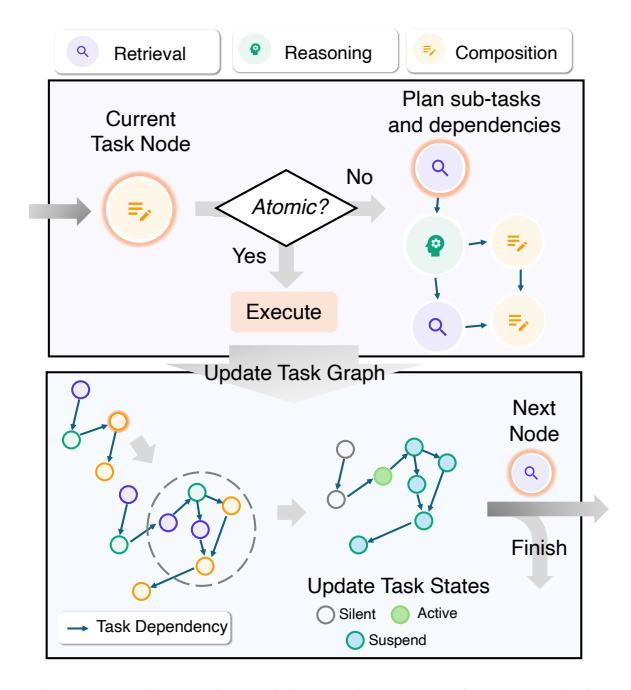

# principia-ai/WriteHERE

#### **Abstract**

Long-form writing agents require flexible integration and interaction across information retrieval, reasoning, and composition. Current approaches rely on predefined workflows and rigid thinking patterns to generate outlines before writing, resulting in constrained adaptability during writing. In this paper we propose WriteHERE, a general agent framework that achieves human-like adaptive writing through recursive task decomposition and dynamic integration of three fundamental task types: retrieval, reasoning, and composition. Our methodology features: 1) a planning mechanism that interleaves recursive task decomposition and execution, eliminating artificial restrictions on writing workflow; and 2) integration of task types that facilitates heterogeneous task decomposition. Evaluations on both fiction writing and technical report generation show that our method consistently outperforms state-of-the-art approaches across all automatic evaluation metrics, demonstrating the effectiveness and broad applicability of our proposed framework. We have publicly released our code and prompts to facilitate further research.

### 1 Introduction

Long-form writing plays a crucial role in numerous domains, including narrative generation (Huot et al., 2024), academic research (Lu et al., 2024), and technical reporting (Shao et al., 2024). Generating coherent, high-quality, and well-structured long-form content presents a significant challenge for Large Language Model (LLM) based writing agents. While LLMs have demonstrated remarkable proficiency in short-form text generation (Yang et al., 2022; Fitria, 2023), their ability to sustain consistency, maintain logical coherence, and adapt dynamically across extended passages remains limited (Yang et al., 2023; Bai et al., 2024;

> **[图片提取文字 (无描述)]:**
> Q Retrieval Reasoning Composition Plan sub-tasks Current and dependencies Task Node Q No Atomic? Yes Execute Update Task Graph Next Node Q Finish Update Task States Active Silent Task Dependency Suspend

Figure 1: Illustration of the WriteHERE framework for long-form writing. The core of the framework is a heterogeneous recursive planning mechanism that breaks down complex writing goals into primitive subtasks across three cognitive categories. The process is represented as a Directed Acyclic Graph, where a State-based Hierarchical Task Scheduling algorithm manages the adaptive interleaving of task planning and execution.

Huot et al., 2024). The complexity of long-form writing arises from the need to manage interdependent ideas, refine arguments progressively, and integrate diverse information sources, all while ensuring stylistic and factual consistency over extended outputs.

Recent advancements in long-form writing have emphasized a pre-writing planning stage to address these challenges (Yang et al., 2023; Huot et al., 2024; Bai et al., 2024; Shao et al., 2024; Jiang et al., 2024). In the pre-writing phase, an agent first generates a comprehensive outline before proceeding with content generation. For example, Bai et al.

\*Equal contribution.

†Corresponding author.

[\(2024\)](#page-9-2) adopted the plan-and-write paradigm [\(Yao](#page-11-0) [et al.,](#page-11-0) [2019\)](#page-11-0) to extend LLM-generated content length by planning the structure and target word count for each paragraph then write paragraphs sequentially. Agent's Room [\(Huot et al.,](#page-9-0) [2024\)](#page-9-0) argue that a planning stage is important for narrative generation following the narrative theory and proposed a multi-agent framework to generate the plan and write collaboratively. STORM [\(Shao et al.,](#page-10-1) [2024\)](#page-10-1) incorporates a multi-agent collaborative outlining stage for retrieval-augmented writing.

However, methods that incorporate a pre-writing stage constrains adaptive reasoning during the writing process. Consider a mystery novelist who discovers an unexpected plot element mid-chapter: they need to retrieve relevant forensic knowledge, reason about plot consistency, and seamlessly integrate new exposition into the narrative flow. Existing structured workflows struggle with such dynamic adjustments since they either have a fixed outline or follow a predefined task sequence. This inflexibility prevents writers from making the necessary modifications when they need to revise their plan and engage in deeper reasoning throughout the writing process.

In this paper, we unify writing and outlining in a general planning framework that enables dynamic adaptation throughout the writing process. We identify three distinct cognitive tasks involved in writing: retrieval, reasoning, and composition, each characterized by unique information flow patterns. Drawing inspiration from Hierarchical Task Network planning (HTN) [\(Sacerdoti,](#page-10-4) [1971;](#page-10-4) [Georgievski and Aiello,](#page-9-4) [2015\)](#page-9-4), we formulate longform writing as a planning problem where the overall writing goal is achieved through the execution of primitive tasks across these three cognitive categories.

Based on the formulation, we propose Write-HERE, a general long-form Writing framework based on HEterogeneous REcursive planning (Figure [1\)](#page-0-0). Leveraging the goal-directed nature of writing tasks, our approach specifies task types during the planning phase and recursively decomposes them into subtasks across the three cognitive categories. This decomposition is recursively applied to subtasks until primitive tasks are reached. The recursive decomposition mechanism enables the system to dynamically adjust planning depth according to the complexity of the writing task and adapt to various requirements. Incorporating task heterogeneity into the planning process facilitates

the integration of heterogeneous agents for task execution and type-aware task decomposition.

To enable an adaptive writing process, we interleave task execution with planning. When a primitive task is reached, the system immediately executes it, updates the state of all dependent tasks, and then proceeds to the next task node. To manage this execution and recursive planning procedure, we introduce a State-based Hierarchical Task Scheduling algorithm, where tasks and their dependencies are represented as a Directed Acyclic Graph (DAG). We manage the states of tasks to ensuring a hierarchical and dependency-based execution logic.

While existing methods specified to a fixed scenario, we argue that our method can be generalized across multiple writing tasks. We implement WriteHERE on two distinct long-form writing tasks: technical report generation and narrative generation. Our framework is evaluated on relevant benchmarks, including the TELL ME A STORY dataset for fiction writing and the Wildseed dataset for structured document generation. Experimental results demonstrate that our approach significantly improves content quality and adaptability compared to state-of-the-art baselines.

Our key contributions are as follows.

- We propose a planning view of the long-form writing problem, casting the process as a combination of heterogeneous tasks that integrates outlining and writing under a single, goaldriven framework.
- We introduce heterogeneous recursive planning that recursively decomposes tasks into subtasks with specified types, enabling flexible integration of specialized agents and typeaware task decomposition.
- We develop a State-based Hierarchical Task Scheduling algorithm that efficiently manages adaptive execution and dynamic planning.
- Experiments on both narrative and report generation show significant improvements of our framework over state-of-the-art baselines.

