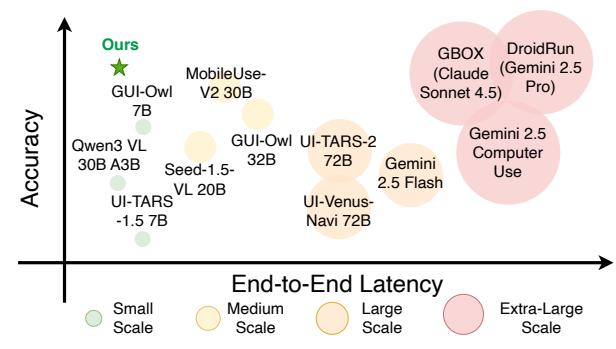
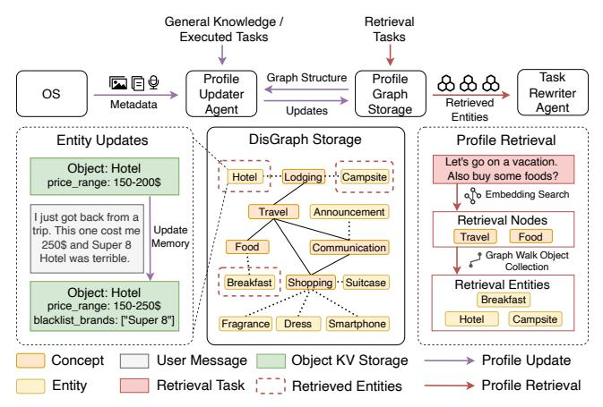
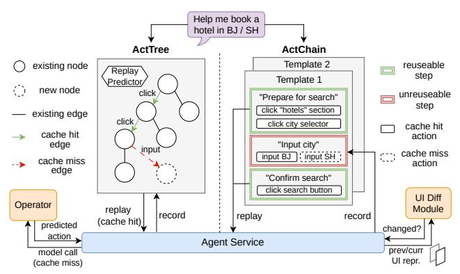
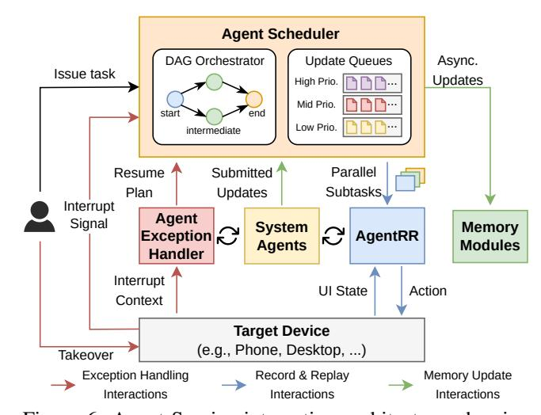

# Beyond Training: Enabling Self-Evolution of Agents with MOBIMEM

Zibin Liu1†, Cheng Zhang1†, Xi Zhao1†, Yunfei Feng†, Bingyu Bai†, Dahu Feng†, Erhu Feng®†, Yubin Xia†, Haibo Chen †

†Institute of Parallel and Distributed Systems, Shanghai Jiao Tong University

### **Abstract**

Large Language Model (LLM) agents are increasingly deployed to automate complex workflows in mobile and desktop environments. However, current *model-centric* agent architectures struggle to self-evolve post-deployment: improving personalization, capability, and efficiency typically requires continuous model retraining/fine-tuning, which incurs prohibitive computational overheads and suffers from an inherent trade-off between model accuracy and inference efficiency.

To enable iterative self-evolution without model retraining, we propose MOBIMEM, a memory-centric agent system. MOBIMEM first introduces three specialized memory primitives to decouple agent evolution from model weights: (1) Profile Memory uses a lightweight distance-graph (Dis-Graph) structure to align with user preferences, resolving the accuracy-latency trade-off in user profile retrieval; (2) Experience Memory employs multi-level templates to instantiate execution logic for new tasks, ensuring capability generalization; and (3) Action Memory records fine-grained interaction sequences, reducing the reliance on expensive model inference. Building upon this memory architecture, MOBIMEM further integrates a suite of OS-inspired services to orchestrate execution: a scheduler that coordinates parallel sub-task execution and memory operations; an agent record-and-replay (AgentRR) mechanism that enables safe and efficient action reuse; and a context-aware exception handling that ensures graceful recovery from user interruptions and runtime errors.

Evaluation on AndroidWorld and top-50 apps shows that MOBIMEM achieves 83.1% profile alignment with 23.83 ms retrieval time (280× faster than GraphRAG baselines), improves task success rates by up to 50.3%, and reduces end-to-end latency by up to  $9\times$  on mobile devices, demonstrating the efficiency and practicality of memory-centric evolution in real-world deployments.

> **[图片提取文字 (无描述)]:**
> Ours DroidRun GBOX (Gemini 2.5 MobileUse-(Claude Pro) GUI-Owl V2 30B Sonnet 4.5) **7B** Accuracy Gemini 2.5 GUI-Owl UI-TARS-2 Qwen3 VL Computer 32B 72B 30B A3B Gemini Seed-1.5-Use 2.5 Flash **VL 20B UI-TARS UI-Venus-**-1.5 7B Navi 72B End-to-End Latency Small Medium Extra-Large Large Scale Scale Scale Scale

Figure 1: MOBIMEM tames the trade-off between AI agents' latency and accuracy by a memory-centric design.

#### 1 Introduction

The rapid advancement of large language models (LLMs) has catalyzed the emergence and proliferation of AI agents, which are capable of autonomously executing complex tasks through natural language understanding and tool manipulation. As AI agents [18, 55, 67] evolve, they are increasingly deployed in mobile and desktop environments to automate user workflows [26,42,43,70], spanning from simple information retrieval to multi-step, cross-application tasks that require coordinating operations across diverse apps and services. For example, agents may help users book hotels by comparing prices across multiple travel apps, schedule meetings by coordinating calendar and communication apps, etc.

Although contemporary AI agents demonstrate autonomous planning, decision-making, and execution capabilities, they often lack the capacity for continual evolution during deployment. A self-evolving agent should aim to achieve three objectives: (1) continually learn user preferences, (2) continually expand its capabilities, and (3) continually improve its execution efficiency. Given that current agents are predominantly built with **model-centric** architectures, such evolution is achieved through per-user model fine-tuning [9, 23, 25, 37, 63, 74] or reinforcement learning [11, 14, 20, 39, 51, 65], which incurs prohibitive computational costs for continual training both on-device and in the

&lt;sup>1The three authors contributed equally to this work and should be considered co-first authors.

&lt;sup>™Erhu Feng is the corresponding author: fengerhu1@sjtu.edu.cn

cloud. Moreover, relying solely on model-based approaches makes it difficult to balance the agent's performance and accuracy, as shown in Figure [1.](#page-0-0) For example, a powerful agent system commonly requires multimodal models with tens to hundreds of billions of parameters. Such models are not only difficult to deploy on edge devices but also introduce substantial latency in cloud deployment, thereby limiting their practical utility in real-world scenarios.

To avoid these post-deployment training overheads, we propose a memory-centric agent system: MOBIMEM, which supports agent self-evolution without the requirement for additional model training. MOBIMEM draws inspiration from classical OS mechanisms, including memory management, scheduling, record-and-replay, etc., and adapts them to agentic scenarios. Through fine-grained memory updating, caching, and orchestration, MOBIMEM supports continuous improvement in personalization, capability, and efficiency.

MOBIMEM organizes agent memory into three types: Profile Memory, Experience Memory, and Action Memory.

- *Profile Memory:* used to learn user preferences, enabling the agent to continually personalize its behavior. Although existing studies [\[10,](#page-12-5) [45,](#page-14-5) [56\]](#page-15-5) have attempted to capture user preferences through techniques such as RAG [\[32\]](#page-13-4), GraphRAG [\[13\]](#page-12-6), and hierarchical memory [\[45\]](#page-14-5), they still face a trade-off between retrieval accuracy and efficiency. RAG enables efficient information extraction through vector search but lacks explicit relationships between entities. GraphRAG provides richer relational information, but retrieval and update require model inference, introducing non-negligible latency. To address this, we design the Dis-Graph, which shifts semantic information from edges to nodes, while edges solely encode relational distances between nodes. It preserves profile accuracy while reducing the latency of retrieval and update operations.
- *Experience Memory:* storing experience templates, enabling the agent to continuously improve its capability. Prior work [\[58,](#page-15-6) [59\]](#page-15-7) only records the agent's execution trajectories as experience, but this approach compromises the agent's generalization. To address this limitation, MO-BIMEM introduces a multi-level, multi-step experience template. When a new task arrives, MOBIMEM inherits relevant templates and instantiates the execution steps required for the current task, ensuring that the experience remains applicable across diverse scenarios.
- *Action Memory:* recording the interactions between the agent and the system, allowing the agent to continually improve its execution efficiency. Similar to the procedural or "muscle" memory that humans develop through repeated practice, the agent can directly replay the action sequences stored in action memory for common tasks, without relying on model-based reasoning. To address issues analogous to cache staleness, MOBIMEM introduces a lightweight mechanism to determine whether an action memory entry is a valid hit (reusable) or to handle cases where the action

memory has become stale.

With the support of agent memory, MOBIMEM further provides system-level agent services, including the fine-grained task scheduler, agent-level record-and-replay mechanism, agent interrupt and exception handler, etc. Leveraging the experience memory, MOBIMEM establishes fine-grained dependencies at the subtask level, enabling independent subtasks to execute in parallel. Through the action memory, MOBIMEM offers an agent-level record-and-replay capability (AgentRR). Unlike system-level record-and-replay services [\[2,](#page-12-7) [12,](#page-12-8) [21,](#page-13-5) [30\]](#page-13-6), AgentRR does not rigidly reproduce previous actions; instead, it preserves the agent's generalization ability during replay. For interruption and exception handling, MOBIMEM maintains the context of the agent's execution process and integrates the corresponding exception handlers into its experience memory, ensuring that subsequent executions are not disrupted by the same exception.

We evaluate our system through extensive experiments on AndroidWorld [\[49\]](#page-14-6) benchmark and real-world workloads (including top 50 mobile Apps) across diverse hardware platforms. Profile Memory achieves 83.1% profile alignment with 23.83 ms retrieval latency, outperforming baseline approaches by up to 25% and achieving over 280× speedup compared to GraphRAG methods. Experience Memory improves task success rates by up to 50.3% across four agent models, with near-zero human effort through automated abstraction. Action Memory achieves 77.3% average action reuse rate with human-crafted templates, reducing end-to-end latency by up to 9× on resource-constrained mobile devices. In multi-task scenarios, our fine-grained task scheduling achieves up to 1.98× speedup by exploiting parallelism across independent sub-tasks. Moreover, Experience Memory and AgentRR technologies have already been deployed in a flagship smartphone.

## 2 Background

## 2.1 Mobile Agent Frameworks

Recent advances in reasoning paradigms [\[66,](#page-15-8) [73\]](#page-15-9) and GUI parsing tools [\[69\]](#page-15-10) enable GUI agent frameworks to adopt iterative execution paradigms where agents perceive screenshots, generate reasoning and actions autonomously. UI-TARS [\[4\]](#page-12-9) implements an online trace bootstrapping framework where the model dynamically learns from past task executions through continual training. Mobile-Agent-v3(MA3) [\[67\]](#page-15-0) introduces GUI-Owl as a foundational model. The framework maintains a compressed history storing interaction traces as the execution memory of the ongoing task. It also leverages an RAG module storing external or user-specific knowledge and a Reflector Agent for error diagnosis and recovery. AutoDroid [\[59\]](#page-15-7) employs an App Memory module built in an offline stage to store simulated task traces which will be used to synthesize execution guidelines, or be fully reused

| Table 1: Comparison of GUI agent frameworks and memory systems across memory architecture and system capabilities |
|-------------------------------------------------------------------------------------------------------------------|
|-------------------------------------------------------------------------------------------------------------------|

|                | Memory Architecture          |                         |                      | System Capabilities         |                         |                       |
|----------------|------------------------------|-------------------------|----------------------|-----------------------------|-------------------------|-----------------------|
| System         | User Profile Memory       | Execution Memory     | Action Memory     | Task Scheduling          | Error Recovery       | User Interrupt     |
| UI-TARS [4]    | Х                            | Training-time data      | X                    | Sequential                  | X                       | Х                     |
| MA3 [67]       | RAG module                   | Compressed histories    | X                    | Sequential                  | LLM Reflector           | X                     |
| AutoDroid [59] | X                            | Simulated traces        | Task-level           | Sequential                  | ×                       | X                     |
| MemGPT [45]    | Profile blocks (Key-value)   | Х                       | Х                    | -                           | -                       | -                     |
| Mem0 [10]      | User facts (Graph)           | X                       | X                    | -                           | -                       | -                     |
| A-MEM [64]     | General notes (Graph)        | ×                       | ×                    | -                           | -                       | -                     |
| Our Work       | Concept-Entity (DisGraph) | Experience Templates | Tree/Chain Memory | Fine-grained Parallelism | Iterative Refinement | Exception Handling |

for similar tasks during online deployment. Related frameworks explore variants with hierarchical planning [57], short-cut learning [27], lifelong learning [54], or broader OS-level scope [62,71].

While these frameworks demonstrate advances in execution memory and error handling (Table 1), they share fundamental limitations in memory architecture and system capabilities. On the memory side, they lack structured user profile memory for personalization and fine-grained action memory to fully exploit shared actions, while their execution memories store raw traces rather than distilled templates. On the system side, they employ sequential task scheduling without exploiting parallelism opportunities, and they do not support user interventions to correct agent errors during execution. Our work addresses these gaps through a comprehensive memory architecture that captures user profiles, execution experiences, and reusable action patterns, coupled with system capabilities including fine-grained parallelism, iterative refinement for error recovery, and exception handling mechanisms that enable user intervention and correction.

### 2.2 Memory Systems in AI Agents

Memory in agent architectures can be categorized into shortterm memory, which maintains immediate context within the model's input window, and long-term memory, which uses external storage to persist information across sessions [50,61]. Recent research focuses on enhancing long-term memory capabilities through mechanisms including indexing and retrieval [28, 41], dynamic updating and forgetting [7, 77], and memory-enhanced generation [46]. Building on these foundations, several memory systems enhance agent capabilities beyond single-task execution. MemGPT [45] introduces a hierarchical memory management system inspired by OS virtual memory, organizing information into main context, external context, and archival storage with self-editing capabilities through key-value structures. Mem0 [10] focuses on automatic fact extraction and deduplication, merging conversational statements into a consolidated graph structure to maintain user-specific facts across interactions. A-MEM [64]

emphasizes agentic self-organization of knowledge, where agents autonomously generate comprehensive memory notes with rich metadata and dynamically establish inter-memory links to form an evolving knowledge network. Other systems explore diverse architectures including human-like memory [24], memo-based mechanisms [40], self-controlled frameworks [53], unified memory architectures [34], and hybrid multimodal memory [33].

However, as shown in Table 1, these memory systems are designed for general conversational contexts rather than GUI automation domains. They excel at storing declarative knowledge (user facts, general notes) but lack the specialized memory structures needed for GUI agents. Specifically, they do not maintain execution memory to capture procedural knowledge from past interactions or provide action memory to cache reusable interaction patterns and templates. Our work optimizes memory architecture for GUI agents through Concept-Entity graphs that enable efficient multi-dimensional user profile retrieval, experience templates that distill execution traces, and Action Memory structures that cache reusable action sequences.

### 3 System Overview

Existing AI-agent systems still face challenges in continually evolving during deployment, such as achieving agent personalization and improving agent capability and efficiency without continual model training. To address these issues, we design MOBIMEM (Figure 2) with three hierarchical layers: a multi-agent layer, an agent memory layer, and an OS integration layer that provides agent services and coordinates system components.

Multi-agent Layer. Our system collaborates with four specialized agents that work together to execute user tasks. The *Profile Updater* processes OS metadata to extract and update user profiles into Profile Memory. The *Experience Generator* distills reusable task templates from execution histories and stores them in Experience Memory. The *Task Rewriter* matches incoming user requests to existing templates and fills template parameters for execution. The *Operator* gen-

> **[图片提取文字 (无描述)]:**
> Agent Layer Profile Updater Experience Generator Task Rewriter Operator § 4.2 Experience Memory § 4.3 Action Memory § 4.1 Profile Memory Profile Retrieval Experience Retrieval ActChain ActTree Evolution Engine Engine Update Template 1: Hotel App N Memory App 1 Layer Step 1 Step 2 Booking App Profile DisGraph Storage Experience Storage 2.1 Ξ Flight Ticketing Reused Concepts Actions 1. Enter "Flight" section Template 2: New 2. Select {departure} Entities Actions 3. Select (destination) OS Integration Agent Service Metadata Execution Perception Layer Provision Service Service § 5.1 § 5.2 § 5.3 Agent Exception **Agent Record** Agent XWF 0 Handler Scheduler and Replay

Figure 2: Three-layer architecture of MOBIMEM: specialized multi-agent layer (top), agent-tailored memory layer (middle), and OS integration layer (bottom).

erates actions when action reuse is not applicable or when encountering unrecorded situations. These agents leverage our memory system to access persistent context and reusable actions, reducing redundant reasoning.

Memory Layer. Our memory system offers three core modules (§4.1-4.3) to provide personalization and improve task success rates and execution efficiency. Profile Memory Module (§4.1) addresses the lack of personalization by organizing user preferences, facts, and behavior patterns in a DisGraph structure, which requires only one LLM call for updates and zero-LLM retrievals through embedding-based search and graph traversal. Experience Memory Module (§4.2) distills shared execution patterns by decomposing task execution into invariant control logic and variable parameters and storing them as experience templates that the Task Rewriter Agent can utilize. Action Memory Module (§4.3) reduces LLM inference overhead by caching historical actions in two structures: ActTree for prefix reuse and ActChain for prefix-suffix reuse. MOBIMEM also designs a fallback mechanism for Action Memory to handle cache-miss scenarios.

OS Integration Layer. Our system is built on an OS with first-class agent support, providing three categories of agent service: Agent Scheduler (§5.1) that orchestrates parallel subtasks according to the fine-grained experience memory, AgentRR (§5.2), a record-and-replay mechanism that captures execution traces for cache population and enables safe action reuse, and an Agent Exception Handler (§5.3) that enables graceful recovery from user interruptions, and records each exception handler in the experience memory. In addition to these agent services, MOBIMEM also provides agents with system-level perception and execution runtime services, including: metadata provision (e.g., screenshots, voice recordings) enables agents to analyze and learn user habits; percep-

tion service (e.g., UI hierarchy, element visibility and semantics) helps agents comprehend system and application state; execution service provides programmatic OS-level APIs for agents to perform UI interactions and event monitoring.

### 4 Agent Memory

This section presents the detailed designs of three types of agent memory: Profile Memory, Experience Memory, and Action Memory. We first describe how Profile Memory organizes a user's personalized information, including facts, preferences, and behavior patterns (§4.1). Next, we introduce how Experience Memory extracts and applies generalizable task-execution templates at multiple levels (§4.2). Finally, we explain how Action Memory accelerates task execution through action reuse (§4.3).

### 4.1 Profile Memory

Challenges. As AI agents interact with users over time, they gradually accumulate rich personalized information, including factual details, preferences, and habitual behaviors. To deliver truly personalized services, an agent must continuously interpret and retain the user's evolving preferences. Current agent systems attempt to support long-term memory through RAG-based techniques, but they still face inherent trade-offs between performance and accuracy. Simple RAG approaches offer fast retrieval but suffer from low accuracy, as embedding-based search often returns semantically similar but irrelevant information. Graph-based RAG systems improve accuracy but incur prohibitive latency, requiring expensive LLM calls for both graph updates and query traversal.

> **[图片提取文字 (无描述)]:**
> General Knowledge / Retrieval Executed Tasks Tasks Task Graph Structure Profile Profile **□**F9 ፚፚፚ OS Rewriter Updater Graph Retrieved Metadata Agent Storage Agent Updates **Entities** DisGraph Storage **Entity Updates** Profile Retrieval Let's go on a vacation. Object: Hotel Hotel .... Lodging ... Campsite Also buy some foods? price range: 150-200\$ a b Embedding Search Travel Announcement I just got back from a Retrieval Nodes Update trip. This one cost me Food Travel Memory 250\$ and Super 8 Food Communication Graph Walk Object Hotel was terrible. Collection Breakfast Shopping .. Suitcase Retrieval Entities Object: Hotel Breakfast price\_range: 150-250\$ Campsite blacklist brands: ["Super 8"] Hotel Dress Smartphone Fragrance User Message Object KV Storage Profile Update Concept Profile Retrieval Entity Retrieval Task | Retrieved Entities

Figure 3: Architecture of the Profile Memory module, showing profile updating, storage, and retrieval workflows.

**Key Insight.** Our analysis reveals that this trade-off stems from how structural relationships are represented. Simple RAG's flat structure lacks relational context, causing embedding-based retrieval to fetch semantically similar but contextually inappropriate information. GraphRAG improves accuracy by encoding rich relational semantics in edge weights, but this design necessitates expensive LLM calls to generate and traverse these semantic edges. Our key insight is to use a DisGraph architecture that shifts semantic information from edges to nodes. The graph comprises two types of nodes: abstract concepts and concrete entities, where entities connect only to concepts and concepts interconnect with each other. All edges in the graph are semantic-free, only indicating membership or relevance. Under this design, the relationship between any two nodes is correlated with the distance between them, with shorter paths generally indicating higher relevance. During retrieval, we only leverage embedding similarity to identify the most relevant starting nodes, then perform breadth-first search to expand to nodes within short path distances, gathering related profile information. Therefore, the entire retrieval process does not require any LLM involvement.

**Our Design.** As shown in Figure 3, the Profile Memory module operates through two workflows: an update workflow where Profile Updater Agent processes OS metadata and task traces to extract the profile information into the DisGraph, and a retrieval workflow where incoming tasks trigger embedding-based search and BFS traversal to gather relevant context. The storage organizes profile knowledge in the DisGraph architecture, with entities storing structured key-value pairs capturing user information. Operations on DisGraph mainly include three primitives: updating, retrieval, and splitting.

*Update logic.* When new observations arrive, the system first performs embedding-based retrieval to identify relevant nodes in the DisGraph. It then sends these retrieved nodes along with their outgoing edges and the new observations to the Profile Updater in a single LLM call. The agent outputs

> **[图片提取文字 (无描述)]:**
> Final task Experience Task Rewriter description Generator History Refined / New Exp. Retrieve Embedding Experience Vector Database Model Store Indexing Human Experience Template High-level Experiences Low-level Experiences Key: Flight Ticketing Key: Food ordering 1.1. click search bar 1.2. input {shop} Steps: Steps: 1.3. click "search" 1. Enter "Flight" section Search for {shop} Select {departure} Search for {food} 3.1. click (food) Select {destination} 3. Add (food) to cart 3.2. click "add to cart" 4. Select {date} 4. Pay for order 3.3. click "confirm"

Figure 4: Experience template example showing template structure and experience generation/retrieval workflows.

structured modifications (updates to existing entities or insertions of new entities), applied atomically to evolve the profile. Figure 3 illustrates how DisGraph updates the attributes of entities after obtaining a user's hotel reviews.

Retrieval logic. When a new task arrives, the system uses an embedding model to score the task description against all entities and concepts in the graph, selecting the top-k most relevant nodes as starting points. The system then performs breadth-first search from these starting points to expand the context. To balance coverage and relevance, the system partitions the profile context window into k equal shares, and uses round-robin scheduling to fill each share with content discovered from each starting point. Figure 3 illustrates an example in which the task "Let's go on a vacation this weekend. Also buy some foods?" triggers an embedding search that identifies Travel and Food as the starting nodes and subsequently collects content related to these entities.

Dynamic splitting. As the user profile expands, the number of entity nodes linked to a popular concept node increases, which in turn reduces retrieval precision. The BFS expansion retrieves an excessive number of entities under the same concept, which dilutes the effective context window. To address this, when a concept's entity count exceeds a threshold, the system invokes the Profile Updater to analyze entity attributes and create specialized subconcepts (e.g., splitting Travel into Business Travel and Leisure Travel), then redistributes entities to their most relevant subconcepts.

#### 4.2 Experience Memory

Challenges. Current approaches enhance agent capabilities primarily through training on domain-specific data. However, such training-based approaches face inherent scalability challenges in real-world deployment. They require large volumes of high-quality execution traces, which are costly to collect, leaving most long-tail tasks insufficiently covered. In addition, model training demands substantial computational resources. On-device training on endpoints such as smartphones remains

impractical, while performing cloud-based training for each user's long-tail tasks also incurs significant cost.

Key Insight. Rather than training the model to understand complex pages, learn page-transition relationships, and perform task planning, it is more effective to directly provide the model with correct execution experiences, thereby reducing its reasoning burden. However, due to the complexity of task descriptions and environments, providing experiences for every task-environment combination is also not scalable. To address this, we propose the *multi-level experience* and *experience template*. For experience templates, we observe that similar tasks share invariant control flow but have variant data flow. This enables us to abstract execution patterns into templates with parameter slots. For any concrete task, the agent inherits the corresponding template and instantiates parameter slots with task-specific values to produce an executable experience. Moreover, multi-level experience strikes a balance between generality and specificity. High-level experience generalizes to a wider range of scenarios but demands greater capability from the model, whereas low-level experience presents the opposite trade-off.

Our Design. Based on this insight, we design an Experience Memory module that enables agents to accumulate, abstract, and reapply execution knowledge. It consists of two core components: (1) an *Experience Store* that maintains multi-level experience templates, and (2) a *Vector Database* that enables fast semantic retrieval. As shown in Figure [4,](#page-4-2) higher-level experiences describe task-level control flow, while lower-level experiences provide concrete execution steps for precise navigation and interaction (e.g., click, swipe, etc.). More specifically, the Experience Memory module provides two core mechanisms:

*Experience generation and storage.* Experience templates are automatically synthesized when encountering new task classes, or manually authored by developers to bootstrap common tasks. For automatic synthesis, when a task cannot find a matching template during retrieval, the Experience Generator synthesizes a new template by referencing similar past experiences. For manual authoring, developers can directly author parameterized workflows. All templates are keyed by their core descriptions, indexed using an embedding model and stored in the vector database for fast retrieval.

*Template retrieval and parameter filling.* When a new task arrives, the system queries the vector database to retrieve the best-matching template based on the semantic similarity between the task description and existing template keys. The retrieved template is passed to the Task Rewriter to fill the parameter slots using information extracted from the current task. If no suitable experience template is found, the agent autonomously decides how to execute the task. Once the task is completed successfully, the Experience Generator will attempt to create a new experience template for future use.

*Cross-app task support.* In real-world scenarios, a single task may span multiple applications (e.g., compare prices

> **[图片提取文字 (无描述)]:**
> Help me book a hotel in BJ / SH ActTree ActChain Template 2 existing node reuseable Replay step Template 1 Predictor, new node click unreuseable "Prepare for search" step click "hotels" section existing edge click click city selector cache hit cache hit action edge "Input city" input cache miss input BJ input SH cache miss action edge "Confirm search" click search button **UI Diff** Operator Module replay record replay record (cache hit) predicted changed? action , Agent Service prev/curr model call UI repr. (cache miss)

Figure 5: Two structures of Action Memory: ActTree (left) for prefix reuse and ActChain (right) for prefix-suffix reuse.

across shopping apps). The Experience Memory module handles such cases via a DAG-based orchestration: experiences are modeled as a DAG of subtasks executed in topological order. Each subtask can declare parameter slots whose concrete values are determined by the outputs of its preceding subtasks. More details will be introduced in [§5.1.](#page-6-0)

## 4.3 Action Memory

Challenges. Pure LLM-based agents lack the inherent ability to self-improve execution efficiency after deployment. Even when executing previously completed tasks, these agents repeat the same reasoning process due to their stateless nature, resulting in consistently high latency, particularly for long-horizon tasks. Existing systems such as AutoDroid have attempted to address this through task-level action caching, which reuses entire execution traces for similar tasks. However, this approach fails to generalize across tasks with partially shared sub-procedures, and lacks mechanisms to detect environment changes, causing low cache hit rates and incorrect trace reuse in non-deterministic environments.

Key Insight. Our key insight is that, when humans perform similar or repetitive tasks, they often operate subconsciously and do not engage in deliberate, complex reasoning. In agentic scenarios, we also observe that tasks within the same application typically share common prefixes; consequently, these actions can be directly reused without invoking the model. By organizing execution traces into a tree structure, we can identify shared prefixes at runtime using a lightweight embedding model, analogous to human procedural memory. For tasks bound to the same experience, we can achieve even more aggressive optimization. Drawing from the analysis in Section [4.2,](#page-4-0) we can decompose a task into a sequence of invariant and variable steps. Invariant steps remain unchanged across executions and can be directly reused, while variable steps are dependent on specific parameters and can only be reused if their parameters exactly match those of previously executed steps. This decomposition allows us to cache and reuse the stable parts of an agent workflow without model reasoning.

Our Design. Based on the above idea, the Action Memory

module organizes interactions between the agent and system in two structures to support fine-grained action-level reuse: *ActTree* for prefix reuse and *ActChain* for prefix-suffix reuse, as shown in Figure [5.](#page-5-1)

*Prefix reuse.* When the incoming task is not bound to any experience template, the Action Memory module works in the prefix reuse mode. This assumes that tasks within the same app can typically reuse prefix actions and share prefix pages. However, once an action branch occurs, the consistency of the subsequent environment can no longer be guaranteed. For each application, it maintains an app-level memory with an ActTree structure where nodes represent UI states and edges represent state transitions with corresponding actions, aggregating all action sequences from previously completed tasks. We design a lightweight embedding model as a Replay Predictor to determine whether the current task can reuse actions completed by the historical task at the *n*-th layer of ActTree. The Action Memory module will adaptively select the reuse threshold to enhance reuse accuracy.

*Prefix-suffix reuse.* When an incoming task is associated with an experience template, the Action Memory module switches to a prefix-suffix reuse mode. Using experience templates makes it possible to recognize that suffix actions can also be merged into the same state (e.g., an invariant step), thereby enabling suffix reuse. For each experience template, the Action Memory module maintains an ActChain structure that stores detailed action sequences corresponding to the specific tasks mapped to that template. When a new task executes invariant steps, the Action Memory module directly reuses the action. For variable steps, if the associated parameter values match those of a historical task, the corresponding action can also be reused; otherwise, the LLM performs fresh reasoning and action generation.

*Correctness check and rollback mechanism.* To guarantee that cached actions remain valid despite potential app updates or UI changes, we employ a verification mechanism for detecting stale action memory before execution. The Action Memory module examines the UI hierarchy (e.g., XML) to locate an element with matching properties such as resource ID, class name, and text content, and uses fuzzy matching to tolerate minor variations. When the check fails, we infer that the page layout has likely changed due to app updates or dynamic content, triggering a rollback mechanism that discards the failed action, falls back to the LLM execution and updates the Action Memory with the new execution trace.

## 5 Agent Service: System Integration

By leveraging three types of agent memory, MOBIMEM enables improvements in personalization, capability and execution efficiency during agent deployment without requiring additional model training. As shown in Figure [6,](#page-6-1) inspired by task and memory management mechanisms in traditional operating systems, MOBIMEM further incorporates agent-

> **[图片提取文字 (无描述)]:**
> Agent Scheduler DAG Orchestrator Update Queues Async. Issue task Updates High Prio. Mid Prio. end start Low Prio. intermediate Parallel Resume Submitted Subtasks, Plan Updates Interrupt Agent Signal System Memory S Exception C AgentRR Modules Agents Handler Interrupt **UI State** Action Context Target Device (e.g., Phone, Desktop, ...) Takeover Exception Handling Record & Replay Memory Update Interactions Interactions Interactions

Figure 6: Agent Service integration architecture, showing how the Agent Scheduler, AgentRR, and Agent Exception Handler coordinate with memory modules, system agents, and the target device.

oriented scheduling, record-and-replay, interruption handling and exception recovery mechanisms. These enhancements improve the agent system's efficiency and robustness when handling multitasking scenarios and abnormal cases.

## 5.1 Agent Scheduler

During task execution, both agent and memory operations incur latency, and a strictly serial workflow yields higher endto-end latency. For example, memory retrievals can be completed within tens of milliseconds using embedding models and graph traversal, whereas memory updates require LLM inference, taking 1–2 seconds for profile construction and several seconds for template distillation. For operator agents, each task requires reading information from the screen, which takes about 1–10 seconds on average, depending on hardware capabilities and model size. However, these operations are not strictly interdependent, creating opportunities for parallel execution. In particular, this parallelism can be exploited during the planning stage, the execution stage, as well as enabling frontend-backend concurrency.

*Parallel execution coordination.* The scheduler coordinates parallel execution at multiple granularities during task processing. In the planning phase, MOBIMEM concurrently retrieves user preferences and experience templates from the profile memory and experience memory. It then invokes the Task Rewriter to generate concrete task descriptions. As for the execution phase, one task may involve multiple applications, MOBIMEM supports both coarse-grained and finegrained parallelism. Coarse-grained parallelism enables parallel execution at the application level. When sub-tasks from different applications are independent, such as performing price comparisons across multiple shopping apps, MOBIMEM schedules them to run concurrently. Fine-grained parallelism

enables concurrency at the step level. For example, experience templates may indicate that app B only depends on a particular step of app A where a specific parameter value is required. In such cases, MOBIMEM constructs a step-level DAG to capture these dependencies and maximize the concurrency of independent steps.

*Background update prioritization.* The scheduler manages continuous background updates through three separate queues with different priorities. Profile updates are assigned the lowest priority because they do not directly affect the accuracy or efficiency of subsequent task execution. In contrast, updates to the Experience Memory module and Action Memory module are given higher priority, as they are triggered upon task completion and have immediate impacts on the performance of future tasks. This prioritization ensures that high-priority updates are processed promptly and are not delayed by the continuous stream of profile updates.

## 5.2 AgentRR: Agent Record and Replay

The Action Memory mechanism relies on execution traces to support action reuse, but naïve action logging is insufficient for agent replay. The Action Memory module employs two structures, ActTree and ActChain; however, the ActTree must be dynamically constructed during execution, while the ActChain requires explicit mappings between experience templates and action sequences. We design Agent Record and Replay (AgentRR) to capture UI states, decision contexts, and execution steps necessary for both replay structures. Unlike traditional system-level record-and-replay techniques that merely reproduce exact action sequences, AgentRR offers agent-level replay capabilities that not only regenerate action trajectories but also preserve an agent's generalization ability through template-based abstraction and adaptive action verification.

*Recording mechanism.* We design AgentRR as a lightweight instrumentation layer that intercepts all interactions between the agent and the mobile device. At each decision point during execution, AgentRR records the current UI state (including the screenshot and UI hierarchy) and the corresponding action. For the ActTree, each recording adds a new path. If the nodes (UI states) and edges (actions) on this path match existing nodes and edges in the ActTree, AgentRR merges them and updates the associated task list. For the ActChain, AgentRR summarizes the action sequence into an experience template and generates the corresponding step-toaction mappings. If an experience template already exists, the current action trajectory is used to validate it.

*Replay mechanism.* When replaying cached actions, AgentRR verifies each action before execution as described in [§4.3.](#page-5-0) Upon successful verification, AgentRR translates the cached action into concrete operations. Each cached action already contains the action type, target UI element, and parameters, enabling AgentRR to map it directly to the corresponding

UI element in the current UI hierarchy. If verification fails, AgentRR falls back to the Operator Agent for re-planning, allowing the agent to complete the remaining steps. After task execution, AgentRR will record the newly generated actions as an alternative path or update stale action memory caused by UI changes or application updates.

