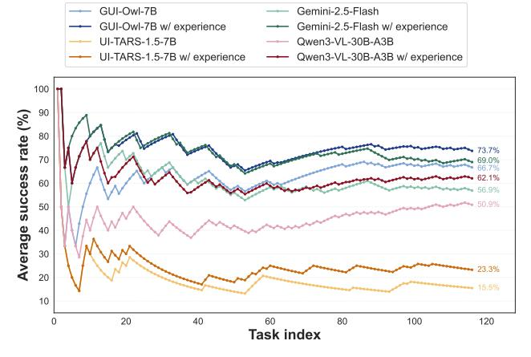
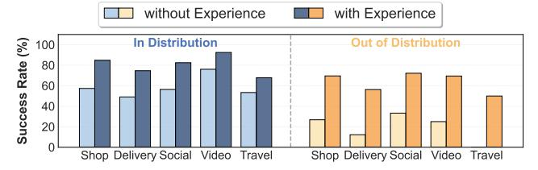
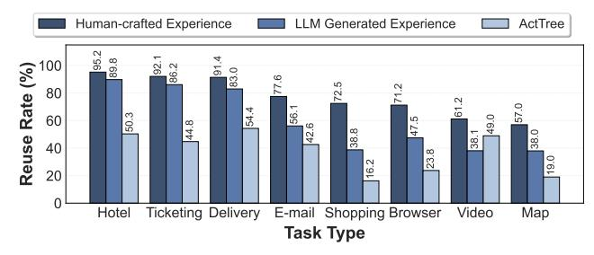
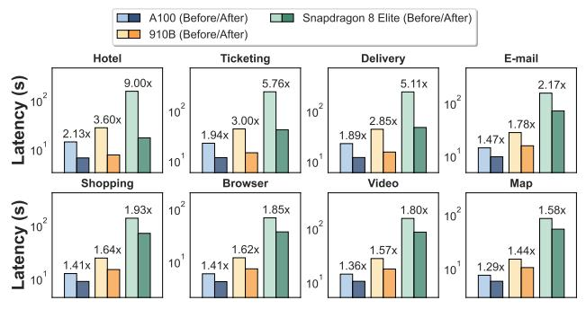
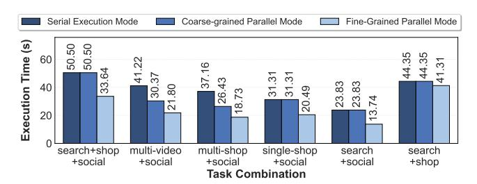
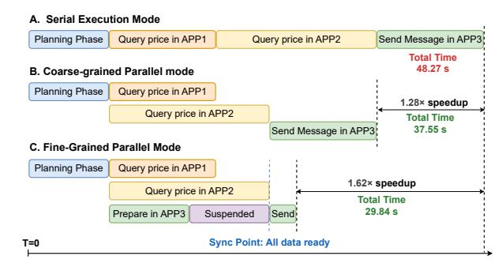

# 5.3 Agent Exception Handler

During task execution, users may need to interrupt the agent when they observe incorrect actions or want to make manual corrections. Without proper exception handling mechanisms, such interruptions would break the automated execution flow. Moreover, if exception handlers are not preserved, the same errors may recur in subsequent executions, making it impossible to leverage prior handling experience.

*Exception detection and execution suspension.* We design an exception-aware execution model that treats user interventions as recoverable events. The system continuously monitors for interruption signals during execution, including explicit pause commands and manual UI interactions that conflict with planned agent actions. When an interruption is detected, the scheduler immediately suspends the current execution thread and retains the context of the agent's execution process. This includes preserving the full execution context: the current UI state, the partially completed task plan, and the action history. The system then yields control to the user, allowing them to inspect the current state, review planned actions, and make corrections through natural language instructions or direct UI manipulations.

*Recovery and continuation.* Once the user completes the corrections, the system integrates the exception handling actions with the execution context to proceed with subsequent planning and execution. Rather than directly incorporating user corrections into experience templates, the *Experience Generator* analyzes the entire execution trace including both the agent's actions and user's corrections. It compares the original plan with the corrections, identifies where and why the agent deviated from user intent, and distills these insights into improved templates. This analysis-driven approach ensures that the system learns what corrections the user made as well as why the corrections were necessary, enabling robust template evolution that prevents similar issues in future tasks.

## 6 Evaluation

We evaluate MOBIMEM along three dimensions that mirror our system design in Section [4:](#page-3-2) (1) whether the DisGraphbased User Profile module can efficiently capture and serve user preferences, (2) how experience templates in the Experience Memory module affect task success rates and cost, and (3) how the Action Memory module improves end-toend latency across different tasks. We deploy MOBIMEM on

Table 2: Profile Memory Module evaluation results (500 historical tasks, 30 test tasks).

| System       | Write (ms) | Retrieval (ms) | Alignment (%) |
|--------------|------------|----------------|---------------|
| Vanilla RAG  | 1.76       | 19.58          | 66.4          |
| GraphRAG     | 37688.73   | 6675.82        | 81.1          |
| Ours (Graph) | 6138.87    | 23.83          | 83.1          |

Table 3: Scalability of Profile Memory Module across different node counts.

| Nodes   | Update  | Retrieval (ms) |          | Storage |
|---------|---------|----------------|----------|---------|
|         | (ms)    | Vector DB      | DisGraph | (MB)    |
| 100     | 6630.60 | 8.77           | 0.15     | 1.41    |
| 1,000   | 7051.38 | 21.11          | 0.17     | 13.49   |
| 10,000  | 8017.17 | 178.40         | 0.26     | 134.79  |
| 100,000 | 9193.84 | 1291.28        | 0.35     | 1346.48 |

both edge and cloud environments and conduct evaluations in real-world mobile usage scenarios, covering the 50 most commonly used applications. Due to the strict latency requirements in edge scenarios, real deployments still rely on cloud compute resources (Intel Xeon Platinum 8378A CPUs and NVIDIA A100-SXM4-80GB GPUs) for model inference. For on-device evaluation, we use the Qualcomm Snapdragon 8 Elite SoC platform and deploy the model using llama.cpp [16]. We evaluate multiple SOTA GUI agent models for the operator agent to ensure generality, including MobiMind-4B [72], UI-TARS-1.5-7B [47], GUI-Owl-7B [67], Qwen3-VL-30B-A3B [8] and Gemini-2.5-Flash [19], covering different scales and architectures. We do not evaluate industrial flagship reasoning models such as Gemini-2.5-Pro or open-source models with more than 10B activated parameters, as their high inference latency cannot meet the latency SLOs of on-device agents. Other agents, such as Profile Updater, Experience Generator, and Task Rewriter, are not on the critical path, and we adopt Qwen3-VL-30B-A3B as the base model. The Experience Memory and AgentRR features proposed in MOBIMEM have already been deployed on a flagship smartphone.

Table 4: Efforts required to enable new agent capabilities when employing different approaches.

| Approach    | Data           | Person-hrs | GPU hrs | Acc.  |
|-------------|----------------|------------|---------|-------|
| Fine-tuning | $\sim$ 100 ex. | 4.0        | 0.25    | 58.5% |
| Exp.(Man.)  | $\sim$ 5 ex.   | 0.2        | 0       | 63.5% |
| Exp.(Syn.)  | $\sim$ 5 ex.   | 0          | 0.0027  | 60.1% |

### 6.1 Agent's Personalization

To evaluate whether agents can accurately learn and model user profiles from historical task executions, we design a benchmark1 with synthetic user profiles. Each profile contains descriptions of a person's characteristics across various aspects, including facts (e.g., home address, frequently used

> **[图片提取文字 (无描述)]:**
> GUI-OwI-7B Gemini-2.5-Flash GUI-OwI-7B w/ experience Gemini-2.5-Flash w/ experience UI-TARS-1.5-7B Qwen3-VL-30B-A3B UI-TARS-1.5-7B w/ experience Qwen3-VL-30B-A3B w/ experience Average success rate (%) Task index

Figure 7: Average success rates of different agents on AndroidWorld with and without experience templates.

> **[图片提取文字 (无描述)]:**
> without Experience with Experience In Distribution Out of Distribution Success Rate (%) 100 80 60 40 20 Shop Delivery Social Video Travel Shop Delivery Social Video Travel

Figure 8: Task success rates with and without experience templates in ID/OOD scenarios.

accounts), preferences (e.g., shopping habits, hotel booking preferences), etc. For each user, we generate 500 historical tasks that explicitly reflect the user's profile information, and 30 test tasks with ambiguous descriptions that require the agent to infer missing details based on learned profile memory. For each test task, we define which profile information should be retrieved based on the task context, serving as the ground truth for evaluating retrieval quality. During evaluation, each system learns from the historical tasks by updating its profile store, then retrieves relevant profile information for the test tasks. We measure three metrics: write latency (time to update profile), retrieval latency (time to retrieve profile information), and profile alignment (the ratio of the retrieved profile information to the ground truth). We compare our DisGraph-based Profile Memory against two baselines: Vanilla RAG, which stores preferences as unstructured text in a vector database with embedding-based retrieval, and GraphRAG, which constructs a knowledge graph with entity extraction and hierarchical summarization following the Mem0 approach. All approaches use a context window of 2000 tokens for retrieval.

As shown in Table 2, Vanilla RAG achieves low latency (1.76ms write, 19.58ms retrieval) but suffers from poor alignment (66.4%) due to its flat structure lacking relational context. GraphRAG improves alignment to 81.1% by encoding relational semantics in edge weights, but incurs high latency (37.69s write, 6.68s retrieval) from expensive LLM calls for entity extraction, edge management, and query traversal. Our system achieves the best of both compared to the GraphRAG:

&lt;sup>1Details in the Appendix.

> **[图片提取文字 (无描述)]:**
> Human-crafted Experience LLM Generated Experience ActTree Rate (%) 83 54.4 50.3 44.8 38.8 38.0 CV Reuse 38 40 23.8 6.2 20 Ticketing Delivery Hotel E-mail Shopping Browser Video Мар Task Type

Figure 9: Action reuse rates of ActTree and ActChain with LLM-generated/human-crafted experience templates.

83.1% alignment (25% higher than Vanilla RAG) with 6.14s write and 23.83ms retrieval latency (6.1× and 280× faster than GraphRAG respectively). This stems from our DisGraph architecture that decouples relational semantics from edges to nodes: writes require only one LLM call for entity classification and concept attachment, while retrieval operates through embedding-based starting point selection and BFS traversal with zero LLM calls. High accuracy is maintained because multi-branch BFS gathers contextually relevant information from multiple conceptual dimensions.

Scalability analysis. To evaluate how Profile Memory scales with user profile size, we test update and retrieval performance as the number of profile nodes grows from 100 to 100,000. As shown in Table 3, update latency increases moderately from 6.6 seconds to 9.2 seconds as profile size grows. Because the update process is dominated by a single LLM inference for entity classification and concept attachment, its runtime remains nearly unchanged. For retrieval, DisGraph traversal remains nearly constant at about 0.15ms–0.35ms across all profile sizes, confirming the zero-LLM overhead of our graph walking mechanism. Total retrieval latency is dominated by the initial vector database search used to select starting nodes, which increases from 8.8 ms (100 nodes) to 1.29 s (100,000 nodes, with 135 MB storage), a delay that remains acceptable in real-world scenarios.

### 6.2 Agent's Capability

**Task success rate in AndroidWorld.** We first evaluate how experience templates improve task success rates in AndroidWorld [49], which provides 116 diverse tasks across 20 Android apps. Our baseline implementation references DroidRun [17], the SOTA open-source work on Android-World, and we augment it with our experience mechanisms to measure the improvements. We test four agent models with and without experience templates: GUI-Owl-7B, UI-TARS-1.5-7B2, Gemini-2.5-Flash, and Qwen3-VL-30B-A3B.

As shown in Figure 7, experience templates consistently improve success rates across all agents. Weaker models benefit more: UI-TARS-1.5-7B achieves a 50.3% relative improvement, while stronger models such as Gemini and Qwen gain

> **[图片提取文字 (无描述)]:**
> MobiMind-4B (Before/After) UI-TARS-1.5-7B (Before/After) GUI-Owl-7B (Before/After) Reuse Rate 60 Latency (s) use Rate (%) 50 30 Ticketing Delivery Hotel E-mail Shopping Browser Video Map Task Type

Figure 10: End-to-end latency and reuse rates for three agent models with and without Action Memory.

21%–22%, and GUI-Owl gains 10.5%. Beyond this overall trend, we observe that different template levels contribute differently across model types. For general-purpose models such as Gemini and Qwen, lower-level templates are more effective because the logic of UI interactions is difficult to infer through reasoning alone. In contrast, for domain-specific models like GUI-Owl, which already possess basic UI interaction skills, higher-level templates reduce reliance on autonomous planning, thereby yielding greater benefits for smaller models. Each experience template consumes 7.8KB on average, resulting in 900KB total storage for the 116 templates.

Task success rate in real-world applications. We evaluate success rates when applying experience memory across various real-world tasks, covering both in-distribution (ID) and out-of-distribution (OOD; i.e., long-tail tasks beyond the agent's training data). UI-TARS-1.5-7B is used as the agent model for this evaluation. For tasks that are only partially completed, the completion rate is taken as the success rate. As shown in Figure 8, applying experience memory leads to substantial improvements in task success rates for both OOD and ID settings. Because OOD tasks often involve complex reasoning, introducing experience templates significantly reduces the reasoning burden and yields greater accuracy gains (44.1% for OOD tasks and 22.0% for ID tasks).

Cost-effectiveness. To evaluate the cost-effectiveness of experience memory, we compare three approaches for enabling new agent capabilities: model fine-tuning, manually authored experience templates, and automatically synthesized experience templates in our system. Table 4 compares these approaches across four key metrics: data volume (number of task execution traces needed), person-hours (human effort for data collection, annotation, or template authoring), GPU hours (computational resources for model training or LLM-based template generation), and accuracy (task success rate).

Fine-tuning requires  $\sim 100$  training examples, 4 personhours, and 0.25 GPU hours to achieve 58.5% accuracy, but must be repeated for each new task family. In contrast, both template methods require only  $\sim 5$  examples ( $20 \times$  less data) by explicitly separating invariant control logic from variable parameter slots. Manual authoring takes 0.2 person-hours for experts to identify control logic and mark variable slots, achieving the highest accuracy (63.5%) through more precise separation of invariant and variant steps, while automatic

&lt;sup>2The 33.0% accuracy is reported in UI-TARS paper, but we cannot fully reproduce this result as the prompts used for testing are not open-sourced.

> **[图片提取文字 (无描述)]:**
> A100 (Before/After) Snapdragon 8 Elite (Before/After) 910B (Before/After) Hotel **Ticketing** Delivery E-mail Latency (s) 9.00x 5.76x 5.11x 2.17x 102 102 102 3.60x 3.00x 2.85x 1.78x 2.13x 1.94x 1.89x 1.47x 101 10 10 Shopping Browser Video Map Latency (s) 102 1.93x 102 1.85x 1.80x 1.58x 102 1.64x 1.62x 1.57x 1.44x 10 101 1.41x 1.41x 1.36x 1.29x 10

Figure 11: Performance boost of Action Memory across different hardware configurations.

synthesis automates this process through semantic clustering and action sequence alignment, requiring zero human effort and only 0.0027 GPU hours to achieve 60.1% accuracy. This demonstrates that experience memory provides a cost-effective alternative to fine-tuning by separating invariant control logic from runtime variables, enabling rapid task family coverage while maintaining competitive accuracy.

### 6.3 Agent's Efficiency

To evaluate the effectiveness of action reuse, we evaluate the different structures of Action Memory under realistic workload patterns, which include 8 diverse task categories: email, train ticketing, food delivery, hotel booking, shopping, web browser, media playback, and map navigation. For each category, we generate parameterized task instances using an LLM to create realistic variations. We submit a sequence of 454 tasks to the system across these categories.

Action reuse rate. We first evaluate how different implementations of Action Memory affect action reuse rates. Figure 9 compares the reuse rates of ActTree and ActChain across task categories. For ActChain, we further evaluate the impact of two template sources on reuse rates: LLM-generated templates and human-crafted templates. ActTree only exploits prefix reuse, achieving 37.5% average reuse rate. ActChain exploits both prefix and suffix reuse, reaching higher reuse rates compared to ActTree. Human-crafted templates strictly separate invariant and variable actions into adjacent steps to maximize the reuse of invariant steps, achieving the highest average reuse rate of 77.3%. LLM-generated templates do not enforce the above constraint, resulting in lower average reuse rate of 59.7% but still outperform ActTree, demonstrating the effectiveness of prefix-suffix reuse.

**End-to-end latency.** We evaluate how Action Memory affects end-to-end task execution time across different agents. We employ ActChain with human-crafted templates for this evaluation. As shown in Figure 10, without Action Memory, latency varies across agents due to differences in inference efficiency: MobiMind-4B averages 14.1s, UI-TARS-1.5-7B 14.7s, and GUI-Owl-7B 38.0s. With Action Memory enabled, all three models achieve substantial latency reduc-

> **[图片提取文字 (无描述)]:**
> Serial Execution Mode Coarse-grained Parallel Mode Fine-Grained Parallel Mode Execution Time (s) 50.50 44.35 50. 60 33.6 23.83 83 40 8 31 3 26 œί 3 20 search+shop multi-video multi-shop single-shop search search +social +social +social +social +social +shop Task Combination

Figure 12: End-to-end performance of different execution modes across six task categories.

tions: MobiMind-4B reduces to 8.6s (up to  $2.1\times$  speedup), UI-TARS-1.5-7B to 8.8s (up to  $2.2\times$  speedup), and GUI-Owl-7B to 16.2s (up to  $4.5\times$  speedup). The latency reduction correlates strongly with reuse rates: tasks such as hotel query and train ticketing with over 92% reuse rates achieve up to  $4.5\times$  speedup, demonstrating that Action Memory effectively eliminates the bottleneck of LLM inference. Tasks such as shopping and browser with lower reuse rates ( $\sim$ 70%) still require longer execution time due to more frequent LLM inference calls for cache misses. For memory overhead, Action Memory uses only 1.54MB ( $\sim$ 6,000 cached actions), negligible on modern devices.

Performance across different hardware. Finally, we evaluate Action Memory across different hardware configurations representing diverse deployment scenarios: A100 GPU, Ascend 910B NPU [35] (cloud server), and Qualcomm Snapdragon 8 Elite SoC [48] (mobile device). We use MobiMind-4B as the agent model for this evaluation. As shown in Figure 11, without Action Memory, task latency varies dramatically across hardware: A100 averages 14.1s, 910B 27.4s, while Snapdragon suffers from 153.2s due to limited computational resources (CPU-only). After enabling Action Memory, latency becomes much more uniform across hardware configurations: most tasks complete within 10s-50s across different underlying compute platforms. The speedup is most pronounced on mobile device where Action Memory achieves  $1.6 \times -9 \times$  speedup across tasks, as action reuse effectively eliminates expensive on-device inference. Even on highperformance hardware like A100, Action Memory provides consistent  $1.3 \times -2.1 \times$  speedup by avoiding redundant inference. This demonstrates that Action Memory effectively shifts the bottleneck from LLM inference to lightweight action execution and UI interaction, enabling practical deployment on mobile and edge devices.

#### 6.4 Performance on Multi-task Scheduling

To evaluate MOBIMEM's performance in realistic scenarios, we test MOBIMEM across complex multi-app tasks that require cross-app coordination and data transfer. These tasks represent real-world use cases where information is retrieved from one or more apps and consumed in other apps. The benchmark involves three application categories: search, shop,

> **[图片提取文字 (无描述)]:**
> A. Serial Execution Mode Planning Phase Query price in APP1 Query price in APP2 Send Message in APP3 Total Time 48.27 s B. Coarse-grained Parallel mode Planning Phase Query price in APP1 1.28× speedup Query price in APP2 Total Time 37.55 s Send Message in APP3 C. Fine-Grained Parallel Mode Planning Phase Query price in APP1 1.62× speedup Query price in APP2 Total Time 29.84 s Prepare in APP3 Suspended Send Sync Point: All data ready T=0

Figure 13: Detailed execution timeline comparison between serial and parallel modes for a multi-shop+social task.

and social networking, using applications such as Chrome, Amazon, WeChat, etc. These application categories are combined to form six task categories as shown in Figure [12,](#page-10-1) where the "multi-" prefix indicates that multiple apps of the same type are involved. Each category contains multiple task instances with different parameter initializations.[3](#page-11-0) We compare the end-to-end latency of three execution modes: *Serial* executes all sub-tasks sequentially. *Coarse-grained* parallelizes independent sub-tasks at the application level. *Fine-grained* further enables step-level parallelism within each sub-task.

Coarse-grained parallelism achieves up to 1.41× speedup over serial execution in the multi-shop+social task. Finegrained parallelism achieves more substantial improvements, with up to 1.98× speedup over serial execution in the same task category. For tasks with sequential app dependencies (e.g., search+shop+social), coarse-grained parallelism provides no benefit, while fine-grained mode still achieves 1.50× and 1.53× speedups through step-level parallelism.

To understand the performance improvements, we analyze a representative task from the multi-shop+social category, as illustrated in Figure [13.](#page-11-1) This task queries prices for the same item across two shopping apps and then shares the results via a social app. In serial mode, the system sequentially queries prices in two shopping apps and then sends a message in a social app, taking 48.27 seconds total. In coarse-grained mode, the two price queries execute in parallel, reducing execution time to 37.65 seconds (1.28× speedup). In fine-grained mode, the scheduler proactively executes steps in the social app that do not depend on price data (e.g., navigating to the chatting page) while price queries run in parallel, blocking only at message composition when price data is required. This further reduces execution time to 29.84 seconds (1.62× speedup), demonstrating that MOBIMEM's fine-grained parallelization effectively exploits step-level dependencies and achieves superior performance.

## 7 Discussion

Platform portability. Our system is implemented on mobile devices with structured GUI introspection, OS-level execution APIs, and execution trace logging. The evaluation demonstrates hardware portability across cloud GPUs, NPUs, and mobile SoCs, validating that our memory mechanisms maintain effectiveness across diverse computational resources. The core memory mechanisms (DisGraph for user profiles, multi-level templates for experiences, and ActTree/ActChain for action reuse) are platform-agnostic abstractions that can be adapted to different environments. Desktop systems provide equivalent capabilities through Microsoft UI Automation [\[44\]](#page-14-15), Linux AT-SPI [\[38\]](#page-13-13), and Apple Accessibility API [\[3\]](#page-12-15), web browsers offer comprehensive DOM introspection with tools like Selenium [\[6\]](#page-12-16) and Playwright [\[5\]](#page-12-17), and commandline interfaces can leverage process monitoring and output parsing. Through appropriate abstraction layers, our memory mechanisms can generalize across diverse platforms.

Comparison with general agent systems. General agent frameworks such as LangChain [\[31\]](#page-13-14), AutoGen [\[60\]](#page-15-17), and MetaGPT [\[22\]](#page-13-15) orchestrate multi-agent workflows atop LLM serving systems [\[1,](#page-12-18) [15,](#page-12-19) [29,](#page-13-16) [36,](#page-13-17) [52,](#page-14-16) [68,](#page-15-18) [75,](#page-16-1) [76,](#page-16-2) [78\]](#page-16-3) that optimize inference efficiency. While these frameworks enable flexible agent composition, their memory mechanisms target conversational agents with linear interaction patterns rather than GUI agents operating in stateful visual environments. The higher cost and complexity of GUI automation necessitate specialized memory: costly physical UI operations require fine-grained action caching, trial-and-error in long-horizon tasks demands abstraction of reusable experience templates from execution traces, and personalization requires capturing multi-app user preference patterns. Existing frameworks rely on conversation buffers designed for dialogue history rather than memory supporting state-indexed action retrieval, hierarchical experience abstraction, and evolving user profiles. MOBIMEM introduces three specialized memory types that transform GUI agents from static executors into self-evolving systems that improve through deployment.

## 8 Conclusion

In this paper, we present MOBIMEM, a memory-centric system that enables agent self-evolution without continual model training. MOBIMEM introduces three specialized memory types with system-level integration, demonstrating significant improvements in preference alignment, execution accuracy and latency. As AI agents are increasingly deployed in edge environments, we believe the memory-centric paradigm offers a practical path toward continually evolving agents that learn from agent memories rather than expensive model updates.

3Details in the Appendix.

## References

- [1] Amey Agrawal, Nitin Kedia, Ashish Panwar, Jayashree Mohan, Nipun Kwatra, Bhargav Gulavani, Alexey Tumanov, and Ramachandran Ramjee. Taming throughputlatency tradeoff in llm inference with sarathi-serve. In *18th USENIX Symposium on Operating Systems Design and Implementation (OSDI 24)*, pages 117–134, 2024.
- [2] Gautam Altekar and Ion Stoica. Odr: Outputdeterministic replay for multicore debugging. In *Proceedings of the ACM SIGOPS 22nd symposium on Operating systems principles*, pages 193–206, 2009.
- [3] Apple Inc. Accessibility API. [https:](https://developer.apple.com/documentation/accessibility/accessibility-api) [//developer.apple.com/documentation/](https://developer.apple.com/documentation/accessibility/accessibility-api) [accessibility/accessibility-api](https://developer.apple.com/documentation/accessibility/accessibility-api), 2025. Accessed: 2025-12-04.
- [4] Authors. Ui-tars: A unified framework for gui automation with large language models. *arXiv preprint*, 2024. To be updated with actual citation.
- [5] Playwright Authors. Playwright. [https://](https://playwright.dev/) [playwright.dev/](https://playwright.dev/), 2025. Accessed: 2025-12-04.
- [6] Selenium Authors. Selenium. [https://www.](https://www.selenium.dev/) [selenium.dev/](https://www.selenium.dev/), 2025. Accessed: 2025-12-04.
- [7] Sanghwan Bae, Donghyun Kwak, Soyoung Kang, Min Young Lee, Sungdong Kim, Yuin Jeong, Hyeri Kim, Sang-Woo Lee, Woomyoung Park, and Nako Sung. Keep me updated! memory management in long-term conversations. *arXiv preprint arXiv:2210.08750*, 2022.
- [8] Shuai Bai, Yuxuan Cai, Ruizhe Chen, Keqin Chen, Xionghui Chen, Zesen Cheng, Lianghao Deng, Wei Ding, Chang Gao, Chunjiang Ge, Wenbin Ge, Zhifang Guo, Qidong Huang, Jie Huang, Fei Huang, Binyuan Hui, Shutong Jiang, Zhaohai Li, Mingsheng Li, Mei Li, Kaixin Li, Zicheng Lin, Junyang Lin, Xuejing Liu, Jiawei Liu, Chenglong Liu, Yang Liu, Dayiheng Liu, Shixuan Liu, Dunjie Lu, Ruilin Luo, Chenxu Lv, Rui Men, Lingchen Meng, Xuancheng Ren, Xingzhang Ren, Sibo Song, Yuchong Sun, Jun Tang, Jianhong Tu, Jianqiang Wan, Peng Wang, Pengfei Wang, Qiuyue Wang, Yuxuan Wang, Tianbao Xie, Yiheng Xu, Haiyang Xu, Jin Xu, Zhibo Yang, Mingkun Yang, Jianxin Yang, An Yang, Bowen Yu, Fei Zhang, Hang Zhang, Xi Zhang, Bo Zheng, Humen Zhong, Jingren Zhou, Fan Zhou, Jing Zhou, Yuanzhi Zhu, and Ke Zhu. Qwen3-vl technical report, 2025.
- [9] Kanzhi Cheng, Qiushi Sun, Yougang Chu, Fangzhi Xu, Yantao Li, Jianbing Zhang, and Zhiyong Wu. Seeclick: Harnessing gui grounding for advanced visual gui agents. In *Annual Meeting of the Association for Computational Linguistics*, 2024.

- [10] Prateek Chhikara, Dev Khant, Saket Aryan, Taranjeet Singh, and Deshraj Yadav. Mem0: Building productionready ai agents with scalable long-term memory, 2025.
- [11] Guanting Dong, Hangyu Mao, Kai Ma, Licheng Bao, Yifei Chen, Zhongyuan Wang, Zhongxia Chen, Jiazhen Du, Huiyang Wang, Fuzheng Zhang, Guorui Zhou, Yutao Zhu, Ji-Rong Wen, and Zhicheng Dou. Agentic reinforced policy optimization, 2025.
- [12] George W Dunlap, Samuel T King, Sukru Cinar, Murtaza A Basrai, and Peter M Chen. Revirt: Enabling intrusion analysis through virtual-machine logging and replay. *ACM SIGOPS Operating Systems Review*, 36(SI):211–224, 2002.
- [13] Darren Edge, Ha Trinh, Newman Cheng, Joshua Bradley, Alex Chao, Apurva Mody, Steven Truitt, Dasha Metropolitansky, Robert Osazuwa Ness, and Jonathan Larson. From local to global: A graph rag approach to query-focused summarization, 2025.
- [14] Lang Feng, Zhenghai Xue, Tingcong Liu, and Bo An. Group-in-group policy optimization for llm agent training. In *Advances in Neural Information Processing Systems*, 2025.
- [15] Yao Fu, Leyang Xue, Yeqi Huang, Andrei-Octavian Brabete, Dmitrii Ustiugov, Yuvraj Patel, and Luo Mai. Serverlessllm: Low-latency serverless inference for large language models. In *18th USENIX Symposium on Operating Systems Design and Implementation (OSDI 24)*, pages 135–153, 2024.
- [16] Ggerganov. llama.cpp - LLM inference with minimal setup and state-of-the-art performance on a wide range of hardware. [https://github.com/ggerganov/](https://github.com/ggerganov/llama.cpp) [llama.cpp](https://github.com/ggerganov/llama.cpp), 2025. Accessed: 2025-12-04.
- [17] Droidrun GmbH. Droidrun: A framework for controlling android and ios devices through llm agents. <https://github.com/droidrun/droidrun>, 2025. Accessed: 2025-12-09.
- [18] Gonzalo Gonzalez-Pumariega, Vincent Tu, Chih-Lun Lee, Jiachen Yang, Ang Li, and Xin Eric Wang. The unreasonable effectiveness of scaling agents for computer use, 2025.
- [19] Google. Gemini 2.5 flash. [https://deepmind.](https://deepmind.google/models/gemini/flash/) [google/models/gemini/flash/](https://deepmind.google/models/gemini/flash/), 2025. Accessed: 2025-12-04.
- [20] Zhangxuan Gu, Zhengwen Zeng, Zhenyu Xu, Xingran Zhou, Shuheng Shen, Yunfei Liu, Beitong Zhou, Changhua Meng, Tianyu Xia, Weizhi Chen, Yue Wen, Jingya Dou, Fei Tang, Jinzhen Lin, Yulin Liu, Zhenlin Guo, Yichen Gong, Heng Jia, Changlong Gao,

- Yuan Guo, Yong Deng, Zhenyu Guo, Liang Chen, and Weiqiang Wang. Ui-venus technical report: Building high-performance ui agents with rft, 2025.
- [21] Zhenyu Guo, Xi Wang, Jian Tang, Xuezheng Liu, Zhilei Xu, Ming Wu, M. Frans Kaashoek, and Zheng Zhang. R2: an application-level kernel for record and replay. In *Proceedings of the 8th USENIX Conference on Operating Systems Design and Implementation*, OSDI'08, page 193–208, USA, 2008. USENIX Association.
- [22] Sirui Hong, Mingchen Zhuge, Jonathan Chen, Xiawu Zheng, Yuheng Cheng, Jinlin Wang, Ceyao Zhang, Zili Wang, Steven Ka Shing Yau, Zijuan Lin, et al. Metagpt: Meta programming for a multi-agent collaborative framework. In *The Twelfth International Conference on Learning Representations*, 2023.
- [23] Wenyi Hong, Weihan Wang, Qingsong Lv, Jiazheng Xu, Wenmeng Yu, Junhui Ji, Yan Wang, Zihan Wang, Yuxiao Dong, Ming Ding, and Jie Tang. Cogagent: A visual language model for GUI agents. In *IEEE/CVF Conference on Computer Vision and Pattern Recognition, Seattle, WA, USA, June 16-22, 2024*, pages 14281–14290. IEEE, 2024.
- [24] Yuki Hou, Haruki Tamoto, and Homei Miyashita. " my agent understands me better": Integrating dynamic human-like memory recall and consolidation in llmbased agents. In *Extended Abstracts of the CHI Conference on Human Factors in Computing Systems*, pages 1–7, 2024.
- [25] Edward J. Hu, Yelong Shen, Phillip Wallis, Zeyuan Allen-Zhu, Yuanzhi Li, Shean Wang, Lu Wang, and Weizhu Chen. Lora: Low-rank adaptation of large language models, 2021.
- [26] IBM. What are agentic workflows? [https://www.](https://www.ibm.com/think/topics/agentic-workflows) [ibm.com/think/topics/agentic-workflows](https://www.ibm.com/think/topics/agentic-workflows), 2025. Accessed: 2025-12-09.
- [27] Wenjia Jiang, Yangyang Zhuang, Chenxi Song, Xu Yang, Joey Tianyi Zhou, and Chi Zhang. Appagentx: Evolving gui agents as proficient smartphone users, 2025.
- [28] Bernal Jimenez Gutierrez, Yiheng Shu, Yu Gu, Michihiro Yasunaga, and Yu Su. Hipporag: Neurobiologically inspired long-term memory for large language models. *Advances in Neural Information Processing Systems*, 37:59532–59569, 2024.
- [29] Woosuk Kwon, Zhuohan Li, Siyuan Zhuang, Ying Sheng, Lianmin Zheng, Cody Hao Yu, Joseph Gonzalez, Hao Zhang, and Ion Stoica. Efficient memory management for large language model serving with pagedattention. In *Proceedings of the 29th symposium on operating systems principles*, pages 611–626, 2023.

- [30] Oren Laadan, Nicolas Viennot, and Jason Nieh. Transparent, lightweight application execution replay on commodity multiprocessor operating systems. In *Proceedings of the ACM SIGMETRICS international conference on Measurement and modeling of computer systems*, pages 155–166, 2010.
- [31] LangChain. Langchain. [https://github.com/](https://github.com/langchain-ai/langchain) [langchain-ai/langchain](https://github.com/langchain-ai/langchain), 2025.
- [32] Patrick Lewis, Ethan Perez, Aleksandra Piktus, Fabio Petroni, Vladimir Karpukhin, Naman Goyal, Heinrich Küttler, Mike Lewis, Wen-tau Yih, Tim Rocktäschel, Sebastian Riedel, and Douwe Kiela. Retrieval-augmented generation for knowledge-intensive nlp tasks. In *Proceedings of the 34th International Conference on Neural Information Processing Systems*, NIPS '20, Red Hook, NY, USA, 2020. Curran Associates Inc.
- [33] Zaijing Li, Yuquan Xie, Rui Shao, Gongwei Chen, Dongmei Jiang, and Liqiang Nie. Optimus-1: Hybrid multimodal memory empowered agents excel in long-horizon tasks. *Advances in neural information processing systems*, 37:49881–49913, 2024.
- [34] Zhiyu Li, Shichao Song, Hanyu Wang, Simin Niu, Ding Chen, Jiawei Yang, Chenyang Xi, Huayi Lai, Jihao Zhao, Yezhaohui Wang, Junpeng Ren, Zehao Lin, Jiahao Huo, Tianyi Chen, Kai Chen, Kehang Li, Zhiqiang Yin, Qingchen Yu, Bo Tang, Hongkang Yang, Zhi-Qin John Xu, and Feiyu Xiong. Memos: An operating system for memory-augmented generation (mag) in large language models, 2025.
- [35] Heng Liao, Jiajin Tu, Jing Xia, Hu Liu, Xiping Zhou, Honghui Yuan, and Yuxing Hu. Ascend: a scalable and unified architecture for ubiquitous deep neural network computing : Industry track paper. In *2021 IEEE International Symposium on High-Performance Computer Architecture (HPCA)*, pages 789–801, 2021.
- [36] Chaofan Lin, Zhenhua Han, Chengruidong Zhang, Yuqing Yang, Fan Yang, Chen Chen, and Lili Qiu. Parrot: Efficient serving of llm-based applications with semantic variable. In *18th USENIX Symposium on Operating Systems Design and Implementation (OSDI 24)*, pages 929–945, 2024.
- [37] Kevin Qinghong Lin, Linjie Li, Difei Gao, Zhengyuan Yang, Shiwei Wu, Zechen Bai, Weixian Lei, Lijuan Wang, and Mike Zheng Shou. Showui: One visionlanguage-action model for gui visual agent, 2024.
- [38] Linux From Scratch. AT SPI. [https:](https://www.linuxfromscratch.org/blfs/view/5.1/gnome/at-spi.html) [//www.linuxfromscratch.org/blfs/view/5.](https://www.linuxfromscratch.org/blfs/view/5.1/gnome/at-spi.html) [1/gnome/at-spi.html](https://www.linuxfromscratch.org/blfs/view/5.1/gnome/at-spi.html). Accessed: 2025-12-04.

- [39] Fanbin Lu, Zhisheng Zhong, Shu Liu, Chi-Wing Fu, and Jiaya Jia. Arpo:end-to-end policy optimization for gui agents with experience replay, 2025.
- [40] Junru Lu, Siyu An, Mingbao Lin, Gabriele Pergola, Yulan He, Di Yin, Xing Sun, and Yunsheng Wu. Memochat: Tuning llms to use memos for consistent longrange open-domain conversation. *arXiv preprint arXiv:2308.08239*, 2023.
- [41] Adyasha Maharana, Dong-Ho Lee, Sergey Tulyakov, Mohit Bansal, Francesco Barbieri, and Yuwei Fang. Evaluating very long-term conversational memory of llm agents. *arXiv preprint arXiv:2402.17753*, 2024.
- [42] Microsoft. Creating cross-system workflows with power automate. [https://kumopartners.com/](https://kumopartners.com/creating-cross-system-workflows/) [creating-cross-system-workflows/](https://kumopartners.com/creating-cross-system-workflows/), 2025. Accessed: 2025-12-09.
- [43] Microsoft. Introducing agent flows: Transforming automation with ai-first workflows. Microsoft Copilot Blog, 2025.
- [44] Microsoft. Ui automation overview. [https://](https://learn.microsoft.com/en-us/dotnet/framework/ui-automation/ui-automation-overview) [learn.microsoft.com/en-us/dotnet/framework/](https://learn.microsoft.com/en-us/dotnet/framework/ui-automation/ui-automation-overview) [ui-automation/ui-automation-overview](https://learn.microsoft.com/en-us/dotnet/framework/ui-automation/ui-automation-overview), 2025. Accessed: 2025-12-04.
- [45] Charles Packer, Sarah Wooders, Kevin Lin, Vivian Fang, Shishir G. Patil, Ion Stoica, and Joseph E. Gonzalez. Memgpt: Towards llms as operating systems, 2024.
- [46] Hongjin Qian, Peitian Zhang, Zheng Liu, Kelong Mao, and Zhicheng Dou. Memorag: Moving towards next-gen rag via memory-inspired knowledge discovery. *arXiv preprint arXiv:2409.05591*, 1, 2024.
- [47] Yujia Qin, Yining Ye, Junjie Fang, Haoming Wang, Shihao Liang, Shizuo Tian, Junda Zhang, Jiahao Li, Yunxin Li, Shijue Huang, Wanjun Zhong, Kuanye Li, Jiale Yang, Yu Miao, Woyu Lin, Longxiang Liu, Xu Jiang, Qianli Ma, Jingyu Li, Xiaojun Xiao, Kai Cai, Chuang Li, Yaowei Zheng, Chaolin Jin, Chen Li, Xiao Zhou, Minchao Wang, Haoli Chen, Zhaojian Li, Haihua Yang, Haifeng Liu, Feng Lin, Tao Peng, Xin Liu, and Guang Shi. Ui-tars: Pioneering automated gui interaction with native agents, 2025.
- [48] Qualcomm. Snapdragon 8 elite mobile platform. [https://www.qualcomm.](https://www.qualcomm.com/smartphones/products/8-series/snapdragon-8-elite-mobile-platform) [com/smartphones/products/8-series/](https://www.qualcomm.com/smartphones/products/8-series/snapdragon-8-elite-mobile-platform) [snapdragon-8-elite-mobile-platform](https://www.qualcomm.com/smartphones/products/8-series/snapdragon-8-elite-mobile-platform), 2025. Accessed: 2025-12-04.
- [49] Christopher Rawles, Sarah Clinckemaillie, Yifan Chang, Jonathan Waltz, Gabrielle Lau, Marybeth Fair, Alice Li, William Bishop, Wei Li, Folawiyo Campbell-Ajala,

- Daniel Toyama, Robert Berry, Divya Tyamagundlu, Timothy Lillicrap, and Oriana Riva. Androidworld: A dynamic benchmarking environment for autonomous agents, 2024.
- [50] Lianlei Shan, Shixian Luo, Zezhou Zhu, Yu Yuan, and Yong Wu. Cognitive memory in large language models. *arXiv preprint arXiv:2504.02441*, 2025.
- [51] Guangming Sheng, Chi Zhang, Zilingfeng Ye, Xibin Wu, Wang Zhang, Ru Zhang, Yanghua Peng, Haibin Lin, and Chuan Wu. Hybridflow: A flexible and efficient rlhf framework. In *Proceedings of the Twentieth European Conference on Computer Systems*, EuroSys '25, page 1279–1297, New York, NY, USA, 2025. Association for Computing Machinery.
- [52] Biao Sun, Ziming Huang, Hanyu Zhao, Wencong Xiao, Xinyi Zhang, Yong Li, and Wei Lin. Llumnix: Dynamic scheduling for large language model serving. In *18th USENIX symposium on operating systems design and implementation (OSDI 24)*, pages 173–191, 2024.
- [53] Bing Wang, Xinnian Liang, Jian Yang, Hui Huang, Shuangzhi Wu, Peihao Wu, Lu Lu, Zejun Ma, and Zhoujun Li. Enhancing large language model with self-controlled memory framework. *arXiv preprint arXiv:2304.13343*, 2023.
- [54] Guanzhi Wang, Yuqi Xie, Yunfan Jiang, Ajay Mandlekar, Chaowei Xiao, Yuke Zhu, Linxi Fan, and Anima Anandkumar. Voyager: An open-ended embodied agent with large language models, 2023.
- [55] Haoming Wang, Haoyang Zou, Huatong Song, Jiazhan Feng, Junjie Fang, Junting Lu, Longxiang Liu, Qinyu Luo, Shihao Liang, Shijue Huang, Wanjun Zhong, Yining Ye, Yujia Qin, Yuwen Xiong, Yuxin Song, Zhiyong Wu, Aoyan Li, Bo Li, Chen Dun, Chong Liu, Daoguang Zan, Fuxing Leng, Hanbin Wang, Hao Yu, Haobin Chen, Hongyi Guo, Jing Su, Jingjia Huang, Kai Shen, Kaiyu Shi, Lin Yan, Peiyao Zhao, Pengfei Liu, Qinghao Ye, Renjie Zheng, Shulin Xin, Wayne Xin Zhao, Wen Heng, Wenhao Huang, Wenqian Wang, Xiaobo Qin, Yi Lin, Youbin Wu, Zehui Chen, Zihao Wang, Baoquan Zhong, Xinchun Zhang, Xujing Li, Yuanfan Li, Zhongkai Zhao, Chengquan Jiang, Faming Wu, Haotian Zhou, Jinlin Pang, Li Han, Qi Liu, Qianli Ma, Siyao Liu, Songhua Cai, Wenqi Fu, Xin Liu, Yaohui Wang, Zhi Zhang, Bo Zhou, Guoliang Li, Jiajun Shi, Jiale Yang, Jie Tang, Li Li, Qihua Han, Taoran Lu, Woyu Lin, Xiaokang Tong, Xinyao Li, Yichi Zhang, Yu Miao, Zhengxuan Jiang, Zili Li, Ziyuan Zhao, Chenxin Li, Dehua Ma, Feng Lin, Ge Zhang, Haihua Yang, Hangyu Guo, Hongda Zhu, Jiaheng Liu, Junda Du, Kai Cai, Kuanye Li, Lichen Yuan, Meilan Han, Minchao Wang, Shuyue Guo, Tianhao Cheng, Xiaobo Ma, Xiaojun Xiao, Xiaolong Huang,

- Xinjie Chen, Yidi Du, Yilin Chen, Yiwen Wang, Zhaojian Li, Zhenzhu Yang, Zhiyuan Zeng, Chaolin Jin, Chen Li, Hao Chen, Haoli Chen, Jian Chen, Qinghao Zhao, and Guang Shi. Ui-tars-2 technical report: Advancing gui agent with multi-turn reinforcement learning, 2025.
- [56] Yu Wang and Xi Chen. Mirix: Multi-agent memory system for llm-based agents, 2025.
- [57] Zhenhailong Wang, Haiyang Xu, Junyang Wang, Xi Zhang, Ming Yan, Ji Zhang, Fei Huang, and Heng Ji. Mobile-agent-e: Self-evolving mobile assistant for complex tasks, 2025.
- [58] Zora Zhiruo Wang, Jiayuan Mao, Daniel Fried, and Graham Neubig. Agent workflow memory. In *Forty-second International Conference on Machine Learning*, 2025.
- [59] Hao Wen, Yuanchun Li, Guohong Liu, Shanhui Zhao, Tao Yu, Toby Jia-Jun Li, Shiqi Jiang, Yunhao Liu, Yaqin Zhang, and Yunxin Liu. Autodroid: Llm-powered task automation in android. In *Proceedings of the 30th Annual International Conference on Mobile Computing and Networking*, ACM MobiCom '24, page 543–557, New York, NY, USA, 2024. Association for Computing Machinery.
- [60] Qingyun Wu, Gagan Bansal, Jieyu Zhang, Yiran Wu, Beibin Li, Erkang Zhu, Li Jiang, Xiaoyun Zhang, Shaokun Zhang, Jiale Liu, et al. Autogen: Enabling next-gen llm applications via multi-agent conversations. In *First Conference on Language Modeling*, 2024.
- [61] Yaxiong Wu, Sheng Liang, Chen Zhang, Yichao Wang, Yongyue Zhang, Huifeng Guo, Ruiming Tang, and Yong Liu. From human memory to ai memory: A survey on memory mechanisms in the era of llms. *arXiv preprint arXiv:2504.15965*, 2025.
- [62] Zhiyong Wu, Chengcheng Han, Zichen Ding, Zhenmin Weng, Zhoumianze Liu, Shunyu Yao, Tao Yu, and Lingpeng Kong. Os-copilot: Towards generalist computer agents with self-improvement, 2024.
- [63] Zhiyong Wu, Zhenyu Wu, Fangzhi Xu, Yian Wang, Qiushi Sun, Chengyou Jia, Kanzhi Cheng, Zichen Ding, Liheng Chen, Paul Pu Liang, and Yu Qiao. Os-atlas: A foundation action model for generalist gui agents, 2024.
- [64] Wujiang Xu, Zujie Liang, Kai Mei, Hang Gao, Juntao Tan, and Yongfeng Zhang. A-mem: Agentic memory for llm agents. In *Advances in Neural Information Processing Systems*, 2025.
- [65] Yifan Xu, Xiao Liu, Xinghan Liu, Jiaqi Fu, Hanchen Zhang, Bohao Jing, Shudan Zhang, Yuting Wang, Wenyi Zhao, and Yuxiao Dong. Mobilerl: Online agentic reinforcement learning for mobile gui agents, 2025.

- [66] Shunyu Yao, Jeffrey Zhao, Dian Yu, Nan Du, Izhak Shafran, Karthik Narasimhan, and Yuan Cao. React: Synergizing reasoning and acting in language models. In *International Conference on Learning Representations (ICLR)*, 2023.
- [67] Jiabo Ye, Xi Zhang, Haiyang Xu, Haowei Liu, Junyang Wang, Zhaoqing Zhu, Ziwei Zheng, Feiyu Gao, Junjie Cao, Zhengxi Lu, Jitong Liao, Qi Zheng, Fei Huang, Jingren Zhou, and Ming Yan. Mobile-agent-v3: Fundamental agents for gui automation, 2025.
- [68] Gyeong-In Yu, Joo Seong Jeong, Geon-Woo Kim, Soojeong Kim, and Byung-Gon Chun. Orca: A distributed serving system for transformer-based generative models. In *16th USENIX Symposium on Operating Systems Design and Implementation (OSDI 22)*, pages 521–538, 2022.
- [69] Wenwen Yu, Zhibo Yang, Jianqiang Wan, Sibo Song, Jun Tang, Wenqing Cheng, Yuliang Liu, and Xiang Bai. Omniparser v2: Structured-points-of-thought for unified visual text parsing and its generality to multimodal large language models, 2025.
- [70] Zapier. Zapier: Automate ai workflows, agents, and apps. <https://zapier.com/>, 2025. Accessed: 2025-12-09.
- [71] Chaoyun Zhang, He Huang, Chiming Ni, Jian Mu, Si Qin, Shilin He, Lu Wang, Fangkai Yang, Pu Zhao, Chao Du, Liqun Li, Yu Kang, Zhao Jiang, Suzhen Zheng, Rujia Wang, Jiaxu Qian, Minghua Ma, Jian-Guang Lou, Qingwei Lin, Saravan Rajmohan, and Dongmei Zhang. Ufo2: The desktop agentos, 2025.
- [72] Cheng Zhang, Erhu Feng, Xi Zhao, Yisheng Zhao, Wangbo Gong, Jiahui Sun, Dong Du, Zhichao Hua, Yubin Xia, and Haibo Chen. Mobiagent: A systematic framework for customizable mobile agents, 2025.
- [73] Jiwen Zhang, Jihao Wu, Teng Yihua, Minghui Liao, Nuo Xu, Xiao Xiao, Zhongyu Wei, and Duyu Tang. Android in the zoo: Chain-of-action-thought for GUI agents. In Yaser Al-Onaizan, Mohit Bansal, and Yun-Nung Chen, editors, *Findings of the Association for Computational Linguistics: EMNLP 2024*, pages 12016–12031, Miami, Florida, USA, November 2024. Association for Computational Linguistics.
- [74] Zhong Zhang, Yaxi Lu, Yikun Fu, Yupeng Huo, Shenzhi Yang, Yesai Wu, Han Si, Xin Cong, Haotian Chen, Yankai Lin, Jie Xie, Wei Zhou, Wang Xu, Yuanheng Zhang, Zhou Su, Zhongwu Zhai, Xiaoming Liu, Yudong Mei, Jianming Xu, Hongyan Tian, Chongyi Wang, Chi Chen, Yuan Yao, Zhiyuan Liu, and Maosong Sun. Agentcpm-gui: Building mobile-use agents with reinforcement fine-tuning, 2025.

- [75] Lianmin Zheng, Zhuohan Li, Hao Zhang, Yonghao Zhuang, Zhifeng Chen, Yanping Huang, Yida Wang, Yuanzhong Xu, Danyang Zhuo, Eric P Xing, et al. Alpa: Automating inter-and intra-operator parallelism for distributed deep learning. In *16th USENIX Symposium on Operating Systems Design and Implementation (OSDI 22)*, pages 559–578, 2022.
- [76] Lianmin Zheng, Liangsheng Yin, Zhiqiang Xie, Chuyue Livia Sun, Jeff Huang, Cody Hao Yu, Shiyi Cao, Christos Kozyrakis, Ion Stoica, Joseph E Gonzalez, et al. Sglang: Efficient execution of structured language model programs. *Advances in neural information processing systems*, 37:62557–62583, 2024.
- [77] Wanjun Zhong, Lianghong Guo, Qiqi Gao, He Ye, and Yanlin Wang. Memorybank: Enhancing large language models with long-term memory. In *Proceedings of the AAAI Conference on Artificial Intelligence*, volume 38, pages 19724–19731, 2024.
- [78] Yinmin Zhong, Shengyu Liu, Junda Chen, Jianbo Hu, Yibo Zhu, Xuanzhe Liu, Xin Jin, and Hao Zhang. Distserve: disaggregating prefill and decoding for goodputoptimized large language model serving. In *Proceedings of the 18th USENIX Conference on Operating Systems Design and Implementation*, OSDI'24, USA, 2024. USENIX Association.

