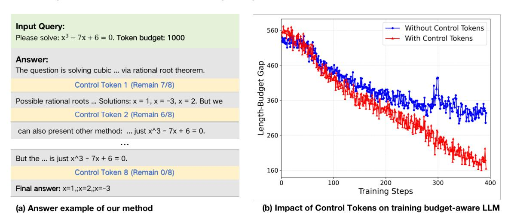
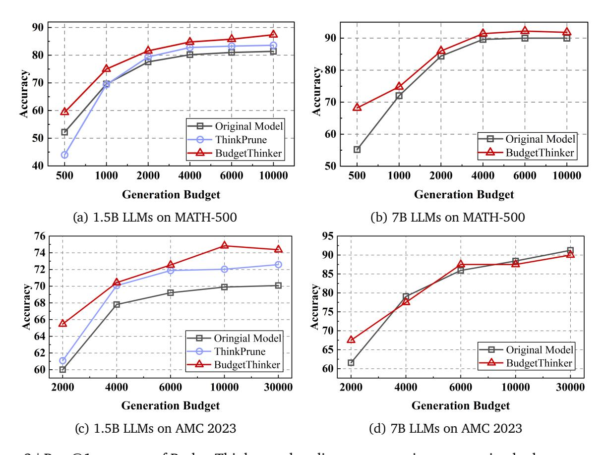
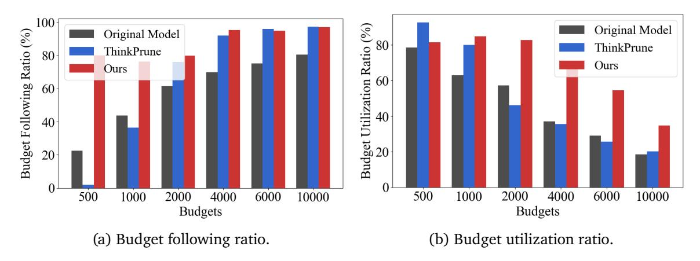
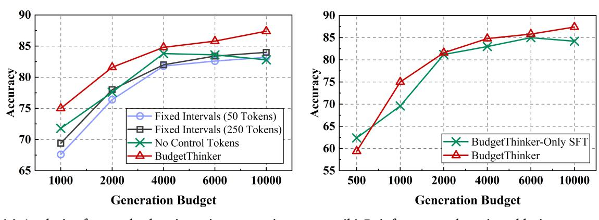

# **1. Introduction**

A key recent progress in Large Language Models (LLMs) is test-time scaling, a paradigm where models are prompted to "think longer" by generating extended Chain-of-Thought (CoT) reasoning before delivering a final answer [\(DeepSeek-AI,](#page-10-0) [2025;](#page-10-0) [OpenAI,](#page-11-0) [2024\)](#page-11-0). While this approach has unlocked state-of-the-art performance in complex domains like advanced mathematics [\(DeepSeek-AI,](#page-10-0) [2025;](#page-10-0) [Google,](#page-10-1) [2025\)](#page-10-1) and coding [\(Hui et al.,](#page-11-1) [2024;](#page-11-1) [Yang et al.,](#page-13-0) [2025\)](#page-13-0), it comes at the significant cost of increased latency and computational overhead. This reliance on increasingly long reasoning makes simple scaling strategies impractical for real-world systems with strict performance constraints, such as vehicle control, robotics, and AI agents.

This trade-off between performance and efficiency highlights a critical need for **controllable CoT reasoning**, where a model can tailor its reasoning process to conclude within a specified computational budget. Such a budget could be dictated by an application's hard limits (*e*.*g*. , under 100ms for autonomous driving [\(Lin et al.,](#page-11-2) [2018;](#page-11-2) [Chen et al.,](#page-10-2) [2025a\)](#page-10-2) or drone navigation [\(Chen et al.,](#page-10-3) [2023\)](#page-10-3)) or by user tolerance for cost and delay in long-running agentic systems. We frame this crucial instruction-following capability as **budget following**.

Existing approaches to control the reasoning budget, however, have proven insufficient. Directly

1 Institute for AI Industry Research (AIR), Tsinghua University

2Global Innovation Exchange & Department of Automation, Tsinghua University

∗Equal contribution.

†Corresponding author: Yuanchun Li (liyuanchun@air.tsinghua.edu.cn).

‡Work done during internships at AIR, Tsinghua University.

inserting budget constraints into prompts [\(Pu et al.,](#page-11-3) [2025;](#page-11-3) [Sun et al.,](#page-12-0) [2025\)](#page-12-0) often fails to reliably control output length [\(Han et al.,](#page-10-4) [2024\)](#page-10-4). Other methods that toggle between "thinking" and "non-thinking" modes [\(Yang et al.,](#page-13-0) [2025;](#page-13-0) [OpenAI,](#page-11-4) [2025\)](#page-11-4) lack the fine-grained control necessary for variable budgets. Even more advanced training-based techniques using Supervised Fine-Tuning (SFT) and Reinforcement Learning (RL) [\(Hou et al.,](#page-11-5) [2025;](#page-11-5) [Aggarwal & Welleck,](#page-9-0) [2025;](#page-9-0) [Wu et al.,](#page-12-1) [2025\)](#page-12-1) struggle to enforce strict adherence to a specified constraint, a limitation our work confirms and aims to address.

In this paper, we address the challenge of precisely controlling the length of a model's thought process. We argue that merely stating a budget constraint in the initial prompt is insufficient, and the model needs to be continuously reminded of its remaining token budget as it generates its response. To achieve this, we develop a novel training and inference framework that enables precise control over the length of the CoT. Our method periodically inserts special **Control Tokens** that act as explicit signals of the remaining budget, as illustrated in Figure [1a](#page-1-0). As shown in Figure [1b](#page-1-0), training with these control tokens leads to a faster and more stable reduction in the gap between the generated length and the target budget, demonstrating their effectiveness in teaching budget adherence.

> **[图片提取文字 (无描述)]:**
> Input Query: Without Control Tokens 560 Please solve:  $x^3 - 7x + 6 = 0$ . Token budget: 1000 With Control Tokens Answer: 9460 Gap The question is solving cubic ... via rational root theorem. Length-Budget Control Token 1 (Remain 7/8) 360 Possible rational roots ... Solutions: x = 1, x = -3, x = 2. But we Control Token 2 (Remain 6/8) can also present other method: ... just  $x^3 - 7x + 6 = 0$ . 260 ... But the ... is just  $x^3 - 7x + 6 = 0$ . 160 Control Token 8 (Remain 0/8) 100 200 300 400 Final answer: x=1,;x=2,;x=-3 Training Steps (b) Impact of Control Tokens on training budget-aware LLM (a) Answer example of our method

Figure 1 | Illustration of the BudgetThinker framework and the impact of Control Tokens. (a) Example of budget-aware generation: Shows how BudgetThinker inserts control tokens into its reasoning process to stay aware of the remaining token budget. (b) Effect of Control Tokens on training: The gap between the generated answer length and the target budget during reinforcement learning.

## Our main contributions are:

- We introduce a method that inserts special tokens during the inference process to achieve controllable output length. This technique minimizes the number of inserted tokens and their impact on the model's output quality.
- We design a comprehensive training process, progressing from SFT to RL, which incorporates a length-aware reward function. This allows the model to adapt to control via special tokens and produce higher-quality, budget-aware outputs. Our method is designed as a plug-and-play module that complements existing test-time scaling training procedures.
- We demonstrate that our approach surpasses strong baselines across multiple foundational models and datasets under various reasoning budgets.

We evaluate our method based on DeepSeek distilled Qwen 2.5 1.5B and 7B (DeepSeek-AI, 2025), on challenging reasoning benchmarks including MATH-500 (Hendrycks et al., 2021), AMC 2023, and AIME 2024. Compared to baselines such as the original reasoning models and a state-of-the-art efficient reasoning method (Hou et al., 2025), our approach demonstrates a better trade-off between accuracy and token budget. Specifically, our method improves accuracy by an average of 4.9% across all tested budgets and exhibits more precise adherence to the specified constraints.

## 2. Special-Token Conditioned Budget-Aware Reasoning

We present BudgetThinker, a budget-aware generation framework that guides LLMs to follow a predefined token budget by conditioning them on explicit control signals. Our method enhances budget adherence by (i) introducing a dynamic control token insertion strategy that continuously reminds the model of the remaining budget and (ii) developing a two-stage training pipeline combining supervised fine-tuning (SFT) and reinforcement learning (RL) to teach the model to follow these control tokens.

#### 2.1. Special-Token Budget Signaling

Our method enforces a target output length, or budget, by augmenting the standard autoregressive generation process. The core idea is to *insert a small*, *fixed set of special control tokens into the sequence* at positions corresponding to fractions of the total budget. These tokens act as explicit signals to the model, indicating how much of its budget has been consumed. Let B be the target budget and K be a fixed hyperparameter for the number of control signals. We introduce a set of K special control tokens,  $C = \{c_1, c_2, \ldots, c_K\}$ , where  $c_k$  signals that the generation has progressed through the k-th fraction of the total budget (e.g.,  $c_1$  signifies 10% completion if K=10). During generation, the token  $y_t$  at timestep t is determined by the following piecewise function:

$$y_t = \begin{cases} c_{k+1} & \text{if } t = k \cdot \lfloor B/K \rfloor \text{ for an integer } k \in \{0, 1, \dots, K-1\} \\ y_t' \mid (y_t' \sim \pi_\theta(\cdot | x, y_{< t})) & \text{otherwise} \end{cases}$$

At each timestep t that corresponds to the end of a budget fraction  $\lfloor k \cdot B/K \rfloor$ , we deterministically insert the corresponding control token  $c_k$ . For all other timesteps, the next token  $y_t'$  is sampled from the LLM's distribution  $\pi_\theta$ , conditioned on the full history of both model-generated tokens and our inserted control tokens.

For comparison, we define a naive baseline: *Fixed-Interval Signaling*. This simpler strategy inserts control tokens at constant, fixed intervals rather than at budget ratios. Given a fixed interval length I, a control token is inserted every I steps (i.e., when  $t = k \cdot I$ ). However, this approach lacks scalability with respect to the budget B. For example, if I = 100, a budget of B = 500 would require 5 control tokens, while a budget of B = 1000 would require 10. The model must be trained to recognize a potentially unbounded number of control tokens as the budget grows. In contrast, our ratio-based method always uses the same fixed set of K tokens, making it far more robust to varying budgets.

#### 2.2. SFT Data Curation

To teach the LLM the semantics of our control tokens, we construct a specialized dataset for Supervised Fine-Tuning (SFT). The curation process involves two key steps: budget assignment and dataset balancing.

**Budget Assignment.** First, for each original data sample (x, y), we assign a budget B by rounding the answer's length, |y|, up to the nearest multiple of a granularity parameter T:

$$B=T\cdot\left\lceil\frac{|y|}{T}\right\rceil,\,$$

This calculation method is intentional. By design, the true answer length |y| is almost always less than the allocated budget |B|. This gap teaches the model to robustly terminate its reasoning and stop generating tokens once the answer is complete, rather than artificially padding the output to fill the entire budget. Next, we transform each sample in the dataset. The input prompt is modified to include the budget constraint, and the target output is reconstructed to include the control tokens:

 $\hat{x} = \text{Concat}(x, \text{Please answer within } B_i \text{ tokens})$ 

$$\hat{y} = \text{Insert}(y, \{c_j\}_{j=1}^K)$$

Here, *Insert* function adds the control token  $c_{k+1}$  at each position t when  $t = k \cdot I$ . Then, we get a reconstructed dataset  $\{(\hat{x}, \hat{y})\}$ , which we use to fine-tune LLM.

**Dataset Balancing.** We balance the dataset to ensure the model's budget following skill is generalizable across different task types and output lengths. We achieve this by creating a mixture of two data categories: **(1) Complex Reasoning Data**: Samples sourced from datasets like s1k (Muennighoff et al., 2025), LIMO (Ye et al., 2025), and Bespoke-Stratos-17k (Labs, 2025), which typically require long, step-by-step thought processes and generate lengthy responses. **(2) Short CoT Data**: Samples from datasets like NuminaMath (LI et al., 2024) and MATH training set (Hendrycks et al., 2021), where tasks often have short chain-of-thought extended reasoning (most answers less than 1000 tokens). By blending these sources, we ensure our SFT dataset has a well-balanced distribution of target answer lengths.

#### 2.3. Reinforcement Learning

Following supervised fine-tuning (SFT), we employ Group Relative Policy Optimization (GRPO) algorithm (Shao et al., 2024) to train the model to generate responses that adhere to a specific token budget, *B*.

**Reward Design.** We design a composite reward function that balances factual accuracy with a penalty for deviating from the target length. For a generated response y, with ground truth  $y_{gold}$  and budget B, the reward R is defined as:

$$R(y, y_{gold}, B) == k_1 \cdot \mathbf{1}\{y = y_{gold}\} + k_2 \cdot \mathbf{1}\{format(y)\} + k_3 \cdot \underbrace{\max(1 - \gamma \cdot \left(\frac{B - |y|}{B}\right)^2, 0)}_{\text{Length Reward}}$$

Indicator functions  $\mathbf{1}\{y=y_{\text{gold}}\}$  and  $\mathbf{1}\{\text{format}(y)\}$  are the original correctness and format check of GRPO, and  $k_1, k_2, k_3$  are coefficients that control the relative importance of each part. The *Length Reward* incentivizes the model to use the budget efficiently. It is based on *normalized length deviation*,  $\delta = \frac{||y| - B|}{B}$ , which measures the fractional difference between the generated length |y| and the target budget B. This deviation is modulated by an *asymmetric penalty coefficient*,  $\gamma$ :

$$\gamma = \begin{cases} 1 & \text{if } |y| \le B \\ r & \text{if } |y| > B \end{cases}$$

Here, r > 1 is a hyperparameter that imposes a substantially larger penalty for exceeding the budget than for falling short of it. This design encourages the model to generate responses that are not only correct but also precisely tailored to the length constraint.

Iterative Reinforcement Learning. To ensure the model performs robustly across a wide range of budgets, we implement a iterative learning strategy within the RL pipeline. Our approach is based on the hypothesis that generating concise, complete answers under tight budget constraints is more difficult than generating longer, more verbose ones. The iterative, therefore, progresses from easier to harder tasks. The training is structured in sequential stages. In each stage k, the model is trained to generate responses within a specific budget  $B_k$ . The curriculum proceeds by systematically decreasing the budget across stages, following the sequence  $B_1 > B_2 > \cdots > B_n$ .

Finally, to prevent catastrophic forgetting and maintain proficiency across all learned budget levels, we conclude with a **mixed-budget training phase**. In this final stage, a budget  $B_k$  is randomly sampled from the set of all previously used budgets  $\{B_j\}_{j=1}^n$  for each training batch. This compels the model to retain its ability to generate high-quality responses for any length within the learned spectrum.

## 3. Experiments

In this section, we present a comprehensive empirical evaluation of BudgetThinker. We investigate its performance under various computational budgets and analyze its ability to adhere to these budgets (Section 3.2). We then analyze the impact of different control token insertion strategies (Section 3.3), iterative training (Section 3.4), and reinforcement learning of BudgetThinker (Section 3.5).

#### 3.1. Experiment Setup

**Training Details.** Our experiments use DeepSeek-R1 (DeepSeek-AI, 2025) distilled Qwen-2.5-1.5B and Qwen-2.5-7B (Hui et al., 2024) as backbone models. For Supervised Fine-Tuning (SFT), we create a dataset of 41k problem-solution pairs as described in Section 2.2. Initially, we select all 1k reasoning samples from s1k (Muennighoff et al., 2025), 0.8k reasoning samples from LIMO (Ye et al., 2025), and 17k reasoning samples from Bespoke-Stratos-17k (Labs, 2025), and a subset from NuminaMath(LI et al., 2024), Math(Hendrycks et al., 2021). Due to computational resource constraints, we remove all question-answer pairs with Chain-of-Thought (CoT) lengths over 10,000 tokens. We train all SFT models for 6 epochs with an initial learning rate of 2e-5 and a maximum context length of 12000.

For Reinforcement Learning (RL), we employ the Group Relative Policy Optimization (GRPO) algorithm (Shao et al., 2024). The training data is a set of 14k math problems, comprising two parts: one part from the math\_splits category of the prm800k dataset (Lightman et al., 2023), and the other part from the numina\_amc\_aime labeled data in the PRIME-RL/Eurus-2-RL-Data(Cui et al., 2025) dataset. Models are trained for 10 epochs with GRPO hyperparameters  $\alpha$  and  $\beta$  set to 0.01 and 0.01, respectively. The maximum context length during RL is 10000.

We configure BudgetThinker by setting the number of control intervals to K = 8. This corresponds to

inserting 8 special tokens during decoding, indicating remaining budget fractions of 7/8, 6/8, ..., 1/8. The granularity parameter for generating training budgets is set to T = 50. The importance hyperparameters are set to  $k_1 = 0.7$ ,  $k_2 = 0.15$ ,  $k_3 = 0.15$ . The length reward penalty coefficient  $\gamma$  is set as:

$$\gamma = \begin{cases} 1 & \text{if } |y| \le B\\ 16 & \text{if } |y| > B \end{cases}$$

Namely, the length reward will decade to 0 when the length of answer y exceeds the budget B by 1/4. For the iterative training curriculum, we start from a budget of 6000, then reducing it to 4000, 3000, and finally 2000. Following this curriculum, we conduct a final mixed-budget training phase by randomly sampling  $B \in \{6000, 4000, 3000, 2000\}$ .

**Evaluation Details.** We evaluate our methods and baselines on three challenging math benchmarks: MATH-500 (Hendrycks et al., 2021), AIME 2024, and AMC 2023. To assess budget control, we evaluate performance across a range of reasoning budgets, from B = 500 to B = 10000 tokens. For inference, we utilize a modified version of the vLLM engine (Kwon et al., 2023). Our modified engine enforces the budget by truncating the reasoning process once the length limit is reached and appending the "

the "
\*\*Final Answer\*\*" tags to signal the model for a final answer. We then allocate an additional 50 tokens for the final answer generation before terminating the process entirely. For each test question, we generate N candidate solutions using sampling with a temperature of 0 and a top-p value of 1 for MATH-500, and with a temperature of 0.6 and a top-p value of 0.95 for AIME 2024 and AMC 2023. We report the pass@1 accuracy. We set the number of samples N to 1 for MATH-500, and to 64 for AIME 2024 and AMC 2023.

**Baselines.** We benchmark BudgetThinker against two baselines: **(1) ThinkPrune** (Hou et al., 2025): A state-of-the-art efficient reasoning framework that also uses GRPO for budget control but does not incorporate explicit control tokens. As the official ThinkPrune repository does not provide a 7B model, we limit our comparison to the 1.5B model scale. **(2) Original Models**: The DeepSeek-R1 distilled Qwen-2.5-1.5B and 7B models that serve as the foundation for our fine-tuning.

## 3.2. Main Performance

We first evaluate the accuracy of BudgetThinker against the baselines across various token budgets, with results shown in Figure 2 and Table 1. For results of MATH-500 and AMC 2023, BudgetThinker outperforms the original model and ThinkPrune across most budget allocations. Specifically, BudgetThinker improves accuracy by 4.2% over the original model and 5.7% over ThinkPrune on average. However, on the AIME 2024 benchmark, the performance of all three methods was comparable. This is likely because the inherent difficulty of AIME problems demands longer, more complex chains of thought; simply restricting the generation length does not necessarily yield better solutions, as producing a concise yet correct proof requires a higher level of reasoning.

We also analyze the budget-following capabilities of each model, as illustrated in Figure 3a. Besides, in Figure 3b, we calculate the average relative length at each budget (|y|/B) for every answer that is within budget, which shows the capability for LLM to understand and fully use budgets. The original model, lacking any budget-specific training, exhibits poor capability to follow the specified limits. While ThinkPrune (Hou et al., 2025) shows improved budget awareness, it often underutilizes the allocated budget, prematurely concluding its reasoning process, which can negatively impact performance on complex problems. In contrast, BudgetThinker demonstrates superior budget adherence. Guided by the

> **[图片提取文字 (无描述)]:**
> Accuracy 02 04 Accuracy Original Model ThinkPrune Original Model BudgetThinker BudgetThinker **Generation Budget Generation Budget** (a) 1.5B LLMs on MATH-500 (b) 7B LLMs on MATH-500 Accuracy 9 02 98 75 70 70 70 70 70 70 70 70 70 70 70 70 70 Oringial Model Original Model **ThinkPrune** BudgetThinker BudgetThinker **Generation Budget Generation Budget** (c) 1.5B LLMs on AMC 2023 7B LLMs on AMC 2023

Figure 2 | Pass@1 accuracy of BudgetThinker vs. baselines across various generation budgets on MATH-500 and AMC 2023. Accuracy is plotted against the maximum generation budget, a metric more applicable to real-time scenarios than average reasoning length.

> **[图片提取文字 (无描述)]:**
> 100 Utilization Ratio (%) Original Model Budget Following Ratio (%) Original Model **ThinkPrune** ThinkPrune 80 Ours Ours 60-40 Budget 1 20 500 2000 10000 500 1000 2000 4000 6000 10000 1000 4000 6000 **Budgets Budgets** (a) Budget following ratio. (b) Budget utilization ratio.

Figure 3 | Budget following and utilization analysis on MATH-500. We compare BudgetThinker-1.5B, ThinkPrune-1.5B, and the original DeepSeek-Distilled-Qwen-2.5-1.5B on MATH-500. (a): The percentage of generated responses that terminate naturally within the specified budget limit (). (b): For responses that finish within the budget, this shows the average generated length as a percentage of the total allocated budget (| |/). This shows BudgetThinker has a superior ability to follow budget constraints while also making more effective use of the allocated tokens compared to baselines.

|                    | 𝐵=2000 | 𝐵=4000 | 𝐵=6000 𝐵=10000 |       |  |
|--------------------|--------|--------|-------------------|-------|--|
| Original-1.5B      | 14.80  | 23.28  | 25.71             | 28.88 |  |
| ThinkPrune-1.5B    | 15.22  | 22.78  | 25.22             | 27.80 |  |
| BudgetThinker-1.5B | 16.25  | 23.80  | 25.63             | 28.90 |  |

Table 1 | Performance of BudgetThinker and baselines on AIME 2024 with different budgets ().

remaining budget tokens, it effectively utilizes the entire allocated length without significant overruns. This precise control allows it to achieve a better balance between computational cost and accuracy, leading to its state-of-the-art performance.

## **3.3. Analysis of Control Token Insertion Strategies**

> **[图片提取文字 (无描述)]:**
> ટું. 80 → Fixed Intervals (50 Tokens) Fixed Intervals (250 Tokens) BudgetThinker-Only SFT No Control Tokens **△** BudgetThinker ♣ BudgetThinker **Generation Budget Generation Budget**

- (a) Analysis of control token insertion strategies. (b) Reinforcement learning ablation.

Figure 4 | Ablation studies on control strategy and RL training (MATH-500, 1.5B Model).

We analyze the performance of BudgetThinker under four distinct control token insertion strategies to understand their impact:

- **No Control Tokens:** An ablation where no special tokens are inserted, relying solely on the RL objective for budget control.
- **Fixed Interval (50 tokens):** Control tokens are inserted at a fixed, frequent interval of every 50 tokens, with 200 special tokens added for a maximum budget of 10000 tokens.
- **Fixed Interval (250 tokens):** Control tokens are inserted at a larger, fixed interval of every 250 tokens, with 40 special tokens added for a maximum budget of 10000 tokens.
- **Budget Ratio (Default):** Our proposed method, where 8 tokens are inserted at intervals corresponding to each 1/8th of the total budget.

Note that while the "No Control Tokens" and "Budget Ratio" strategies are inherently scalable to any context length, fixed-interval strategies require adjustments to the number of special tokens for different budget sizes.

The results, presented in Figure [4a,](#page-7-2) indicate that the **Budget Ratio** strategy yields the best performance. This suggests that a relative, ratio-based notification of remaining resources is more intuitive for the

LLM to learn and adapt its reasoning pace, compared to fixed-interval notifications. Furthermore, the 250-token interval outperforms the 50-token interval, implying that a sparser, less intrusive set of control signals is more beneficial. The superior performance of our default strategy over the "No Control Tokens" baseline further validates the effectiveness of our core design.

## **3.4. Analysis of Iterative Training**

| Model                         | Accuracy (%) |           |           | Budget Following Ratio (%) |           |           |           |            |
|-------------------------------|--------------|-----------|-----------|----------------------------|-----------|-----------|-----------|------------|
|                               | = 2𝐾 𝐵    | = 4𝐾 𝐵 | = 6𝐾 𝐵 | = 10𝐾 𝐵                 | = 2𝐾 𝐵 | = 4𝐾 𝐵 | = 6𝐾 𝐵 | = 10𝐾 𝐵 |
| BudgetThinker 6k              | 79.6         | 85.2      | 86.0      | 84.6                       | 47.0      | 67.8      | 76.2      | 85.6       |
| BudgetThinker 6k-4k           | 80.0         | 86.0      | 84.6      | 86.4                       | 62.8      | 78.6      | 85.8      | 93.8       |
| BudgetThinker 6k-4k-3k        | 80.0         | 84.2      | 85.0      | 87.2                       | 66.4      | 84.6      | 89.8      | 95.4       |
| BudgetThinker 6k-4k-3k-2k     | 83.6         | 84.6      | 84.6      | 85.2                       | 86.8      | 95.4      | 97.2      | 98.6       |
| BudgetThinker (Full Training) | 81.6         | 84.8      | 85.8      | 87.4                       | 79.8      | 95.4      | 95.0      | 97.2       |

Table 2 | This table tracks the Accuracy (%) and Budget Following Ratio (%) of BudgetThinker-1.5B at different stages of the iterative training. Each row represents a checkpoint (*e*.*g*. , "6k-4k" denotes the model after training sequentially on 6k and 4k budgets). The "Full Training" model completes the 6k-to-2k curriculum plus a final mixed-budget training phase where budgets are randomly sampled. Darker cells indicate higher values within each column.

To investigate the impact of our iterative training curriculum, we evaluated checkpoints of BudgetThinker-1.5B on MATH-500, as shown in Table [2.](#page-8-2) The results reveal that as the model is trained on smaller budgets, its reasoning capability on larger budgets initially decreases. However, after the final mixed-budget training stage, accuracy on larger budgets recovers. We also observed that training on smaller budgets improves the budget following ratio, encouraging the model to generate more concise answers. After the full curriculum, the LLM achieves a balanced capability to handle all budgets, even if it is not individually optimal for every single budget constraint.

### **3.5. Ablation on Reinforcement Learning**

To isolate the contribution of reinforcement learning, we compare the full BudgetThinker model with a version trained only with Supervised Fine-Tuning (SFT). The results in Figure [4b](#page-7-2) demonstrate that the full RL-tuned model consistently surpasses the SFT-only model across all tested budgets. This underscores the importance of the RL phase. While SFT teaches the model the format and semantic meaning of control tokens, RL encourages the model to actively explore and discover more effective reasoning strategies that optimize the reward under specific budget constraints, ultimately leading to higher accuracy.

