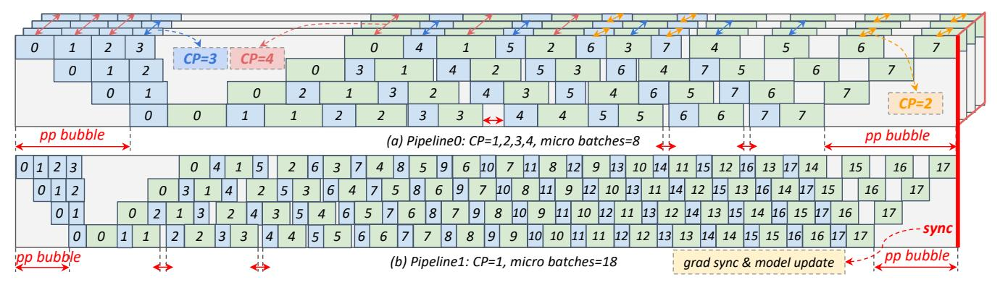

# **Algorithm 1:** Naive HDP Solution

```
Input: Global Batch \mathbb{B} = \{s_1, s_2, \dots, s_n\}, Rank Capacity C
   for each sequence s_i \in \mathbb{B} do
       Determine offload ratio r and minimum required
 2
        number of HDP ranks D(s_i) using Eq.(3);
       if d_i == 0 then
3
          Add s_i to pack list;
 5
          Update map^r[s_i] \leftarrow r and map^d[s_i] \leftarrow D(s_i);
7 while pack list is not empty do
       Pack subset by best-fit strategy to fill capacity C;
       Update map^r[subset] \leftarrow 0, map^d[subset] \leftarrow 1;
10 Assign sequences to d_{hdp} HDP ranks based on map^d;
11 Initialize act ctx for each micro-batch using map^r;
12 Return micro-batches, act_ctx for each HDP rank
```

Assume the number of layers per rank as l, the token capacity per rank as C. Given a sequence with length  $s_i \geq C$ , we define the computation time and activation size for each layer as  $T(s_i)$  and  $Act(s_i)$ , respectively. The bandwidths of D2H and H2D are profiled as  $B_{\rm d2h}$  and  $B_{\rm h2d}$ . We aim to find the offload ratio r that minimizes the required number of HDP ranks  $D(s_i)$  for  $s_i$  by Eq. (3), where  $\alpha_1$ ,  $\beta_1$ ,  $\alpha_2$ ,  $\beta_2$  and  $\gamma$  are coefficients we profiled for the cost model.

<span id="page-6-1"></span>
$$\arg \min_{r} D(s_i),$$
s.t. 
$$T(s_i) = \alpha_1 s_i^2 + \beta_1 s_i + \gamma, \ \operatorname{Act}(s_i) = \alpha_2 s_i + \beta_2,$$

$$D(s_i) = \lceil \frac{2 \times \operatorname{Act}(s_i) + (1 - r) \times (l - 2) \times \operatorname{Act}(s_i)}{l \times \operatorname{Act}(C)} \rceil,$$

$$T(s_i) \ge \frac{\operatorname{Act}(s_i) \times r}{\min(B_{d2h}, B_{h2d})},$$

$$1 \ge r \ge \min(1, \frac{l \times \operatorname{Act}(C)}{(l - 2) \times \operatorname{Act}(s_i)}).$$
(3)

Since different micro-batches have mutual independent forward and backward propagation, in Listing 1 we assign a separate *offload\_ratio* derived from Eq. (3) to each microbatch. This method effectively compresses the number of ranks required for long sequences from  $\frac{s_i}{C}$  to  $D(s_i)$ , as shown in Figure 11(a). It not only significantly reduces communication overhead but also enables the more available HDP ranks to process data, thereby improving efficiency.

Overlap Efficiency Discussion. As we know, the NCCL communication needs to occupy a portion of streaming multiprocessors (SMs), to reach the peak bandwidth over Infini-Band and NVLink. Consequently, even with communication-computation overlap, the computation kernels cannot fully utilize all the tensor cores, resulting in inefficiencies. Fortunately, the D2H and H2D kernel use the DMA engine rather than SMs, making it overlap perfectly with both computation and communication. Moreover, we use cached pinned host

<span id="page-7-1"></span>> **[图片提取文字 (无描述)]:**
> 6 pp bubble pp bubble (a) Pipeline0: CP=1,2,3,4, micro batches=8 9 13 10 14 11 15 12 15 16 9 12 10 13 11 14 12 15 13 16 14 17 15 16 181 11 10 12 11 13 12 14 13 15 14 16 15 17 17 10 10 11 11 12 12 13 13 14 14 15 15 16 16 17 17 9 grad sync & model update pp bubble pp bubble (b) Pipeline1: CP=1, micro batches=18


Figure 12. Balanced Data and Pipeline Parallelism

memory to further reduce the overhead of CPU memory allocation and speed up the data exchange between the device and host. Since pipeline parallelism interleaves the forward and backward propagation of different micro-batches, the D2H and H2D kernels could execute simultaneously, thereby maximizing the bidirectional bandwidth of PCIe.

#### 5.3 Overall Routine

The overall routine of ByteScale is outlined in Alg. 1. Briefly speaking, the algorithm traverses each sequence  $s_i$  in the global batch. For long sequences, it derives the offload ratio r and determines the required number of ranks  $D(s_i)$  (lines 1-6). For short sequences, it packs them to fill each rank's capacity C (lines 7-9). The processed sequences are then assigned to  $d_{\rm hdp}$  ranks, and the algorithm returns the microbatches and  $act\_ctx$ , for execution (lines 10-12).

#### 6 Balance Scheduler

In this section, we introduce the balance scheduler to address both the DP and PP imbalance issues. By carefully orchestrating data assignment (instead of line 10 in Alg. 1), it mitigates these imbalances while keeping the minimum communication as §5 performs. We will first outline several key insights and then propose our heuristic solution.

#### 6.1 Redefine micro-batch

Gradient accumulation requires that different DP ranks execute the same number of micro-batches, based on the assumption that all micro-batches have the same computational load. However, as mentioned in §3.3, execution times for different micro-batches can significantly vary. In ByteScale, we redefine a more flexible strategy, which enables different HDP ranks to process different numbers of micro-batches (same size but differ in workloads), to mitigate the imbalance issue. As shown in Figure 13, it makes all the ranks finish computation at the same time. More importantly, this strategy does not affect model convergence. Regardless of how sequences are assigned to HDP ranks, we finally calculate the sum of gradients from all tokens in the global batch, as discussed in §5.1, which ensures the mathematical equivalence.

<span id="page-7-0"></span>> **[图片提取文字 (无描述)]:**
> seglen seq0 seq1 seq2 seq3 seq4 seq5 GPU GPU GPU GPU GPU GPU sealen timeliné (a) DP Balance pipeline stages timeline (b) PP Balance


Figure 13. Balance Strategy

#### 6.2 Solve PP Imbalance

Insight 1: PP bubbles are less when sequences of different length levels are assigned to separate pipelines.

It is crucial to ensure that the pipeline processes microbatches with similar execution times. As illustrated in Figure 13(b), when  $d_{pp}=4$ , any 4 consecutive micro-batches on the timeline will be executed by 4 PP stages at the same time. If their execution times differ significantly, extra PP bubbles occur. Due to the limited number of long sequences in the global batch, some pipelines have to be assigned sequences of multiple length levels. Fortunately, only during transition phases (e.g., when 4 consecutive micro-batches belong to different length levels) will cause extra PP bubbles.

We assign more micro-batches to those pipelines with less average execution times. As illustrated in Figure 12(a)-(b), pipeline-0 handles micro-batches with larger average execution times and is therefore assigned only 8 micro-batches. In contrast, pipeline-1 is assigned 18 micro-batches to synchronize with pipeline-0. Additionally, due to more micro-batches, the bubble rate is further reduced.

