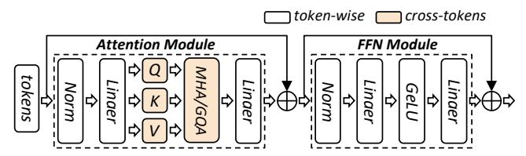

# 1 Introduction

In recent years, large language models (LLMs) have achieved remarkable success across various domains. The impressive performance of LLMs is attributed to increased model sizes, larger volumes of training data, and longer context windows, all in accordance with the scaling law [20]. The demand for long-context capabilities of LLMs has increased rapidly, as modern LLM applications like documents summarization [19], video understanding [41, 42], agent interaction [1] and code completion [27], require the model to understand long-range dependencies. It has driven many organizations to extend their models' context lengths. For instance, Meta's LLaMA3 [11] and OpenAI's GPT-40 [33] support 128K contexts, Anthropic's Claude3 [3] supports 200K, and Google's Gemini-1.5 Pro [13] supports up to 2M contexts.

A fundamental challenge in scaling to a long context is the quadratic scaling of memory and computation for selfattention. Flash Attention [7, 8] has been proposed to reduce the memory complexity from  $O(S^2)$  to O(S), where S is the sequence length. To further scale the context length, it's necessary to partition the sequences across multiple devices. There are broadly two categories: inter-data partitioning (a.k.a. Data Parallelism, DP [9, 24, 37]) distributes different sequences across the devices, while intra-data partitioning (a.k.a. Context Parallelism, CP [4, 23, 25, 31]) scatter a single sequence. Both categories evenly reduce the memory consumption on each device, while inevitably incurring extra communication overhead. Existing LLM training frameworks, such as Megatron-LM [21, 30, 38], DeepSpeed [17, 36] and MegaScale [18], treat the two categories as individual parallelism strategies, and establish DP×CP communication groups to organize the devices as a static mesh (e.g., a 2D mesh), where the size of each CP group is dependent on the maximum sequence length (i.e., context length). Undoubtedly, it requires the sequences to be of the same length so that the training workloads across devices are uniform.

Nevertheless, the sequences for LLM training usually vary in lengths. For one thing, sequence lengths typically exhibit skewed distribution in real-world datasets, no matter the text

\*Equal Contribution.

&lt;sup>†Corresponding Authors.

or multi-modal data. For another thing, inference-time scaling (e.g. OpenAI's o1 [34], DeepSeek-R1 [10]) increases the length of the Chain-of-Thought reasoning process, further exacerbates length heterogeneity for reinforcement learning. When facing the sequences with variable lengths, existing frameworks can only configure the size of CP groups to be large enough to handle the longest sequences (yielding a small DP size), and each sample needs to be evenly partitioned across the entire CP group, regardless of sequence length, degrading the overall training efficiency.

In particular, the mismatch between data heterogeneity and static system design causes two main challenges (detailed in §3). (1) **Redundant Communication**: It is common practice to pack [22] shorter sequences into a single one up to the context length and configure a sufficient CP size to prevent out-of-memory (OOM) errors. However, all short sequences have to undergo the same partitioning and communication process as long sequences, even if it is unnecessary. Worse yet, CP requires  $O(S^2)$  computation to overlap O(S)communication, which is challenging for short sequences. (2) **Imbalanced Computation**: Although tokens are evenly partitioned across devices by CP and memory is balanced, execution times still vary. This is because the computational complexity of each token is related to the original sequence length, which is  $O(S^2)$ . The imbalanced computation causes some devices to fall into idle time for synchronization.

**Summary of Contributions.** To address the aforementioned challenges, we propose ByteScale, an efficient, flexible, and scalable training framework designed for large-scale mixed training of long and short sequences. The main contributions are as follows:

C1: Proposal of Hybrid Data Parallelism. We propose a novel parallelism strategy, namely Hybrid Data Parallelism (HDP), which unifies both inter-data (DP) and intra-data partitioning (CP), and is defined to evenly distributing <u>tokens</u> across devices. It utilizes devices in the range of [1, DP×CP] to flexibly process variable-length sequences.

C2: Communication Optimizations. To eliminate redundant communication for short sequences, HDP provides the ability of data-aware sharding, where dynamic communication groups are automatically built and each sequence will be processed with a minimal number of devices individually. Besides, HDP also provides selective offloading to further compress the communication cost for long sequences.

C3: Balance Strategy. To mitigate the imbalanced computation, we design a heuristic algorithm that reorganizes data assignment based on the characteristics of data and pipeline parallelism. Furthermore, for those devices with shorter execution times, we assign more micro batches, rather than the same number under the static system design.

*C4: Evaluation.* We conduct experiments on a production cluster with more than 12,000 GPUs, scaling the model size from 7B to 141B, and context length from 256K to 2048K. The

> **[图片提取文字 (无描述)]:**
> token-wise cross-tokens Attention Module FFN Module

Figure 1. the Architecture of Transformer layer

> **[图片提取文字 (无描述)]:**
> time mem x 4 x4 (d) attn mask & time (c) packing (a) origin batch (b) padding

Figure 2. Sequence Padding and Packing

results demonstrate that ByteScale achieves up to 7.89× of speedup compared to existing training approaches.

