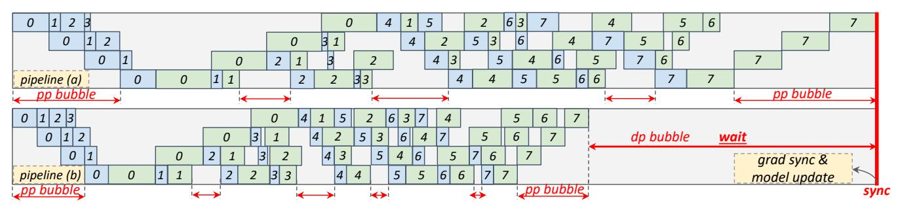
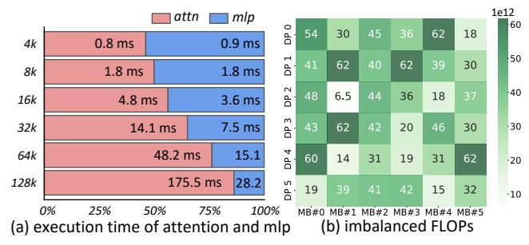
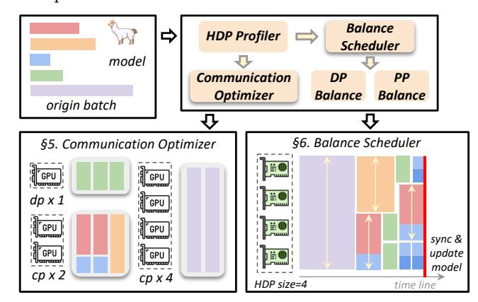

# 3.1 Data Heterogeneity

LLMs are trained on sequences data. As mentioned in §1, the training data typically consists of variable-length sequences. There exist two observations and one significant challenge:

Observation 1: sequence lengths exhibit skewed distribution in real-world datasets. As shown in Figure 4, we profiled the sample and token distribution of two datasets: an open-source dataset *GitHub* and a productive dataset *Byted* for long-context training. We observed that both of them exhibit a skewed distribution in sequence lengths. For instance, in the *Byted* dataset, if we randomly sample a global batch, nearly 80% of the samples are 4K tokens or shorter, while only 0.05% of the samples can reach 2M tokens. However, from the perspective of token distribution, those 0.05% of the samples (>=2M) contribute 12.1% of the tokens in the global batch, and 1% of the samples (>=128K) contribute 44.3%. Although the *GitHub* dataset has a lower proportion of long sequences, 16.2% of its tokens come from sequences exceeding 128K, demonstrating significant data heterogeneity.

Observation 2: mixing long and short sequences enhances model performance. The existing work [12] has demonstrated that training exclusively on long-context data can lead to a decline in short-context performance. LLaMA3 report [11] indicates that when training a model with 128K context, mixing 0.1% of long data with the original short data optimizes the performance across both short-context and long-context benchmarks. DeepSeek-R1 [10] presents the average response length on the training set during the RL process, demonstrating that gradually increasing and diverse response lengths help improve model performance.

> **[图片提取文字 (无描述)]:**
> 6 3 4 pipeline (a) pp bubble pp bubble 0 dp bubble wait 3 16 6 grad sync & model update pipeline (b) pp bubble sync

Figure 5. Imbalanced Data and Pipeline Parallelism

> **[图片提取文字 (无描述)]:**
> 1e12 attn mlp 60 DP 0 62 54 45 30 18 0.8 ms 0.9 ms 4k 50 DP 1 62 62 30 1.8 ms 8k 1.8 ms DP 2 44 -40 6.5 36 18 16k 4.8 ms 3.6 ms DP 3 7.5 ms 43 32k 62 42 14.1 ms 20 30 -30 DP 4 15.1 64k 48.2 ms 60 14 31 19 31 62 -20 175.5 ms 28.2 128k DP 5 19 42 15 32 41 -10 0% 25% 50% 75% 100% MB#0 MB#1 MB#2 MB#3 MB#4 MB#5 (a) execution time of attention and mlp (b) imbalanced FLOPs

Figure 6. Imbalanced Computation

Challenge: data heterogeneity leads to efficiency degradation. Although mixed training of long and short sequences is common and beneficial for model performance, it introduces new challenges. The static parallelism strategies used in existing systems are not well-suited to handle dynamic workloads. This causes issues of redundant communication (§3.2) and imbalanced computation (§3.3), which we will discuss in more detail below.

#### 3.2 Redundant Communication

Existing systems apply static parallelism strategies throughout the training process. Typically, they assume that all (packed) sequences are of the same length and set a fixed CP degree to amortize them across enough devices, thereby avoiding OOM errors. As mentioned in §2.3, to handle variable-length sequences, it is common to pack sequences up to the context length. However, as depicted in Figure 3(a)-(b), all sequences have to be partitioned across the entire CP group, even if it is unnecessary for shorter ones.

For instance, assuming that each device has a capacity of 8K tokens, to train an LLM with a context length of 1M tokens, a CP degree of 128 is required. This configuration necessitates 128 individual devices to process a sequence of 1M tokens. Concurrently, a large number of shorter sequences, such as those with lengths of 4K, 8K, and 16K tokens, are packed up to 1M tokens and processed in a CP group with 128 devices. As depicted in Figure 14, each subsequence within the packed sequence needs to be partitioned into 128 chunks across CP ranks, performing ring-P2P communication. In fact, it is unnecessary to perform cross-device partitioning and communication for sequences with lengths under 8K. For those sequences with 16K tokens, only two CP ranks are

> **[图片提取文字 (无描述)]:**
> Balance **HDP Profiler** Scheduler model Communication DP PP Optimizer Balance Balance origin batch §6. Balance Scheduler §5. Communication Optimizer GPU dp x 1 GPU GPU sync & update GPII model cp x 2 cp x 4 HDP size=4 time line

Figure 7. ByteScale Overview

required. Using the same CP degree as for the maximum sequence length leads to excessive redundant communication for these shorter sequences. This issue is exacerbated when sequence lengths are highly skewed.

