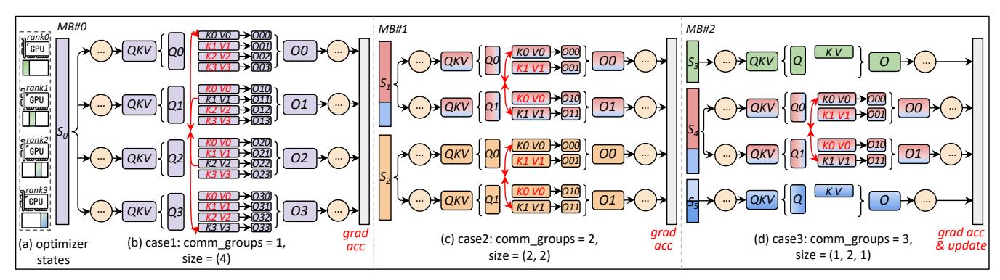

# 3.3 Imbalanced Computation

Imbalanced FLOPs. Although Flash Attention enables linear packing with O(S) memory complexity, the computational complexity for each subsequence remains  $O(S^2)$ . As depicted in Figures 2(d) and 3(c), even if two packed sequences contain the same number of tokens, their actual computational workloads differ, which are proportional to the areas of attention mask. As shown in Figure 6(a), when the context length is shorter than 8K tokens, the  $O(S^2)$  term is relatively insignificant, allowing packing to effectively balance workloads for both memory and computation. However, for long-context training tasks, the  $O(S^2)$  term becomes the predominant component of the computation, leading to significant time imbalances across different packed sequences.

To provide an intuitive explanation, we sampled a global batch of 1.2M tokens from the *GitHub* dataset and randomly packed them into micro-batches of up to 32K tokens, aligning with the model's context length. As shown in Figure 6(b), we recorded the FLOPs (Floating Point Operations) for each micro-batch and observed significant variability, indicating that the execution time for each micro-batch also differs.

*Imbalanced Data and Pipeline Parallelism.* The imbalanced execution times across micro-batches further degrade

> **[图片提取文字 (无描述)]:**
> MB#1 MB#2 GPU grad acc grad (c) case2: comm\_groups = 2, (d) case3: comm\_groups = 3, (b) case1: comm\_groups = 1, (a) optimizer & update acc size = (2, 2)size = (1, 2, 1)size = (4)states

Figure 8. Illustration of HDP

the efficiency of data and pipeline parallelism. In data parallelism, all DP ranks must execute the same number of micro-batches, and then synchronize gradients before the model update. As illustrated in Figure 3(c), rank-2 processes tokens with fewer FLOPs than rank-0, leading to idle time (i.e. DP Bubble) as it waits for synchronization. In pipeline parallelism, there are two types of "bubbles": the PP bubble occurs within a single pipeline, and the DP bubble occurs across different pipelines (different DP groups). Aside from PP bubbles during the warmup and cooldown phases, imbalanced FLOPs between micro-batches prevent the execution time on different devices from overlapping as they would in an ideal pipeline. This leads to extra PP bubbles caused by inter-stage waiting, as shown in Figure 5. Additionally, since each micro-batch is executed sequentially across  $d_{pp}$  different stages in the pipeline, any DP bubble will be magnified by a factor of  $d_{\rm pp}$ . For example, consider two pipelines illustrated in Figure 5, the micro-batches 0 and 7 in the pipeline (a) have a longer forward and backward execution time compared to those in the pipeline (b). Under  $d_{pp} = 4$ , this time gap is magnified fourfold. Consequently, after executing 8 micro-batches, the pipeline (b) falls into a prolonged idle period, waiting for gradient synchronization. This causes the DP bubble to account for over 30% of the total execution time, far exceeding the normal pipeline bubble time.

