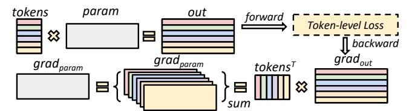

# <span id="page-4-1"></span>5 Communication Optimizer

This section describes how ByteScale optimizes communication overhead. First, it reduces redundant communication

for short sequences by dynamic sequence sharding and communication. Second, it further compresses the communication cost for long sequences by selective offloading.

#### <span id="page-4-2"></span>5.1 Data-Aware Sharding and Communication

*Hybrid Data Parallelism.* To begin with, we introduce a novel parallelism strategy, namely Hybrid Data Parallelism (HDP), to enable efficient training for different levels of sequence lengths. Both DP and CP partition training data across devices. DP performs inter-data partitioning by distributing different samples evenly across devices, while CP performs intra-data partitioning by sharding a single sample across devices. HDP unifies both inter-data and intra-data partitioning and is defined to evenly distribute *tokens* across devices. It can replace traditional DP and CP, with the parallel degree of HDP equivalent to the product of the degrees of DP and CP (i.e.  $d_{\rm hdp} = d_{\rm dp} \times d_{\rm cp}$ ).

Unlike DP and CP, which require all DP/CP ranks to perform consistent behavior in computation or communication (e.g. CP requires all CP ranks to participate in homogeneous ring-P2P communication), HDP allows for heterogeneous behavior among HDP ranks. It has two key characteristics:

- ① More Flexible Communication: HDP only requires that different HDP ranks handle an equal number of tokens. This means that some HDP ranks may be assigned complete sequences (short sequences), as illustrated by  $S_3$  and  $S_5$  in Figure 8(d), while some other ranks may only handle the partial slice of a sequence (long sequences), as shown with  $S_4$  in Figure 8(d). This necessitates establishing more flexible communication groups. For instance, in Figure 8(d), a communication group of size 2 is created only between rank-[1~2] to compute the distributed attention for  $S_4$ , while rank-0 and 3 can perform local computation without cross-device communication. In Figure 8(b), sequence  $S_0$  is sharded into four slices, and a communication group of size 4 is created among rank-[0~3].
- ② More Finer-Grained Communication: Static parallel strategies require that the product of the parallel degrees equals the number of devices in the cluster, i.e.  $d_{\rm dp} \times d_{\rm cp} \times d_{\rm tp} \times d_{\rm pp} = N_{\rm cluster}$ , where  $d_{\rm tp}$  and  $d_{\rm pp}$  are actually fixed based on model size. To utilize all the devices and maintain

<span id="page-5-0"></span>> **[图片提取文字 (无描述)]:**
> tokens param out forward Token-level Loss backward tokens<sup>™</sup> param


Figure 9. Token-Level Gradient

<span id="page-5-3"></span>> **[图片提取文字 (无描述)]:**
> CPU \_\_\_\_ ıme Compute: O(N²) vs D2H & H2D: O(N) compute Cartivation31 D2H seglen compute activation30 activation overlap activation1 D2H activation 0,1,...,30 activation0 activation0 0,1,...,29 layer31 layer0 layer1 layer30 layer0 layer30 layer31 layer1 compute overlap compute activation31 compute activation30 H2D H<sub>2</sub>D activation1 activation activation 0,1,...,30 activation0 activation0 0,1,...,29


Figure 10. Per-Layer Activation Offloading

this divisibility,  $d_{\rm dp}$  and  $d_{\rm cp}$  can only be scaled by a limited factor, resulting in coarse granularity (e.g. assume each rank can handle 8K tokens, 512K can use  $< d_{\rm dp} = 2$ ,  $d_{\rm cp} = 64>$ , while 768K needs  $d_{\rm cp} = 96$  but must use  $< d_{\rm dp} = 1$ ,  $d_{\rm cp} = 128>$ ). Meanwhile, HDP can use any amount of ranks in  $[1, d_{\rm hdp}]$  to handle a sequence without considering the divisibility constraints (e.g. with  $d_{\rm hdp} = d_{\rm dp} \times d_{\rm cp} = 128$ , HDP can use 96 ranks to handle a 768K sequence while use rest 32 ranks to handle  $32 \times 8$ K sequences individually).

NCCL Buffer Optimization. Creating NCCL communication groups incurs extra overhead. Firstly, the process of establishing a communication group is inherently slow, and dynamically creating new groups for each sequence can significantly reduce training efficiency. Secondly, creating an excessive number of communication groups can consume an additional 5~10GB of memory per GPU for NCCL buffers, further reducing the available memory. Fortunately, distributed attention utilizes P2P communication. With a global communication group across all HDP ranks, P2P communication between any two devices can directly reuse the existing group, thereby alleviating the time and memory pressure associated with creating temporary communication groups.

*Optimizer States Sharding.* HDP evenly partitions tokens across devices, and will shard neither model parameters nor gradients. This means that HDP ranks replicate the model states like DP. Consequently, the ZeRO series technique is also suitable to HDP, as shown in Figure 8(a), HDP utilizes ZeRO-1 across all the HDP ranks to maximally shards the optimizer states, minimizing the memory usage.

Loss and Model Update. Even though HDP ranks may perform different heterogeneous communications across different micro-batches, the final gradient for a parameter is equivalent to that obtained in standard DP. As shown in Figure 9, each token contributes a gradient to the parameter  $\theta_n$ , and the final gradient, denoted as  $G_{\theta_n}$ , is the sum over

<span id="page-5-4"></span>> **[图片提取文字 (无描述)]:**
> forward graph Devices Mapping graph ctx GPU A GPU A GPU A GPU pack hook gpu tensor activation parameter cur layer D2H pop push tensor tag = {layer id, act id} activations offload CPU Memory prev layer reload tensor tag = {layer id, act id} pop 🔻 activations H2D push activation parameter < gpu tensor unpack hook **Devices Mapping** graph ctx GPU ' A GPU backward graph (a) selective offloading (b) activation offloading


Figure 11. Data-Aware Selective Offloading

gradients from all tokens in global batch (denoted as  $\mathbb{B}$ ). Let grad $(j, \theta_n)$  represent the gradient from the token j to the parameter  $\theta_n$ . Then  $G_{\theta_n}$  can be presented as:

<span id="page-5-2"></span>
$$G_{\theta_n} = \sum_{S_i \in \mathbb{B}} \left( \sum_{j \in S_i} \operatorname{grad}(j, \theta_n) \right) \tag{1}$$

Since parameters are replicated and tokens are evenly distributed across HDP ranks (denoted as  $\mathbb{R}$ ), the local accumulated gradient corresponds to the partial sum of gradients from tokens assigned to each rank (denoted as  $\mathbb{B}^r$ , i.e. microbatches in rank r). Consequently, similar to DP, a global collective communication like All-Reduce or Reduce-Scatter will be performed across all HDP ranks to aggregate partial gradients. This also yields the gradient  $G_{\theta_n}$  from all tokens:

<span id="page-5-1"></span>
$$G_{\theta_n} = \sum_{r \in \mathbb{R}, \ \mathbb{B}^r \in \mathbb{B}} \left( \sum_{m \in \mathbb{B}^r} \left( \sum_{j \in m} \operatorname{grad}(j, \theta_n) \right) \right) \tag{2}$$

The Eq.(2) is equivalent to Eq.(1), and ensures that the result of gradient accumulation in HDP is equivalent to that in standard DP. Moreover, since we calculate the gradient  $G_{\theta_n}$  over all tokens in the global batch, it also needs to be scaled by the total amount of tokens, as we implement this by the *token-level loss*, which scales the loss by the token amount rather than sample amount.

#### 5.2 Data-Aware Selective Offloading

Activation Offloading. The activation size is proportional to the sequence length. Constrained by GPU memory, longer sequences require more HDP ranks to distribute the activation. For example, processing a sequence with 1M tokens requires 128 ranks if each rank can handle 8K tokens, which is usually unaffordable with today's expensive GPU resources. In practice, modern GPU servers are typically equipped with CPU memory that far exceeds GPU memory. Therefore, an alternative approach is to offload activations to the CPU, thereby reducing the required amount of ranks. There are two characteristics to support the feasibility of this approach:

① **Activation is first-in-last-out**: As shown in Figure 10, given any sequence, during the forward propagation, it will

be processed sequentially by transformer layers, and activations will be gradually accumulated until reaching a peak after the final layer. Subsequently, during the backward propagation, these activations will be consumed from the last layer to the first one. Since the activations produced by earlier layers are used more later (i.e. FILO), it is promising to offload these activations to the CPU during the forward propagation and reload them back into GPU when needed in the backward propagation.

②  $O(N^2)$  computation can overlap O(N) offloading: It is well-known that transferring data between GPU and CPU is typically inefficient due to the limited PCIe bandwidth. The offloading time usually far exceeds the computation time, making it impractical. Fortunately, as mentioned in §2.4, the computational complexity of attention is  $O(S^2)$ , while the memory complexity is O(S). Therefore, for sufficiently long sequences, the  $O(S^2)$  computation time will inevitably surpass the O(S) data transfer time, allowing the offloading to be perfectly masked under computation.

As illustrated in Figure 11(b), we designed a general component named act\_ctx (Listing 1) to support activation offloading. This component maintains two cuda streams for D2H (Device-to-Host) and H2D (Host-to-Device) separately. It automatically captures activation tensors from the computation graph and offloads them to the CPU (use async-CudaMemcpy API) at appropriate times during the forward propagation, and establishes asynchronous dependencies between the D2H stream and the computation stream. The original tensor in the computation graph is replaced with the metadata {layer id, act id}. Similarly, during the backward propagation, the metadata stored in the computation graph is used to index and reload corresponding activations in the H2D stream. Figure 10 illustrates the whole process. The act\_ctx also supports a parameter named offload\_ratio, providing token-level fine-grained control over the proportion of activations offloaded to the CPU. This capability balances GPU memory savings with optimal overlap of computation.

```
# Separate offload_ratio to each micro-batch
act_ctx = get_act_ctx(num_micro_batch, offload_ratios)
# forward of micro-batch-i
act_ctx.update_micro_batch_id(i)
with act_ctx:
forward_func(...)
# backward of micro-batch-j
act_ctx.update_micro_batch_id(j)
with act_ctx:
backward_func(...)
```

**Listing 1.** usage of act\_ctx

Selective Offloading. Activation offloading leverages CPU memory to alleviate the burden on GPU memory. However, only for long sequences the computation can perfectly overlap with offloading. This means we cannot offload all tokens assigned to each rank indiscriminately. Instead, we must selectively offload each token based on the FLOPs.

