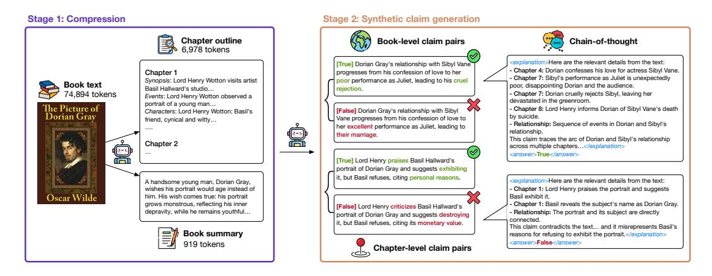

# **1 Introduction**

Due to the high cost of human-annotated data, LLM developers increasingly rely on *synthetic* data (generated by LLMs) to boost instruction following and reasoning capabilities [\(Ding](#page-10-0) [et al.](#page-10-0) [2023;](#page-10-0) [Lambert et al.](#page-11-0) [2024;](#page-11-0) [Yang et al.](#page-14-0) [2025,](#page-14-0) *inter alia*). As the context size of LLMs extends to millions of tokens, it is important to ensure that we have scalable and performant strategies to create synthetic data for *long-context* tasks. Prior work creates such data by (1) selecting a long document or a smaller chunk within; and (2) prompting an LLM to generate input/output pairs using the selected text [\(Bai et al.,](#page-10-1) [2024;](#page-10-1) [Dubey et al.,](#page-10-2) [2024\)](#page-10-2).

While this strategy is effective for tasks like summarization and QA, we show that it breaks down for more complex reasoning-oriented tasks like *narrative claim verification*, in which a model must judge whether a statement about a long input text is true or false. The majority of narrative claims in the NoCha benchmark [\(Karpinska et al.,](#page-11-1) [2024\)](#page-11-1), which was created by human readers of fictional books, can only be verified by *global* reasoning over events, characters, and relationships.[2](#page-0-1) This poses a challenge to even the best LLMs: OpenAI's o1-preview currently leads with an accuracy of 67.4% (far below human performance). If no LLM can reliably solve the task, how can we produce and validate synthetic data for it?

We tackle this challenge by introducing CLIPPER, a synthetic data generation pipeline that operates in two stages (Figure [1\)](#page-1-0). First, a long document is *compressed* by an LLM into

1CLIPPER stands for **C**ompressing **L**ong **I**n**P**uts.

2Creating NoCha is costly and challenging: annotators read full books and earn \$1.70 per claim.

> **[图片提取文字 (无描述)]:**
> Stage 1: Compression Stage 2: Synthetic claim generation Chapter outline Book-level claim pairs Chain-of-thought 6.978 tokens <explanation>Here are the relevant details from the text: True! Dorian Grav's relationship with Sibvl Vane Chapter 4: Dorian confesses his love for actress Sibvl Vane. Chapter 1 progresses from his confession of love to her Chapter 7: Sibyl's performance as Juliet is unexpectedly Synopsis: Lord Henry Wotton visits artist poor performance as Juliet, leading to his cruel Book text poor, disappointing Dorian and the audience. Basil Hallward's studio rejection. 74.894 tokens Chapter 7: Dorian cruelly rejects Sibyl, leaving her Events: Lord Henry Wotton observed a devastated in the greenroom. portrait of a young man... The Picture of Chapter 8: Lord Henry informs Dorian of Sibyl Vane's death [False] Dorian Gray's relationship with Sibvl. Characters: Lord Henry Wotton: Basil's Dorian Gray by suicide. Vane progresses from his confession of love to friend, cynical and witty... - Relationship: Sequence of events in Dorian and SibvI's her excellent performance as Juliet, leading to relationship. their marriage. This claim traces the arc of Dorian and Sibvl's relationship Chapter 2 across multiple chapters...</explanation> canswer>True</answer> [True] Lord Henry praises Basil Hallward's portrait of Dorian Gray and suggests exhibiting it, but Basil refuses, citing personal reasons, <explanation>Here are the relevant details from the text: A handsome young man, Dorian Gray, wishes his portrait would age instead of Chapter 1: Lord Henry praises the portrait and suggests Oscar Wilde him. His wish comes true: his portrait Basil exhibit it grows monstrous, reflecting his inner Chapter 1: Basil reveals the subject's name as Dorian Gray. [False] Lord Henry criticizes Basil Hallward's degravity, while he remains youthful... Relationship: The portrait and its subject are directly portrait of Dorian Gray and suggests destroying connected it, but Basil refuses, citing its monetary value. This claim contradicts the text... and it misrepresents Basil's Book summary reasons for refusing to exhibit the portrait.</explanation> canswer>False</answer> 919 tokens Chapter-level claim pairs

Figure 1: CLIPPER overview. (1) *Compression*: An LLM generates chapter outlines (8.7K tokens) and summaries (618 tokens) from books (90K tokens). (2) *Claim generation*: The LLM produces true/false claims with chains-of-thought with the outlines and summaries.

summaries and/or outlines that contain salient events. Then, the LLM generates claims based on the compressed narrative, with optional instructions to write claims that require reasoning over multiple chapters to verify. Each claim is accompanied by a chain-of-thought reasoning trace that grounds it within specific chapters where relevant events occur.

Compared to the na¨ıve strategy of prompting an LLM with the entire (uncompressed) book, CLIPPER significantly reduces the error rate in the claims from 73.1% to 16.7%, while also producing more claims at a lower cost. Why does this work? Prior work has shown that LLMs are high-quality summarizers of long documents [\(Chang et al.,](#page-10-3) [2024;](#page-10-3) [Kim et al.,](#page-11-2) [2024\)](#page-11-2). By operating on compressed representations, we also address the known degradation of instruction-following in long-context settings [\(Wu et al.,](#page-14-1) [2024b;](#page-14-1) [Levy et al.,](#page-12-0) [2024\)](#page-12-0) and thus reduce the complexity of the claim generation process.

We use CLIPPER to generate a dataset containing 19K claims about public-domain fictional books. Fine-tuning open-weight models like Llama-3.1-8B-Instruct [\(Dubey et al.,](#page-10-2) [2024\)](#page-10-2), ProLong-512K-8B-Base [\(Gao et al.,](#page-10-4) [2024c\)](#page-10-4) and Qwen2.5-7B-Instruct [\(Qwen et al.,](#page-13-0) [2024\)](#page-13-0) on this dataset yields large improvements on narrative claim verification and positive transfer to other narrative-related tasks (e.g., NarrativeQA, MuSR). For instance, fine-tuning Llama-3.1-8B-Instruct on our data doubles its NoCha performance (from 16.5% to 32.2%) and almost triples its test set performance (from 27.9% to 76.0%). Our fine-tuned Qwen model sets a new state of the art on NoCha for <10B models, outperforming closed models like Gemini 1.5 Flash 8B [\(Team et al.,](#page-13-1) [2024\)](#page-13-1) and OpenAI o1-mini [\(OpenAI,](#page-12-1) [2024\)](#page-12-1).

While our approach is promising for improving long-context reasoning in open-weight models, our best models fall well short of the performance reached by closed LLMs such as o1 on NoCha. The performance gap between NoCha and CLIPPER-test likely stems from the nature of the claims, as CLIPPER-test features synthetic claims based on model-generated outlines, while NoCha's human-written claims require reasoning about details often absent from such outlines. We analyze where our fine-tuned models can still improve, discovering that they benefit more from training on claims whose evidence is localized to a single chapter (and not more complex multi-chapter claims). We hope future work will use our data generation pipeline for fine-tuning larger models (e.g., >70B) on other long-context tasks to further improve global reasoning abilities. In summary, our contributions are:

- 1. CLIPPER: A compression-based pipeline for synthesizing grounded long-context data at low cost, producing 19K claim-book pairs for narrative claim verification.
- 2. Fine-tuned open-weight models that advance claim verification and narrative understanding, showing the benefits of training on data generated with CLIPPER.

