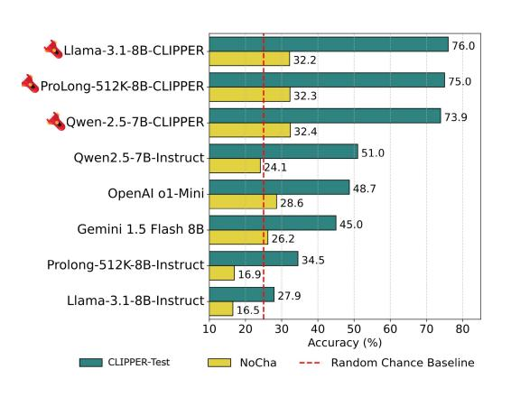

# 4.1 CLIPPER models outperform baselines on narrative claim verification

On CLIPPER-test, our fine-tuned models significantly outperform the instruct models they are initialized from (referred to as baselines), 16 as shown in Table 2.

For example, Qwen-CLIPPER achieves over a 20% performance gain compared to Qwen-Instruct, while Llama-CLIPPER sees nearly triple the performance of Llama-Instruct. These substantial improvements demonstrate the effectiveness of CLIPPER-generated data.

Fine-tuning on our data improves performance on NoCha: A similar trend is observed on NoCha. The performance improvements range from an 8% gain for strong baselines like Qwen-Instruct to a twofold increase for weaker baselines such as Llama-Instruct and ProLong-Instruct. It is worth noting that all baseline models initially perform below the random chance baseline of 25%, but our fine-tuned models consistently surpass this threshold.

> **[图片提取文字 (无描述)]:**
> 76.0 Llama-3.1-8B-CLIPPER 32.2 75.0 ProLong-512K-8B-CLIPPER 32.3 73.9 Qwen-2.5-7B-CLIPPER 32.4 51.0 Qwen2.5-7B-Instruct 24.1 48.7 OpenAl o1-Mini 28.6 45.0 Gemini 1.5 Flash 8B 26.2 34.5 Prolong-512K-8B-Instruct 16.9 27.9 Llama-3.1-8B-Instruct 16.5 10 20 30 40 50 60 70 80 Accuracy (%) CLIPPER-Test NoCha Random Chance Baseline

Figure 2: Results on CLIPPER's test set and NoCha for baselines, small closed models, and CLIPPER models. Fine-tuning on our synthetic data significantly improves narrative claim verification.

Performance gap between CLIPPER-test

and NoCha: We note that the performance gap between NoCha and CLIPPER-test is likely due to the nature of the events involved in the claims. While CLIPPER-test consists of synthetic claims derived from events in model-generated outlines, NoCha's human-written claims may involve reasoning about low-level details that may not typically appear in such

&lt;sup>16ProLong-CLIPPER is initialized from ProLong-Base instead of ProLong-Instruct. However, since performing evaluation intended for instruct models on a continually pretrained model may not be ideal, we exclude ProLong-Base's results from Table 2. As shown in Table 19, ProLong-Base performs significantly worse than ProLong-Instruct on CLIPPER-test.

**Claim:** "Jacques consistently uses pastoral themes to express his love for Belle-bouche, first through metaphorical discussions of shepherds and shepherdesses, and later while walking through an orchard and discussing Arcadian lovers."

**Llama-Instruct's CoT:** "The statement claims that Jacques consistently uses pastoral themes to express his love for Belle-bouche. To evaluate this statement, we need to examine the text and identify instances where Jacques uses pastoral themes to express his love for Belle-bouche. The text mentions that Jacques discusses crooks, flowers, and shepherdesses with Belle-bouche, and later, while walking through an orchard, he talks about Arcadian lovers, specifically mentioning Strephon, Chloe, Corydon, Daphnis, and Narcissus. These instances suggest that Jacques does use pastoral themes to express his love for Belle-bouche. However, we need to consider whether this is a consistent pattern throughout the text." *Answer: TRUE*

**Llama-CLIPPER's CoT:** "Here are the relevant details from the text:

- Chapter 2: Jacques engages in a metaphorical discussion about shepherds and shepherdesses, expressing his love for Belle-bouche.
- Chapter 17: Jacques and Belle-bouche walk through the orchard, discussing the twentieth of May as a day for lovers.
- Relationship: Recurring theme of pastoral love

In Chapter 2, Jacques engages in a metaphorical discussion about shepherds and shepherdesses to express his love for Belle-bouche. This theme continues in Chapter 17, where Jacques and Belle-bouche walk through an orchard, discussing the twentieth of May as a day for lovers. This connection shows Jacques' consistent use of pastoral imagery to convey his romantic feelings for Belle-bouche throughout the story." *Answer: TRUE*

Table 3: Comparison of CoT responses from Llama-Instruct and Llama-CLIPPER for a claim in John Esten Cooke's The Youth of Jefferson. Llama-CLIPPER includes more explicit chapter references (green) and details than Llama-Instruct (red).

generated outlines. Future work could incorporate more low-level events into chapter outlines to create more diverse claims.

