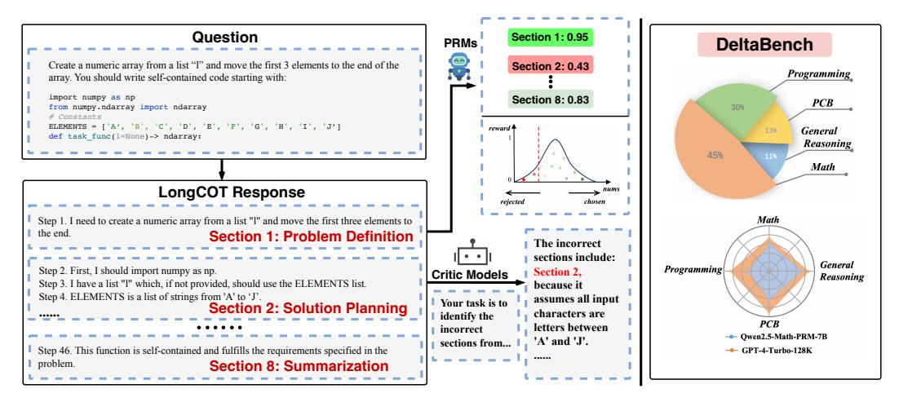
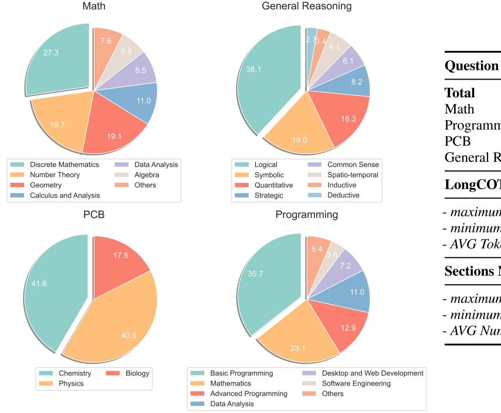
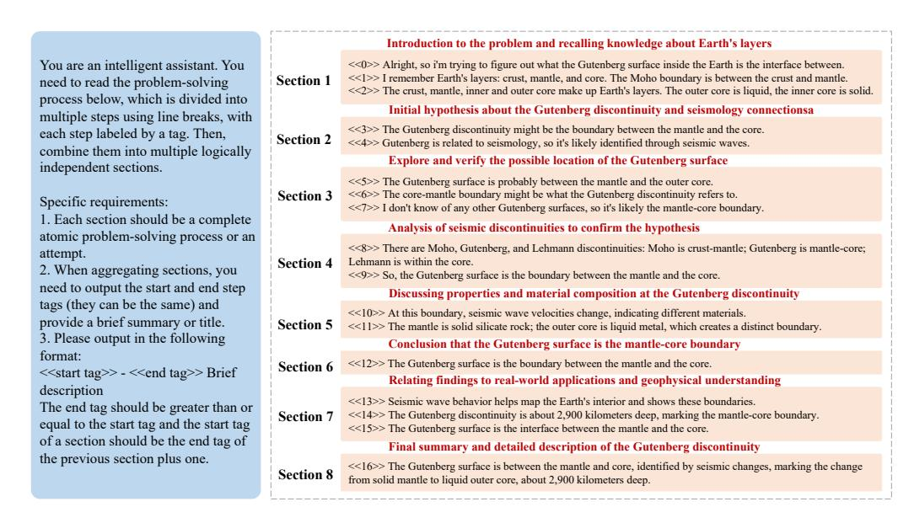

# 1 Introduction

Large Language Models (LLMs) have witnessed remarkable progress in recent years [\[Dubey et al.,](#page-13-0) [2024,](#page-13-0) [He et al.,](#page-15-0) [2024a,](#page-15-0) [Li et al.,](#page-15-1) [2024a,](#page-15-1) [Zhang et al.,](#page-15-2) [2024a\]](#page-15-2). Among these advancements, o1-like LLMs have emerged to greatly improve reasoning capabilities by generating long Chain-of-Thought (CoT) reasoning steps [\[OpenAI,](#page-15-3) [2024,](#page-15-3) [Guo et al.,](#page-15-4) [2025\]](#page-15-4).

However, despite the growing popularity of o1-like models and their long CoT reasoning approaches, *systematic evaluation of the quality and effectiveness of the generated reasoning chains is not well investigated*, which poses a significant challenge in understanding the capabilities and limitations of these models [\[Chen et al.,](#page-15-5) [2024a,](#page-15-5) [Yeo et al.,](#page-15-6) [2025\]](#page-15-6). Besides, as LLMs continue to evolve, further improving their performance has become increasingly challenging. One of the key areas of focus in this regard is the development of critique ability, which measures the capability to provide detailed analysis, constructive suggestions, and refinement feedback suggestions for solutions generated by other models or even themselves [\[Lan et al.,](#page-15-7) [2024,](#page-15-7) [Lin et al.,](#page-15-8) [2024,](#page-15-8) [Tan et al.,](#page-15-9) [2024,](#page-15-9) [Song et al.,](#page-15-10) [2025,](#page-15-10) [Zheng et al.,](#page-15-11) [2024a\]](#page-15-11). However, *evaluating the critique abilities of existing LLMs (e.g., critic models or process reward models) on the long CoT reasoning steps has not been explored*.

Therefore, to address the aforementioned challenges, we introduce DeltaBench, the first dataset to analyze the qualities of the long CoTs generated by o1-like models and evaluate the critique abilities to Detect Error in Long CoT ReAsoning of existing critic models and PRMs in Figure [1.](#page-1-0) Specifically, in DeltaBench, we first collect a diverse collection of long CoTs generated by various o1-like models

\* Equal Contribution. † Corresponding Author.

1The dataset is available at <https://github.com/OpenStellarTeam/DeltaBench>.

> **[图片提取文字 (无描述)]:**
> Question Section 1: 0.95 **PRMs** DeltaBench Create a numeric array from a list "I" and move the first 3 elements to the end of the Section 2: 0.43 Programming array. You should write self-contained code starting with: import numpy as np Section 8: 0.83 PCB from numpy.ndarray import ndarray 30% # Constants ELEMENTS = ['A', 'B', 'C', 'D', 'E', 'F', 'G', 'H', 'I', 'J'] 13% General def task func(1=None) -> ndarray: Reasoning 45% Math LongCOT Response Step 1. I need to create a numeric array from a list "1" and move the first three elements to Math the end. Section 1: Problem Definition The incorrect sections include: General Programming Step 2. First, I should import numpy as np. Section 2. Critic Models Reasoning Step 3. I have a list "I" which, if not provided, should use the ELEMENTS list. because it Step 4. ELEMENTS is a list of strings from 'A' to 'J'. assumes all input Your task is to Section 2: Solution Planning characters are identify the PCB letters between incorrect - Owen2.5-Math-PRM-7B 'A' and 'J'. sections from... Step 46. This function is self-contained and fulfills the requirements specified in the → GPT-4-Turbo-128K problem. Section 8: Summarization

Figure 1: Illustration of the evaluation process for critic models and Process Reward Models (PRMs) for DeltaBench.

(i.e., QwQ, DeepSeek-R1, and Gemini 2.0 Flash Thinking) across different reasoning tasks such as **Math**, **Programming**, **PCB** (physics, chemistry and biology), and **General Reasoning**. Then, we divide each long CoT into different sections, where each section denotes an independent subtask. After that, each section is annotated with corresponding labels (e.g., reasoning usefulness, reasoning correctness, and reflection).

Based on DeltaBench, we first conduct a fine-grained analysis on the efficiency of the generated long CoTs from different o1-like models, and have the following interesting findings:

- Fundamental errors (e.g.,calculation errors, syntax errors and format errors) are usually existed in existing o1-like models. For example, such errors account for approximately 25% and 23% in QwQ-32B-Preview and Gemini 2.0 Flash Thinking, respectively.
- The proportion of effective reflection is still very low. Note that the "effective reflection" denotes this reflection leads to the right answer. For example, on average, approximately 67.8% of the reflections in the collected long CoT responses are useless.
- The long CoT reasoning process is very redundant for existing o1-like models. For example, on average, 27% of the reasoning sections in the collected long CoT response are redundant.

After that, we evaluate the critique abilities of LLMs prompted as critic models and PRMs and draw the following insightful observations:

- For existing LLMs and PRMs, the ability to effectively identify errors in long CoT reasoning is very limited. For example, the top-performing model in DeltaBench, GPT-4-turbo-128k, achieves an F1-score of only 40.8%.
- o1-like models (e.g., o1-mini, o1-preview) do not show any advantage over non-o1-like models on the critique abilities. For example, the results of o1-preview are lower than the results of GPT-40-mini.
- The self-critique abilities of existing o1-like models are generally weaker than their critique abilities on other o1-like models. For example, DeepSeek-R1 exhibits a 36% reduction in self-critique performance compared to the critique performance of other o1-like models.

### 2 DeltaBench

In this section, we detail the construction of the DeltaBench dataset, developed to assess a model's capacity to identify and locate errors in long CoT reasoning processes. DeltaBench comprises 1,236 samples across diverse domains, including **Math**, **Programming**, **PCB** (physics, chemistry and biology), and **General Reasoning**. Each sample encompasses a problem, its corresponding long CoT

> **[图片提取文字 (无描述)]:**
> Math General Reasoning Question 8.2 Total Math Programn **PCB** General R Discrete Mathematics Data Analysis Logical Common Sense Number Theory Algebra Symbolic Spatio-temporal LongCO Others Quantitative Inductive Geometry Deductive Calculus and Analysis Strategic maximun **PCB** Programming minimum AVG Tok Sections 1 maximun minimum - AVG Nur Chemistry Biology Basic Programming Desktop and Web Development **Physics** Mathematics Software Engineering Advanced Programming Others Data Analysis

Figure 2: Left: Overview of DeltaBench. These pie charts show the distribution of questions in Math, General Reasoning, PCB (Physics, Chemistry and Biology), and Programming. Right: Statistics of

solution, and comprehensive human annotations. Specifically, the long CoT is divided into sections, and each section includes the following tags:

- Strategy Shift: whether this section introduces a new method or strategy attempt. If a new strategy is introduced, the specific step is annotated.
- Reasoning Usefulness: whether the reasoning in this section is useful. If the process of section can help to lead to the right answer, it considered as useful.
- Reasoning Correctness: whether this section contains any errors. If an error is present, additional error-related fields are annotated, including the first step number at which the error occurs, explanation and correction.
- Reflection Efficiency: whether this section contains reflection and whether the reflection is correct. If reflection is present, the step at which the reflection begins is annotated.

### 2.1 Dataset Construction

DeltaBench.

Query collection. We extract queries from diverse open-source datasets. Detailed data sources are listed in Appendix [A.1.](#page-21-0) The domains include math, programming, physics, chemistry, biology, and general reasoning, which comprise 48 subcategories. To ensure the dataset's diversity and balance, we employ a multi-step process:

• Clustering and Deduplication: Queries are first converted into vector representations using the NV-Embed-v2[2](#page-2-0) embedding model. Then, similarity scores are computed between each pair of queries to identify and eliminate duplicates using a predefined threshold. The non-duplicate queries are clustered using DBSCAN [\[Ester et al.,](#page-15-12) [1996\]](#page-15-12), resulting in 17,510 unique queries.

https://huggingface.co/nvidia/NV-Embed-v2

> **[图片提取文字 (无描述)]:**
> Introduction to the problem and recalling knowledge about Earth's layers You are an intelligent assistant. You <<0>> Alright, so i'm trying to figure out what the Gutenberg surface inside the Earth is the interface between. <<1>> I remember Earth's layers: crust, mantle, and core. The Moho boundary is between the crust and mantle. Section 1 need to read the problem-solving <<2>> The crust, mantle, inner and outer core make up Earth's layers. The outer core is liquid, the inner core is solid. process below, which is divided into Initial hypothesis about the Gutenberg discontinuity and seismology connectionsa multiple steps using line breaks, with <<3>> The Gutenberg discontinuity might be the boundary between the mantle and the core. each step labeled by a tag. Then, Section 2 <<4>> Gutenberg is related to seismology, so it's likely identified through seismic waves. combine them into multiple logically Explore and verify the possible location of the Gutenberg surface independent sections. <<5>> The Gutenberg surface is probably between the mantle and the outer core. <<6>>> The core-mantle boundary might be what the Gutenberg discontinuity refers to. Section 3 Specific requirements: <<7>> I don't know of any other Gutenberg surfaces, so it's likely the mantle-core boundary. 1. Each section should be a complete Analysis of seismic discontinuities to confirm the hypothesis atomic problem-solving process or an <<8>> There are Moho, Gutenberg, and Lehmann discontinuities: Moho is crust-mantle; Gutenberg is mantle-core; attempt. Lehmann is within the core. Section 4 When aggregating sections, you <<9>> So, the Gutenberg surface is the boundary between the mantle and the core. need to output the start and end step Discussing properties and material composition at the Gutenberg discontinuity tags (they can be the same) and <<10>> At this boundary, seismic wave velocities change, indicating different materials. provide a brief summary or title. Section 5 <<11>>> The mantle is solid silicate rock; the outer core is liquid metal, which creates a distinct boundary. 3. Please output in the following Conclusion that the Gutenberg surface is the mantle-core boundary format: <<12>> The Gutenberg surface is the boundary between the mantle and the core. Section 6 <<start tag>> - <<end tag>> Brief Relating findings to real-world applications and geophysical understanding description <<13>> Seismic wave behavior helps map the Earth's interior and shows these boundaries. The end tag should be greater than or <<14>>> The Gutenberg discontinuity is about 2,900 kilometers deep, marking the mantle-core boundary. Section 7 equal to the start tag and the start tag <<15>> The Gutenberg surface is the interface between the mantle and the core. of a section should be the end tag of Final summary and detailed description of the Gutenberg discontinuity the previous section plus one. <<16>>> The Gutenberg surface is between the mantle and core, identified by seismic changes, marking the change Section 8 from solid mantle to liquid outer core, about 2,900 kilometers deep.

Figure 3: An example of section division for long CoT reasoning process.

- Difficulty Filtering: For each query, multiple models[3](#page-3-0) were employed to generate solutions, and difficulty labels were assigned based on the accuracy of the answers produced by these models. Following this, uniform sampling was carried out according to these difficulty labels to ensure a balanced distribution of difficulties.
- Subcategory Sampling: For each query, GPT-4o is used to classify it into a subcategory. The queries are then uniformly sampled based on these subcategories to ensure diversity.

Data Preprocessing. We observe low-quality queries exist in open-source datasets. To address this issue, we employed GPT-4 and rule-based filtering strategies to identify and remove these low-quality queries. We have recorded encountered issues. Specific details are shown in Appendix [A.4.](#page-22-0)

Long CoT Generation. We generate long CoT solutions using several open-source o1-like models, such as QwQ-32B-Preview, DeepSeek-R1, and Gemini 2.0 Flash Thinking, with random sampling to enhance diversity. This method ensures a wide range of reasoning processes and captures potential errors models may produce in real-world scenarios, enabling a robust evaluation of error detection capabilities in long CoT reasoning.

Section Split. Previous approaches typically divide solutions into steps. However, long CoT responses often contain numerous steps, which significantly increases the difficulty of human annotation, and many of which are either overly granular or lack meaningful contribution to the overall reasoning process. To address this issue, we segment each long CoT response into multiple sections, each representing an independent sub-task, aligning more closely with human cognitive patterns. Specifically, we use the delimiter "\n\n" to partition the model's response into steps first. Then, we employ GPT-4 to identify the start and end steps of each section and generate a brief summary of the content within each section. This approach not only facilitates manual annotation but also enhances the accuracy of the model's segmentation process. The details are provided in Appendix [A.5.](#page-22-1)

