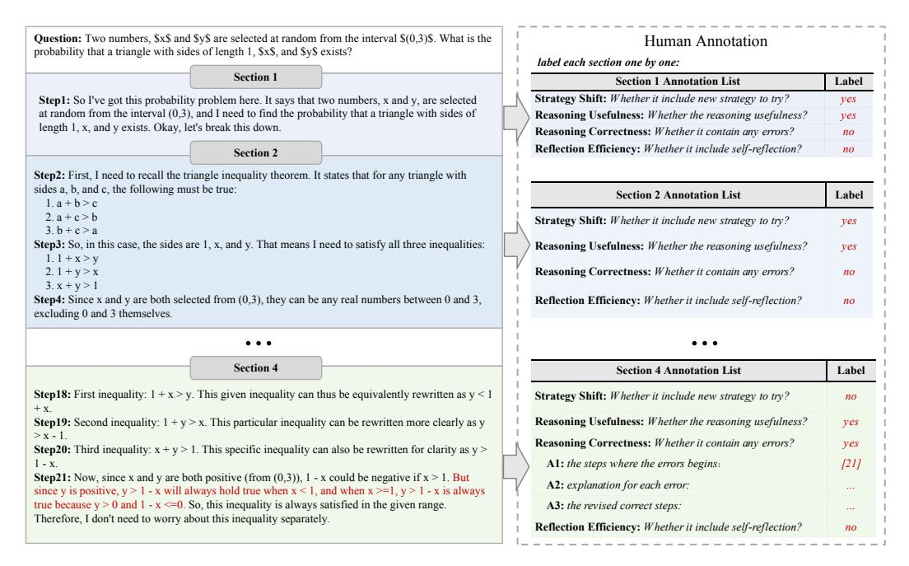
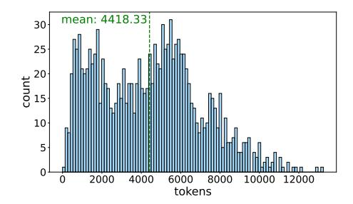
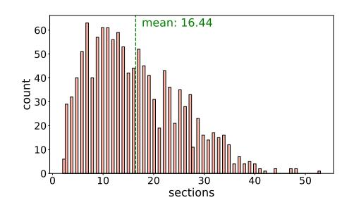

# 2.2 Correctness Assessment

Before manual annotation, we employ automated methods to assess the correctness of the long CoT results. Domain-specific techniques are used to identify potentially erroneous outputs in Appendix

3GPT-4o [\[OpenAI,](#page-16-0) [2023\]](#page-16-0), Meta-Llama-3-70B-Instruct [\[Dubey et al.,](#page-13-0) [2024\]](#page-13-0), Meta-Llama-3-8B-Instruct [\[Dubey et al.,](#page-13-0) [2024\]](#page-13-0), Qwen2.5-72B-Instruct [\[Team,](#page-16-1) [2024\]](#page-16-1), Qwen2.5-32B-Instruct [\[Team,](#page-16-1) [2024\]](#page-16-1), and DeepSeek-67B-chat [\[DeepSeek-AI,](#page-16-2) [2024\]](#page-16-2).

> **[图片提取文字 (无描述)]:**
> Question: Two numbers, \$x\$ and \$y\$ are selected at random from the interval \$(0,3)\$. What is the Human Annotation probability that a triangle with sides of length 1, \$x\$, and \$v\$ exists? label each section one by one: Section 1 Section 1 Annotation List Label Strategy Shift: Whether it include new strategy to try? Step1: So I've got this probability problem here. It says that two numbers, x and y, are selected ves at random from the interval (0,3), and I need to find the probability that a triangle with sides of Reasoning Usefulness: Whether the reasoning usefulness? ves length 1, x, and y exists. Okay, let's break this down. Reasoning Correctness: Whether it contain any errors? no Reflection Efficiency: Whether it include self-reflection? no Section 2 Step2: First, I need to recall the triangle inequality theorem. It states that for any triangle with sides a, b, and c, the following must be true: Section 2 Annotation List Label 1.a + b > c2 a + c > bStrategy Shift: Whether it include new strategy to try? ves 3 b + c > aStep3: So, in this case, the sides are 1, x, and y. That means I need to satisfy all three inequalities: Reasoning Usefulness: Whether the reasoning usefulness? ves 1.1 + x > v2.1 + y > xReasoning Correctness: Whether it contain any errors? no 3. x + y > 1Step4: Since x and y are both selected from (0,3), they can be any real numbers between 0 and 3, Reflection Efficiency: Whether it include self-reflection? no excluding 0 and 3 themselves. Section 4 Section 4 Annotation List Label Step18: First inequality: 1 + x > y. This given inequality can thus be equivalently rewritten as y < 1Strategy Shift: Whether it include new strategy to try? no + x. Reasoning Usefulness: Whether the reasoning usefulness? Step19: Second inequality: 1 + y > x. This particular inequality can be rewritten more clearly as y ves > x - 1Reasoning Correctness: Whether it contain any errors? ves Step20: Third inequality: x + y > 1. This specific inequality can also be rewritten for clarity as y > 1. A1: the steps where the errors begins: [21] 1 - x Step21: Now, since x and y are both positive (from (0,3)), 1 - x could be negative if x > 1. But A2: explanation for each error: since y is positive, y > 1 - x will always hold true when x < 1, and when x >= 1, y > 1 - x is always true because y > 0 and  $1 - x \le 0$ . So, this inequality is always satisfied in the given range. A3: the revised correct steps: Therefore, I don't need to worry about this inequality separately. Reflection Efficiency: Whether it include self-reflection? no

Figure 4: An example of human annotation applied to a mathematical problem-solving process. Annotators are required to annotate each section individually.

A.3 and the evaluation accuracy of each domain and the details are shown in Appendix A.6. This process ensures that the data provided for manual annotation are likely to contain errors, which enhances the annotation efficiency.

#### 2.3 Human Annotation

The data annotation process aims to evaluate the reasoning process of each long CoT response systematically. Each section is assessed for **strategy shift**, **reasoning usefulness**, **reasoning correctness**, and **reflection efficiency**, as shown in Figure 4. The annotation of whether strategy shift and reflection occurred is to help analyze o1's thinking pattern. The annotation of Reasoning usefulness and error identification is to better analyze and evaluate the performance of system II thinking and further evaluate the critique ability of other models for these problems.

To ensure high-quality annotations, we recruit Master's and Ph.D. graduates from various disciplines and collaborate with specialized suppliers (See Appendix A.2 for more details on the annotation and quality control processes).

#### 2.4 Dataset Statistics

**DeltaBench** contains 1,236 carefully curated samples. These samples are distributed across five major domains and 48 subcategories. The dataset ensures a balance of question types and difficulty levels, incorporating a rich set of long CoT responses.

Figure 5 shows the distribution of both the length and the number of sections of long CoTs. The distribution is relatively balanced overall, enabling a comprehensive evaluation of the performance of PRMs or critic models across a range of different lengths. Additionally, detailed statistics on the category distribution are provided in Appendix A.7.

## 2.5 Evaluation Metrics

We employ **recall**, **precision**, and **macro-F1 score** for error sections as evaluation metrics. For the PRMs, we utilize an outlier detection technique based on the Z-Score to make predictions. This method was chosen because threshold-based prediction methods determined from other step-level

> **[图片提取文字 (无描述)]:**
> mean: 4418.33 15 20 tokens

> **[图片提取文字 (无描述)]:**
> mean: 16.44 30 30 sections

- (a) Distribution of long CoT Length.
- (b) Distribution of the number of long CoT sections.

Figure 5: Distribution of long CoT characteristics.

| Benchmark    | Source                                                                                                                            | Long CoT | Granularity   |
|--------------|-----------------------------------------------------------------------------------------------------------------------------------|----------|---------------|
| JudgeBench   | MMLU-Pro [Wang et al., 2024], LiveBench [White et al., 2024], LiveCodeBench [Jain et al., 2024]                                   | ×        | Sample-Level  |
| CriticBench  | GSM8K [Cobbe et al., 2021], CSQA [Talmor et al., 2019], BIGBench [Srivastava et al., 2022], HumanEval [Chen et al., 2021], etc | ×        | Sample-Level  |
| CriticEval   | GSM8K [Cobbe et al., 2021], HumanEval [Chen et al., 2021], ChatArena [Chiang et al., 2024], etc.                                  | ×        | Sample-Level  |
| ProcessBench | GSM8K [Cobbe et al., 2021], MATH [Lightman et al., 2023], OlympiadBench [He et al., 2024b], Omni-MATH [Gao et al., 2024]       | ×        | Step-Level    |
| DeltaBench   | AIME, BigCodeBench [Zhuo et al., 2024], KOR-Bench [Ma et al., 2024], GPQA [Rein et al., 2023], etc                                | ✓        | Section-Level |

Table 1: Comparisons between different benchmarks. Sample-level evaluation classifies the entire model response as correct or incorrect. Step-level evaluation assesses the correctness of individual reasoning steps. Section-level evaluation evaluates the correctness of reasoning sections which is a more appropriate granularity for long CoT response.

datasets, such as those used in ProcessBench [Zheng et al., 2024a], may not be reliable due to significant differences in dataset distributions, particularly as DeltaBench focuses on long CoT (The details are provided in Appendix A.8). Outlier detection helps to avoid this bias. The threshold t for determining the correctness of a section is defined as:  $t = \mu - \sigma$ , where  $\mu$  is the mean of the rewards distribution across the dataset, and  $\sigma$  is the standard deviation. Sections falling below t are predicted as error sections. For critic models, all erroneous sections within a long CoT are prompted to be identified. Given that error sections constitute a smaller proportion than correct sections across the dataset, we use macro-F1 to mitigate the potential impact of the imbalance between positive and negative sections. Macro-F1 independently calculates the F1 score for each sample and then takes the average, providing a more balanced evaluation metric when dealing with class imbalance.

