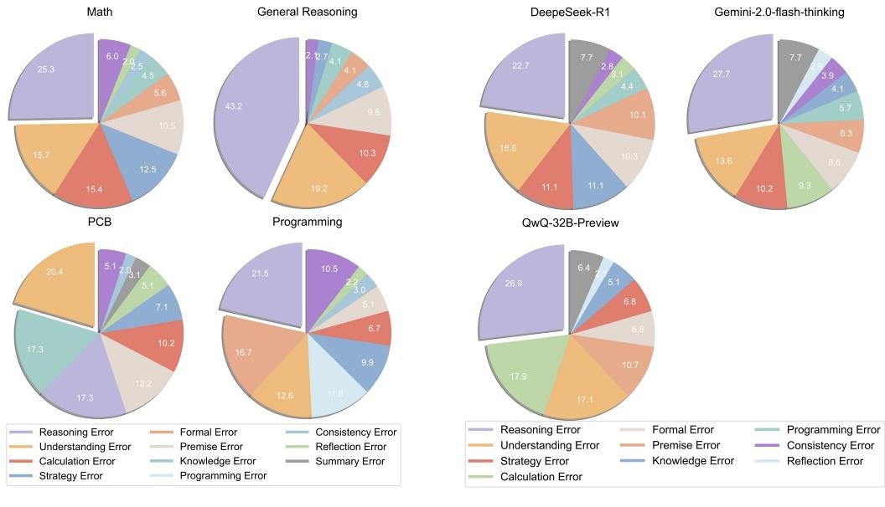
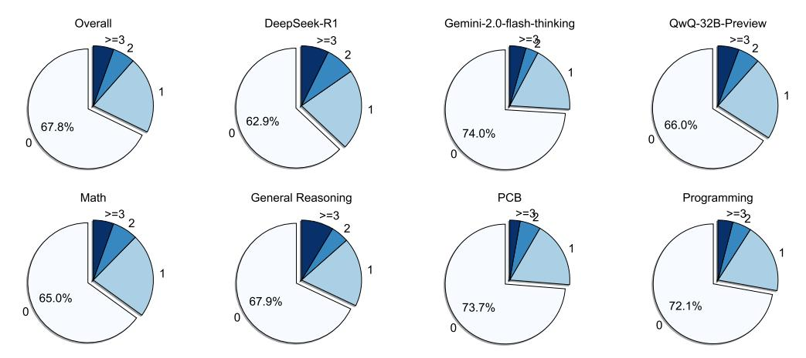

# 2.6 Comparison to Other Benchmarks

In Table 1, DeltaBench has the following features: (1) We focus on difficult questions, providing a more challenging critical evaluation; (2) We utilize long CoT responses, enabling the assessment of a model's ability to identify errors within complex reasoning processes; (3) We evaluate the model's capability to identify all errors in the reasoning process, rather than just the first error or a binary classification of correctness on sample level, which can provide a fine-grained analysis of long CoTs.

#### 3 Analysis

#### 3.1 Error Analysis of o1-like Models

**Error Type Lists** We classify the errors that occur during the system II thinking process into 8 major aspects and 23 specific error types based on the manual annotations, including understanding errors, reasoning errors, reflection errors, summary errors, etc. For detailed information about the error categories, see Appendix B.

> **[图片提取文字 (无描述)]:**
> General Reasoning Math DeepeSeek-R1 Gemini-2.0-flash-thinking **PCB** Programming QwQ-32B-Preview Reasoning Error Formal Error Programming Error Reasoning Error Formal Error Consistency Error Understanding Error Premise Error Consistency Error Understanding Error Premise Error Reflection Error Calculation Error Knowledge Error Summary Error Strategy Error Knowledge Error Reflection Error Strategy Error Programming Error Calculation Error

(a) Distribution of Error Types Across Domains (b) Distribution of Error Types Across Models

Figure 6: Distribution of error types across different domains and models.

What Are the Most Common Errors Across Domains? To analyze the characteristics of error distribution in different domains, we performed a uniform sampling of the data based on the model, the domain, and the query difficulty. Figure [6](#page-6-0) shows the error distribution across different domains, here are some key findings:

- Math: The most frequent error type is *Reasoning Error*(25.3%), followed by *Understanding Error*(15.7%) and *Calculation Error*(15.4%). This indicates that while the models often struggle with logical reasoning and problem understanding, low-level computational mistakes also remain a significant issue.
- Programming: *Reasoning Error* (21.5%) is the most common, followed by *Formal Error* (16.7%) and *Understanding Error* (12.6%). The high frequency of *Formal Error* and *Programming Error* (11.8%) underscores the models' struggles with code-specific details and implementation.
- PCB: The dominant error types are *Understanding Error* (20.4%) and *Knowledge Error* (17.3%), closely followed by *Reasoning Error* (17.3%). This suggests that the main challenge for current models in the fields of physics, chemistry and biology is to understand field-specific concepts and accurately apply relevant knowledge.
- General Reasoning: *Reasoning Error* is the most prevalent, accounting for 43%, followed by comprehension errors, accounting for 19%, showing that logical reasoning is the primary bottleneck.

What Are the Model-Specific Error Patterns? We also analyzed errors specific to individual models, providing further insights into model weaknesses, as illustrated in Figure [7.](#page-7-0) The error distributions reveal distinct patterns for each model, highlighting their unique strengths and areas for improvement. Here are some key findings:

- DeepSeek-R1 exhibits its most pronounced weakness in *Reasoning Errors* (22.7%), indicating challenges in constructing coherent and accurate logical reasoning paths. However, it demonstrates relative strength in handling fundamental tasks, with minimal *Calculation Errors* (3.1%) and *Programming Errors* (4.4%).
- QwQ-32B-Preview excels at identifying correct problem-solving approaches. However, its effectiveness is significantly hindered by deficiencies in handling finer details, particularly in *Calculation Errors* (17.9%)

Positive Reflection Times Distribution by Model and Task

> **[图片提取文字 (无描述)]:**
> Overall DeepSeek-R1 Gemini-2.0-flash-thinking QwQ-32B-Preview >=32 >=32 >=3 >=3 62.9% 66.0% 67.8% 74.0% 0 Math General Reasoning PCB Programming >=3 2 >=35 >=37 >=3 65.0% 67.9% 72.1% 73.7% 0

Figure 7: Distribution of effective reflection times by models and domains on a sample level. The segments within each pie chart represent how many times effective reflection occurs in one sample, with segment '0' indicating there is no effective reflection.

