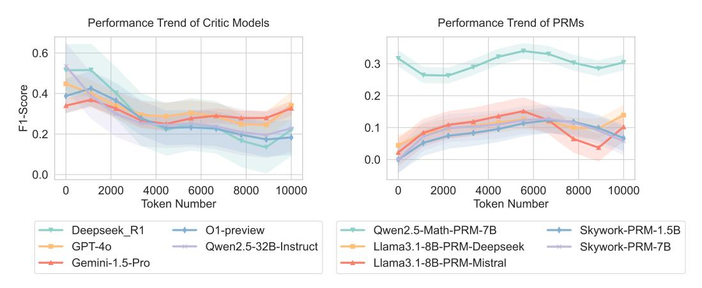
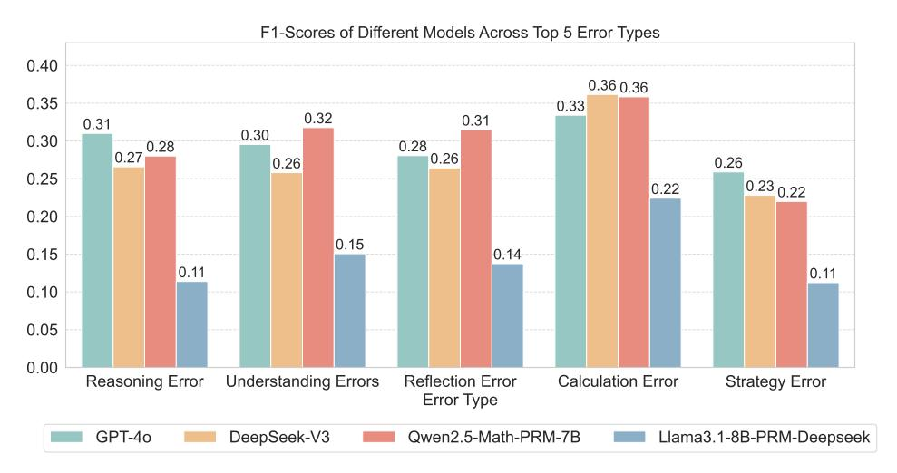

# 3.5.2 Further Analysis

Effect of Long CoT Length. In Figure [10,](#page-10-0) we compare the average F1-Score performance of critic models and PRMs across varying LongCoT token lengths. For critic models, the performance notably declines as token length increases. Initially, models like Deepseek-R1 and GPT-4o exhibit strong

8 [Skywork/Skywork-o1-Open-PRM-Qwen-2.5-1.5B](https://huggingface.co/Skywork/Skywork-o1-Open-PRM-Qwen-2.5-1.5B)

9 [Skywork/Skywork-o1-Open-PRM-Qwen-2.5-7B](https://huggingface.co/Skywork/Skywork-o1-Open-PRM-Qwen-2.5-7B)

> **[图片提取文字 (无描述)]:**
> Performance Trend of Critic Models Performance Trend of PRMs 0.6 0.3 F1-Score 0.2 0.1 0.0 0.0 2000 4000 6000 8000 10000 0 2000 4000 6000 8000 10000 Token Number Token Number Deepseek R1 O1-preview Qwen2.5-Math-PRM-7B Skywork-PRM-1.5B GPT-40 Qwen2.5-32B-Instruct Llama3.1-8B-PRM-Deepseek Skywork-PRM-7B Gemini-1.5-Pro Llama3.1-8B-PRM-Mistral

Figure 10: The effect of long CoT length.

> **[图片提取文字 (无描述)]:**
> F1-Scores of Different Models Across Top 5 Error Types 0.40 0.36 0.36 0.35 0.33 0.32 0.31 0.31 0.30 0.30 0.27 0.28 0.26 0.26 0.26 0.25 0.23 0.22 0.22 0.20 0.15 0.15 0.14 0.11 0.11 0.10 0.05 0.00 Reasoning Error Understanding Errors Reflection Error Calculation Error Strategy Error Error Type GPT-40 DeepSeek-V3 Qwen2.5-Math-PRM-7B Llama3.1-8B-PRM-Deepseek

Figure 11: Results of different LLMs on top-5 errors.

performance with shorter sequences (1-3k tokens). However, as token length increases to mid-ranges (4-7k tokens), there is a marked decrease in performance across all models. This trend highlights the growing difficulty for critic models to maintain precision and recall as long CoT response become longer and more complex, likely due to the challenge of evaluating lengthy model outputs. In contrast, PRMs demonstrate greater stability across token lengths, as they evaluate sections sequentially rather than processing the entire output at once. Despite this advantage, PRMs achieve lower overall scores compared to critic models on our evaluation set.

