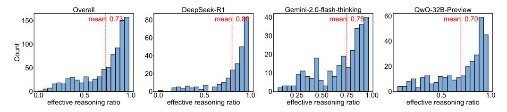
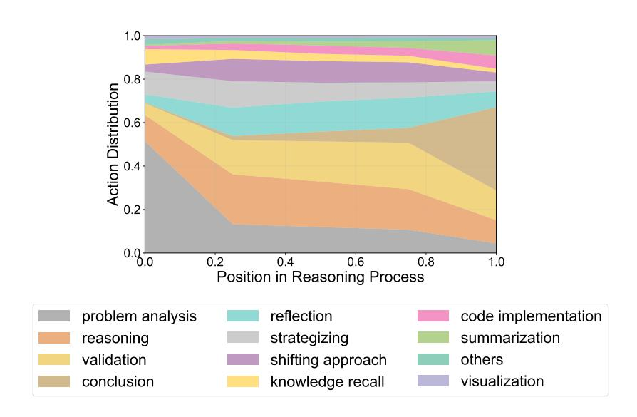

# Key Finding for Error Type

The primary bottleneck of current models remains reasoning ability. However, detailed errors like calculation and formal mistakes also contribute significantly.

### 3.2 Reflection Analysis of o1-like Models

Statistics. We also conduct a analysis of the total number of reflections and the proportion of effective reflections in the long CoT output of all questions (including questions answered correctly and incorrectly by the model).

How Effective Are Model Reflections Across Different Models and Domains? We classify samples with reflections based on the number of valid reflections to evaluate the ability to produce valid reflections. Specifically, we label samples as 0 if no valid reflections occur, and 1, 2, or >=3 for samples with one, two, or three and more valid reflections, respectively(all statistical analyses were performed under strictly controlled conditions, ensuring uniform sampling and balanced tasks for a fair comparison). In Figure [7,](#page-7-0) DeepSeek-R1 exhibits the highest proportion of effective reflections, and the models show a notably higher rate of effective reflections in the math domain. However, the overall proportion of valid reflections across all models remains relatively low, ranging between 30% and 40%. This suggests that the reflection capabilities of current models require further improvement.

### Key Finding for Reflection

Despite frequent reflection attempts, the proportion of effective reflections remains low across models, and DeepSeek-R1 achieves the highest rate of valid reflections.

### 3.3 Effective Reasoning of o1-like Models

Statistics. Human annotators evaluate the usefulness of the reasoning in each section, enabling us to calculate the proportion of valid reasoning in each response. As illustrated in Figure [8,](#page-8-0) each graph shows the distribution of effective reasoning ratios for a particular model. The red dashed line in each graph indicates the average effective reasoning ratio.

What Proportion of Reasoning in Long CoT Responses is Effective? On average, only 73% of the reasoning in the collected long CoT responses is useful, highlighting significant redundancy

> **[图片提取文字 (无描述)]:**
> Overall DeepSeek-R1 Gemini-2.0-flash-thinking QwQ-32B-Preview 60 40 mean: 0.73 mean: 0.80 mean: 0.75 mean: 0.70 80 150 30 60 20 40 50 0.50effective reasoning ratio effective reasoning ratio effective reasoning ratio effective reasoning ratio

Figure 8: Distribution of effective reasoning ratios.

> **[图片提取文字 (无描述)]:**
> 1.0 Action Distribution 0.0 0.2 0.4 0.6 8.0 1.0 Position in Reasoning Process problem analysis reflection code implementation summarization strategizing reasoning shifting approach validation others knowledge recall visualization conclusion

Figure 9: Distribution of different task types throughout the progress of a long CoT response.

issues. Among the models analyzed, *QwQ-32B-Preview* exhibited the lowest proportion of effective reasoning at 70%, while *DeepSeek-R1* achieved a notably higher proportion compared to the others, demonstrating superior reasoning efficiency.

### Key Finding for Reasoning Efficiency

On average, 27% of reasoning in long CoT responses we collected is redundant, and DeepSeek-R1 outperforms others in reasoning efficiency.

