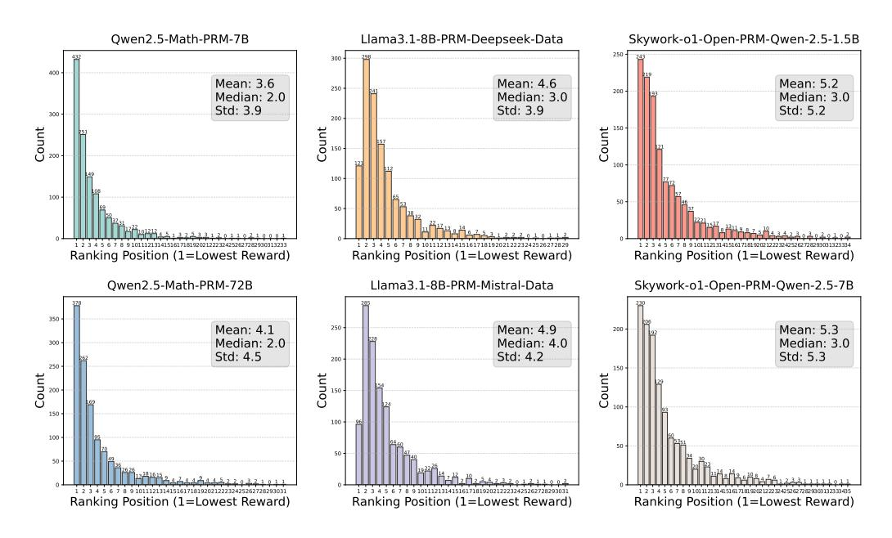
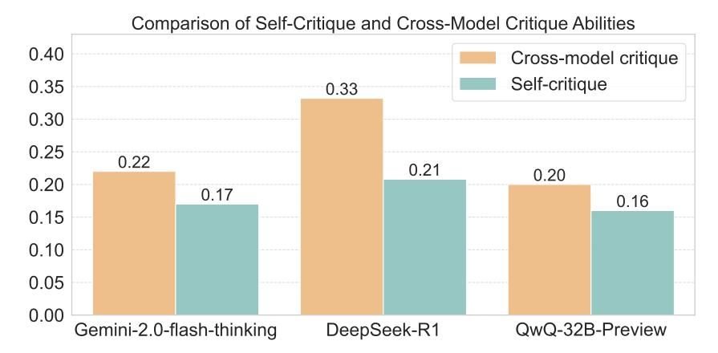

# Key Finding

Critic models exhibit significant performance degradation with longer contexts, while PRMs demonstrate consistent evaluation capability across varying lengths.

**Performance Analysis Across Different Error Types.** Figure 11 shows the performance of different models on the five most common error types. In terms of error types, most models demonstrate the highest accuracy in recognizing calculation errors. Conversely, the recognition of strategy errors is generally the weakest. In terms of models, there is significant variation in the ability of individual models to recognize different error types. For instance, DeepSeek-V3 achieves an F1 of 36% on calculation errors but only 23% on strategy errors. Meanwhile, Llama3.1-8B-PRM-Deepseek performs poorly, with an F1 score of 22% on calculation errors, and shows a significant decline in

> **[图片提取文字 (无描述)]:**
> Qwen2.5-Math-PRM-7B Llama3.1-8B-PRM-Deepseek-Data Skywork-o1-Open-PRM-Qwen-2.5-1.5B 400 Mean: 3.6 Mean: 4.6 Mean: 5.2 250 200 Median: 2.0 Median: 3.0 Median: 3.0 Std: 3.9 Std: 3.9 Std: 5.2 300 Count Count Count 100 100 Ranking Position (1=Lowest Reward) Ranking Position (1=Lowest Reward) Ranking Position (1=Lowest Reward) Qwen2.5-Math-PRM-72B Llama3.1-8B-PRM-Mistral-Data Skywork-o1-Open-PRM-Qwen-2.5-7B 350 Mean: 4.1 250 Mean: 4.9 Mean: 5.3 200 Median: 4.0 Median: 2.0 Median: 3.0 300 Std: 4.5 Std: 4.2 Std: 5.3 200 250 Count Count Count 150 100 100 50 1 2 3 4 5 6 7 8 9 10111213141516171819202122232425262728293031 Ranking Position (1=Lowest Reward) Ranking Position (1=Lowest Reward) Ranking Position (1=Lowest Reward)

Figure 12: Ranking of rewards for the first incorrect section for different PRMs.

performance across the other four error types. This highlights the limited generalization capabilities of most models when recognizing various error types.

#### **Key Finding**

Models exhibit strong performance on calculation errors but struggle with strategy errors, revealing limited generalization across error types.

| Model                             | HitRate@ $k$ - Avg(%) k = 1 $k = 3$ $k = 5$ |       |              |  |
|-----------------------------------|------------------------------------------------|-------|--------------|--|
| Qwen2.5-Math-PRM-7B               | 49.15                                          | 69.14 | 83.14        |  |
| Qwen2.5-Math-PRM-72B              | 41.13                                          | 62.70 | <u>75.73</u> |  |
| Llama3.1-8B-PRM-Deepseek-Data     | 12.63                                          | 48.62 | 69.78        |  |
| Llama3.1-8B-PRM-Mistral-Data      | 8.99                                           | 42.97 | 65.33        |  |
| Skywork-o1-Open-PRM-Qwen-2.5-1.5B | 31.90                                          | 53.82 | 69.23        |  |
| Skywork-o1-Open-PRM-Qwen-2.5-7B   | 31.58                                          | 52.59 | 69.16        |  |

Table 3: Results of HitRate@k. Bold and underlined results indicate the best and the second best.

Analysis on HitRate evaluation for PRMs. To better measure the ability of PRMs to identify erroneous sections in long CoTs, we use HitRate@k to evaluate PRMs. Specifically, within a sample, we rank the sections in ascending order based on the rewards given by the PRM, select the smallest k sections, and calculate the recall rate for the erroneous sections among them. Specifically, we define the sorted sections as  $S = \{s_1, s_2, \ldots, s_n\}$ , with E being the set of erroneous sections. We select the top k sections, denoted as  $S_k = \{s_1, s_2, \ldots, s_k\}$ . The HitRate@k is calculated as:

$$\operatorname{HitRate}@k = \frac{|S_k \cap E|}{\min(k, |E|)} \tag{1}$$

In this formula,  $|S_k \cap E|$  indicates the number of erroneous sections identified among the top k sections. This metric reflects the ability of PRMs to effectively identify erroneous sections within the top k candidate sections. In Table 3, the relative performance rankings among different PRMs

> **[图片提取文字 (无描述)]:**
> Comparison of Self-Critique and Cross-Model Critique Abilities 0.40 Cross-model critique Self-critique 0.35 0.33 0.30 0.25 0.22 0.21 0.20 0.20 0.17 0.16 0.15 0.10 0.05 0.00 Gemini-2.0-flash-thinking DeepSeek-R1 QwQ-32B-Preview

Figure 13: F1-score comparison of self-critique and cross-model critique abilities for different models.

are quite similar to the results in Table [2.](#page-9-2) Additionally, we observe that for k = 3 and k = 5, the performance differences between various PRMs are not particularly significant. However, when k = 1, the Qwen2.5-Math-PRM-7B shows a clear performance advantage. Figure [12](#page-11-1) illustrates the ranking ability of different PRMs for the first incorrect section within the sample, which is generally consistent with the performance evaluation results of HitRate@k.

### Key Finding

HitRate@k evaluation aligns with the main results, with Qwen2.5-Math-PRM-7B demonstrating superior performance in identifying the first incorrect section.

Comparative Analysis of Self-Critique Capabilities of LLMs. We randomly sample queries based on domains and models that generate the long CoT output, followed by a statistical analysis of the model's performance in evaluating its own outputs as well as those of other models. In Figure [13,](#page-12-0) Gemini 2.0 Flash Thinking, DeepSeek-R1, and QwQ-32B-Preview show lower selfcritique scores compared to their cross-model critique scores, indicating a prevalent deficiency in self-critic abilities. Notably, DeepSeek-R1 exhibits the largest discrepancy, with a 36% decrease in self-evaluation compared to evaluations of other models. This suggests models' self-critic abilities remain underdeveloped.

### Key Finding

LLMs demonstrate weaker self-critique performance compared to cross-model critique, highlighting a fundamental limitation in self-critic capabilities.

