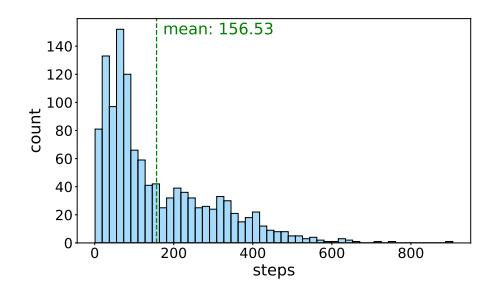
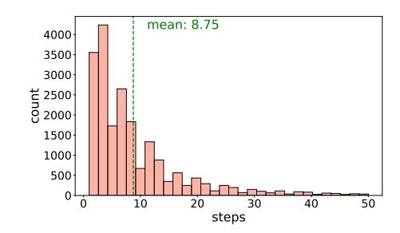

# A.2 Details on Dataset Annotation

The average cost for annotating each data unit was approximately *\$15*. The annotation process is organized into three phases, each with specific goals and criteria:

Initial Assessment. Annotators initially verify the quality of the question and subsequently evaluate the correctness of the model's final response.

Section-Level Evaluation. The long CoT is divided into sections, each corresponding to a specific sub-task, such as problem analysis, verification of calculation results, and summarization. This phase requires the annotator to check and annotate each section individually. The annotation process and examples are shown in Figure [4](#page-4-0)

Quality Assurance and Validation. We have established a strict quality control process to ensure the high quality and consistency of annotations. Each data is assigned three initial annotators, two junior reviewers, and an additional five people who are responsible for overall spot checks. Outsourced personnel and external contractors responsible for annotations receive unified training. We regularly check the consistency and quality between annotators and repeatedly discuss and improve annotation protocols during the annotation process to make the standards more perfect. This process ensures the generation of high-quality annotations and minimizes subjective bias.

Profile of Annotation Persons. In this dataset annotation project, we engaged a diverse group of annotators through three distinct sources. We employed a set of external contractors directly recruited by us and collaborated with two additional suppliers to provide annotation services. The dataset was divided into three parts, with certain sections deliberately overlapping to facilitate cross-validation. This overlap allows us to compute the annotation consistency rate, and if the results do not meet the required standards, revisions are necessitated.

Our annotator pool is composed of highly qualified individuals: 23 Master's degree holders and 6 Ph.D. holders in Mathematics, 18 Master's graduates in Computer Science, 7 Master's and 2 Ph.D. graduates in Physics, 7 Master's and 3 Ph.D. graduates in Chemistry, and 6 Master's and 2 Ph.D. degree holders in Biology. We employ a rotational system to randomly assign two individuals from each academic field to serve as reviewers. Additionally, 5 algorithm specialists are tasked with conducting spot checks on the annotations. This meticulous selection and review process ensures superior data quality and reliability for subsequent analyses.

#### A.3 Details on Assessment

**Math** For mathematical queries, we employ a combination of rules and LLMs to evaluate the correctness of the provided solutions. Rule-based systems verify the validity of numerical calculations, while LLMs ensure that reasoning steps adhere to established mathematical principles. This dual approach guarantees high accuracy in error detection within the solutions.

**Programming** For programming tasks, we utilize sandbox testing environments alongside LLM-based evaluations. Specifically, we utilize SandboxFusion [Cheng et al., 2024] as our testing environment. The solution is initially executed in the sandbox environment. Subsequently, the test case, the sandbox environment's feedback output, and the code are provided to the LLM to determine the correctness of the answer.

**PCB** Due to the straightforward nature of answers in these domains, we exclusively rely on LLM judgments, which offer high accuracy in assessing correctness.

**General Reasoning** Similarly, for general reasoning questions, LLM judgments are employed to effectively and accurately assess solution validity.

#### A.4 Findings in Data Preprocessing

During the data preprocessing stage, we identified several issues with the data collected from open-source datasets. These issues included incomplete queries, incorrect solutions, and excessively high query similarity. To address these problems, we applied a combination of manual review and LLM (Large Language Model) validation to filter out low-quality data. Additionally, for code data specifically, we observed that different sources and types of data sometimes included test cases, while others did not, and the formats of these test cases were inconsistent. To tackle these inconsistencies, we used GPT-4 to filter the data for quality and to extract test cases, standardizing them into executable code for SandboxFusion. This allowed us to conduct uniform sandbox verification to ensure data accuracy.

#### A.5 Sections Division

> **[图片提取文字 (无描述)]:**
> mean: 156.53 count steps

> **[图片提取文字 (无描述)]:**
> mean: 8.75 15 2500 · 2000 · steps

- (a) Distribution of the number of steps in long CoT(divided by "\n\n").
- (b) Distribution of the number of steps contained in each divided section.

Figure 14: Statistical distribution of steps in long CoT.

Figure 3 illustrates the prompt for dividing sections along with examples of the resulting divisions. Several steps involved in addressing an atomic problem or exploring an idea are grouped into the same section. The specific outcome of the division is influenced by various factors, such as the task domain. However, compared to a purely long CoT, this approach is more user-friendly for human annotation.

Furthermore, to prevent sections from becoming overloaded with too many steps, which would increase the complexity of the annotation process, we iteratively divide sections that exceed 50 steps. Figure 14 displays the distribution of steps in the original long CoT (subfigure 14a) and the distribution of steps in each divided section (subfigure 14b). Before sectioning, annotators are required to review each individual step, which can be exceedingly challenging for long CoTs with

numerous steps. By dividing the sections, annotators can proceed on a section-by-section basis, making the process more comprehensible and significantly reducing the difficulty of annotation.

### A.6 Validation of Long CoT Correctness

| Domain            | Filtered Total Num | Correct Num | Accuracy(%) |
|-------------------|--------------------|-------------|-------------|
| Math              | 7534               | 5413        | 71.84       |
| Programming       | 2103               | 1276        | 60.67       |
| PCB               | 4517               | 2626        | 58.13       |
| General Reasoning | 1981               | 1160        | 58.56       |

Table 5: Accuracy statistics for generated long CoT responses for filtered high-quality queries.

For the filtered high-quality queries, we use a mix of various o1-like models, including QwQ-32B-Preview, DeepSeek-R1, and Gemini 2.0 Flash Thinking, to generate the corresponding long CoT. We then use LLM-as-a-judge and a sandbox testing environment to validate the accuracy of the long CoT generated by these o1-like models, obtaining the native erroneous long CoT for subsequent human annotation.

Table [5](#page-23-2) shows the accuracy of the generated long CoT. It can be seen that o1-like models enhanced with reinforcement learning in math and programming perform slightly better in these two areas compared to general reasoning and PCB.

