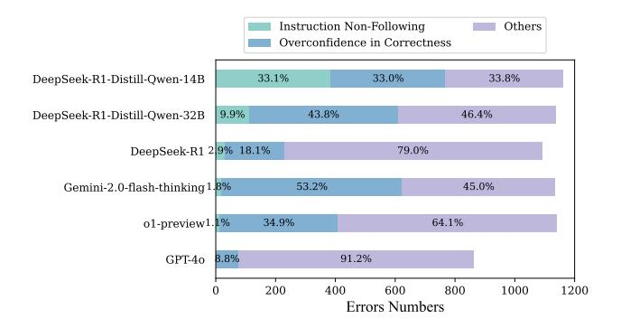

# C Analysis of Underperforming Model

| Primary Category    | Subcategory                    | Description                                                                                                                                                     |
|---------------------|--------------------------------|-----------------------------------------------------------------------------------------------------------------------------------------------------------------|
| Understanding Error | Problem Misunderstanding    | Incorrect interpretation of the problem requirements or context at the initial comprehension stage                                                              |
| Onderstanding Error | Conceptual Misunderstanding | Misunderstanding of basic principles or theoretical foundations                                                                                                 |
|                     | Factual Error                  | Incorrect recall or statement of established facts or constants                                                                                                 |
| Knowledge Errors    | Theorem Error                  | Incorrect recall or application of mathematical theorems or scientific laws                                                                                     |
|                     | Definition Error               | Incorrect understanding or application of standard definitions or terminology                                                                                   |
|                     | Strategy Error                 | Inappropriate selection of problem-solving approaches or methodologies                                                                                          |
| Logical Errors      | Reasoning Error                | Flaws in the logical flow of problem-solving steps                                                                                                              |
|                     | Premise Error                  | Invalid or incorrect assumptions in the reasoning process                                                                                                       |
|                     | Consistency Error              | Contradictions or inconsistencies in the logical framework                                                                                                      |
| Calculation Errors  | Numerical Error                | Inaccuracies in arithmetic operations or numerical computations                                                                                                 |
|                     | Formula Error                  | Incorrect application or manipulation of mathematical formulas                                                                                                  |
|                     | Parameter Error                | Mistakes in handling variables or parameters                                                                                                                    |
|                     | Unit Error                     | Incorrect use or conversion of measurement units                                                                                                                |
|                     | Syntax Error                   | Violations of programming language rules and conventions Including incorrect code structure, missing delimiters, or improper statement construction       |
| Programming Errors  | Function Error                 | Deficiencies in function implementation, usage, or behavior Including improper function definitions, incorrect function calls, or unexpected function behaviors |
|                     | Data Type Error                | Incorrect handling of data types and type conversions. Including type mismatches, improper type conversions, or inappropriate data structure usage              |
|                     | Symbol Error                   | Incorrect use of mathematical or scientific symbols                                                                                                             |
| Formal Errors       | Formatting Error               | Improper presentation or organization of solution structure                                                                                                     |
| Completeness Errors | Boundary Omission              | Failure to consider edge cases or limiting conditions                                                                                                           |
|                     | Reflection Error               | Insufficient analysis of solution validity or limitations                                                                                                       |
| Constitution C      | Summary Error                  | Inadequate synthesis or conclusion of findings                                                                                                                  |
| Special Cases       | Hallucination                  | Generation of false or unsupported information                                                                                                                  |
|                     | Redundancy                     | Unnecessary repetition or superfluous information in solutions                                                                                                  |

Figure 15: Categories of Errors in o1-like Models.

> **[图片提取文字 (无描述)]:**
> Instruction Non-Following Others Overconfidence in Correctness 33.1% DeepSeek-R1-Distill-Qwen-14B 33.0% 33.8% 9.9% 43.8% 46.4% DeepSeek-R1-Distill-Qwen-32B DeepSeek-R1 2 9% 18.1% 79.0% Gemini-2.0-flash-thinking 1.8% 53.2% 45.0% 34.9% 64.1% o1-preview1.1% 8.8% 91.2% GPT-40 200 400 600 800 1000 1200 Errors Numbers

Figure 16: Distribution of error causes for each model.

We classify the errors produced by underperforming models into three categories: (1) Not following instructions, where models fail to follow the critique instructions; (2) Overconfidence in Correctness, where models incorrectly assume the sample contains no errors; (3) Other errors, such as false negatives, where models incorrectly flag accurate reasoning as erroneous, and error misidentification, where models inaccurately determine the type or location of errors.

As illustrated in Figure 16, the following observations can be made: (1) DeepSeek-R1-Distill series exhibit significant instruction-following deficiencies. These models tend to directly answer questions rather than critically evaluate the correctness of responses, indicating a potential overfitting problem. (2) o1-like models like DeepSeek-R1 and o1-preview-0912 also demonstrate notable instruction-following challenges, albeit to a lesser extent than GPT-40. (3) A notable trend among the o1-preview and Gemini 2.0 Flash Thinking models was their tendency to assume that samples were correct without thorough evaluation. This overconfidence in correctness was a significant contributor to their error rates. In contrast, GPT-40 demonstrates superior performance, with no instances of "Instructions not followed" errors and a relatively low number of "Overconfidence in Correctness" errors.