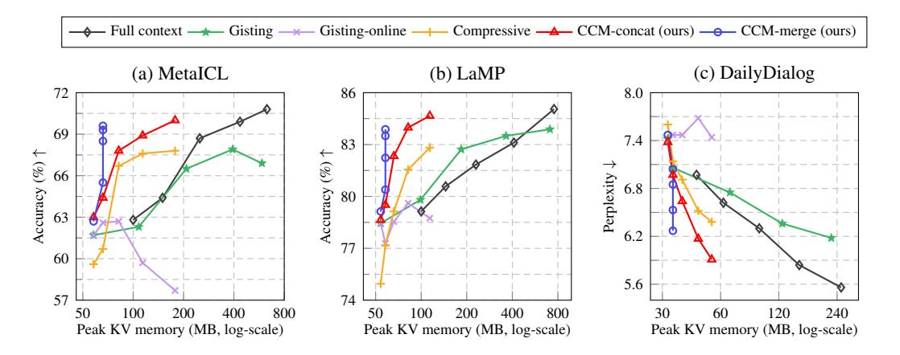

# C ADDITIONAL EXPERIMENTAL RESULTS

## C.1 MAIN ANALYSIS

Unified compression adapter We train a single compression adapter with LLaMA-7B on the mixture of the MetaICL training tasks and the SODA conversation dataset. We follow the training recipe in [Table 13,](#page-15-4) while we train a model for 4k steps. We train the Gisting and Compressive Transformer baselines using the same dataset and training protocol. We use the ⟨COMP⟩ token length of 2 for CCM-concat and 8 for CCM-merge. Finally, we test the model on the MetaICL unseen test tasks, LaMP, and DailyDialog at the corresponding maximum time step.

[Table 15](#page-16-2) demonstrates the generalization ability of our approach on datasets and scenarios unseen during training. Specifically, CCM-concat maintains the best compression performance by a large margin compared to baseline methods. We observe that CCM-merge has increased performance degradation by compression compared to the scenario-specific settings (*e.g.*, the LaMP accuracy degradation by compression increased from 1.2% to 5.1%). However, the other compression baselines have a larger performance gap by compression, demonstrating our approach achieves the best generalization performance among the baselines.

Table 15: Evaluation of a single model trained on MetaICL and SODA training datasets. *Memory* refers to the peak memory required for attention keys/values during inference.

| Test dataset | Metric       | No context | Full context | Gisting-online | Compressive | CCM-concat | CCM-merge |
|--------------|--------------|------------|--------------|----------------|-------------|------------|-----------|
| MetaICL      | Accuracy (%) | 53.6       | 70.0         | 59.9           | 65.0        | 68.7       | 67.8      |
|              | Memory (MB)  | 50         | 630          | 82             | 82          | 82         | 66        |
| LaMP         | Accuracy (%) | 37.0       | 76.4         | 67.6           | 58.4        | 75.2       | 71.4      |
|              | Memory (MB)  | 50         | 755          | 82             | 82          | 82         | 66        |
| DailyDialog  | Perplexity   | 11.51      | 7.02         | 9.04           | 9.19        | 7.61       | 8.22      |
|              | Memory (MB)  | 32         | 252          | 54             | 54          | 54         | 38        |

Design choice of merge function In the main experiments, we evaluate an update method based on the arithmetic average of the compressed states up to the present time, *i.e.*, at = 1/t. Another natural design choice is an exponential moving average (EMA), where at is set to a constant value. This strategy weighs higher importance on recent information compared to the arithmetic average. [Table 16](#page-16-0) provides a comparison between the arithmetic average and EMA with at = 0.5, on DailyDialog with LLaMA-7B. The results indicate that both methods yield similar performance. When forming the compression state h(t), our method involves referencing the previous memory Mem(t91) [\(Figure 2\)](#page-3-0). We believe this enables the preservation of overall context, even with exponentially decreasing coefficients for past states by EMA.

Table 16: Comparison of merge function design choices with LLaMA-7B on DailyDialog.

| Method \Time step  | 1    | 2    | 4    | 8    | 12   |
|--------------------|------|------|------|------|------|
| EMA                | 7.49 | 7.06 | 6.79 | 6.49 | 6.38 |
| Arithmetic average | 7.47 | 7.06 | 6.87 | 6.54 | 6.34 |

FLOPS analysis Regarding FLOPS, our approach has two notable effects:

- Reduction in attention FLOPS due to the shortened context.
- Computation overhead incurred by the compression process.

The reduction in attention FLOPS becomes more pronounced as the number of processed tokens during inference increases. In [Table 17,](#page-17-1) we compute the minimum length of tokens required to be processed during inference, where the benefits from the shortened context outweigh the compression overhead. Our analysis is based on a context token length of 50, according to the dataset statistics in [Table 12.](#page-15-3) With ⟨COMP⟩ token length of 1, our approach reduces the total computation FLOPS when the length of the processed token during inference surpasses 504. We summarize the results on larger ⟨COMP⟩ token lengths in [Table 17.](#page-17-1)

Table 17: Compression FLOPS overhead analysis on MetaICL with LLaMa-7B. *Threshold* refers to the minimum token length required during inference for the reduction in attention FLOPS to outweigh the compression overhead. We assume that the token length of context c(t)is 50, according to the MetaICL and LaMP datasets' statistics [\(Table 12\)](#page-15-3).

|                                                                  | ⟨COMP⟩ token length |             |             |            |
|------------------------------------------------------------------|---------------------|-------------|-------------|------------|
|                                                                  | 1                   | 2           | 4           | 8          |
| Context compression factor Threshold (inference token length) | ×50 504          | ×25 1029 | ×13 2148 | ×6 4706 |

Additional memory-performance graphs In [Figure 10,](#page-17-0) we present graphs illustrating the relationship between attention KV memory and performance across increasing time steps for MetaICL, LaMP, and DailyDialog. The figure comprehensively compares all methods introduced in our main text, including a fixed-context compression method such as Gisting. From the figure, we verify that our methods exhibit the best memory-performance efficiency. Specifically, our methods achieve superior performance while requiring minimal attention KV memory when compared to existing compression baselines.

> **[图片提取文字 (无描述)]:**
> → Full context → Gisting → Gisting-online → Compressive → CCM-concat (ours) → CCM-merge (ours) (c) DailyDialog (a) MetaICL (b) LaMP 86 8.0 69 7.4 83 ↓(%) Accuracy (%) ↑ Perplexity ↓ 66 6.8 Accuracy 80 63 6.2 60 5.6 57 74 50 200 400 800 60 120 240 100 800 50 100 200 400 30 Peak KV memory (MB, log-scale) Peak KV memory (MB, log-scale) Peak KV memory (MB, log-scale)

Figure 10: Test performance of methods with LLaMA-7B over increasing time steps in an online inference scenario. The x-axis refers to the peak memory space occupied by attention keys/values during compression and inference processes at each time step. Here, the time steps span from 1 to 16, except for DailyDialog, which covers a range of 1 to 12.

#### C.2 COMPRESSION TOKEN LENGTH AND MODEL

Length of compression token In Table [18,](#page-18-0) we analyze the performance of our method across varying compression token lengths. In general, increasing the token length leads to a slight improvement in performance. For MetaICL, we observe a 1% accuracy gain, while the DailyDialog experiment shows a 1% reduction in perplexity as token length increases. However, when comparing our approach to the no-context method, the performance differences attributed to the compression token length are not significant. For example, our method outperforms the no-context approach by approximately 18% in the MetaICL experiment. In our main experiment, we set the compression token length according to the average context length of the target dataset, ensuring consistent compression rates across datasets. We provide detailed configuration values in [Table 13.](#page-15-4)

Table 18: Analysis of ⟨COMP⟩ token length with LLaMA-7B at the maximum time step [\(Table 12\)](#page-15-3). Here, *concat* refers to CCM-concat, and *merge* denotes CCM-merge.

(a) MetaICL (Accuracy %). No context: 51.6% \ Full context: 70.8%.

(b) LaMP (Accuracy %). No context: 69.5% \ Full context: 85.1%.

(c) DailyDialog (Perplexity). No context: 10.3 \ Full context: 5.85.

|        | ⟨COMP⟩ token length |      |      |      |  |  |  |
|--------|---------------------|------|------|------|--|--|--|
|        | 1                   | 2    | 4    | 8    |  |  |  |
| concat | 69.5                | 69.3 | 70.0 | 70.0 |  |  |  |
| merge  | 68.5                | 68.1 | 68.3 | 69.6 |  |  |  |

|        | ⟨COMP⟩ token length 2 4 1 |      |      |  |  |  |  |
|--------|------------------------------------|------|------|--|--|--|--|
| concat | 84.3                               | 83.9 | 84.7 |  |  |  |  |
| merge  | 83.4                               | 84.2 | 83.9 |  |  |  |  |

|        | ⟨COMP⟩ token length |      |      |  |  |
|--------|---------------------|------|------|--|--|
|        | 1                   | 2    | 4    |  |  |
| concat | 6.51                | 6.37 | 6.26 |  |  |
| merge  | 6.67                | 6.62 | 6.63 |  |  |

Larger model scale In [Table 19,](#page-18-1) we provide evaluation results with LLaMA-13B on MetaICL. Consistent with 7B models, our method exhibits the best performance among the compression baselines while requiring smaller peak attention KV memory.

Table 19: LLaMA-13B test accuracy and peak attention KV memory on MetaICL at time step 16.

|              | No context | Full context | Gisting | Gisting-online | Compressive | CCM-concat | CCM-merge |
|--------------|------------|--------------|---------|----------------|-------------|------------|-----------|
| Accuracy (%) | 51.4       | 72.1         | 66.7    | 62.5           | 66.1        | 70.7       | 68.6      |
| Memory (MB)  | 78         | 984          | 919     | 278            | 278         | 278        | 103       |

Different model architecture We evaluate our method with an encoder-decoder structured model, Flan-T5-Large [\(Chung et al., 2022\)](#page-12-13). Since there exists an overlap between the training set of Flan-T5 and the MetaICL dataset [\(Min et al., 2022\)](#page-13-4), we conduct an evaluation using the LaMP dataset. [Table 20](#page-18-2) presents the evaluation results at time step 16. While both Gisting and Compressive Transformer exhibit a significant drop in accuracy compared to the full context method, our methods achieve the best performance while requiring less key/value memory on the Flan-T5 architecture.

Table 20: Test accuracy and peak key/value memory size with Flan-T5-Large on LaMP at time step 16. We evaluate performance across five different random seeds for user profile order.

|              | No context | Full context | Gisting-online | Compressive | CCM-concat | CCM-merge  |
|--------------|------------|--------------|----------------|-------------|------------|------------|
| Accuracy (%) | 71.1 ± 0.0 | 81.8 ± 0.3   | 78.4 ± 0.3     | 79.7 ± 0.4  | 81.9 ± 0.2 | 82.1 ± 0.3 |
| Memory (MB)  | 20         | 152          | 32             | 32          | 32         | 21         |

Table 21: Evaluation results of default LoRA and our conditional LoRA with LLaMA-7B.

(a) LaMP (Accuracy %)

(b) DailyDialog (Perplexity)

|            | Default | Conditional (ours) |
|------------|---------|--------------------|
| CCM-concat | 83.9    | 84.7               |
| CCM-merge  | 82.6    | 83.9               |

|            | Default | Conditional (ours) |
|------------|---------|--------------------|
| CCM-concat | 6.01    | 5.96               |
| CCM-merge  | 6.42    | 6.33               |

Table 22: Comparison with RMT OPT-2.7B on MetaICL at time step 16. We measure the training time using identical samples on an A100 GPU. We evaluate performance across five different random seeds for demonstration order.

|                                                                | No context       | Full context             | RMT                        | RMT-finetune               | CCM-concat             | CCM-merge             |
|----------------------------------------------------------------|------------------|--------------------------|----------------------------|----------------------------|------------------------|-----------------------|
| Accuracy (%) Peak KV memory (MB) Training time per sample (ms) | 42.1 ± 0.0 31 | <b>54.5</b> ± 0.4 394 | $44.4 \pm 0.4$ $63$ $1330$ | $50.0 \pm 0.3$ $63$ $1330$ | $52.3 \pm 0.4$ 111 195 | $52.2 \pm 0.3$ 41 195 |

Table 23: Test accuracy (%) on MetaICL with LLaMA-7B. The test set is identical across time steps.

| Time step | No context | Full context | Gisting-online | Compressive | CCM-concat | CCM-merge |
|-----------|------------|--------------|----------------|-------------|------------|-----------|
| 1         | 51.7       | 62.8         | 61.7           | 59.6        | 63.0       | 62.7      |
| 2         | 51.7       | 64.4         | 62.6           | 60.7        | 64.4       | 65.5      |
| 4         | 51.7       | 68.7         | 62.7           | 66.7        | 67.8       | 68.5      |
| 8         | 51.7       | 69.9         | 59.7           | 67.6        | 68.9       | 69.3      |
| 16        | 51.7       | 70.8         | 57.7           | 67.8        | 70.0       | 69.6      |

Table 24: Test accuracy (%) on LaMP with LLaMA-7B. The test set is identical across time steps.

| Time step | No context | Full context | Gisting-online | Compressive | CCM-concat | CCM-merge |
|-----------|------------|--------------|----------------|-------------|------------|-----------|
| 1         | 69.5       | 79.1         | 78.5           | 75.0        | 78.6       | 79.1      |
| 2         | 69.5       | 80.6         | 77.3           | 77.2        | 79.5       | 80.4      |
| 4         | 69.5       | 81.8         | 78.5           | 79.1        | 82.3       | 82.2      |
| 8         | 69.5       | 83.1         | 79.6           | 81.6        | 84.0       | 83.5      |
| 16        | 69.5       | 85.1         | 78.7           | 82.8        | 84.7       | 83.9      |

Table 25: Test perplexity on DailyDialog with LLaMA-7B.

| Time step | No context | Full context | Gisting-online | Compressive | CCM-concat | CCM-merge |
|-----------|------------|--------------|----------------|-------------|------------|-----------|
| 1         | 8.93       | 6.97         | 7.42           | 7.60        | 7.38       | 7.47      |
| 2         | 9.06       | 6.62         | 7.47           | 7.14        | 6.97       | 7.04      |
| 4         | 9.33       | 6.30         | 7.47           | 6.91        | 6.64       | 6.85      |
| 8         | 9.85       | 5.84         | 7.68           | 6.52        | 6.17       | 6.53      |
| 12        | 9.67       | 5.56         | 7.44           | 6.38        | 5.91       | 6.27      |