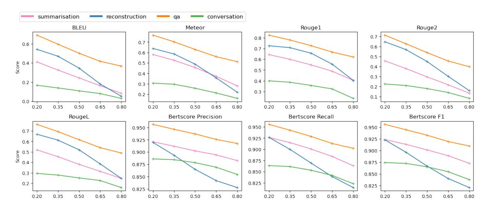
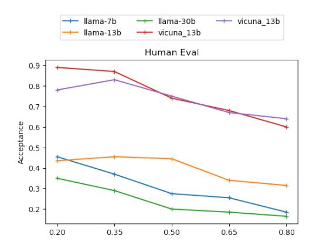
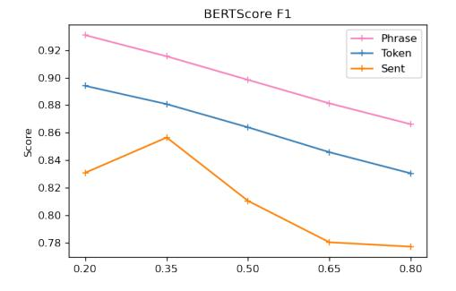

# 3 Method

*Selective Context* optimises the input context by filtering out redundant or non-essential content to reduce computational cost and make better use of the limited context window. In implementation, Original: INTRODUCTION Continual Learning ( *CL ) , also known as Lifelong Learning , is* a promising learning paradigm to design models *that* have to *learn* how *to perform multiple tasks* across *different environments* over *their lifetime [*To uniform the language and enhance *the readability of the paper we* adopt the unique term continual learning *( CL ) .].* Ideal CL models in *the real world* should *be* deal *with* domain shifts *,* researchers *have* recently started *to* sample tasks *from* two different datasets *.* For instance *,* proposed to train and evaluate *a model* on Imagenet first *and then* challenge *its performance on the* Places365 *dataset .* considers more scenarios *,* starting *with* Imagenet or Places365 *, and then moving on to* the VOC/CUB/Scenes datasets*.* Few works propose more advanced scenarios built *on* top *of* more than two datasets*.*

Filtered: INTRODUCTION Continual Learning ( a promising learning paradigm to design models have to how across overTo uniform the language and enhance adopt the unique term continual learning Ideal CL models in should deal domain shifts researchers recently started sample tasks two different datasets For instance proposed to train and evaluate on Imagenet first challenge Places365considers more scenarios starting Imagenet or Places365 the VOC/CUB/Scenes datasetsFew works propose more advanced scenarios built top more than two datasets

Figure 2: A visualisation of selective context. Darker colour indicates larger value of self-information.

we first 1) employ a causal language model such as GPT [\(Radford et al.,](#page-8-8) [2019;](#page-8-8) [Brown et al.,](#page-8-0) [2020\)](#page-8-0), OPT [\(Zhang et al.,](#page-9-3) [2022\)](#page-9-3), or LLaMA [\(Touvron](#page-9-0) [et al.,](#page-9-0) [2023\)](#page-9-0), computing self-information for each token. We then 2) merge tokens, along with their corresponding self-information values, into lexical units, which can be phrases or sentences. This step is optional if tokens are being used as the basic units. Finally, 3) we eliminate content that is deemed least necessary to render the input more compact.

#### 3.1 Computing Self-Information

Given a context C = x0, x1, ..., xn, where xi denotes a token, we use a base language model M to compute the self-information for each token xt as follows:

$$I(x_i) = -\log_2 P(x_i|x_0, x_1, ..., x_{i-1})$$
 (5)

### 3.2 Merging into Lexical Units

If the content filtering of selective context is directly performed on the token level, it might lead to very disjoint context. Therefore apart from token level filtering, we also conduct the filtering procedure on phrase and sentence level. We call a basic unit in our filtering a *lexical unit*, which could be a token, a phrase or a sentence in our setting.

To enable selective context to work on phrases and sentences, we merge tokens and their selfinformation into lexical units. Each lexical unit u consists of multiple tokens (xt , ..., xt+α), and we can calculate its self-information by summing the self-information of its individual tokens according

to the additivity property of self-information:

$$I(u) = \sum_{i=t}^{\alpha} I(x_i)$$
 (6)

The NLTK sentence tokenizer is employed to obtain sentence level lexical units. And we use spacy[1](#page-2-0) to merge tokens into noun phrases. We do not merge verb phrases as it might produce very long phrases.

### 3.3 Selective Retention of Informative Context

With the self-information of each lexical unit computed, we can now evaluate their informativeness. Instead of using a fixed threshold or retaining a fixed number of top k lexical units, we design a percentile-based filtering approach to adaptively select the most informative content.

First, we rank the lexical units based on their self-information values in descending order. Then, we compute the p-th percentile of self-information values among all lexical units.

$$I_p = \text{np.percentile}([I(u_0), .., I(u_k)], p)$$
(7)

Next, we selectively retain lexical units with selfinformation values greater than or equal to the p-th percentile, constructing a filtered context C ′ :

$$C' = U_i \mid I(U_i) \ge I_p, 1 \le i \le n \tag{8}$$

The percentile-based filtering is a more flexible approach to retain the most informative content depending on the distribution of self-information values in the given context. In Figure [2,](#page-2-1) we present

1[https://spacy.io/api/](https://spacy.io/api/pipeline-functions#merge_noun_chunks) [pipeline-functions#merge\\_noun\\_chunks](https://spacy.io/api/pipeline-functions#merge_noun_chunks)

an example on phrase level where p is set to 50, which means half of phrases are filtered out. In this case, the context after processing by selective context only retains 57.2% of tokens, which saves 42.7% of context length.

### 4 Experiments

The goal of Selective Context is to reduce the redundancy in the input context without compromising the generation quality of LLMs. As a result, we are expecting the answers given both selective context and the original context to be as close as possible. We take the generated answer given full context as the reference answer, and compare to the generated answer given the selective context in our experiments.

#### 4.1 Datasets

Selective Context prunes redundancy in the input context to allow very long context processing for LLMs. However, existing benchmarks for LLMs, such as MMLU [\(Hendrycks et al.,](#page-8-9) [2020\)](#page-8-9) and ARC [\(Clark et al.,](#page-8-10) [2018\)](#page-8-10), are mostly single round question answering and are thus not suitable to evaluate our proposed method. Therefore, we collect three test sets consisting of long documents and conversations to evaluate Selective Context. Statistics in detail are presented in Table [4.](#page-9-4)

BBC News: A dataset containing news articles collected from the British Broadcasting Corporation (BBC). This dataset covers a wide range of topics, including politics, business, sports, and technology. We use the full content of each news article in our experiments.

arXiv Articles: A dataset consisting of latest academic papers, spaning various scientific disciplines, such as computer science, physics, and mathematics. As arXiv articles can be quite long, we only process the first two sections (usually introduction and background) for each paper in our experiments. ShareGPT.com: ShareGPT.com is a platform where ChatGPT users share their surprising and interesting conversation with ChatGPT. This datasets consists of conversations in different languages and in various scenarios (e.g., coding, chitchat, writing assistant, etc.). We use the ShareGPT dataset for the conversation task in our experiments.

The three evaluation datasets were created carefully to avoid *data contamination*. Data samples in the BBC News, arXiv, and ShareGPT.com datasets were all created after March 2023, which is after

the release of all LLMs in our experiments. Considering some of baseline models are continually being updated, we employ the latest version released before 30 March 2023 to make sure models have never seen our test set in their pre-training and fine-tuning stage. In addition, as some of LLMs in our experiment has a max\_length of 2048 tokens, we do not include articles or conversations exceeding this length.

### 4.2 Models

We test Selective Context on the following models: GPT-3.5, GPT-4: GPT-3.5 also known as Chat-GPT, which is likely to be further fine-tuned from GPT-3 and InstructGPT. GPT-4 is the latest model from OpenAI, which has demonstrated substantially improved capability on complex reasoning compared to its predecessor. GPT-3.5 and GPT-4 are unfortunately not open-source, we can only access these models via web api[2](#page-3-0) .

LLaMA-7, 13, 30B: LLaMA is a family of opensource language models released by Meta, which is reported to outperform GPT-3 with less parameters. The LLaMA family includes models with size ranging from 7B to 65B. To investigate the effect of scaling law to Selective Context, we experiment with LLaMA with 7B, 13B, and 30B parameters.

Vicuna-7, 13B: Vicuna [\(Chiang et al.,](#page-8-11) [2023\)](#page-8-11) is a family of open-source language models instructtuned from LLaMA. According to their technical report, Vicuna model perform quite well on a list of multitasking benchmarks.

#### 4.3 Tasks and Metrics

We evaluate Selective Context on four tasks:

Original Context Reconstruction: Given a compressed context produced by Selective Context, this task aims to evaluate whether models are able to reconstruct the original context. This task assesses how well the filtered context retains the essential information from the original context. In our experiments, the compressed contexts are used as input, and the original contexts are used as reference answers.

Summarisation: Given a context, the task is to generate a summary that captures the main points of the document. This task aims to evaluate whether Selective Context affects the overall understanding of models on the input contexts. In

2[https://platform.openai.com/docs/](https://platform.openai.com/docs/api-reference) [api-reference](https://platform.openai.com/docs/api-reference)

our experiments, the input and output are the compressed context and the summaries generated based on the compressed contexts. Summaries based on the *original (full) contexts* are treated as the reference answers.

Question Answering (QA): Given a document and a set of questions, the task is to generate answers based on the information available in the document. This task aims to evaluate models' understanding towards a specific query. Here we first generate questions and answers based on the original context, where these answers are treated as reference answers, and then ask LLMs to answer these questions with selective context.

Conversation: This task is only for the ShareGPT dataset. Given a conversation history and a user query, the task is to generate a response to the query based on the previous conversation history. This task aims to evaluate selective context's performance on conversation. Specifically, we ask LLMs to answer users' last query of ShareGPT conversation instances with selective context applied on the previous conversation history.

We employ four metrics to assess the performance of our models on the tasks: BLEU, ME-TEOR, ROUGE, and BERTScore. BLEU [\(Pa](#page-8-12)[pineni et al.,](#page-8-12) [2002\)](#page-8-12) calculates n-gram precision, which is the proportion of n-grams in the generated text that are also present in the reference text. ME-TEOR [\(Banerjee and Lavie,](#page-8-13) [2005\)](#page-8-13) take additional features such as synonymy, stemming and word order into consideration, which leads to more comprehensive evaluation. ROUGE [\(Lin,](#page-8-14) [2004\)](#page-8-14) focuses on how much of the important information in the reference text is present in the generated summary. BERTScore [\(Zhang et al.,](#page-9-5) [2019\)](#page-9-5) leverages contextualised embeddings from pre-trained language models like BERT, computing the cosine similarity between the generated text and reference text embeddings to capture semantic similarity more effectively than traditional n-gram-based metrics.

As mentioned before, we use the generated answers given the full contexts as the reference answers. When testing the deterministic decoding strategy (greedy decoding), we take one single run on full context as the reference answer. When testing non-deterministic decoding strategy (temperature = 0.7), we run multiple times on full context to obtain multiple reference answers to address the randomness in decoding. The metrics are computed based on the set of reference

answers. In our experiment, we set the number of reference answers to 4.

#### 4.4 Experimental Settings

We use smaller base causal language model for selfinformation computing in our experiments. For the LLaMA family and vicuna family, we employ LLaMA-7B to compute self-information. For the OpenAI family, we use a smaller GPT-3 variant curie for self-information computing, which is available on OpenAI web API. In self-information computing, we do not process the entire context at once. This is due to our observation on the tendency of LLMs to give later lexical units lower selfinformation. Instead, we compute self-information sentence by sentence in our experiments.

In our experiments, we compare the two different dimensions that are adjustable in Selective Context.

Compression Ratios: We experiment with different content reduction ratios in Selective Context: 0.2, 0.35, 0.5, 0.65, and 0.8. These ratios determine the proportion of content to be filtered out, allowing us to study the trade-off between efficiency and performance as the amount of retained information varies.

Lexical Units: Lexical units are the basic element of content reduction in Selective Context. It can be sentence, phrases, or tokens. As mentioned in [§3.2,](#page-2-2) we remove the redundancy in input context by a specific lexical unit level.

### 5 Results

Except [§5.5,](#page-7-0) all results of selective context presented are at the phrase level (the optimal).

#### 5.1 Overview

In Table [1,](#page-5-0) we first compare the performance of *Selective Context* against the *Original Context* to see how well Selective Context preserves useful information when reducing context cost. The metrics are averaged across all models mentioned in [§4.2.](#page-3-1) The performance drop is shown in parentheses.

As demonstrated in the table, using Selective Context only leads to a marginal drop when the reduction ratio is set to 0.2 or 0.35, despite it significantly reducing the context cost. The BLEU score drops by only 0.05 when 20% of the content is reduced. And the number is even smaller when it comes to ROUGE-1, where the drop is just 0.03. This indicate a high level of consistency be-

|                      |       |            |            | ROUGE               |            |            | BERTScore   |             |                      |
|----------------------|-------|------------|------------|---------------------|------------|------------|-------------|-------------|----------------------|
| Method               | Ratio | BLEU       | METEOR     | rouge1              | rouge2     | rougeL     | Precision   | Recall      | F1                   |
| Original             | -     | .347       | .496       | .571                | .383       | .471       | .910        | .909        | .909                 |
| Selective Context | 0.2   | .295 (.05) | .460 (.04) | .540 (.03)          | .346 (.04) | .438 (.03) | .905 (.005) | .900 (.009) | .902 ( <b>.007</b> ) |
|                      | 0.35  | .243 (.10) | .421 (.08) | .504 ( <b>.07</b> ) | .294 (.09) | .396 (.07) | .900 (.010) | .894 (.015) | .897 ( <b>.013</b> ) |
|                      | 0.5   | .179 (.17) | .362 (.13) | .449 (.12)          | .237 (.15) | .344 (.13) | .893 (.018) | .882 (.027) | .887 (.023)          |
|                      | 0.65  | .127 (.22) | .299 (.20) | .391 (.18)          | .178 (.21) | .287 (.18) | .885 (.025) | .870 (.039) | .877 (.032)          |
|                      | 0.8   | .070 (.28) | .224 (.27) | .311 (.26)          | .122 (.26) | .225 (.25) | .874 (.036) | .852 (.057) | .863 (.047)          |

Table 1: Comparing Selective Context to the Original Context when temperature set to 0.7.

|                   |       |       |        | ROUGE  |        | BERTScore |           |        |       |
|-------------------|-------|-------|--------|--------|--------|-----------|-----------|--------|-------|
|                   | Ratio | BLEU  | METEOR | rouge1 | rouge2 | rougeL    | Precision | Recall | F1    |
| Random            | 0.20  | 0.437 | 0.578  | 0.666  | 0.503  | 0.566     | 0.892     | 0.909  | 0.899 |
|                   | 0.35  | 0.360 | 0.514  | 0.629  | 0.423  | 0.502     | 0.879     | 0.895  | 0.886 |
|                   | 0.50  | 0.283 | 0.443  | 0.576  | 0.346  | 0.432     | 0.867     | 0.881  | 0.873 |
|                   | 0.65  | 0.210 | 0.378  | 0.522  | 0.279  | 0.371     | 0.855     | 0.868  | 0.860 |
|                   | 0.80  | 0.156 | 0.314  | 0.450  | 0.219  | 0.310     | 0.843     | 0.853  | 0.847 |
| Selective Context | 0.20  | 0.527 | 0.643  | 0.714  | 0.585  | 0.631     | 0.930     | 0.932  | 0.931 |
|                   | 0.35  | 0.446 | 0.588  | 0.679  | 0.508  | 0.570     | 0.915     | 0.916  | 0.915 |
|                   | 0.50  | 0.350 | 0.528  | 0.642  | 0.425  | 0.501     | 0.900     | 0.902  | 0.900 |
|                   | 0.65  | 0.244 | 0.418  | 0.557  | 0.315  | 0.404     | 0.886     | 0.877  | 0.881 |
|                   | 0.80  | 0.160 | 0.328  | 0.464  | 0.223  | 0.319     | 0.875     | 0.858  | 0.866 |

Table 2: Comparing Selective Context to the random deletion baseline when using greedy decoding.

tween answers given selective contexts and original contexts when the reduction ratio is 0.2. Selective Context also yields impressive results when 35% of the content is reduced, with BERT scores around 0.9 and ROUGE-1 scores over 0.5. The drops become noticeable as the reduction ratio rises to 0.5, where the average BLEU score drops 0.17 and the average ROUGE-1 drops 0.12. A reduction ratio of 0.65 and 0.8 tends to be less valuable, as shown by the 0.18 drop on ROUGE-1 and 0.32 drop on BERTScore-F1.

We then compare *Selective Context* against the *Random* compression baseline as shown in Table 2. We observe that using Selective Context allows LLMs to generate very similar answers to the reference answers (answers given full context) although we significantly reduce the context cost. Selective Context maintains BERTScore-F1 above 0.9 when the compression ratio is 0.5 or lower, which shows a high similarity with the reference answers. ROUGE demonstrates the same trend: ROUGE-1 continue to be above 0.64 and ROUGE-L keeps above 0.5 when the ratio is under 0.5. We also notice that Selective Context is significantly more effective than the random baseline: Selective Context with compression ratio of 0.5 shows a better

| Ratio | #Sorry | Answer len. | Unfaithfulness |
|-------|--------|-------------|----------------|
| Full  | 0      | 160.3       | -              |
| 0.2   | 0      | 156.5       | .027           |
| 0.35  | 6      | 136.0       | .050           |
| 0.5   | 4      | 140.2       | .038           |
| 0.65  | 19     | 131.2       | .051           |
| 0.8   | 27     | 103.7       | .086           |

Table 3: Faithfulness test on gpt-3.5-turbo using selective context.

overlapping with the reference answer than Random baseline with only 20% content compression.

#### 5.2 Faithfulness

To evaluate to what extent selective context affects the faithfulness of LLMs generated content, we perform manual tests on our question answering results based on the idea of (Wang et al., 2020). We evaluate 1000 question answering pairs (200 for each ratio) with the following procedure: 1) We first extract OpenIE tuples from the answers of selective context, and then 2) manually evaluate whether each tuple is entailed by the reference answer. If the model's answer is "Sorry, I don't know", we treat it as "Sorry" cases and do not consider it as unfaithfulness.

As shown in the Table 3, we find that gpt-3.5

> **[图片提取文字 (无描述)]:**
> summarisation reconstruction conversation qa BLEU Rouge1 Rouge2 Meteor 0.7 0.8 0.7 0.6 0.6 0.7 0.6 0.5 0.6 9.0.4 SC025 0.5 0.4 0.5 0.4 0.3 0.4 0.2 0.3 0.2 0.3 0.2 0.1 0.0 0.20 0.35 0.50 0.65 0.80 0.20 0.35 0.50 0.65 0.80 0.20 0.35 0.50 0.65 0.80 0.20 0.35 0.50 0.65 0.80 RougeL Bertscore Precision Bertscore Recall Bertscore F1 0.950 0.950 0.950 0.7 0.925 0.925 0.6 0.925 0.5 0.4 0.900 0.900 0.900 0.875 0.875 0.875 0.850 0.3 0.850 0.850 0.2 0.825 0.825 0.825 0.20 0.35 0.50 0.65 0.80 0.35 0.50 0.65 0.80 0.20 0.35 0.50 0.65 0.80 0.35 0.50 0.65 0.80 0.20 0.20

Figure 3: Performance of selective context on different tasks. x-axix represents compression ratios (same below).

> **[图片提取文字 (无描述)]:**
> llama-7b llama-30b vicuna 13b llama-13b vicuna\_13b Human Eval 0.9 0.8 0.7 Acceptance 0.6 0.5 0.4 0.3 0.2 0.20 0.35 0.50 0.65 0.80

Figure 4: Acceptance rate of generated summaries.

tend to generate shorter answers or refuse to answer the questions if it fails to identify necessary evidence in the given selective context. With a compress ratio of 0.65, gpt-3.5 refuses to answer 19 questions (9% of 200), and the answers are 35% shorter than the reference answer (131 tokens in average). However, selective context doesn't significantly affect the faithfulness across all compression ratios. About 3.8% of all tuples are not entailed by the reference answer when the compression ratio is 0.5, and this number rises slightly to 5.1% as the compression ratio increase to 0.65.

#### 5.3 Tasks

In this part, we break down and analyse the performances of Selective Context into the four different NLP tasks: summarisation, question answering, original context reconstruction, and conversation. The results are as shown in Fig. [3.](#page-6-0) First, the results on the Original Context Reconstruction task (RC) show the steepest drop with increasing compression ratio, however, Selective Context allows LLMs to preserve most of the key points in the

> **[图片提取文字 (无描述)]:**
> BERTScore F1 Phrase 0.92 Token Sent 0.90 0.88 Score 0.86 -0.84 0.82 -0.80 0.78 0.80 0.20 0.50 0.65 0.35

Figure 5: Effects of lexical units.

original context when the reduction ratio is lower than 0.5, as demonstrated by a rather high ROUGE score. Second, we notice that the curves of question answering and summarisation decrease gradually and are continually higher that the other two tasks evaluated by BERTScore. We could say Selective Context is especially suitable for tasks of summarisation and answer generation.

#### 5.4 Scaling and Instruct-Tuning

We perform human evaluation to explore the effect of model scales and supervised instruct-tuning on Selective Context. We ask three college students to evaluate 1150 generated summaries from llama and vicuna (about 55 per model and ratio) and record whether they accept the generation as a reasonable summary. As shown in Figure [4,](#page-6-1) we find no specific trends between the scales and generation quality given Selective Context. The vicuna family demonstrates similar summarisation capability with 7b and 13b parameters. And so does the llama family, larger models do not show stronger robustness towards Selective Context. But instruct-tuned model vicuna demonstrates significant superior performance than

Original Context, CUDA Memory = 77,695 MB; Time = 110.8 ms/token

Please see the original document and summary given full context in Appendix [B.](#page-9-7)

Selective Context, Ratio: 0.5, CUDA Memory = 61,885 MB, Time = 76.3 ms/token, Time to construct selective context = 46.1 ms

[1]The above paragraph discusses the use of probabilistic methods, safety distance-based control methods, and trajectory prediction methods for assisting vehicles in avoiding collisions. [1]It mentions that CNN has made outstanding contributions in vision tasks, particularly in road condition inspection, due to its excellent regional feature extraction capabilities. However, the performance of CNN-based models for vision tasks is inferior to EfficientNets RepVGG, due to the huge differences between sequential tasks in NLP and image tasks in CV, the difficulty in keeping the original information of inputs after RNN layers, and the computational and memory requirements of switching layers. The paragraph introduces a new network structure called Sequential Spatial Network (SSN) blocks, which overcomes the limitations of traditional CNN-based models. [2]The SSN block consists of convolutional layers, Upsampling Convolutional Decreasing (UCD) blocks, and Reinforcement Region Unit and Fast MultiHead Self-Attention (FMHSA) to enhance local information and improve normalization capability. The paragraph concludes by stating that the SSN network outperforms existing methods on the Lykit dataset and can be easily transferred for image classification tasks.

Figure 6: Comparing the summary generated by vicuna\_13b given original context and selective context.

llama models given selective context indicating instruct-tuning might help the model to be more robustness towards context compression. Given selective context, llama models often fail to follow instructions and go wild very easily.

#### 5.5 Lexical Units

We test the effect of Selective Context based on different lexical units: tokens, phrases, and sentences via BERTScore-F1. As shown in Table [5,](#page-6-2) employing phrase as the basic lexical units in Selective Context is the optimal approach, consistently outperforming the other two variants, followed by token-level Selective Context. Removing redundancy at sentence-level is a rather unstable implementation compared to the token and phrase-level. This experiment indicates that a reasonable granularity can be crucial in Selective Context.

#### 5.6 Case Study

To have a straightforward impression on how well LLMs generate with selective context, we present two summaries given the full and selective context respectively in Figure [6.](#page-7-1) The original document and processing to obtain selective context are presented at Appendix [B.](#page-9-7)

We first found that preparing selective context is extremely efficient. It takes a one-time cost of 46.1 ms to build selective context for the example paragraph, which includes computing self-information

and performing lexical unit tokenisation. This ensures that the initial stage of establishing a selective context incurs very little overhead. Secondly, it shows selective context significantly reduces the memory usage of the GPU and accelerates the generation process. With compression ratio of 0.5, selective context reduces about 36% of the memory cost in inference and makes generation 1.32 times faster (per token). By comparing the content of the two summaries, we see that the summary given selective context missed relevant information about the research background (as denoted by the [1] marker), such as the use of machine learning in autonomous driving technology and instead starts with the different methods directly. This is due to the background parts not being selected and removed as redundancy before feeding to vicuna. We try to ask vicuna *"what is the background of this study?"* given the selective context, and obtain a decent answer: *"the research background of this paper is likely to be situated in the domain of autonomous driving technology and the application of artificial intelligence (AI) for improving vehicle safety and decision-making capabilities."*. This demonstrates that LLMs are likely to be able to infer the deleted parts of background information in the selective context. Selective context also affects vicuna's decision on what information should be included in the summary as the second summary includes details about for example FMHSA and

UCD block (as denoted by the [2] marker) which are not covered in the summary generated with the full context. We find no factual errors in the summary given selective context.

### 6 Conclusion

We introduced Selective Context to improve the context efficiency of LLMs in inference by deleting redundant content measured by self-information. Our extensive experiments on arXiv papers, BBC news articles, and conversation transcripts showed that our proposed method can significantly reduce GPU memory cost, accelerate generation with minor performance decrease, and potentially enable LLMs to handle long documents and extended conversations without the risk of context truncation.

### 7 Limitations

*Selective Context* demonstrates promising results, but it is still necessary to note a couple of potential limitations. Firstly, our approach is somewhat influenced by the phrase boundary detection procedure. We employ the noun phrase tokenisation algorithm provided by spacy in our experiments. However, we do not consider verb phrases as there is no mature solution for verb phrase tokenisation. We speculate that we can achieve better compression performance with dependency tree-based filtering procedure which might lead to better boundary identification of lexical units. Secondly, in the experiment section, we use percentile to control the pruning process. However, the optimal compression percentile varies based on specific tasks and context. Developing a tool to find the optimal threshold can further enhance the effectiveness of selective context.

### References

- Satanjeev Banerjee and Alon Lavie. 2005. Meteor: An automatic metric for mt evaluation with improved correlation with human judgments. In *Proceedings of the acl workshop on intrinsic and extrinsic evaluation measures for machine translation and/or summarization*, pages 65–72.
- Iz Beltagy, Matthew E Peters, and Arman Cohan. 2020. Longformer: The long-document transformer. *arXiv preprint arXiv:2004.05150*.
- Tom Brown, Benjamin Mann, Nick Ryder, Melanie Subbiah, Jared D Kaplan, Prafulla Dhariwal, Arvind Neelakantan, Pranav Shyam, Girish Sastry, Amanda Askell, et al. 2020. Language models are few-shot

- learners. *Advances in neural information processing systems*, 33:1877–1901.
- Sébastien Bubeck, Varun Chandrasekaran, Ronen Eldan, Johannes Gehrke, Eric Horvitz, Ece Kamar, Peter Lee, Yin Tat Lee, Yuanzhi Li, Scott Lundberg, et al. 2023. Sparks of artificial general intelligence: Early experiments with gpt-4. *arXiv preprint arXiv:2303.12712*.
- Razvan Bunescu and Oseremen O Uduehi. 2022. Distribution-based measures of surprise for creative language: Experiments with humor and metaphor. In *Proceedings of the 3rd Workshop on Figurative Language Processing (FLP)*, pages 68–78.
- Alexis Chevalier, Alexander Wettig, Anirudh Ajith, and Danqi Chen. 2023. Adapting language models to compress contexts. *arXiv preprint arXiv:2305.14788*.
- Wei-Lin Chiang, Zhuohan Li, Zi Lin, Ying Sheng, Zhanghao Wu, Hao Zhang, Lianmin Zheng, Siyuan Zhuang, Yonghao Zhuang, Joseph E. Gonzalez, Ion Stoica, and Eric P. Xing. 2023. [Vicuna: An open](https://lmsys.org/blog/2023-03-30-vicuna/)[source chatbot impressing gpt-4 with 90%\\* chatgpt](https://lmsys.org/blog/2023-03-30-vicuna/) [quality.](https://lmsys.org/blog/2023-03-30-vicuna/)
- Rewon Child, Scott Gray, Alec Radford, and Ilya Sutskever. 2019. Generating long sequences with sparse transformers. *arXiv preprint arXiv:1904.10509*.
- Peter Clark, Isaac Cowhey, Oren Etzioni, Tushar Khot, Ashish Sabharwal, Carissa Schoenick, and Oyvind Tafjord. 2018. Think you have solved question answering? try arc, the ai2 reasoning challenge. *ArXiv*, abs/1803.05457.
- Dan Hendrycks, Collin Burns, Steven Basart, Andy Zou, Mantas Mazeika, Dawn Xiaodong Song, and Jacob Steinhardt. 2020. Measuring massive multitask language understanding. *ArXiv*, abs/2009.03300.
- Chin-Yew Lin. 2004. Rouge: A package for automatic evaluation of summaries. In *Text summarization branches out*, pages 74–81.
- Jesse Mu, Xiang Lisa Li, and Noah Goodman. 2023. Learning to compress prompts with gist tokens. *arXiv preprint arXiv:2304.08467*.
- Kishore Papineni, Salim Roukos, Todd Ward, and Wei-Jing Zhu. 2002. Bleu: a method for automatic evaluation of machine translation. In *Proceedings of the 40th annual meeting of the Association for Computational Linguistics*, pages 311–318.
- Alec Radford, Jeffrey Wu, Rewon Child, David Luan, Dario Amodei, Ilya Sutskever, et al. 2019. Language models are unsupervised multitask learners. *OpenAI blog*, 1(8):9.
- Claude E Shannon. 1948. A mathematical theory of communication. *The Bell system technical journal*, 27(3):379–423.

Hugo Touvron, Thibaut Lavril, Gautier Izacard, Xavier Martinet, Marie-Anne Lachaux, Timothée Lacroix, Baptiste Rozière, Naman Goyal, Eric Hambro, Faisal Azhar, et al. 2023. Llama: Open and efficient foundation language models. *arXiv preprint arXiv:2302.13971*.

Ashish Vaswani, Noam Shazeer, Niki Parmar, Jakob Uszkoreit, Llion Jones, Aidan N Gomez, Łukasz Kaiser, and Illia Polosukhin. 2017. Attention is all you need. *Advances in neural information processing systems*, 30.

Alex Wang, Kyunghyun Cho, and Mike Lewis. 2020. Asking and answering questions to evaluate the factual consistency of summaries. *ArXiv*, abs/2004.04228.

EC Wit and Marie Gillette. 1999. What is linguistic redundancy. *University of Chicago*.

Susan Zhang, Stephen Roller, Naman Goyal, Mikel Artetxe, Moya Chen, Shuohui Chen, Christopher Dewan, Mona Diab, Xian Li, Xi Victoria Lin, et al. 2022. Opt: Open pre-trained transformer language models. *arXiv preprint arXiv:2205.01068*.

Tianyi Zhang, Varsha Kishore, Felix Wu, Kilian Q Weinberger, and Yoav Artzi. 2019. Bertscore: Evaluating text generation with bert. *arXiv preprint arXiv:1904.09675*.

