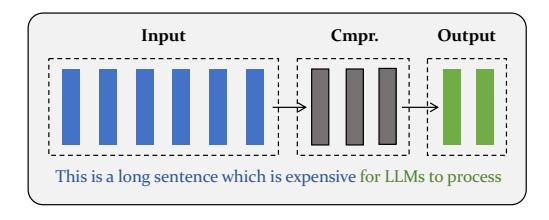
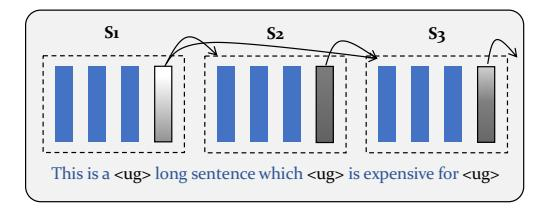
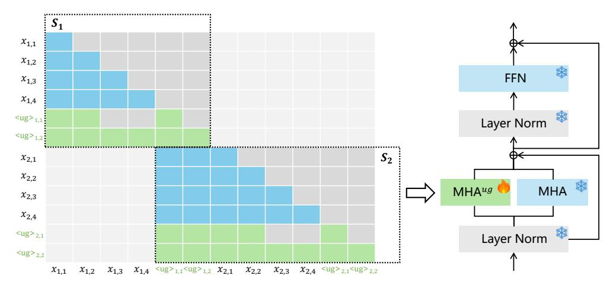
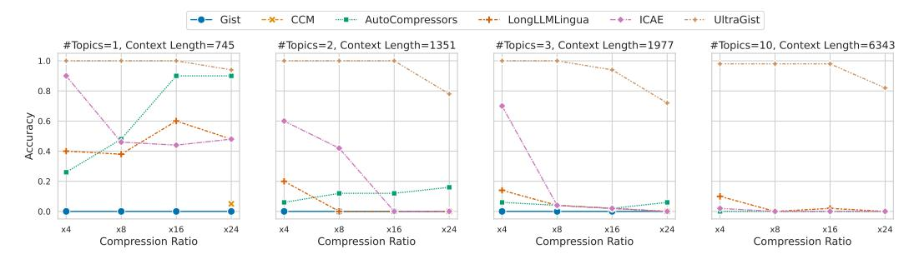
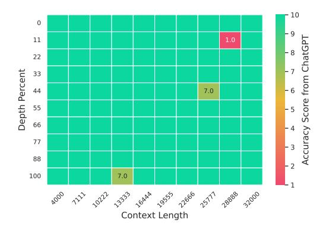
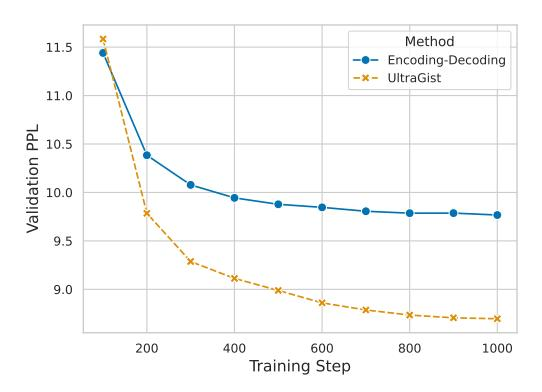

# 1 Introduction

The economical running of large language models (LLMs) is a critical issue for society. On one hand, it cuts down the monetary cost of using LLMs, which makes such powerful AI tools more accessible to people's lives. On the other hand, it also contributes to the saving of energy, which makes the corresponding techniques environment-friendly. The economical running of LLMs can be advanced in different ways, among which the compression of context is one important perspective [\[30;](#page-11-0) [22;](#page-11-1) [7\]](#page-10-0). This is because the Transformer architecture incurs a quadratic time complexity while performing self-attention. Once the context length can be substantially compressed, there will be a tremendous reduction of computation and memory consumption.

Despite the preliminary progress, it remains a tough challenge to perform high-quality compression for LLM's context. Notably, the existing methods struggle to handle lengthy context. Most of the time, they are trained to compress relatively short context with a pre-defined compression ratio [\[30\]](#page-11-0), which is insufficient and inflexible to compress the working context for many real-world applications, such as document-level reading compression, document summarization, and multi-turn conversation. Besides, the existing methods are prone to big compression losses, which means the LLM's performance is likely to severely degrade based on the compressed context. Even worse, the compression loss can be magnified when handling *longer context* or *out-of-domain scenarios*. Finally, the compression is statically computed in many popular methods [\[22;](#page-11-1) [30\]](#page-11-0), which means the compression needs to be re-computed if the context is updated. Such methods are unsuitable for scenarios like conversations, where new context is dynamically presented.

∗ Peitian Zhang and Zheng Liu are the co-first authors

†Zheng Liu is the corresponding author

> **[图片提取文字 (无描述)]:**
> Input Cmpr. Output This is a long sentence which is expensive for LLMs to process

> **[图片提取文字 (无描述)]:**
> This is a <ug> long sentence which <ug> is expensive for <ug>

#### **(A) Conventional Compression (B) Compression by UltraGist**

Figure 1: Comparison using an example sentence. The conventional methods (A), like Gist [\[30\]](#page-11-0), treat most of the sentence starting from the beginning as input and the end of it as output. The input is compressed all at once, based on which the output is predicted. UltraGist (B) partitions the context into fine-grained segments of an equal window size (S1, S2, S3). Then, it progressively compresses the entire context based on randomly sampled compression ratios. Each segment is predicted from its compressed preceding context (i.e. the grey slots whose brightness indicates the compression ratio).

As discussed, it is non-trivial to perform high-quality compression for lengthy context, where much of the reason is due to the rigid form of compression and training. Particularly, the previous methods used to produce a fixed-size compressed result (e.g., a constant number of compressed hidden states [\[30;](#page-11-0) [15;](#page-10-1) [23\]](#page-11-2)) for the input context (usually truncated to a uniform length), based on which the LLM makes its prediction for the target output. Given such a process, it can only learn to compress one particular context length by a constant compression ratio. Besides, it is only able to obtain training loss from the target output. In contrast, the input context, which accounts for a big amount of the computation during compression, cannot be utilized as the training objective.

To address the above challenges, we propose a new approach called UltraGist. [3](#page-1-0) Our approach is featured for its high-quality compression of lengthy context thanks to the innovative compression and learning mechanism. In a nutshell, we partition the lengthy context into fine-grained segments of an equal size w, e.g., 1024 tokens, such that the whole context can be progressively compressed based on each segment's internal information and the external information from the compressed preceding context (Figure [1\)](#page-1-1). For each segment, the compression ratio α is randomly sampled, where the context within the segment is compressed by a factor of α. Based on such a workflow, the learning process takes place in the form of compression-based language modeling, where each token is predicted from its compressed preceding context. The above mechanism brings forth four benefits.

- Firstly, it notably contributes to the compression's *flexibility*. On one hand, the prediction of next token is made based on the compressed preceding context, where the context lengths differ among tokens. On the other hand, each token's preceding context is compressed by a mixture of different ratios because of the random sampling. Therefore, UltraGist can naturally be learned to handle a broad range of context lengths and compression ratios during training.
- Secondly, it helps to produce *fine-grained compression* for the lengthy context. Different from many conventional methods which compress the lengthy context directly, our method is able to effectively preserve the fine-grained information of context since the small context segments can be progressively processed with an optimized cross-attention mechanism.
- Thirdly, it substantially improves the *sample-efficiency* and thus helps to make full use of the training data, as the training loss can be obtained from all tokens within each training sample.
- Fourthly, it facilitates the *efficient running* of compression when dealing with dynamic context. Thanks to the progressive workflow, the new context, e.g., a session of dialogue between human and machine, can be incrementally compressed and added to the existing compression result.

UltraGist is trained with both plain corpus and instruction-tuning data. Because of the superior sample efficiency, it can quickly establish a strong compression capability for general applications. The effectiveness of UltraGist is verified by a wide variety of tasks associated with lengthy contexts, such as document QA, document summarization, few-shot learning, and multi-session conversation. Whilst the existing methods fail to handle these challenging scenarios, our method is able to maintain

3Gist [\[30\]](#page-11-0) is a well-known approach for context compression. The name is to emphasize the dramatic improvement achieved by our method as high-quality compression can be made for much longer context.

near-lossless compression performances throughout all these evaluations. Our data, model, and source code (anonymously submitted) will be publicly released to facilitate the future research.

## 2 Related Work

LLMs need to deal with lengthy context in many important applications, like the reading compression of a book, the summarization of a long document, the multi-turn conversations with human, et al. To confront such scenarios, a large body of research has been dedicated to the extension of LLMs' context. For example, ALiBi [\[33\]](#page-11-3) leverages linear-decaying attention biases to achieve the extrapolation of position encoding. Methods like Position Interpolation [\[5\]](#page-10-2), NTK-Aware scaling [\[1\]](#page-10-3) and ReRoPE [\[35\]](#page-11-4) make adaptation of RoPE [\[36\]](#page-11-5) such that the LLM can handle unseen positions at the inference time. Besides, recent studies suggest that the LLM's long-context capability can significantly benefit from the continual training and fine-tuning after the modification of ROPE [\[32;](#page-11-6) [13\]](#page-10-4). Considering that training over long-context data is expensive, people also investigate the cost-effective way of training. For example, LongLora [\[6\]](#page-10-5) proposes S2 -Attn and leverages LoRA [\[18\]](#page-10-6) for further acceleration. PoSE [\[41\]](#page-11-7) uses skip-wise position indices to train LLMs on 2K context length as a simulation of 128K. However, fine-tuning operations are likely to incur losses of LLMs' general capability. Ultimately, it is an extremely expensive and resource-consuming option to apply LLMs directly for processing lengthy context.

Another important line of research is about context compression. Such techniques aim to compress the context into shorter and more compact forms where the LLM can generate outputs of equivalent quality. A well-known study in this area is presented by Gist [\[30\]](#page-11-0). It learns to compress the input prompts based on a certain number of Gist tokens, such that the corresponding instructiontuning tasks can be accomplished with shorter context. Apart from Gist, many related works are proposed following the same spirit. ICAE [\[15\]](#page-10-1) fine-tunes the LLM to be a context compressor using LoRA, which produces the compression result on top of several memory tokens. Meanwhile, AutoCompressor [\[7\]](#page-10-0) and CCM [\[23\]](#page-11-2) also fine-tunes the LLM to generate a fixed number of memory (or summary) tokens; however, they rely on auto-regression to better confront longer context and interactive scenarios. In addition to the above methods which leverages special tokens, there are also research works like LLMLingua [\[21;](#page-11-8) [22\]](#page-11-1), which directly remove unimportant tokens from the context based on smaller specialist LMs. Despite the above technical progresses, the existing context compression methods are limited in many perspectives. Notably, they can hardly handle lengthy context. Most of them can only be applied for a specific task, rather than being a general approach. Finally, there are still severe performance losses due to compression.

While our work shares some common principles with the related works, it is distinguished in many critical perspectives about compression and training. One notable advantage is the *dynamic sampling of compression ratios* (i.e. varying numbers of UltraGist tokens) during the progressive compression process. Because of such a feature, UltraGist can be learned to flexibly handle a broad range of context lengths and compression ratios during the training process. Different from our approach, most of the existing methods simply learn to compress the uniformly truncated context with a fixed number of compression tokens [\[30;](#page-11-0) [15;](#page-10-1) [23\]](#page-11-2). Another important difference is that our method is able to perform *fine-grained compression for each small context segment* on top of its optimized attention mechanism. In contrast, the existing methods usually append all special tokens to the end of a big-chunk of context for compression, which is prone to coarse-grained results [\[15;](#page-10-1) [7\]](#page-10-0). Finally, our progressive compression of fine-grained segments facilitates *sample-efficient training*, which significantly improves upon the common practice where the compression is performed in an encoding-decoding manner [\[30;](#page-11-0) [15\]](#page-10-1). Other auto-regressive approaches also share a similar property [\[7;](#page-10-0) [23\]](#page-11-2). However, due to the coarse-grained partition of context, many of the tokens can hardly leverage the compressed preceding context during the training process, since their recent context is largely uncompressed and next tokens can easily be predicted from it.

## 3 Method

In this section, we start with the preliminaries of context compression and present the definition of the problem. Then, we elaborate on how lengthy context is compressed by UltraGist and how the learning process is conducted based on the training sample.

The LLMs are learned to accomplish arbitrary tasks in the form of language generation. Formally, it operates as the following probabilistic process of next token prediction:  $P_{LM}(x_t|x_1,\ldots,x_{t-1})$ , where  $x_i$  is the *i*-th token within the context. Due to the transformer-based architecture of LLMs, the lengthy context will take a huge computation cost while performing the next token prediction. To mitigate this problem, the compression of context becomes a welcomed solution. In our work, the compression is made on top of the newly added special token, namely the UltraGist token: <ug>. Suppose m UltraGist tokens are introduced to compress the context, the language modeling process is modified as:  $P_{LM}(x_t|x_{t-l},\ldots,x_{t-1}, \mathsf{vug})_1,\ldots,\mathsf{vug})_m$ , where  $x_{t-l},\ldots,x_{t-1}$  are the latest ltokens from the original context, and  $\langle ug \rangle_1, \ldots \langle ug \rangle_m$  are the compression for the rest of the context before  $x_{t-l}$  ( $m \ll t-l$ ). Based on such a formulation, the learning of compression can be defined as the optimization of language modeling conditioned on the compressed context with UltraGist.

#### Compression 3.1

We focus on dealing with a lengthy context, e.g., a long document of thousands of tokens. We argue that the direct compression, as performed by many recent works [30; 15], is unsuitable for this scenario. This is because lengthy context is made up of complicated and heterogeneous information, where the direct compression is likely to incur coarse-grained results. Besides, the lengthy context can even go beyond the maximum length of LLMs. In this work, we propose to perform progressive and fine-grained compression for lengthy context. Particularly, the input context  $X = \{x_1, \dots, x_t\}$ is partitioned into small segments of the same window size w (e.g., 1024):

$$X = \{x_1, \dots, x_t\} \xrightarrow{\text{Partition}} \{X_1, \dots X_N\}, \ X_i = \{x_{(i-1)w+1}, \dots, x_{\min\{iw, t\}}\}$$
 (1)

With the well-partitioned context, the progressive compression takes place where each segment is processed sequentially. The above workflow facilitates fine-grained compression of the contextual information. Besides, it relaxes the requirement on LLMs' maximum length, as the small segments can fit into most of the existing models. It also contributes to the efficiency since the progressive processing results in a linear time complexity w.r.t. the context length.

Each segment is compressed by a group of UltraGist tokens: <ug>. The UltraGist tokens are appended to normal tokens in each segment, which jointly summarize the contextual information of the corresponding segment. To flexibly support diversified compression requirements, the compression ratio  $\alpha_i$  for the i-th segment is **dynamically determined** during the training process. In our work,  $\alpha_i$  is uniformly sampled from a scope of candidate ratios:  $\alpha_i \sim \text{Uni}(\{2,4,8,16,32\})$ . After that, the number of UltraGist tokens  $k_i$  can be determined accordingly:  $k_i = w/\alpha_i$ . In other words, the information from w normal tokens will be compressed by  $k_i$  UltraGist tokens.

The UltraGist tokens are employed to compress each segment based on **cross-attention** [26]. For-

mally, such an operation is defined by the following formula: CrossAttn.( 
$$\underbrace{\langle \mathrm{ug} \rangle_{1,1}, \ldots, \langle \mathrm{ug} \rangle_{i-1,k_{i-1}}}_{\text{UltraGist tokens from the preceding context}}, x_{i,1}, \ldots, x_{i,w}, \underbrace{\langle \mathrm{ug} \rangle_{i,1}, \ldots, \langle \mathrm{ug} \rangle_{i,k_{i}}}_{\text{UltraGist tokens for the } i\text{-th segment}}; \mathrm{Mask}). (2)$$

In this place,  $x_{i,1}, \ldots, x_{i,w}$  are the normal tokens within the i-th segment.  $\{ug\}_{1,1}, \ldots, \{ug\}_{i-1,k_{i-1}}$ are the UltraGist tokens from the previous segments, which present the compressed information from the preceding context.  $\langle ug \rangle_{i,1}, \dots, \langle ug \rangle_{i,k_i}$  are the UltraGist tokens for the *i*-th segment. They are used to query the previous tokens by cross-attention based on a tailored attention mask "Mask".

The computation of cross-attention is explained as follows. For an arbitrary layer of the LLM, let  $\mathbf{H}^{nt} \in \mathbb{R}^{w \times D}$  and  $\mathbf{H}^{ug} \in \mathbb{R}^{k_i \times D}$  denote the hidden states of normal tokens and UltraGist tokens,

respectively. The hidden states are projected into queries, keys, and values for cross-attention: 
$$Q^{nt} = W_Q^{nt} \mathbf{H}^{nt}, \qquad K^{nt} = W_K^{nt} \mathbf{H}^{nt}, \qquad V^{nt} = W_V^{nt} \mathbf{H}^{nt},$$

$$Q^{ug} = W_Q^{ug} \mathbf{H}^{ug}, \qquad K^{ug} = W_K^{ug} \mathbf{H}^{ug}, \qquad V^{ug} = W_V^{ug} \mathbf{H}^{ug},$$

$$(3)$$

where  $\bm{W}_*^{nt}$  and  $\bm{W}_*^{ug}$  are the projection matrices to handle normal tokens and UltraGist tokens  $(\boldsymbol{W}_{*}^{nt})$  are the LLM's original parameters, while  $\boldsymbol{W}_{*}^{ug}$  are newly introduced parameters). Based on the projection results, the following attention computation is conducted:

$$\mathbf{A} = \text{softmax} \left( \text{Mask} \left( \frac{\{\mathbf{Q}^{nt}; \mathbf{Q}^{ug}\} \{\mathbf{K}^{ca}; \mathbf{K}^{nt}; \mathbf{K}^{ug}\}^T}{\sqrt{D}} \right) \right), \quad \mathbf{V} = \mathbf{A} \{\mathbf{V}^{ca}; \mathbf{V}^{nt}; \mathbf{V}^{ug}\}$$

$$\mathbf{O}^{nt} = \mathbf{W}_O^{nt} \mathbf{V}[: w], \quad \mathbf{O}^{ug} = \mathbf{W}_O^{ug} \mathbf{V}[w :]. \tag{4}$$

> **[图片提取文字 (无描述)]:**
> $S_1$  $x_{1,1}$  $x_{1,2}$ **FFN**  $x_{1,3}$  $x_{1,4}$ <ug>1,1 Layer Norm <ug>1.2  $x_{2,1}$  $S_2$  $x_{2,2}$ МНА  $\mathsf{MHA}^{ug}$  $x_{2,3}$  $x_{2,4}$ Layer Norm <ug>2,2  $x_{1,2}$   $x_{1,3}$   $x_{1,4}$   $< ug >_{1,1} < ug >_{1,2}$   $x_{2,1}$   $x_{2,2}$   $x_{2,3}$   $x_{2,4}$   $< ug >_{2,1} < ug >_{2,2}$

Figure 2: Illustration of Cross-Attention.  $S_1$  and  $S_2$  are the first two segments, each consisting of 4 tokens. The compression ratio  $\alpha$  is set to 2, where two UltraGist tokens are appended. We use the "stepwise expansion" style attention mask, where 1) the later UltraGist token can attention to a larger scope of normal tokens, 2) the UltraGist tokens from preceding context can all be attended. MHAug indicates the learnable parameters  $(\boldsymbol{W}_{Q}^{ug}, \boldsymbol{W}_{K}^{ug}, \boldsymbol{W}_{V}^{ug}, \boldsymbol{W}_{Q}^{ug})$  for UltraGist tokens' activations.

In the above equations,  $\{\cdot\,;\,\cdot\}$  denotes the matrix concatenation.  $\boldsymbol{K}^{ca},\boldsymbol{V}^{ca}\in\mathbb{R}^{(\sum_{j=1}^{i-1}k_j)\times D}$  are the cached projection results for preceding UltraGist tokens. D is the LLM's hidden dimension. All tokens are encoded by their relative positions within the context window while cross-attention is conducted. The output hidden states, i.e.  $\boldsymbol{O}^{nt}$  and  $\boldsymbol{O}^{ug}$ , are further processed by other operations (e.g., MLP, LayerNorm) before passed to the next layer. After the above computation, the keys and values of UltraGist tokens, i.e.  $\boldsymbol{K}^{ug}$  and  $\boldsymbol{V}^{ug}$ , are generated as the compression result for the normal tokens. Afterwards, the cached keys and values of UltraGist tokens are incrementally updated:

$$\boldsymbol{K}^{ca} \leftarrow \{\boldsymbol{K}^{ca}; \boldsymbol{K}^{ug}\}, \quad \boldsymbol{V}^{ca} \leftarrow \{\boldsymbol{V}^{ca}; \boldsymbol{V}^{ug}\}. \tag{5}$$

It is worth noting the attention mask is tailored for the cross-attention operation. Particularly, we propose to utilize the "stepwise expansion" style mask (Figure 2), where the UltraGist tokens can attend to a linearly growing number of normal tokens in the corresponding segment. In other words, the first  $j \times \alpha_i$  normal tokens can be attended by <ug $>_{i,j}$ . Meanwhile, the UltraGist tokens from preceding context can always be attended. The above mechanism enables UltraGist tokens to capture differentiated information of the segment, which contributes to their joint compression effect. It is empirically more competitive than the common mask used by previous works [30; 15; 7], where the whole normal tokens can be attended by the compression module.

#### 3.2 Learning

UltraGist is learned to optimize the generation quality with the compressed context. Formally, the generation of each token is presented as:  $P_{LM}(x_{i,j}| < u >_{1,1}, \ldots, < u >_{i-1,k_{i-1}}, x_{i,1} \ldots x_{i,j-1}; \Theta, \Theta^{ug})$ . The generation process is associated with two sets of parameters. One is the LLM's original parameters  $\Theta$ , which are *fixed* such that the LLM's original capability with short context won't be affected. The other one is the newly added learnable parameters, which include the parameters for the projection of UltraGist tokens' projection, i.e.  $W_Q^{ug}$ ,  $W_K^{ug}$ ,  $W_V^{ug}$ ,  $W_Q^{ug}$  (initialized from the LLM's original parameters:  $W_Q^{nt}$ ,  $W_K^{nt}$ ,  $W_V^{nt}$ ,  $W_V^{nt}$ ,  $W_V^{nt}$ ,  $W_V^{nt}$ ,  $W_V^{nt}$ , and the token embedding for UltraGist (one shared embedding for UltraGist tokens despite that they are used multiple times in cross attention). The learning is performed to minimize the the next-token prediction loss for the entire context:

$$\min_{\boldsymbol{\Theta}^{ug}} \cdot \sum_{i=2}^{N} \sum_{j=1}^{w} P_{LM}(x_{i,j} | \langle \mathsf{ug} \rangle_{1,1}, \dots, \langle \mathsf{ug} \rangle_{i-1,k_{i-1}}, x_{i,1} \dots x_{i,j-1}; \boldsymbol{\Theta}, \boldsymbol{\Theta}^{ug}).$$
(6)

As presented above, the training loss can be obtained from all tokens within the context (except the ones in the first segment). Such a property contributes to a high sample-efficiency, which maximizes

> **[图片提取文字 (无描述)]:**
> -o- Gist -x-- CCM --- AutoCompressors --+- LongLLMLingua - - ICAE UltraGist #Topics=1, Context Length=745 #Topics=2, Context Length=1351 #Topics=3, Context Length=1977 #Topics=10, Context Length=6343 -----Acmesmenmen & ....................................... 0.8 0.2 A MILLION CO. 2 ..... x24 x24 x24 x24 x4 x16 x16 Compression Ratio Compression Ratio Compression Ratio Compression Ratio

Figure 3: Evaluation results of Topic Retrieval. UltraGist demonstrates superior compression quality over the baseline methods across a broad range of context lengths and compression ratios.

the use of training data and thus facilitates the learning of compression capability. Unlike recurrent memory methods [7; 4] that compel serial encoding of each segment, UltraGist allows parallel encoding of adjacent segments. For example, in Figure 2, the encoding of the first two segments can be computed simultaneously leveraging the attention mask of the largest gray square.

## 4 Experiment

Our experiment aim to address these research questions:  $RQ\ 1$ . Lengthy compression capability, whether UltraGist can effectively handle lengthy context with diversified compression ratios (§4.2)?  $RQ\ 2$ . Generalizability, whether UltraGist can effectively compress different lengthy tasks (§4.3)?  $RQ\ 3$ . The cost-effectiveness of UltraGist (§4.4).  $RQ\ 4$ . The effect of each technical design (§4.5).

### 4.1 Settings

**Implementation.** Our method is implemented on Llama-2-7B (chat) [38] for the experiment (an alternative implementation is made with Mistral-7B-Instruct (v0.2) [20], which is presented in Appendix C). UltraGist is incompatible with FlashAttention-2 [10] due to its customized attention mask; thus, we use the scaled dot product attention from PyTorch [29] for acceleration. We use one 8xA800 (80G) machine all our experiments.

**Training.** The training consists of two phases. In pre-training, we use 2B tokens from SlimPajama [34]. These tokens are per-source upsampled according to [13]. In fine-tuning, we leverage LongAlpaca [6], BookSum [25], and 16K synthetic data from GPT-3.5 (details in Appendix B). All the training samples are shorter than 10240. The batch size is 8. The learning rate is 5e-5 for pre-training and 1e-5 for fine-tuning, with linear decay scheduler and no warmup. As introduced, the LLM's original parameters are frozen throughout the training process.

**Baselines.** We consider the following well-regarded context compression methods in our experiments, including Gist [30], CCM [23], AutoCompressors [7], LongLLMLingua [22], ICAE [15]. While Gist is trained on top of Llama-1 [37], the rest of the baselines are implemented based on LLama-2-7B (chat), which is the same as our method.

## 4.2 Flexible and Fine-Grained Compression of Lengthy Context

The evaluation is first conducted based on Topic Retrieval [8] because of its flexibility in making the adjustment of context length and compression ratio. In this benchmark, a user performs conversations with a chatbot on multiple topics sequentially. By adjusting the number of topics, we can obtain conversations of different context lengths. In our experiment, we make use of 1, 2, 3, and 10 topics, which results in conversations of 745, 1351, 1977, and 6343 tokens, respectively. The entire conversation is used as the input context, where the model is asked to retrieve the first topic of the conversation. Therefore, the retrieval performance can be measured by *accuracy*. We vary the compression ratio from  $\times 4$  to  $\times 24$  and report the evaluation results in Figure 3.4

As shown in Figure 3, UltraGist consistently outperforms all baselines with huge advantages. Notably, it is able to accomplish highly accurate topic retrieval for **all context lengths**; most of the time, it can achieve nearly perfect accuracy (i.e., Accuracy=1). In contrast, all baselines fall behind and

 $^4$ CCM is hard coded to compress each utterance with two <COMP> tokens. Since the average utterance length is 48 for Topic Retrieval and 32 for MSC, the compression ratio of CCM is  $\times$ 24 and  $\times$ 16, respectively.

Table 2: Evaluation of various lengthy-context compression tasks (top performances marked in bold). UltraGist is able to produce high-quality compression result throughout all these application scenarios. It significantly outperforms the baseline methods and improves upon the backbone LLM Llama-2-7B.

| Method                           |             | Document Comp. |             |            |              |              | Example Comp. |              | Code Comp.   |              |
|----------------------------------|-------------|----------------|-------------|------------|--------------|--------------|---------------|--------------|--------------|--------------|
|                                  | NQA         | Qasp           | HpQA        | Musiq      | Gov          | News         | TREC          | SSum         | LCC          | Repo         |
| Llama-2-7B                       | 18.7        | 19.2           | 25.4        | 9.4        | 27.3         | 25.8         | 61.5          | 40.7         | 52.4         | 43.8         |
| AutoCompressors LongLLMLingua | 3.3 13.1 | 7.8 21.1    | 9.6 20.5 | 3.9 4.7 | 17.5 23.0 | 11.3 25.6 | 36.2 34.5  | 27.8 39.9 | 15.2 54.8 | 19.2 50.1 |
| ICAE                             | 10.1        | 19.5           | 23.7        | 7.2        | 18.6         | 22.4         | 1.0           | 3.2          | 21.0         | 23.2         |
| UltraGist                        | 22.3        | 37.1           | 43.3        | 18.2       | 26.6         | 25.4         | 63.0          | 40.7         | 56.2         | 51.1         |

completely break down when the context length is long enough. UltraGist also exhibits a superior resilience to different compression ratios, as it is able to stay almost lossless within the ×16 compression. However, other baselines are severely affected when the compression ratio is increased.

Note that both Gist and CCM perform badly in the experiment. In fact, these two methods can only handle very specific application scenarios given their training settings: Gist is for compressing short instructions, while CCM is for compressing daily dialogues. As a result, they are incapable of dealing with general tasks, such as Topic Retrieval and many other tasks in later experiments.

Further evaluations are made based on the multisession conversation (MSC) benchmark created by MemGPT [\[31\]](#page-11-15). In MSC, each testing case contains a multi-session conversation between two human speakers. At the end of the conversation, Speaker 1 asks a question which needs to be answered by very specific information from one previous conversation turn. The average context length of MSC is about 2K tokens. The entire conversation is compressed, based on which the model outputs its answer. The answer's quality is measured by ROUGE-L recall.

Table 1: Evaluation of long-term memory on MSC.

| Method          | Compression Ratio |      |      |      |  |  |  |
|-----------------|-------------------|------|------|------|--|--|--|
|                 | ×4                | ×8   | ×16  | ×24  |  |  |  |
| Gist            | 3.7               | 4.3  | 4.3  | 2.5  |  |  |  |
| CCM             | –                 | –    | 21.8 | –    |  |  |  |
| AutoCompressors | 28.8              | 27.3 | 25.0 | 24.0 |  |  |  |
| LongLLMLingua   | 22.4              | 19.5 | 17.8 | 15.9 |  |  |  |
| ICAE            | 18.1              | 16.6 | 15.3 | 14.5 |  |  |  |
| UltraGist       | 39.0              | 36.5 | 33.6 | 32.3 |  |  |  |

Once again, we vary the compression ratios from ×4 to ×24.2 As reported in Table [1,](#page-6-1) UltraGist maintains its substantial improvements over the baselines across all compression ratios. Note that MSC is close to the scenario where CCM is trained. However, UltraGist still outperforms the domain-specific method by a big margin.

## 4.3 High-Quality Compression Across Various Lengthy Tasks

To investigate UltraGist's compression capability in general scenarios, we further leverage a variety of real-world tasks associated with lengthy context from LongBench [\[3\]](#page-10-11). One type of tasks is QA and summarization based on one or multiple compressed long document (Document Comp.), which include the following datasets: NarriativeQA [\[24\]](#page-11-16), Qasper [\[11\]](#page-10-12), HotpotQA [\[40\]](#page-11-17), Musique [\[39\]](#page-11-18), GovReport [\[19\]](#page-10-13), MultiNews [\[12\]](#page-10-14). Another type is about few-shot learning with compressed incontext examples (Example Comp.), which includes TREC [\[27\]](#page-11-19) and SamSum [\[16\]](#page-10-15). The third type is about long-range code completion (Code Comp.), which includes LCC [\[17\]](#page-10-16) and RepoBench [\[28\]](#page-11-20). The context length of these tasks vary from 1K to 32K. There is no overlap between the tasks' training sets and our fine-tuning data, thus the evaluation can be interpreted as a zero-shot evaluation. The results are reported in Table [2.](#page-6-2)[5](#page-6-3)

Firstly, UltraGist achieves superior performances across all scenarios. There are huge advantages over the baselines in most of the tasks, such as NarrativeQA, Qasper, HotpotQA, Musique, and TREC. Although some baselines can achieve comparable performances in a few cases, e.g., LongLLMLingua on MultiNews summarization, it falls short in other tasks like question answering and code completion. In fact, none of the baselines can maintain their effectiveness in general settings.

5We exclude the results of Gist [\[30\]](#page-11-0) and CCM [\[23\]](#page-11-2) because the context lengths of these tasks are far beyond their maximum capacity (as demonstrated by Figure [3\)](#page-5-1).

> **[图片提取文字 (无描述)]:**
> Accuracy Score from ChatGPT Depth Percent 7.0 7.0 1955 2866 25TT 2888 3200 Context Length

> **[图片提取文字 (无描述)]:**
> Method 11.5 Encoding-Decoding UltraGist 11.0 Validation PPL 10.5 10.0 9.5 9.0 200 400 600 800 1000 Training Step

Figure 4: Needle-In-A-Haystack test. UltraGist can accurately recall the hidden needle within the lengthy context (up to 32K).

Figure 5: The perplexity on held-out validation set during training. UltraGist converges much faster due to its high sample efficiency.

Secondly, UltraGist **improves upon Llama-2-7B**, the backbone LLM. In the experiment, UltraGist compresses the lengthy context into a 4K context window; while Llama-2-7B directly makes use of the truncated 4K context. Such an advantage indicates that useful information from Llama-2-7B's unseen context can be effectively introduced by UltraGist and hence be utilized. However, the baseline methods fall far behind Llama-2-7B. It suggests that there are severe losses of useful information with the baselines such that the compressed unseen context cannot be utilized by the backbone LLM.

Last but not least, we evaluate UltraGist with the Needle-In-A-Haystack-Search test (NIHS), which is an extremely challenging task for context compression methods (to the best of our knowledge, no existing methods can fulfill this test). As shown in Figure 4, UltraGist can **precisely retrieve the needle** in most of the time. It's also worth noting that the training data of UltraGist is within 10K. Thus, it suggests that UltraGist can be effectively generalized to context longer than its training data.

#### 4.4 Cost-Effectiveness of UltraGist

We analyze the cost-effectiveness of UltraGist with multi-turn conversation, a typical application scenario of context compression where the lengthy context is dynamically presented [23; 31]. We conduct the pilot experiment based on data from ShareGPT [2], which contains sufficiently long conversations between human users and ChatGPT. There are 3 turns of conversation, where the context length is increased from 765 tokens to 6491 tokens. All methods compress the historical utterances based on the same compression ratio ( $\times$ 8), where the new utterance is generated from the compression result. The compression quality is measured by PPL (perplexity): a lower PPL indicates that the favorable conversation is more likely to be generated based on the compression result. The efficiency is measure by TFLOPs (TeraFLOPs): the lower TFLOPs reflect the higher efficiency. The empirical results are shown in Table 3, where the following observations can be made.

Firstly, UltraGist leads to the optimal generation quality throughout conversations of different context lengths. Such an observation is complementary with the results in Table 1, where conversations of identical lengths are compressed with different ratios. We can also observe that the PPL of UltraGist can be consistently reduced whenever longer context is presented. Such an observation suggests that the historical utterance can be effectively compressed and utilized by UltraGist. However, it is not the case for many other baselines, as their PPL can not always be reduced by longer context.

Secondly, UltraGist achieves a competitive efficiency, as it can always maintain low TFLOPs in the experiment. It can also be observed that the TFLOPs is increased linearly with the context length thanks to its progressive compression of context (so do baselines like CCM relying on auto-regressive processing). In contrast, the static methods, i.e. Gist and LongLLMLingua, need to re-compute the compression for the dynamic context, which results in a much quicker growth of TFLOPs.

#### 4.5 Ablation Studies

We study the impact of each technical factor, including the attention mechanism in cross-attention, the sampling strategy of compression ratio, different training stages, and the training method. We

| Table 3: Analysis of cost-effectiveness. UltraGist facilitates the generation of high-quality conversa |
|--------------------------------------------------------------------------------------------------------|
| tions (lower PPL) while maintaining the efficient running of compression process (lower TFLOPs).       |

| Method          | 1 Turn (765 tokens) |      | 2 Turn (3006 tokens) |      | 3 Turn (6491 tokens) |       |  |
|-----------------|---------------------|------|----------------------|------|----------------------|-------|--|
|                 | TFLOPs              | PPL  | TFLOPs               | PPL  | TFLOPs               | PPL   |  |
| Gist            | 8.37                | 8.76 | 44.02                | 9.54 | 131.20               | 10.33 |  |
| CCM             | 8.30                | 7.91 | 33.97                | 7.20 | 75.45                | 7.63  |  |
| AutoCompressors | 8.41                | 8.32 | 38.18                | 6.09 | 96.63                | 7.51  |  |
| LongLLMLingua   | 8.78                | 5.91 | 48.32                | 4.96 | 145.71               | 4.77  |  |
| ICAE            | 8.78                | 7.72 | 40.62                | 6.55 | 92.37                | 8.13  |  |
| UltraGist       | 8.63                | 4.27 | 34.54                | 3.08 | 75.41                | 2.98  |  |

leverage the MSC task [\[31\]](#page-11-15) for the ablation studies (with ROUGE-L as the performance metric) and make use of two compression ratios (×4 and ×8). The results are shown in Table [4.](#page-8-1)

We first explore two optional *attention mechanisms* besides the "stepwise expansion" used by UltraGist: "segmentation" where the UltraGist tokens can sequentially attend to different parts of the context window, and the "full-coverage" attention where the UltraGist tokens can attend to the entire context window (more details about the alternatives are presented by Figure [6](#page-12-1) in the Appendix). It can be observed that the attention mechanism exerts a substantial impact on UltraGist's performance, where the "stepwise expansion", which lets each UltraGist token to perceive differentiated local and global information, notably improves the performance over the other two options.

We then analyze the *dynamic sampling of compression ratio*. We make comparison with two alternatives. One uses a fixed compression ratio of 4, denoted as Monotonous (×4); the other one samples the compression ratio by instance rather than by segment (the default setting), denoted as Instance-Random. We can observe that with the dynamic sampling of compression ratio, especially the default method where the compression ratio is sampled by segment, is able to effectively support both scenarios (×4 and ×8). In contrast, the monotonous method can only handle its associated compression ratio, i.e. ×4. We further investigate the impact of different *training stages*. One alternative simply conducts pre-training (Pre-train Only), while the

Table 4: The impact of different technical factors.

| Factor    | Setting         | MSC  |      |  |  |
|-----------|-----------------|------|------|--|--|
|           |                 | ×4   | ×8   |  |  |
| –         | Default         | 39.0 | 36.5 |  |  |
| Attention | Segmentation    | 36.0 | 33.2 |  |  |
| Mechanism | Full-Coverage   | 37.2 | 33.7 |  |  |
| Sampling  | Monotonous (×4) | 38.4 | 31.6 |  |  |
| of Ratio  | Instance-Random | 36.9 | 34.0 |  |  |
| Training  | Pretrain Only   | 36.0 | 34.8 |  |  |
| Stage     | FT Only         | 35.3 | 34.5 |  |  |

other one only leverages fine-tuning (FT. Only). It can be observe that both pre-training and finetuning are useful, and the two training stages jointly result in the superior performance of UltraGist (Default). Finally, we make investigation for the *impact of training method*. We compare UltraGist against the common encoding-decoding approach as used by many previous methods [\[30;](#page-11-0) [15\]](#page-10-1) (the input context is encoded and compressed in the first place, then the pre-defined target is decoded). We plot the curve of validation perplexity during the training process in Figure [5.](#page-7-2) As we can observe, UltraGist leads to a much quicker reduction of the validation loss, which reflects its higher sample-efficiency of training.

## 5 Conclusion

This paper introduces UltraGist, a novel approach for the compression of lengthy context. UltraGist is featured for several critical innovations, including the progressive fine-grained compression of context, the dynamic sampling of compression ratios, and the sample-efficient training of compression. Our experiment demonstrates a series of critical values presented by UltraGist. Notably, it is able to compress much longer context than the existing methods. It can substantially reduce the compression loss; for many tasks, it can even achieve near-lossless compression. Finally, it is significantly more general than the previous methods, which can effectively handle various challenging applications.

